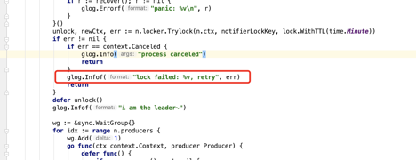

# Etcd分布式锁加锁失败


### 现象

线上程序一直报错，错误信息：lock failed: context deadline exceeded, retry

### 排查过程

异常对应代码位置



很明显的是获取锁超时了，由于用的etcd的分布式锁，就怀疑是etcd出问题了，此时看到大量etcd日志，rejected connection from "ip:port" (error "tls: first record does not look like a TLS handshake", ServerName "")，怀疑是不是这个问题导致的，经过查询报错的IP，均为线上容器IP，登陆容器内看发现都是管理员平台的代码，里面也用到了py03的etcd，但是不是导致超时的原因。在排除各种可能之后，最后去etcd查看锁对应的key的情况，发现有两个key

```shell
/notifier/locker/{leaseid}
 
/notifier/locker/rwl/{leaseid}
```

其中第一个key是notifier自己添加的，第二个key在代码中搜不到，但是看起来像是redis whitelist的简写，先把第一个key删了，然后看notifier日志，仍然获取不到锁，所以怀疑是第二个key已经获得了锁，虽然key不一样。于是删除了第二个key，再看notifier日志，终于获得了锁，开始正常工作，**于是得出猜想，etcd****的分布式锁，在子目录下加了锁之后，父目录会加锁失败**。然后用etcdctl lock来验证了下，确实如此，/a/b下加了锁，/a再加锁就会失败，但是/a下加了锁，/a/b再加锁会成功。基本上可以验证上面的猜想，剩下的就是从etcd源码中找到对应处理的代码了。

### etcd源码部分

在查询源码之前，第一反应就是这肯定是在服务端实现的，于是开始了从etcd服务端找相关源码的过程，从etcdctl命令开始追溯到所涉及的服务端，一直没有发现问题。又在网上搜了相关etcd服务端源码实现的文章，结合本地代码均没有想找的代码，于是反过来从client找起。

首先从etcdctl lock命令开始，挑主要函数展示

```go
// 代码位置go.etcd.io/etcd/etcdctl/ctlv3/command/lock_command.go
func lockUntilSignal(c *clientv3.Client, lockname string, cmdArgs []string) error {
   ...
 
   if err := m.Lock(ctx); err != nil {
      return err
   }
 
   ...
}
```

接下来进入到Lock函数，这是个关键函数，etcd的分布式锁就是在这里实现的

```go
func (m *Mutex) Lock(ctx context.Context) error {
   s := m.s
   client := m.s.Client()
 
   // 这里的pfx就是prefix，就是传进来的前缀，后面的s.Lease()会返回一个租约，是一个int64的整数，和session有关
   m.myKey = fmt.Sprintf("%s%x", m.pfx, s.Lease())
   // 这里比较上面prefix/lease的createrevision是否为0，为0表示目前不存在该key，需要执行Put操作，下面可以看到
   // 部位0表示已经有对应的key了，只需要执行Get就行
   // createrevision是自增的
   cmp := v3.Compare(v3.CreateRevision(m.myKey), "=", 0)
   // put self in lock waiters via myKey; oldest waiter holds lock
   put := v3.OpPut(m.myKey, "", v3.WithLease(s.Lease()))
   // reuse key in case this session already holds the lock
   get := v3.OpGet(m.myKey)
   // 获取所得持有者
   getOwner := v3.OpGet(m.pfx, v3.WithFirstCreate()...)
   resp, err := client.Txn(ctx).If(cmp).Then(put, getOwner).Else(get, getOwner).Commit()
   if err != nil {
      return err
   }
   m.myRev = resp.Header.Revision
   if !resp.Succeeded {
      m.myRev = resp.Responses[0].GetResponseRange().Kvs[0].CreateRevision
   }
   // if no key on prefix / the minimum rev is key, already hold the lock
   ownerKey := resp.Responses[1].GetResponseRange().Kvs
   // 比较如果当前没有人获得锁或者锁的owner的createrevision等于当前的kv的revision，则表示已获得锁，就可以退出了
   if len(ownerKey) == 0 || ownerKey[0].CreateRevision == m.myRev {
      m.hdr = resp.Header
      return nil
   }
 
   // 为了验证自己加的打印信息
   //fmt.Printf("ownerKey: %s\n", ownerKey)
   // 走到这里代表没有获得锁，需要等待之前的锁被释放，即revision小于当前revision的kv被删除
   hdr, werr := waitDeletes(ctx, client, m.pfx, m.myRev-1)
   // release lock key if wait failed
   if werr != nil {
      m.Unlock(client.Ctx())
   } else {
      m.hdr = hdr
   }
   return werr
}
 
// waitDeletes 等待所有当前比当前key的revision小的key被删除后，锁释放后才返回
func waitDeletes(ctx context.Context, client *v3.Client, pfx string, maxCreateRev int64) (*pb.ResponseHeader, error) {
   getOpts := append(v3.WithLastCreate(), v3.WithMaxCreateRev(maxCreateRev))
   for {
      resp, err := client.Get(ctx, pfx, getOpts...)
      if err != nil {
         return nil, err
      }
      if len(resp.Kvs) == 0 {
         return resp.Header, nil
      }
      lastKey := string(resp.Kvs[0].Key)
      // 为了调试自己加的这句
      fmt.Printf("wait for %s to delete\n", lastKey)
      if err = waitDelete(ctx, client, lastKey, resp.Header.Revision); err != nil {
         return nil, err
      }
   }
}
 
func waitDelete(ctx context.Context, client *v3.Client, key string, rev int64) error {
   cctx, cancel := context.WithCancel(ctx)
   defer cancel()
 
   var wr v3.WatchResponse
   // wch是个channel，key被删除后会往这个chan发数据
   wch := client.Watch(cctx, key, v3.WithRev(rev))
   for wr = range wch {
      for _, ev := range wr.Events {
         if ev.Type == mvccpb.DELETE {
            return nil
         }
      }
   }
   if err := wr.Err(); err != nil {
      return err
   }
   if err := ctx.Err(); err != nil {
      return err
   }
   return fmt.Errorf("lost watcher waiting for delete")
}
```

看完上面的代码基本知道了etcd分布式锁的实现机制了，但是还没看到哪里和前缀Prefix相关了。其实答案就藏在getOwner里，看上述代码，不管是执行Put还是Get，最终都有个getOwner的过程，看一下这个getOwner，options模式里有个v3.WithFirstCreate函数调用，看下这个函数

```go
// WithFirstCreate gets the key with the oldest creation revision in the request range.
func WithFirstCreate() []OpOption { return withTop(SortByCreateRevision, SortAscend) }
 
// withTop gets the first key over the get's prefix given a sort order
func withTop(target SortTarget, order SortOrder) []OpOption {
   return []OpOption{WithPrefix(), WithSort(target, order), WithLimit(1)}
}
 
// WithPrefix enables 'Get', 'Delete', or 'Watch' requests to operate
// on the keys with matching prefix. For example, 'Get(foo, WithPrefix())'
// can return 'foo1', 'foo2', and so on.
func WithPrefix() OpOption {
   return func(op *Op) {
      if len(op.key) == 0 {
         op.key, op.end = []byte{0}, []byte{0}
         return
      }
      op.end = getPrefix(op.key)
   }
}
```

看到上面的是三个函数后，大致就找到了对应的源码的感觉，因为看到了WithPrefix函数，和上面的猜测正好匹配。所以getOwner的具体执行效果是会把虽有以lockkey开头的kv都拿到，且按照createrevision升序排列，取第一个值，这个意思就很明白了，就是要拿到当前以lockkey为prefix的且createrevision最小的那个key，就是目前已经拿到锁的key。

看了上面的源码就可以明白为什么/a/b加了锁之后，/a加锁会超时了，因为在getOwner时，拿到了/a/b，且createrevision小于/a的revision，于是/a就会等待/a/b被删除后，watch chanel有数据后才能获得锁。

看到这里还有个需要确认的问题，那就是如果/ab加锁了，那么再对/a加锁会怎么样？/a肯定是/ab的prefix啊，是不是也会加锁失败呢？

结论是会加锁成功，看下源码

```go
 func NewMutex(s *Session, pfx string) *Mutex {
   return &Mutex{s, pfx + "/", "", -1, nil}
}
```

可以看到在NewMutex时并不是直接拿传进来的pfx作为prefix的，而且在后面加了个"/"，所以上线的/ab加了锁，/a加锁还是可以成功的。一般查找prefix或suffix时都会加上固定的分隔符，要不然就会出现误判。

### 总结

通过分析问题，看源码，可以了解到etcd锁的实现原理，以及可能存在的小坑。etcd居然把锁的实现放在了client端，也是出乎我的意料，这样的话，可以直接修改client端代码来修改其锁的实现，就可能出现虽然共用一个服务端，但是etcd行为却不一致的问题，不知道为何要这么设计，个人感觉还是要放到服务端更好些。

 

 

 


 


 
