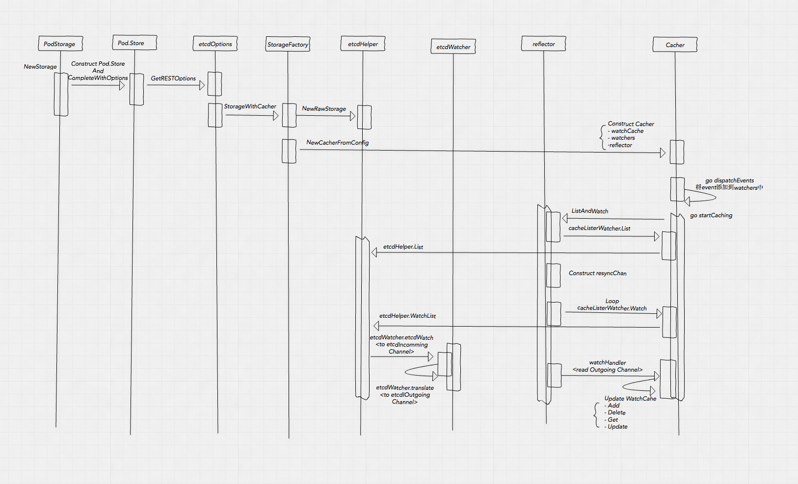
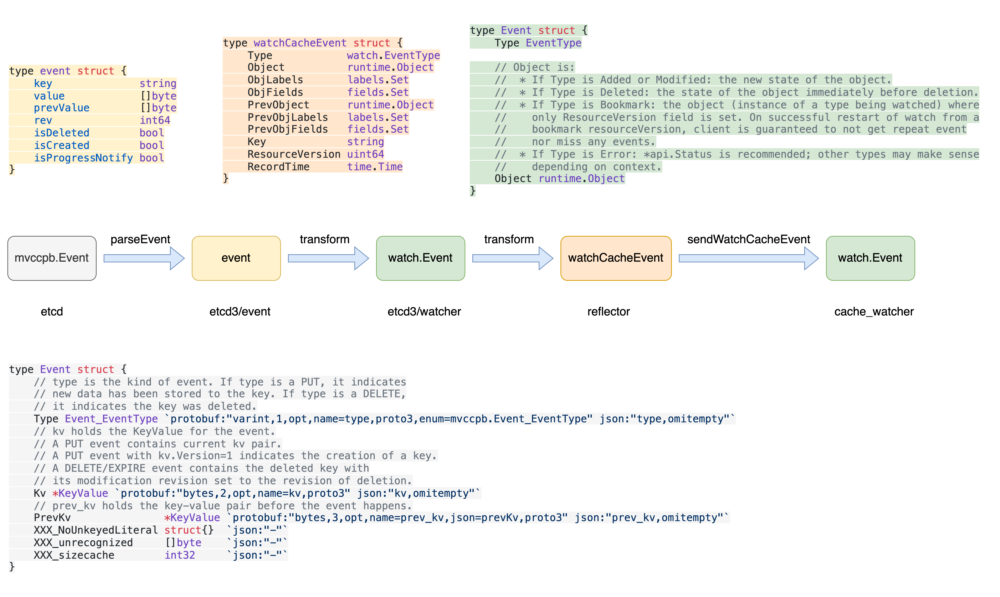

# kubernetes 月光宝盒 - 时间倒流


# 背景

碰到一个"诡异"的线上问题，已经定位到原因，虽然不是什么大问题，但感觉还是挺有意思的。在远古时期（k8s 1.7）中也有一个类似回溯的现象，不过从现象看远古那次是事件回溯，现在是时间回溯。接下来分别看下两个 case 和其背后的逻辑。

# 时间回溯

## 现象

```bash
- lastProbeTime: null
  lastTransitionTime: t1
  status: "True"
  type: Ready
```

上面是 Pod spec.status.conditions 中的 PodReady Condition，表示在 t1 时刻，Pod 变成 Ready 状态。

1. t1 时刻 watch 到 Pod Ready，lastTransitionTime 为 t1’；
2. t2 时刻 watch 到 Pod NotReady，lastTransitionTime 为 t2‘；
3. t3 时刻 watch 到 Pod Ready，lastTransitionTime 为 t3’；

常理来说 t3‘  > t2‘ > t1’，但诡异的是 t3’ == t1‘，也就是说在 t3 时刻看到的效果就是 Pod 在 t1‘ 时刻就已经 Ready 了，这与实际（t2‘ 到 t3’ 中间这段时间 Pod NotReady）不符。

经过查看 kubelet 代码发现具体处理逻辑在如下

```go
func (m *manager) updateStatusInternal(pod *v1.Pod, status v1.PodStatus, forceUpdate, podIsFinished bool) {
	var oldStatus v1.PodStatus
	cachedStatus, isCached := m.podStatuses[pod.UID]
	if isCached {
		oldStatus = cachedStatus.status
		// TODO(#116484): Also assign terminal phase to static pods.
		if !kubetypes.IsStaticPod(pod) {
			if cachedStatus.podIsFinished && !podIsFinished {
				klog.InfoS("Got unexpected podIsFinished=false, while podIsFinished=true in status cache, programmer error.", "pod", klog.KObj(pod))
				podIsFinished = true
			}
		}
	} else if mirrorPod, ok := m.podManager.GetMirrorPodByPod(pod); ok {
		oldStatus = mirrorPod.Status
	} else {
		oldStatus = pod.Status
	}

	...

	// Set ReadyCondition.LastTransitionTime.
	updateLastTransitionTime(&status, &oldStatus, v1.PodReady)

  ...
}

// updateLastTransitionTime updates the LastTransitionTime of a pod condition.
func updateLastTransitionTime(status, oldStatus *v1.PodStatus, conditionType v1.PodConditionType) {
	_, condition := podutil.GetPodCondition(status, conditionType)
	if condition == nil {
		return
	}
	// Need to set LastTransitionTime.
	lastTransitionTime := metav1.Now()
	_, oldCondition := podutil.GetPodCondition(oldStatus, conditionType)
	if oldCondition != nil && condition.Status == oldCondition.Status {
		lastTransitionTime = oldCondition.LastTransitionTime
	}
	condition.LastTransitionTime = lastTransitionTime
}
```

kubelet 内部维护了从 container runtime 获取到的 status 信息以及探活信息保存在 `podStatuses` 结构中，`updateStatusInternal` 每次执行到之后会先从此结构中获取，对应上面场景是会获取到的， `oldStatus` 就是缓存中的值。**注意 `podStatuses` 的内容和 k8s pod spec 内容无关，也就是说上面场景即使在 t2’ 时刻 Pod NotReady 了，但在 `podStatuses` 中仍然是在 t1‘ Pod Ready 的内容**。所以在 t3 时刻 Pod Ready 后，在调用 `updateLastTransitionTime` 时对比了 `status` 和 `oldStatus` 的 Status 值（都是 true）发现一致，则最终 condition.LastTransitionTime 会被设置为 oldCondition.LastTransitionTime 即 t1’。

## Feature Or Bug?

不管是 feature 还是 bug，目前对于我们来说这个问题只是看起来时间回溯了，并没有实际的影响。就此问题也咨询了社区，参考 [issue: 119514](https://github.com/kubernetes/kubernetes/issues/119514)。在 kubelet 里面有一段注释：

```go
// needsReconcile compares the given status with the status in the pod manager (which
// in fact comes from apiserver), returns whether the status needs to be reconciled with
// the apiserver. Now when pod status is inconsistent between apiserver and kubelet,
// kubelet should forcibly send an update to reconcile the inconsistence, because kubelet
// should be the source of truth of pod status.
// NOTE(random-liu): It's simpler to pass in mirror pod uid and get mirror pod by uid, but
// now the pod manager only supports getting mirror pod by static pod, so we have to pass
// static pod uid here.
// TODO(random-liu): Simplify the logic when mirror pod manager is added.
func (m *manager) needsReconcile(uid types.UID, status v1.PodStatus) bool {
	...
}
```

关键一句：**kubelet should be the source of truth of pod status.** 也可以理解，因为毕竟 kubelet 才是真正干活的，只有他知道 container 的真实状态，但 Pod 的状态就并不一定是只有 kubelet 会更新了，这就是一个比较 trick 的地方。

Pod Ready Condition 除了在 kubelet 中会设置外，在 kube-controller-manager 中也会设置，当 Node NotReady 一段时间后，其上所有 Pod 都会被 controller-manager 标记为 NotReady，同时更新 LastTransitionTime。

所以这个现象也是很容易的复现，步骤如下：

1. start a http proxy in a worker node to proxy kube-apiserver request
2. set kubelet to use this proxy instead of directly use kube-apiserver
3. schedule some pod to this node and wait pod running, record the LastTransitionTime of PodReady true condition as time1.
4. stop the proxy and wait node not ready and pod ready condition changed to false which set by kube-controller-manager, record the LastTransitionTime of PodReady false condition as time2.
5. then start the proxy again and wait pod ready, record the LastTransitionTime of PodReady true condition as time3.
6. you will see time3 == time1 and time3 is before time2

可以使用 socat 作为 http proxy 代理使用，轻松复现。

Kube-controller-manager 为什么要去操作 Pod Ready 状态呢，因为 endpoint controller 对这个状态有依赖，只有 Pod Ready 后，Pod IP 才会被当做可用，也就是说这个状态直接影响使用 endpoint 来进行通信的场景，而 endpoint 几乎所有云原生网络相关组件都会用到。也就是说**如果你也使用了 endpoint，在出现上述问题时，可能某些 Pod 在一段时间内没有流量，但在最后你去查问题的时候，看 Pod 状态发现他很早之前就是 Ready 状态的，这就容易误导人，如果真如 Condition LastTransitionTime 所述那应该在 t1 时刻开始 Pod 一直有流量，但实际确实在 t2 到 t3 时刻，Pod 并未接流**。所以这到底算是 bug 还是 feature 呢？

不管是 feature 还是 bug，这个问题是需要解决的，而解决办法最好是再额外加一个 Condition，Pod Ready Condition 只留给 kubelet 去操作，其他组件都是读，同时每个组件按需增加自己的 Condition，结合 Pod Ready Condition 去做一些逻辑处理，比如 node controller 在发现 Node NotReady 后添加 Custom Condition，然后 endpoint controller 结合 Pod Ready Condition 与 Custom Condition 状态判断 Pod 是否可以接流。

***时间回溯虽然看起来奇怪，好在并没有实际影响。但接下来事件回溯就厉害了，他是真正的让其他组件感觉到了时间回到了过去，并且历史发生的事情又重来一遍。***

# 事件回溯

这个问题发生在 2017 年，某天早上起来，一篇名为 [《Kubernetes 惊天地泣鬼神之大Bug》](https://zhuanlan.zhihu.com/p/37217575)在知乎上，朋友圈，技术群里面疯狂转发，瞬间炸了锅。

## 现象

> 问题的现象是，在某种情况下，一个或者多个 Kubernetes service 对应的 Kubernetes endpoints 消失几分钟至几十分钟，然后重新出现，然后又消失。

这可就是实打实的影响集群里面正在运行的服务了，此问题在 v1.7 版本引入，在 v1.9 中修复，影响还是比较大的，当然我们当时并没有遇到这个问题，因为我们使用的还是 v1.6，所以使用新版本还是有风险的，哈哈。

## 原因 

> Fixes a bug in the cache watcher where we were returning the "current" object from a watch event, not the historic event. This means that we broke behavior when introducing the watch cache. This may have API implications for filtering watch consumers - but on the other hand, it prevents clients filtering from seeing objects outside of their watch correctly, which can lead to other subtle bugs.

问题是在 [pr: 46223](https://github.com/kubernetes/kubernetes/pull/46223) 引入的，当时是为了修复另外一个 bug 而引入的新的 bug。因为**此问题和 cache watcher 的 watch 实现有关**，所以先看下 kube-apiserver 有关 watch 的实现机制



图片来自：https://zhuanlan.zhihu.com/p/33335726

先讲一下 store 和 storage 的区别，store 一般用来作为一个 service 对外提供服务，对外屏蔽存储细节，而 storage 是 store 内的一个结构，用来与底层存储交互，这是一个很常见的分层设计。

以 Pod 为例，这里涉及到两层或者说两对 store 和 storage：

- 外层 store（上图并未给出） 用来和 restful api 交互，即通过 k8s api 访问 Pod 的处理请求在 kube-apiserver 内部都会走到这个 store 上，其内部对应的 storage 为上图中所示的 PodStorage；
- 内层的 store 为上图的 Pod.Store，最终对应 Cacher，而内层的 storage 才是直接与 Etcd 交互；

核心组件：Cacher，watchCache，cacheWatcher，reflector。其中 watchCache 作为 reflector 的 store，Etcd 作为 listerWatcher 的 storage，store 和 listerWatcher 作为参数用来构造 reflector。数据流大致如下：

1. cacher.startCaching 调用 reflector.ListAndWatch，进而触发 listerWatcher 的 list 和 watch，对应 Etcd list 之后再 watch，watch 时会创建 watchChan，从 Etcd 读到的结果会先进入到 watchChan 的 incomingEventChan 中，**经过 transform 处理，对于 delete 类型的事件，处理时会直接 `prevValue` 的值，而其他类型事件则直接使用其 `value`，处理后的对象的 ResourceVersion 为 Etcd event 的 `ModRevision`**，之后进行数据过滤（例如带着 LabelSelector 的请求，也可以看到*筛选是在获取全量数据到 Etcd 后在 kube-apiserver 里面进行的*），再以符合条件的数据构建 watch.Event 对象，并后发送到 watchChan 的 resultChan 中，供 reflector 消费；
2. reflector 会消费上述 resultChan 的数据，即 watch.Event 对象，并根据事件类型调用 store 的增删改方法，此处 store 即 watchCache，经过 watchCache.processEvent 处理，组装 watchCacheEvent 对象，并最终通过 eventHandler 将其发送到 cacher 的 incoming chan 中；
3. cacher.dispatchEvents 消费 incoming chan 的数据，经过处理后发送给每个 cacheWatcher 的 input chan；
4. 外部调用 kube-apiserver watch 请求后，最终到 cacheWatcher 的 Watch 处理机中，消费 input chan，调用 watchCacheEvent 进行事件分发；

Event 转换示意：

终于介绍完了一些基础，最终导致事件回溯的原因就在最后的 `sendWatchCacheEvent` 中，针对 delete 请求，有问题的代码如下

```go
// NOTE: sendWatchCacheEvent is assumed to not modify <event> !!!
func (c *cacheWatcher) sendWatchCacheEvent(event *watchCacheEvent) {
	...

	var watchEvent watch.Event
	switch {
	case curObjPasses && !oldObjPasses:
		...
	case curObjPasses && oldObjPasses:
		...
	case !curObjPasses && oldObjPasses:
		object, err := c.copier.Copy(event.PrevObject)
		if err != nil {
			utilruntime.HandleError(fmt.Errorf("unexpected copy error: %v", err))
			return
		}
		watchEvent = watch.Event{Type: watch.Deleted, Object: object}
	}

	...
}
```

其直接使用了 watchCacheEvent 的 PrevObject，而他的 ResourceVersion 是一个过去时的值，例如连续创建三个 Pod，再删除第一个 Pod，则此时返回的 watchEvent 的 Object 对象的 ResourceVersion 是第一个 Pod 创建后的 ResourceVersion，但实际情况是最新的 ResourceVersion 已经随着后两个 Pod 的创建而递增了。也就是此时**客户端 watch 到一个 delete event 之后，客户端 informer 所使用的 reflector 内部维护的 resourceVersion 已经不对了，是一个历史值，如果此时发生一个问题（例如网络闪断）需要去重新 watch 时，会使用这个错误的 resourceVersion，也就是这个版本之后的所有符合条件的事件会再次接收并处理一遍，真正的回到过去，历史重演。**

此问题在 v1.9 中修复，[pr: 58547](https://github.com/kubernetes/kubernetes/pull/58547)，修复后的逻辑如下

```go
// NOTE: sendWatchCacheEvent is assumed to not modify <event> !!!
func (c *cacheWatcher) sendWatchCacheEvent(event *watchCacheEvent) {
	...

	var watchEvent watch.Event
	switch {
	case curObjPasses && !oldObjPasses:
		...
	case curObjPasses && oldObjPasses:
		...
	case !curObjPasses && oldObjPasses:
		// return a delete event with the previous object content, but with the event's resource version
		oldObj := event.PrevObject.DeepCopyObject()
		if err := c.versioner.UpdateObject(oldObj, event.ResourceVersion); err != nil {
			utilruntime.HandleError(fmt.Errorf("failure to version api object (%d) %#v: %v", event.ResourceVersion, oldObj, err))
		}
		watchEvent = watch.Event{Type: watch.Deleted, Object: oldObj}
	}

	...
}
```

仍然使用 watchCacheEvent 的 PrevObject，但会使用 watchCacheEvent 的 ResourceVersion 覆盖前者的 ResourceVersion。


