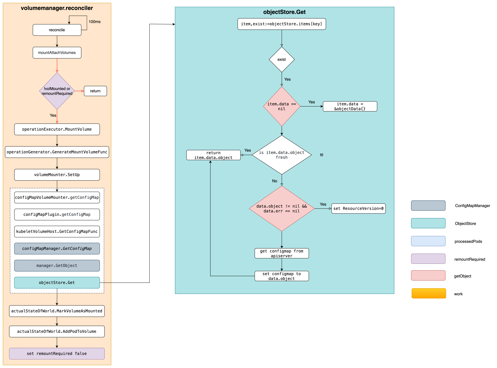
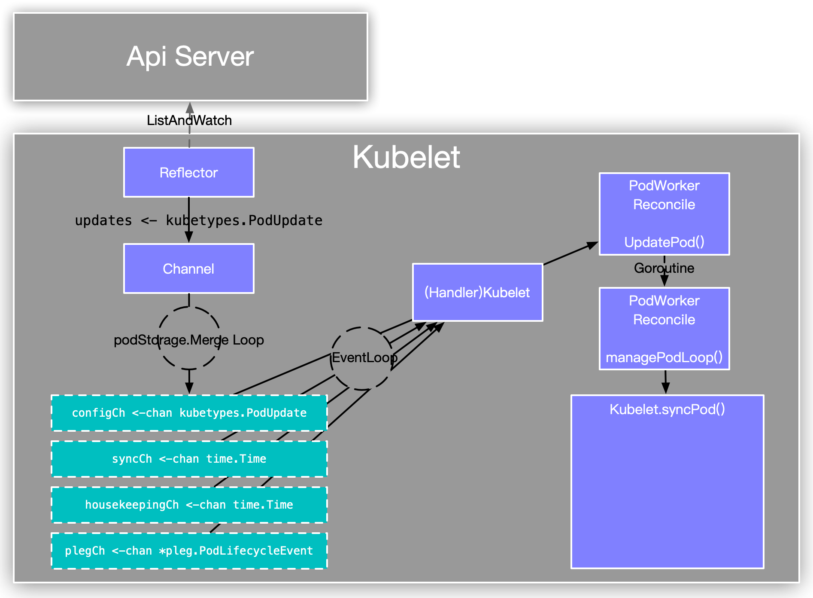

# high QPS for configmap GET requests in kube-apiserver - 1


# 背景

线上 k8s 集群 kube-apiserver 的 ConfigMap Get 操作 QPS 较高，且同时间段 Etcd 中 ConfigMap 资源的 Get 操作 QPS 也较高，看日志多数请求的发起方是 kubelet。对应 k8s v1.22.13 版本代码，同时在 v1.28.0 测试现象相同。kube-apiserver 日志大致如下：

```shell
2023-08-23T08:55:54.331196195Z stderr F I0823 08:55:54.330840       1 httplog.go:132] "HTTP" verb="GET" URI="/api/v1/namespaces/default/configmaps/nginx-cfgmap" latency="1.926865ms" userAgent="kubelet/v1.28.0 (linux/amd64) kubernetes/855e7c4" audit-ID="36cfcbe3-d76a-4a4d-b251-47cc2df060cb" srcIP="192.168.228.2:59052" apf_pl="system" apf_fs="system-nodes" apf_iseats=1 apf_fseats=0 apf_additionalLatency="0s" apf_execution_time="1.269527ms" resp=200
2023-08-23T08:57:09.333913507Z stderr F I0823 08:57:09.333470       1 httplog.go:132] "HTTP" verb="GET" URI="/api/v1/namespaces/default/configmaps/nginx-cfgmap" latency="1.810334ms" userAgent="kubelet/v1.28.0 (linux/amd64) kubernetes/855e7c4" audit-ID="563bd337-df29-4342-afd0-9ca6e0632f0f" srcIP="192.168.228.2:59052" apf_pl="system" apf_fs="system-nodes" apf_iseats=1 apf_fseats=0 apf_additionalLatency="0s" apf_execution_time="1.177012ms" resp=200
2023-08-23T08:58:14.338971779Z stderr F I0823 08:58:14.338630       1 httplog.go:132] "HTTP" verb="GET" URI="/api/v1/namespaces/default/configmaps/nginx-cfgmap" latency="1.563356ms" userAgent="kubelet/v1.28.0 (linux/amd64) kubernetes/855e7c4" audit-ID="45350dc7-7a4b-43f1-8972-3b8053578234" srcIP="192.168.228.2:59052" apf_pl="system" apf_fs="system-nodes" apf_iseats=1 apf_fseats=0 apf_additionalLatency="0s" apf_execution_time="929.214µs" resp=200
```

# 由来

定位此问题的过程中花了一定的时间，同时也纠正了一些有关 kubelet 内 Pod 处理的错误理解。本篇旨在描述上述现象产生的原因及潜在问题，同时也希望能帮助大家更进一步的理解 kubelet 对 Pod 的处理逻辑。

由于涉及到的逻辑较多，因此将拆分成三篇来写：

1. ConfigMap Get 请求的来源？
2. 为什么 QPS 高？为什么没有走 kube-apiserver 缓存？
3. 问题如何解决？

# 追踪溯源

在找到具体原因之前，大概有个排查方向，因为日志中显示的 ConfigMap 都是挂载到 Pod 中作为 Volume 使用的，问题的根源大概率与此有关，因此先从这个方向来。

采取自下而上方式沿着函数调用链路看代码，找源头，首先需要找到最后调用 ConfigMap Get 的地方，如果熟悉 client-go 的话，很容易在 /pkg/kubelet 目录下根据关键字 `ConfigMaps(` 搜索到结果，在 /pkg/kubelet/configmap/configmap_manager.go 文件中，里面有三种类型的 manager，分别对用不同类型的参数设置，因为 kubelet 配置的 `configMapAndSecretChangeDetectionStrategy: Cache`，因此看 `NewCachingConfigMapManager` 即可，最终返回 `cacheBasedManager` 就是管理 ConfigMap 的。

```go
// NewCachingConfigMapManager creates a manager that keeps a cache of all configmaps
// necessary for registered pods.
// It implement the following logic:
//   - whenever a pod is create or updated, the cached versions of all configmaps
//     are invalidated
//   - every GetObject() call tries to fetch the value from local cache; if it is
//     not there, invalidated or too old, we fetch it from apiserver and refresh the
//     value in cache; otherwise it is just fetched from cache
func NewCachingConfigMapManager(kubeClient clientset.Interface, getTTL manager.GetObjectTTLFunc) Manager {
	getConfigMap := func(namespace, name string, opts metav1.GetOptions) (runtime.Object, error) {
		return kubeClient.CoreV1().ConfigMaps(namespace).Get(context.TODO(), name, opts)
	}
	configMapStore := manager.NewObjectStore(getConfigMap, clock.RealClock{}, getTTL, defaultTTL)
	return &configMapManager{
		manager: manager.NewCacheBasedManager(configMapStore, getConfigMapNames),
	}
}
```

NewCachingConfigMapManager 创建一个管理器，用于管理缓存的 ConfigMap 数据。

- 当创建或更新 Pod 时，缓存中的所有 ConfigMap 数据都会被标记为无效。
- 在每次调用 `GetObject()` 方法时，首先尝试从本地缓存中获取数据。如果数据不存在、已被标记为无效或已过期，会从 apiserver 获取最新数据，并刷新缓存中的数据。如果数据存在于缓存中且有效，则直接从缓存中获取。

注释写的很清楚，每次创建或者更新 Pod 时，缓存中 Pod 对应的 ConfigMap 会被标记为无效，等 `GetObject` 被调用时，发现本地缓存中对应的 ConfigMap 已被标记为无效，就去 apiserver 获取。一种典型的协作式逻辑，接下来围绕两个调用链来看分析： `GetObject` 的调用链，缓存无效标记链。

## `GetObject` 调用链

### 投石问路

首先看下 `GetObject` 干了什么，核心逻辑还是在 `Get` 中，下面代码中的 klog 日志输出是为了方便调试自己加上去的，在官方代码中没有的。

```go
// pkg/kubelet/util/manager/cache_based_manager.go

func (c *cacheBasedManager) GetObject(namespace, name string) (runtime.Object, error) {
	return c.objectStore.Get(namespace, name)
}

func (s *objectStore) Get(namespace, name string) (runtime.Object, error) {
	key := objectKey{namespace: namespace, name: name}

	data := func() *objectData {
		s.lock.Lock()
		defer s.lock.Unlock()
		item, exists := s.items[key]
		if !exists {
			return nil
		}
		if item.data == nil {
			klog.V(5).InfoS("empty item data", "key", key.namespace+"/"+key.name)
			item.data = &objectData{}
		}
		return item.data
	}()
	if data == nil {
		return nil, fmt.Errorf("object %q/%q not registered", namespace, name)
	}

	// After updating data in objectStore, lock the data, fetch object if
	// needed and return data.
	data.Lock()
	defer data.Unlock()
	if data.err != nil || !s.isObjectFresh(data) {
		opts := metav1.GetOptions{}
		if data.object != nil && data.err == nil {
			// This is just a periodic refresh of an object we successfully fetched previously.
			// In this case, server data from apiserver cache to reduce the load on both
			// etcd and apiserver (the cache is eventually consistent).
			util.FromApiserverCache(&opts)
			klog.V(5).InfoS("set resourceversion 0", "key", key.namespace+"/"+key.name)
		}

		object, err := s.getObject(namespace, name, opts)
		if err != nil && !apierrors.IsNotFound(err) && data.object == nil && data.err == nil {
			// Couldn't fetch the latest object, but there is no cached data to return.
			// Return the fetch result instead.
			return object, err
		}
		if (err == nil && !isObjectOlder(object, data.object)) || apierrors.IsNotFound(err) {
			// If the fetch succeeded with a newer version of the object, or if the
			// object could not be found in the apiserver, update the cached data to
			// reflect the current status.
			data.object = object
			data.err = err
			data.lastUpdateTime = s.clock.Now()
		}
	} else {
		klog.V(5).InfoS("return from cache directly", "key", key.namespace+"/"+key.name)
	}
	return data.object, data.err
}
```

objectStore 用来存储所用到的所有 ConfigMap，key 是一个由 ConfigMap 的 namespace 和 name 组成的结构体，value 是 objectStoreItem 结构体，其内维护了对应 ConfigMap 的引用计数、ConfigMap 自身、最后更新时间等属性。

```go
// pkg/kubelet/util/manager/cache_based_manager.go

type objectKey struct {
	namespace string
	name      string
	uid       types.UID
}

// objectStoreItems is a single item stored in objectStore.
type objectStoreItem struct {
	refCount int
	data     *objectData
}

type objectData struct {
	sync.Mutex

	object         runtime.Object
	err            error
	lastUpdateTime time.Time
}

// objectStore is a local cache of objects.
type objectStore struct {
	getObject GetObjectFunc
	clock     clock.Clock

	lock  sync.Mutex
	items map[objectKey]*objectStoreItem

	defaultTTL time.Duration
	getTTL     GetObjectTTLFunc
}
```

### 顺藤摸瓜

沿着 `GetObject` 调用链路向上找，直到 `configMapVolumeMounter` 结构，在他的 `SetUpAt`  方法中有一行代码来获取 ConfigMap。

```go
configMap, err := b.getConfigMap(b.pod.Namespace, b.source.Name)
```

很明显，结构体名字就是和挂载有关的。继续往上找看又是谁在调用 `SetUpAt` ，最终在 reconiler 结构的 `mountAttachVolumes` 方法中找到了最终的触发者 `operationExecutor.MountVolume`，忽略了部分不相关代码，如下

```go
// pkg/kubelet/volumemanager/reconciler/reconciler.go

func (rc *reconciler) mountAttachVolumes() {
	// Ensure volumes that should be attached/mounted are attached/mounted.
	volumesToMount := rc.desiredStateOfWorld.GetVolumesToMount()
	for _, volumeToMount := range volumesToMount {
		volMounted, devicePath, err := rc.actualStateOfWorld.PodExistsInVolume(volumeToMount.PodName, volumeToMount.VolumeName)
		volumeToMount.DevicePath = devicePath
		if cache.IsVolumeNotAttachedError(err) {
			...
		} else if !volMounted || cache.IsRemountRequiredError(err) {
			// Volume is not mounted, or is already mounted, but requires remounting
			remountingLogStr := ""
			isRemount := cache.IsRemountRequiredError(err)
			if isRemount {
				remountingLogStr = "Volume is already mounted to pod, but remount was requested."
			}
			klog.V(4).InfoS(volumeToMount.GenerateMsgDetailed("Starting operationExecutor.MountVolume", remountingLogStr))
			err := rc.operationExecutor.MountVolume(
				rc.waitForAttachTimeout,
				volumeToMount.VolumeToMount,
				rc.actualStateOfWorld,
				isRemount)
			if err != nil && !isExpectedError(err) {
				// Ignore nestedpendingoperations.IsAlreadyExists and exponentialbackoff.IsExponentialBackoff errors, they are expected.
				// Log all other errors.
				klog.ErrorS(err, volumeToMount.GenerateErrorDetailed(fmt.Sprintf("operationExecutor.MountVolume failed (controllerAttachDetachEnabled %v)", rc.controllerAttachDetachEnabled), err).Error())
			}
			if err == nil {
				if remountingLogStr == "" {
					klog.V(1).InfoS(volumeToMount.GenerateMsgDetailed("operationExecutor.MountVolume started", remountingLogStr))
				} else {
					klog.V(5).InfoS(volumeToMount.GenerateMsgDetailed("operationExecutor.MountVolume started", remountingLogStr))
				}
			}
		} else if cache.IsFSResizeRequiredError(err) &&
			utilfeature.DefaultFeatureGate.Enabled(features.ExpandInUsePersistentVolumes) {
			...
		}
	}
}

```

逻辑大致如下：

1. 首先从 `desiredStateOfWorld` 获取需要挂载的所有的卷（ConfigMap）
2. 遍历每个卷，看 Pod 是否存在于 `actualStateOfWorld` 中保存的已经挂载了卷的 Pod 列表中
3. 如果 2 返回不存在（尚未挂载），或者需要重新挂载，则会调用 `operationExecutor.MountVolume` 进行挂载

之后就会一步步触发最终 `GetObject` 去获取要挂载的 `ConfigMap` ，继续往上找 `mountAttachVolumes` 调用方，如下

```go
// pkg/kubelet/volumemanager/reconciler/reconciler.go

func (rc *reconciler) Run(stopCh <-chan struct{}) {
	wait.Until(rc.reconciliationLoopFunc(), rc.loopSleepDuration, stopCh)
}

func (rc *reconciler) reconciliationLoopFunc() func() {
	return func() {
		rc.reconcile()
		...
	}
}

func (rc *reconciler) reconcile() {
	...

	// Next we mount required volumes. This function could also trigger
	// attach if kubelet is responsible for attaching volumes.
	// If underlying PVC was resized while in-use then this function also handles volume
	// resizing.
	rc.mountAttachVolumes()

	...
}
```

至此找到了最上层触发 `GetObject` 调用的调用者 `reconciler`，他在 kubelet 启动时启动，每间隔 `loopSleepDuration` （代码中写死的 100ms ）执行一次，每次执行时都会去调用 `mountAttachVolumes` 最终调用 `GetObject`。

上述流程总结如下图



## 缓存无效标记链

### 蛛丝马迹

思路同上，需要先找到标记是什么，还是得回到 `GetObject` 中（开头代码注释中写了）。因为从 kube-apiserver 日志中看到的现象是请求直接穿透到了 Etcd，再结合上面 `Get` 方法，可以知道是命中了 item.data == nil 之后执行 item.data = &objectData{}，因此才没有命中 data.object != nil 的逻辑，也就没有给请求设置 ResourceVersion: 0 的参数，最终导致请求穿透到了 Etcd。在每次请求结束后，会将 data.object 赋值为刚获取到的 ConfigMap。又因为日志中已知出现请求，基本可以得到标记无效就是靠设置 item.data = nil 实现的。

代码中搜索 `.data = nil` 会发现只有一条匹配的

```go
func (s *objectStore) AddReference(namespace, name string) {
	key := objectKey{namespace: namespace, name: name}

	// AddReference is called from RegisterPod, thus it needs to be efficient.
	// Thus Add() is only increasing refCount and generation of a given object.
	// Then Get() is responsible for fetching if needed.
	s.lock.Lock()
	defer s.lock.Unlock()
	item, exists := s.items[key]
	if !exists {
		item = &objectStoreItem{
			refCount: 0,
			data:     &objectData{},
		}
		s.items[key] = item
	}

	item.refCount++
	// This will trigger fetch on the next Get() operation.
	item.data = nil
}
```

注释写的也很清晰，设置 item.data = nil 会触发下次执行 `Get` 操作时去访问 apiserver。标记找到了，接下来就是去看下整个调用链了。 

### 抽丝剥茧

沿着 `AddReference` 调用链路往上找，发现最终调用方在 `syncPod` 中，如下

```go
func (kl *Kubelet) syncPod(ctx context.Context, updateType kubetypes.SyncPodType, pod, mirrorPod *v1.Pod, podStatus *kubecontainer.PodStatus) (isTerminal bool, err error) {
	...
	
	// ensure the kubelet knows about referenced secrets or configmaps used by the pod
	if !kl.podWorkers.IsPodTerminationRequested(pod.UID) {
		if kl.secretManager != nil {
			kl.secretManager.RegisterPod(pod)
		}
		if kl.configMapManager != nil {
			kl.configMapManager.RegisterPod(pod)
		}
	}
	
	...
}
```

`syncPod` 调用 `configMapManager.RegisterPod` 最终触发 `AddReference` 设置 item.data 为 nil，相当于标记缓存无效。到这里熟悉 kubelet 主流程的话应该就比较清楚是怎么回事了，Kubelet 会为每个 Pod 启动一个单独的 goroutine PodWorker 负责 Pod 生命周期的管理，这里盗用一个网图



有四个 chan：

- configCh 对应从外界获取到的 Pod 信息，有三种来源 File，Http，Apiserver；
- syncCh 对应一个 ticker，每秒触发一次，时间写死在代码中；
- housekeepingCh 也对应一个 ticker，每 2 秒触发一次，时间同样写死在代码中；
- plegCh 对应从 container runtime 获取到的 container 的真实信息，有个对应的结构，每秒从 container runtime 获取所有 container 信息，经过处理之后发到 plegCh；

任意 chan 内有数据了之后都会最终触发 `syncPod`。

# 总结

至此整个流程已经清楚了，一句话概括就是每有 Pod 需要 Sync 时，会触发 `syncPod`，在 `syncPod` 时会调用 `configMapManager.RegisterPod` 标记缓存无效，reconciler goroutine 每 100ms 执行一次 `mountAttachVolumes` 去挂载 Pod 所有的 Volume，发现被标记失效就会重新去 apiserver 获取。

至于具体哪些 Pod 需要去挂载哪些 Volume，有另外两个数据结构存储相关信息：`DesiredStateOfWorld`，`ActualStateOfWorld`。上文在执行 `mountAttachVolumes` 的时候出现过，将会在下一篇中分析为什么 QPS 会高，为什么没有走 apiserver cache 的时候进行更详细的分析。

