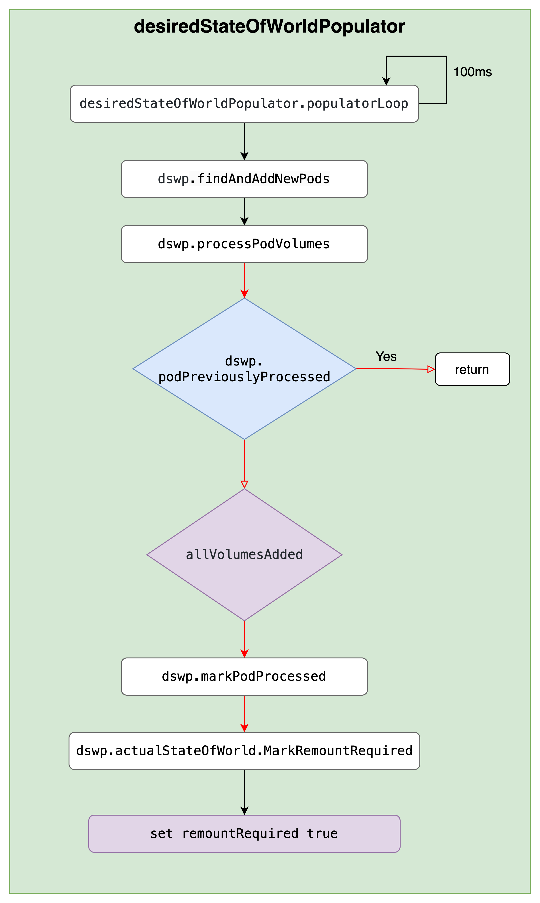

# high QPS for configmap GET requests in kube-apiserver - 2


# 背景

线上 k8s 集群 kube-apiserver 的 ConfigMap Get 操作 QPS 较高，且同时间段 Etcd 中 ConfigMap 资源的 Get 操作 QPS 也较高，看日志多数请求的发起方是 kubelet。对应 k8s v1.22.13 版本代码，同时在 v1.28.0 测试现象相同。kube-apiserver 日志大致如下：

```shell
2023-08-23T08:55:54.331196195Z stderr F I0823 08:55:54.330840       1 httplog.go:132] "HTTP" verb="GET" URI="/api/v1/namespaces/default/configmaps/nginx-cfgmap" latency="1.926865ms" userAgent="kubelet/v1.28.0 (linux/amd64) kubernetes/855e7c4" audit-ID="36cfcbe3-d76a-4a4d-b251-47cc2df060cb" srcIP="192.168.228.2:59052" apf_pl="system" apf_fs="system-nodes" apf_iseats=1 apf_fseats=0 apf_additionalLatency="0s" apf_execution_time="1.269527ms" resp=200
2023-08-23T08:57:09.333913507Z stderr F I0823 08:57:09.333470       1 httplog.go:132] "HTTP" verb="GET" URI="/api/v1/namespaces/default/configmaps/nginx-cfgmap" latency="1.810334ms" userAgent="kubelet/v1.28.0 (linux/amd64) kubernetes/855e7c4" audit-ID="563bd337-df29-4342-afd0-9ca6e0632f0f" srcIP="192.168.228.2:59052" apf_pl="system" apf_fs="system-nodes" apf_iseats=1 apf_fseats=0 apf_additionalLatency="0s" apf_execution_time="1.177012ms" resp=200
2023-08-23T08:58:14.338971779Z stderr F I0823 08:58:14.338630       1 httplog.go:132] "HTTP" verb="GET" URI="/api/v1/namespaces/default/configmaps/nginx-cfgmap" latency="1.563356ms" userAgent="kubelet/v1.28.0 (linux/amd64) kubernetes/855e7c4" audit-ID="45350dc7-7a4b-43f1-8972-3b8053578234" srcIP="192.168.228.2:59052" apf_pl="system" apf_fs="system-nodes" apf_iseats=1 apf_fseats=0 apf_additionalLatency="0s" apf_execution_time="929.214µs" resp=200
```

# 由来

定位此问题的过程中花了一定的时间，同时也纠正了一些有关 kubelet 内 Pod 处理的错误理解。本篇旨在描述上述现象产生的原因及潜在问题，同时也希望能帮助大家更进一步的理解 kubelet 对 Pod 的处理逻辑。

由于涉及到的逻辑较多，因此将拆分成三篇来写：

1. ConfigMap Get 请求的来源？
2. 为什么 QPS 高？为什么没有走 kube-apiserver 缓存？
3. 问题如何解决？

本篇主要介绍 QPS 为什么高，为什么请求会穿透到 Etcd。

# 回顾

在第一篇中已经介绍了 ConfigMap Get 请求的逻辑：

每有 Pod 需要 Sync 时，会触发 `syncPod`，在 `syncPod` 时会调用 `configMapManager.RegisterPod` 标记缓存无效，reconciler goroutine 每 100ms 执行一次 `mountAttachVolumes` 去挂载 Pod 所有的 Volume，发现被标记失效就会重新去 apiserver 获取。

至于具体哪些 Pod 需要去挂载哪些 Volume，有另外两个数据结构存储相关信息：`DesiredStateOfWorld`，`ActualStateOfWorld`。

# 为什么 QPS 高？

## QPS 估算

可以粗略计算每台机器上的 kubelet 对 ConfigMap Get 的贡献，我们可以先统一前提，就是没有外部 Pod 的增删改请求，也没有 Container Runtime 侧的变化，单纯是靠 syncCh 来触发的 syncPod，有如下数据：

- sync tiker 的周期是 1s；
- reconciler 的周期为 100ms；
- `--sync--frequency` 默认配置是 1m；

```go
// pkg/kubelet/pod_workers.go

// completeWork requeues on error or the next sync interval and then immediately executes any pending
// work.
func (p *podWorkers) completeWork(pod *v1.Pod, phaseTransition bool, syncErr error) {
	// Requeue the last update if the last sync returned error.
	switch {
	...
	case syncErr == nil:
		// No error; requeue at the regular resync interval.
		p.workQueue.Enqueue(pod.UID, wait.Jitter(p.resyncInterval, workerResyncIntervalJitterFactor))
	...
	}
	p.completeWorkQueueNext(pod.UID)
}
```

虽然 reconciler 周期 100ms，但只有在缓存标记为失效或者过期时才会去 apiserver 拿，并且我们看到的日志都是直接穿透到 Etcd 的，也就是说针对我们的情况，都是由缓存被标记为失效引起的。

 `resyncInterval` 对应的是参数 `--sync-frequency`。k8s 里面经常是在配置里面设置一个同步的间隔，而实际的间隔往往是一个介于配置的间隔和此间隔额外加上一个随机值之间的随机值，这里也是同样的，实际每次 Enqueue 的时间是当前时间加上介于 1m 与 1m30s 之间的一个随机值。虽然 sync ticker 周期是 1s，也只是每次尝试去看队列里面有没有需要同步的 Pod，他的判断依据就是拿当前时间与 Pod Enqueue 时计算的时间作比较，如果已近过了 Enqueue 带的时间，就会触发 `syncPod`。

如果节点上只有一个 Pod 挂载了一个 ConfigMap，那么理论上他贡献的 QPS 介于 1/90 到 1/60 之间。这么一看的话，QPS 也不算高，假如一个有 90 个实例的 deployment 挂载一个 ConfigMap，如果**每个 deployment 的所有实例都分布在不同的机器上**，那么他对  QPS 的贡献介于 1 和 90 之间，如果有 100 个这样的 deployment，并且**他们挂载的 ConfigMap 各不相同**，那么整体的 QPS 的贡献介于 100 和 9000 之间。也就是说 9000 个 Pod 可能的贡献介于 100 和 9000之间，这个上下限差距很大。

# 为什么没有走 apiserver 缓存？

分别就本地缓存和 apiserver 缓存来分析

## 有没有走本地缓存？

不知道你有没有这个疑问，**既然每次 `syncPod` 都会设置缓存失效，那本地缓存还有什么用**？

确实从当前的实现结果看，本地貌似缓存没有用，但实际还是有一些作用，某些情况下是可以降低 apiserver QPS 的。考虑如下情况

- 同一个 deployment 的不同实例在同一台宿主上；
- 不同的 deployment 挂载了相同的 ConfigMap；

会导致出现挂载相同 ConfigMap 的 Pod 出现在同一台机器上，而我们知道 `syncPod` 是有多个 goroutine 并行执行的，以 Pod 为粒度，而 ConfigMap 的缓存的 Key 的是其 namespace，name 组成的结构，也就以是 ConfigMap 为粒度，且最终 reconciler 执行 Get 的操作是串行的，就可能会出现相同的 CM 被标记失效，但获取的时候由于串行执行，前面一个已经获取过了，后面的就不会再走到去 apiserver 获取 CM 的逻辑，而是直接利用缓存中的 CM 返回。

因此，**在当前的机制和实现结果下，QPS 高的主要原因在于使用 CM 作为 Pod Volume 的数量过多导致**，且 Pod 调度的越分散，CM 重合度越低，QPS 会越高。

## 为什么没有走 apiserver 缓存？

按上面的分析，默认每 1m 到 1m30s s 触发一次 `syncPod`，而缓存过期时间为 1m（来自 node annotation `node.alpha.kubernetes.io/ttl`，会随着集群规模变化，控制逻辑在 kube-controller-manager 里面，node 上如果没有这个设置的话，会采用默认的最小值，即 1m），理论上就应该出现由于缓存过期导致的再次去 apiserver 获取时直接从 apiserver cache 里面拿的请求，即会出现带着 resourceversion=0 的请求，但实际没有，哪里的问题呢？


这里就涉及到 `remountRequired` 了，可以看到在 `MountVolume` 成功后会设置这个参数为 false，代表不再需要挂载了已经，如果没有其他地方改这个参数的话，理论上挂载成功后就不会再请求 apiserver 了，与实际情况不符，那就是还会有其他地方去改这个值，设置为 true，代码如下

```go
// pkg/kubelet/volumemanager/populator/desired_state_of_world_populator.go

func (asw *actualStateOfWorld) MarkRemountRequired(
	podName volumetypes.UniquePodName) {
	asw.Lock()
	defer asw.Unlock()
	for volumeName, volumeObj := range asw.attachedVolumes {
		if podObj, podExists := volumeObj.mountedPods[podName]; podExists {
			volumePlugin, err :=
				asw.volumePluginMgr.FindPluginBySpec(podObj.volumeSpec)
			if err != nil || volumePlugin == nil {
				// Log and continue processing
				klog.ErrorS(nil, "MarkRemountRequired failed to FindPluginBySpec for volume", "uniquePodName", podObj.podName, "podUID", podObj.podUID, "volumeName", volumeName, "volumeSpecName", podObj.volumeSpec.Name())
				continue
			}

			if volumePlugin.RequiresRemount(podObj.volumeSpec) {
				podObj.remountRequired = true
				asw.attachedVolumes[volumeName].mountedPods[podName] = podObj
			}
		}
	}
}
```

继续沿着其调用链路往上找，会发现另外一个类似上篇中 reconciler 的一个 goroutine 在定时的执行以下方法，就在这个方法里面会触发最终 `MarkRemountRequired` 的调用。

```go
// pkg/kubelet/volumemanager/populator/desired_state_of_world_populator.go

func (dswp *desiredStateOfWorldPopulator) Run(sourcesReady config.SourcesReady, stopCh <-chan struct{}) {
	// Wait for the completion of a loop that started after sources are all ready, then set hasAddedPods accordingly
	klog.InfoS("Desired state populator starts to run")
	wait.PollUntil(dswp.loopSleepDuration, func() (bool, error) {
		done := sourcesReady.AllReady()
		dswp.populatorLoop()
		return done, nil
	}, stopCh)
	dswp.hasAddedPodsLock.Lock()
	dswp.hasAddedPods = true
	dswp.hasAddedPodsLock.Unlock()
	wait.Until(dswp.populatorLoop, dswp.loopSleepDuration, stopCh)
}

func (dswp *desiredStateOfWorldPopulator) populatorLoop() {
	dswp.findAndAddNewPods()
  
  ...
}

// Iterate through all pods and add to desired state of world if they don't
// exist but should
func (dswp *desiredStateOfWorldPopulator) findAndAddNewPods() {
	...
  
	for _, pod := range dswp.podManager.GetPods() {
		if dswp.podStateProvider.ShouldPodContainersBeTerminating(pod.UID) {
			// Do not (re)add volumes for pods that can't also be starting containers
			continue
		}
		dswp.processPodVolumes(pod, mountedVolumesForPod, processedVolumesForFSResize)
	}
}

// processPodVolumes processes the volumes in the given pod and adds them to the
// desired state of the world.
func (dswp *desiredStateOfWorldPopulator) processPodVolumes(
	pod *v1.Pod,
	mountedVolumesForPod map[volumetypes.UniquePodName]map[string]cache.MountedVolume,
	processedVolumesForFSResize sets.String) {
	...

	uniquePodName := util.GetUniquePodName(pod)

	if dswp.podPreviouslyProcessed(uniquePodName) {
		return
	}

	allVolumesAdded := true

	...

	// some of the volume additions may have failed, should not mark this pod as fully processed
	if allVolumesAdded {
		dswp.markPodProcessed(uniquePodName)
		// New pod has been synced. Re-mount all volumes that need it
		// (e.g. DownwardAPI)
		dswp.actualStateOfWorld.MarkRemountRequired(uniquePodName)
		...
	} else if dswp.podHasBeenSeenOnce(uniquePodName) {
		...
	}

}

func (dswp *desiredStateOfWorldPopulator) podPreviouslyProcessed(
	podName volumetypes.UniquePodName) bool {
	dswp.pods.RLock()
	defer dswp.pods.RUnlock()

	return dswp.pods.processedPods[podName]
}
```

`loopSleepDuration` 写死的 100ms，即 100ms 执行一次 `populatorLoop`。简化为如下图



是否需要设置 `remountRequired` 关键还是要看 `dswp.podPreviouslyProcessed`，继续看在哪里会对此进行操作

```go
func (dswp *desiredStateOfWorldPopulator) markPodProcessingFailed(
	podName volumetypes.UniquePodName) {
	dswp.pods.Lock()
	dswp.pods.processedPods[podName] = false
	dswp.pods.Unlock()
}

func (dswp *desiredStateOfWorldPopulator) ReprocessPod(
	podName volumetypes.UniquePodName) {
	dswp.markPodProcessingFailed(podName)
}

func (vm *volumeManager) WaitForAttachAndMount(pod *v1.Pod) error {
	...

	// Some pods expect to have Setup called over and over again to update.
	// Remount plugins for which this is true. (Atomically updating volumes,
	// like Downward API, depend on this to update the contents of the volume).
	vm.desiredStateOfWorldPopulator.ReprocessPod(uniquePodName)

	...
}

func (kl *Kubelet) syncPod(ctx context.Context, updateType kubetypes.SyncPodType, pod, mirrorPod *v1.Pod, podStatus *kubecontainer.PodStatus) (isTerminal bool, err error) {
  ...
  
  // Volume manager will not mount volumes for terminating pods
	// TODO: once context cancellation is added this check can be removed
	if !kl.podWorkers.IsPodTerminationRequested(pod.UID) {
		// Wait for volumes to attach/mount
		if err := kl.volumeManager.WaitForAttachAndMount(pod); err != nil {
			kl.recorder.Eventf(pod, v1.EventTypeWarning, events.FailedMountVolume, "Unable to attach or mount volumes: %v", err)
			klog.ErrorS(err, "Unable to attach or mount volumes for pod; skipping pod", "pod", klog.KObj(pod))
			return false, err
		}
	}
  
  ...
}
```

惊不惊喜，意不意外，最终还是在 `syncPod` 里面。所以没有走 apiserver 的缓存的原因在于每次挂载之后，虽然 reconciler 每 100ms 执行一次，但由于设置了 remountRequired 为 false，所以不会触发 Get 的逻辑，也就是根本不需要再去获取 CM，直到下次 `syncPod` 时又重新标记缓存无效，这时候就和第一次挂载一样，需要去 apiserver 且去 etcd 中获取了。


这就可以解释为什么没有走 apiserver 缓存的请求了，因为最根本的触发是在 syncPod，而每次 syncPod 都会先标记缓存失效，最终的效果就是每次都会作为全新创建的 Pod 一样去挂载。

# 总结

至此已经解释了 QPS 高的原因，以及为什么代码中虽然有设置 resourceversion=0，但却没有出现走 aiserver 缓存的请求日志的原因。总结如下：

1. QPS 高，一个原因是使用 ConfigMap 作为 Volume 挂载的 Pod 较多；
2. 没有走 apiserver 缓存，是因为每次都会作为新的处理直接去 etcd 获取导致；

如果你还是没有完全明白，也没有关系，因为这个过程涉及到多个异步的 gouroutine，确实稍微复杂。我们会在最后一篇分析如何解决这个问题时，详细分析整个流程，找到解决问题的办法，敬请期待最后一篇，在此之前也可以联系第一篇以及代码自己去分析去体会。

