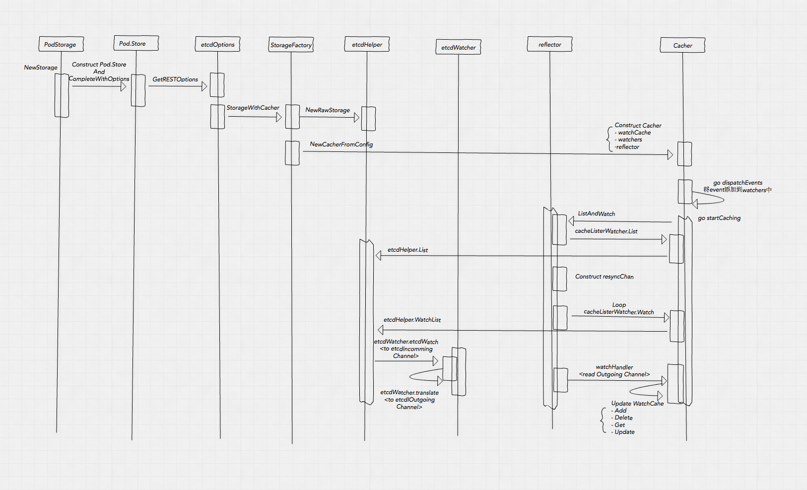
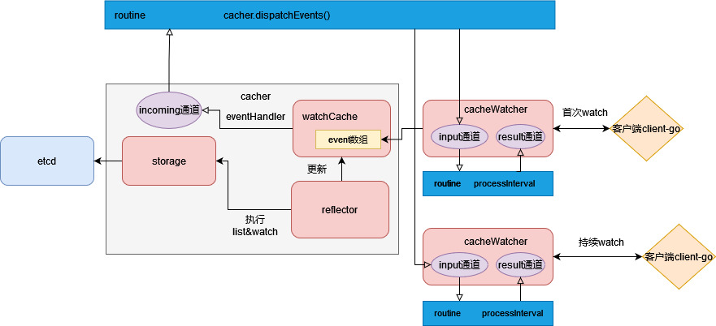

# kube-apiserver 又 OOM 了？

> 代码版本：v1.26

# 由来

前一篇已经介绍了 Informer 的实现，Informer 对 kube-apiserver 发起了 list 和 watch 请求。我们知道大规模集群下，kube-apiserver 会成为瓶颈，尤其在内存方面，相信很多人也遇到过 kube-apiserver OOM 等问题（碰巧的是最近线上连续出现两次 kube-apiserver OOM 的问题）。本篇主要讲 kube-apiserver 中 Informer 需要用到的两个接口 list 和 watch 的实现。

网上搜索的话，可以找到大量相关的源码解析的文章，这里我并不会去过多涉及代码，主要还是以讲原理、流程为主，最后简单介绍下当前存在的问题，理论实践相结合。本篇主要讲当前实现，只有了解了当前实现，明白了为什么会有问题，才知道如何去解决问题，接下来的一篇会详细分析如何解决这些问题。

# 原理

## Cacher 加载

在之前一篇 [kubernetes 月光宝盒 - 时间倒流](https://mp.weixin.qq.com/s/B1OTBSIY7I-4TF0LaxtQUA)中我们已经介绍过 watch 的实现机制。

核心组件：Cacher，watchCache，cacheWatcher，reflector。其中 watchCache 作为 reflector 的 store，Etcd 作为 listerWatcher 的 storage，store 和 listerWatcher 作为参数用来构造 reflector。数据流大致如下：

1. kube-apiserver 启动，针对每种资源类型，调用其对应 cacher 的 startCaching，进而调用 reflector.ListAndWatch，触发 listerWatcher 的 list 和 watch，对应 Etcd list 之后再 watch，watch 时会创建 watchChan，从 Etcd 读到的结果会先进入到 watchChan 的 incomingEventChan 中，经过 transform 处理后发送到 watchChan 的 resultChan 中，供 reflector 消费；
2. reflector 会消费上述 resultChan 的数据，即 watch.Event 对象，并根据事件类型调用 store 的增删改方法，此处 store 即 watchCache，经过 watchCache.processEvent 处理，组装 watchCacheEvent 对象，**更新 watchCache 的 cache（大小自适应的唤醒缓冲区，保留历史 event）和 store（全量数据）**，并最终通过 eventHandler 将其发送到 cacher 的 incoming chan 中；
3. cacher.dispatchEvents 消费 incoming chan 的数据，经过处理后发送给每个 cacheWatcher 的 input chan；
4. 外部调用 kube-apiserver watch 请求后会创建一个对应的 cacheWachter 对象，最终到 cacheWatcher 的 Watch 处理机中，消费 input chan，调用 watchCacheEvent 进行事件分发；

## Cacher 数据流

用来缓存数据的核心结构是 watchCache，其内部又两个关键结构：cache（cyclic buffer），store（thread safe store），分别用来存储历史的 watchCacheEvent 和真实的资源对象，其中 store 里面存储的是全量对象，而 cache 虽然是自适应大小的，但还是有最大容量限制的，所以他存储的 watchCacheEvent 所代表的对象集合并不一定能覆盖 store 的全部数据。

# 历史问题

kube-apiserver 在优化自身内存使用方面做了很多优化了，不过至今仍然存在一些尚未完全解决的问题。

## kube-apiserver OOM

### 内存消耗来源

kube-apiserver 的内存消耗，主要两个来源：

1. 一部分来自于他缓存了集群所有数据（Event 除外，此 Event 为 k8s 的资源类型），并且为每种资源缓存了历史 watchCacheEvent，以及一些内部的数据结构和 chan 等，这部分是不可避免的，虽然可以适当优化，但作用并不大；
2. 另一部分来自于客户端请求，尤其是 list 请求，kube-apiserver 需要在内存中进行数据深拷贝，序列化等操作，所需内存量和数据量、请求量正相关，随着数据量的增加，请求量的增加，所需要的内存也越大，而且这部分的内存通过 golang GC 是没有办法完全回收的，而 list 请求的主要来源就是 Informer；

list 请求占用内存多的原因如下：

1. 默认情况下（没有指定 resourceversion 的情况下），直接从etcd获取数据可能需要大量内存，超过数据存储的完整响应大小数倍；
2. 请求明确指定 ResourceVersion 参数来从缓存中获取数据（例如，ResourceVersion="0"），这实际上是大多数基于 client-go 的控制器因性能原因而使用的方法。内存使用量将比第一种情况低得多。但这并不是完美的，因为我们仍然需要空间来存储序列化对象并保存完整响应，直到发送。

### 常见场景

有两个常见的容易引起 kube-apiserver OOM 的场景：

1. 一些 DaemonSet 之类的程序里面用到了 Informer，在进行变更，或者故障重启的时候，随着集群规模的增加，请求量也随之增加，对 kube-apiserver 内存的压力也增加，在没有任何防护措施（限流）的情况下，很容易造成 kube-apiserver 的 OOM，而且在 OOM 之后，异常连接转移到其他 master 节点，引起雪崩。理论上也属于一种容量问题，应对措施扩容（加 master 节点）、限流（服务端限流：APF、MaxInflightRequest等，及客户端限流）。
2. 某种类型资源的数据量很大，kube-apiserver 配置的 timeout 参数太小，不足以支持完成一次 list 请求的情况下，Informer 会一直不断地尝试进行 list 操作，这种情况多发生在控制面组件，因为他们往往需要获取全量数据。

## too old resource version

### 原理

严格说，这并不能算是一个问题，机制如此，理论上单机资源无限的情况下是可以避免这个现象的。为了方便描述，用 RV 代指 resourceversion。

其本质是客户端在调用 watch api 时携带非 0 的 RV，服务端在走到 cacher 的 watch 实现逻辑时需要根据传入的 RV 去 cyclic buffer 中二分查找大于 RV 的所有 watchCacheEvent 作为初始 event 返回给客户端。当 cyclic buffer 的最小 RV 还要比传入的 RV 大时，也就是说服务端缓存的事件的最小 RV 都要比客户端传过来的大，意味着缓存的历史事件不全，可能是因为事件较多，缓存大小有限，较老的 watchCacheEvent 已经被覆盖了。

### 常见场景

1. 这种情况多发生在 kubelet 连接 apiserver 的场景下，或者说 watch 带了 labelselector 或 fieldselector 的情况下。因为每个 kubelet 只关心自己节点的 Pod，如果自身节点 Pod 一直没有变化，而其他节点上的 Pod 变化频繁，则可能 kubelet 本地 Informer 记录的 last RV 就会比 cyclic buffer 中的最小的 RV 还要小，这时如果发生重连（网络闪断，或者 Informer 自身 timeout 重连），则可以在 kube-apiserver 的日志中看到 "too old resoure version" 的字样。
2. kube-apiserver 重启的场景，如果集群中部分类型资源变更频繁，部分变更不频繁，则对于去 watch 变更不频繁的资源类型的 Informer 来说起本地的 last RV 是要比最新的 RV 小甚至小很多的，在 kube-apiserver 发生重启时，他以本地这个很小的 RV 去 watch，还是有可能会触发这个问题；

客户端 Informer 遇到这个报错的话会退出 ListAndWatch，重新开始执行 LIstAndWatch，进而造成 kube-apiserver 内存增加甚至 OOM。问题本质原因：RV 是全局的。场景的景本质区别在于场景 1 是在一种资源中做了筛选导致的，场景 2 是多种资源类型之间的 RV 差异较大导致的。

### 优化

经过上述分析，造成这个问题的原因有两个：

1. cyclic buffer 长度有限；
2. 客户端 Informer 持有的 last RV 过于陈旧；

社区也已经在多个版本之前进行了优化来降低这个问题出现的概率。

针对问题一，采用了自适应窗口大小，虽然还是会有问题，但相比之前写死一个值出现问题的概率要小，同时在不必要的时候缩小长度，避免内存资源的浪费。

针对问题二，有两个优化，引入了 BOOKMARK 机制来优化同一种资源不同筛选条件导致的问题，BOOKMARK 是一种 event 类型，定期将最新的 RV 返回客户端；引入 ProgressNotify 解决多种资源类型 RV 差异较大，在 kube-apiserver 重启后，Informer resume 时导致的问题，本质是利用了 Etcd 的 clientv3 ProgressNotify 的机制，kube-apiserver 在 Watch Etcd 的时候携带了特定的 Options 开启此功能。ProgressNotify 参考 [Etcd 官方文档](https://pkg.go.dev/github.com/coreos/etcd/clientv3#WithProgressNotify)：

> WithProgressNotify makes watch server send periodic progress updates every 10 minutes when there is no incoming events. Progress updates have zero events in WatchResponse.

详情可以参考如下 KEP [956-watch-bookmark](https://github.com/kubernetes/enhancements/blob/master/keps/sig-api-machinery/956-watch-bookmark/README.md) 和 [1904-efficient-watch-resumption](https://github.com/kubernetes/enhancements/blob/c63ac8e05de716370d1e03e298d226dd12ffc3c2/keps/sig-api-machinery/1904-efficient-watch-resumption/README.md)

## stale read

这更是一个历史悠久的问题了，自从有了 watchCache 之后就有了这个问题，本质是将之前直接访问 Etcd 时的线性一致性读（Etcd 提供的能力），降级成了读 kube-apiserver cache 的顺序一致性。

### 场景

1. T1: StatefulSet controller creates `pod-0` (uid 1) which is scheduled to `node-1`
2. T2: `pod-0` is deleted as part of a rolling upgrade
3. `node-1` sees that `pod-0` is deleted and cleans it up, then deletes the pod in the api
4. The StatefulSet controller creates a second pod `pod-0` (uid 2) which is assigned to `node-2`
5. `node-2` sees that `pod-0` has been scheduled to it and starts `pod-0`
6. The kubelet on `node-1` crashes and restarts, then performs an initial list of pods scheduled to it against an API server in an HA setup (more than one API server) that is partitioned from the master (watch cache is arbitrarily delayed). The watch cache returns a list of pods from before T2
7. `node-1` fills its local cache with a list of pods from before T2
8. `node-1` starts `pod-0` (uid 1) and `node-2` is already running `pod-0` (uid 2).

详情可以参考 [issue 59848](https://github.com/kubernetes/kubernetes/issues/59848)。

# 思考

我们经常看到各种源码分析，原理解析的文章，容易轻信其内容，但随着版本迭代，以及一些细节的处理，可能会导致我们理解不到位，或者并不能真正的掌握。例如是否在 list 请求时传 RV=0 就一定会走 kube-apiserver 的缓存？网上搜的话，应该都是说会走，但看代码你会发现并不是这样，例如当 kube-apiserver 重启后数据还没有完全加载好的时候，遇到 list 带了 RV=0 的请求会直接去访问 Etcd 获取数据。看似不起眼的细节，可能会影响我们处理问题的思路，比如 Etcd 负载较高要查原因，如果你知道这个细节的话，就会有意识的去看所有的 list 请求，而不只是那些 RV != 0 的请求。

最后留一个思考，kube-apiserver 的内存压力主要来自 list 请求，那么我们是否可以不使用 list 请求而是使用一种流式处理来实现 list 的功能呢？这样是不是就可以把内存消耗限制在一个常数的空间复杂度范围内了？下一篇将会专门分析使用流式 api 解决 list 导致的内存暴涨的问题，敬请期待~

