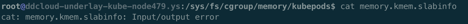

# Cgroup泄露1


### 背景

线上k8s节点创建容器时提示"no space left on device"，为已知问题，参考

<https://tencentcloudcontainerteam.github.io/2018/12/29/cgroup-leaking/>

<http://www.linuxfly.org/kubernetes-19-conflict-with-centos7/?from=groupmessage>

### 解决方案

按照上述链接中的提示，首先看runc部分，docker用的从opencontainers/runc项目fork出来的docker/runc项目，目前线上用的docker版本为1.13.1，对应的docker-runc的commit为 9df8b306d01f59d3a8029be411de015b7304dd8f，查看其相关代码

```
func (s *MemoryGroup) Apply(d *cgroupData) (err error) {
   path, err := d.path("memory")
   if err != nil && !cgroups.IsNotFound(err) {
      return err
   }
   if memoryAssigned(d.config) {
      if path != "" {
         if err := os.MkdirAll(path, 0755); err != nil {
            return err
         }
      }
          // 默认关闭
      if d.config.KernelMemory != 0 {
         if err := EnableKernelMemoryAccounting(path); err != nil {
            return err
         }
      }
   }
   defer func() {
      if err != nil {
         os.RemoveAll(path)
      }
   }()
 
   // We need to join memory cgroup after set memory limits, because
   // kmem.limit_in_bytes can only be set when the cgroup is empty.
   _, err = d.join("memory")
   if err != nil && !cgroups.IsNotFound(err) {
      return err
   }
   return nil
}
```

此版本默认关闭KernelMemory功能，所以docker-runc暂时不需要改，接下来看kubelet相关代码，kubelet为1.12.4版本，pkg/kubelet/cm/cgroup_manager_linux.go下

```
func (s *MemoryGroup) Apply(d *cgroupData) (err error) {
   path, err := d.path("memory")
   if err != nil && !cgroups.IsNotFound(err) {
      return err
   } else if path == "" {
      return nil
   }
   if memoryAssigned(d.config) {
      if _, err := os.Stat(path); os.IsNotExist(err) {
         if err := os.MkdirAll(path, 0755); err != nil {
            return err
         }
         
         // Only enable kernel memory accouting when this cgroup
         // is created by libcontainer, otherwise we might get
         // error when people use `cgroupsPath` to join an existed
         // cgroup whose kernel memory is not initialized.
                // 强制开启
         if err := EnableKernelMemoryAccounting(path); err != nil {
            return err
         }
      }
   }
   defer func() {
      if err != nil {
         os.RemoveAll(path)
      }
   }()
 
   // We need to join memory cgroup after set memory limits, because
   // kmem.limit_in_bytes can only be set when the cgroup is empty.
   _, err = d.join("memory")
   if err != nil && !cgroups.IsNotFound(err) {
      return err
   }
   return nil
}
```

上面的代码为默认开启KernelMemory，且无法关闭，解决方案是注释掉EnableKernelMemoryAccounting调用，然后重新编译kubelet即可。**由于线上docker****和cgroup****使用的cgroup-driver****为cgroupfs****而不是systemd****，所以这里并没有修改systemd****对应文件里有关KernelMemory****的代码。**

### 验证

找了一台新机器，上面没有任何容器，先看下改之前的kubelet所创建的/sys/fs/cgroup/memory/kubepods/memory.kmem.slabinfo文件，如下


说明已经开启了kmem，然后替换kubelet并重启宿主，观察上面文件，如下



说明kmem已经关闭了。这里重点强调一下，必须重启宿主才能生效，只重启kubelet无法生效，因为需要修改/sys/fs/cgroup/memory/kubepods，kubelet启动时会检测此目录是否存在，不存在则创建，存在则直接使用，只重启kubelet时此目录依然存在，因为容器业务进程还在使用着相关的cgroup。新创建的Pod会以继承此目录下的cgroup的配置，所以需要重启宿主才能关闭kmem。

### 总结

本篇是一种快速暴力的解决问题手段，后经过调研测试，有不需要重启宿主的方案，在[这一篇](../cgroup-leak2)中介绍
