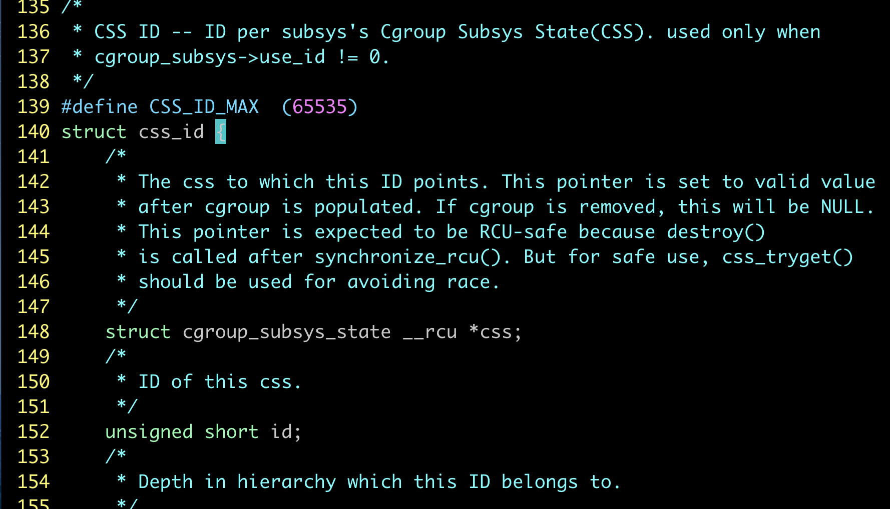
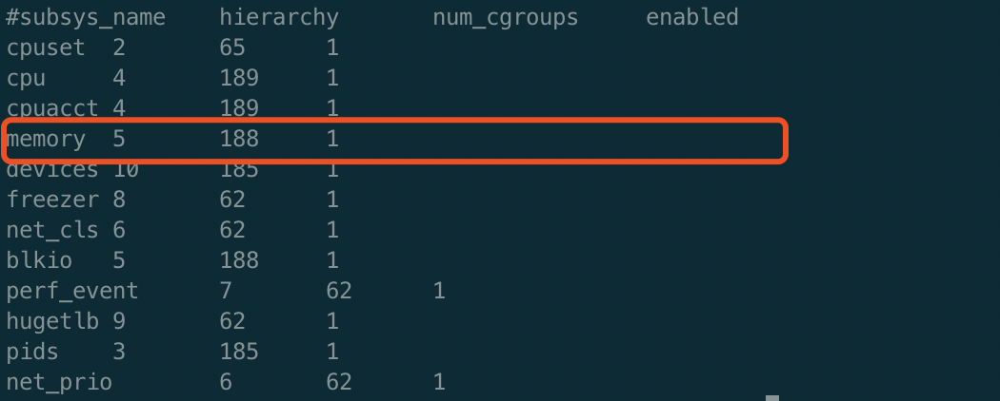

# Cgroup泄露2


> 线上宿主使用的kubernetes版本是1.12 ，kubelet默认是开启了kmem accounting的功能。kernel memory 在内核4.0以下的版本是一个[实验特性](https://www.malasuk.com/doc/kernel-doc-3.10.0/Documentation/cgroups/memory.txt)，存在使用后不能删除cgroup的问题，造成cgroup泄漏。

## 现象描述

宿主机上创建容器时失败，kubelet log中可见 报错信息如下

```shell
mkdir /sys/fs/cgroup/memory/kubepods/burstable/pod79fe803c-072f-11e9-90ca-525400090c71/b98d4aea818bf9d1d1aa84079e1688cd9b4218e008c58a8ef6d6c3c106403e7b: no space left on devic
```

## 到底在泄漏什么

内核中对于每个子系统的的条目数是有限制的，限制的大小定义在kernel/cgroup.c#L139。 



当正常在cgroup创建一个group的目录时，条目数就加1 .我们遇到的情况就是因为开启了kmem accounting功能，虽然cgroup的目录删除了，但是条目没有回收。这样后面就无法创建65535个cgroup了。也就是说，在当前内核版本下，开启了kmem accounting功能，会导致memory cgroup的条目泄漏无法回收。

## 如何查看泄漏程度

正常情况下，可以通过以下命令来查看cgroup的数目 。

```shell
cat /proc/cgroups
```

但是存在泄漏的宿主机上这个数字是不可信的，因为这个计数就是随着cgroup下目录的增删进行。



经过请教内核组同学，他给出了一个可以统计cgroup条目的方法

```c
# usage : stap -g get_memcg_count.stp
 
%{
 
#include <linux/rcupdate.h>
#include <linux/cgroup.h>
#include <linux/memcontrol.h>
 
 
    /* The embedded c function must have a return value.
     *  If it doesn't has an argument, we must use a specified void here.
     */
        int get_memcg_count(void)
        {
                struct cgroup_subsys_state *tmp;
                int count = 1;
        int i;
 
                rcu_read_lock();
                for (i = 1; i < 65536; i++) {
                        tmp = css_lookup(&mem_cgroup_subsys, i);
                        if (tmp)
                                count++;
 
                }
                rcu_read_unlock();
 
        return count;
        }
 
%}
 
 
function do_calc:long()
%{
    int count = 0;
    count = get_memcg_count();
    STAP_RETVALUE = count;
%}
 
probe begin {
    printf("probe begin\n");
    printf("count %ld\n", do_calc());
    exit();
}
 
probe end {
    printf("probe end\n");
}
```

## 如何引入 & 如何解决

这个问题是kubernetes 1.9 版本引入的，kubelet创建容器代码中EnableKernelMemoryAccounting 导致的。关于这个问题的分析，网络上有很多文章进行分析，比如
https://github.com/kubernetes/kubernetes/issues/61937  
https://github.com/moby/moby/issues/29638
https://tencentcloudcontainerteam.github.io/2018/12/29/cgroup-leaking/ http://www.linuxfly.org/kubernetes-19-conflict-with-centos7/?from=groupmessage

在上篇[cgroup泄露问题1](../cgroup-leak)进行了详细的分析，并提供了1.12.4版本（线上版本）的修复方案。 社区版本1.14，提供了开关可以关闭kmem accounting。

文章给出的方案简单总结就是重启宿主机后+关闭kmem account的kubelet，可以彻底解决这个问题。对于设置了node affinity的场景，重启宿主机成本较高，因此也就有了探索是否可以不重启宿主机的方案。

## cgroup迁移

 下面对于memory cgroup子系统，简称为memcg 。对于已经泄漏的memcg，新创建的容器会继承父group，所以会加剧这个问题。如果我们通过一种cgroup迁移方式，将当前的memcg 迁移到另一个group，然后重新创建关闭了kmem accounting的group，并把原来的子group迁移回来是否就可以搞定这个问题了呢。

   cgroup 本身是支持cgroup迁移功能的

```shell
4.2 Task migration
When a task migrates from one cgroup to another, its charge is not
carried forward by default. The pages allocated from the original cgroup still
remain charged to it, the charge is dropped when the page is freed or
reclaimed.
 
You can move charges of a task along with task migration.
See 8. "Move charges at task migration"

This feature is disabled by default. It can be enabledi (and disabled again) by
writing to memory.move_charge_at_immigrate of the destination cgroup.
 
If you want to enable it:
 
# echo (some positive value) > memory.move_charge_at_immigrate
Note: Each bits of move_charge_at_immigrate has its own meaning about what type
      of charges should be moved. See 8.2 for details.
Note: Charges are moved only when you move mm->owner, in other words,
      a leader of a thread group.
Note: If we cannot find enough space for the task in the destination cgroup, we
      try to make space by reclaiming memory. Task migration may fail if we
      cannot make enough space.
Note: It can take several seconds if you move charges much.
```

我们是全量task 迁移，因此也不存在上面注意事项中提到的只支持迁移主线程的问题。

那我们梳理下，memcg 需要迁移内容包含哪些。 迁移后需要保证容器内存quota不变，容器的内存使用量不变，容器内的进程（对于cgroup来说，都是task）迁移后不丢。这三项分别对应的是memory.limit_in_bytes/memory.usage_in_bytes/tasks

因为内存使用量是memcg来控制的，我们看到的memory.usage_in_bytes 是只读的，所以这个文件中的数据迁移是依赖于task迁移来实现。
