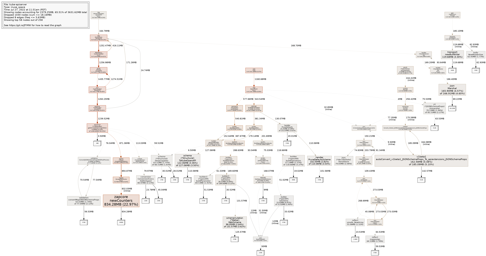

# kube-apiserver 连接数也会影响内存？

> 之前从资源对象的获取方式、序列化、深拷贝的角度分别分析了对 kube-apiserver 内存使用量的影响以及社区是如何进行优化的，这一篇围绕网络连接展开分析其对 kube-apiserver 内存的影响。涉及到如下内容：
>
> - 连接数是如何影响 kube-apiserver 内存的
> - client-go 是如何与 kube-apiserver 建立连接的
> - kube-apiserver 是如何与 etcd 建立连接的
> - etcd 相关服务端实现和问题
> - http2 的 io 多路复用的原理
> - golang 在 http2 实现上的一些缺陷和安全漏洞

# 背景

之前从资源对象的[获取方式](https://mp.weixin.qq.com/s/futHT0njb5y2UHLeg7BL7w)、[序列化](https://mp.weixin.qq.com/s/RrBOHRSztsnkp5M2_32VrQ)、[深拷贝](https://mp.weixin.qq.com/s/ukwOzE5wXsb8wUXZ95xpEQ)的角度分别分析了对 kube-apiserver 内存使用量的影响以及社区是如何进行优化的，这一篇围绕网络连接展开分析其对 kube-apiserver 内存的影响，以及这中间涉及到的其他相关问题。

# 分析

## 内存消耗

按照常理理解的话，进程负责了网络连接的管理，理论上连接数多了之后是对进程内存有影响的，但一般情况下在做内存优化的时候并不会上来就从连接数的角度去分析。在 kube-apiserver 中真实的出现了因为网络连接数造成的不可忽视的内存开销。

相关问题是在 2022 年提出来的，在名为 [etcd3 client logger uses significant memory with many CRDs](https://github.com/kubernetes/kubernetes/issues/111476) 的 issue 中提到了一个现象，在一个通过 kind 启动的包含大约 1900 个 CRD 的集群中（注意是 CRD 不是 CR），issue 的作者发现 kube-apiserver 的内存使用量高达到 8G，而 etcd3 client's logger 贡献了大约 1.5G，很夸张的一个比例。随后其又做了一些测试并贴出来了 pprof 的结果，如下

可以明显的看到 zapcore.newCounters 占用了 800+M 内存，这还只是一个用来复现问题的 demo，实际情况下的内存消耗要比这个值多。zap 是 etcd3 client 使用的日志包。

经过其分析，logger 消耗内存多和 kube-apiserver 与 etcd3 的连接数有关，过程如下

- All of /apis is handled by a *crdHandler
- When a request comes in it gets an instance of the crd (from an informer)
- Gets serving info from a map of CRDs - if there is none it...
- Calls customresource.NewStorage which creates a genericregistry.Store
- Calls its CompleteWithOptions method
- That calls its “Decorator”, which is a genericregistry.StorageWithCacher
- That calls generic.NewRawStorage which just wraps factory.Create
- factory.Create calls newETCD3Storage which calls newETCD3Client

最后的结果就是 kube-apiserver 会为每个 CRD 都和 etcd 建立一个连接，而 kube-apiserver 在设置 clientv3.Config 时并没有显示的指定 Logger，而 etcd clientv3 内部逻辑会判断 Logger 是否为空，是的话会实例化一个 Logger 对象出来，最终 kube-apiserver 和 etcd 有多少连接存在，就会有多少 Logger 对象存在。

## Logger 问题修复

issue 作者提了 [Share a single etcd3 client logger across all clients](https://github.com/kubernetes/kubernetes/pull/111477) 来修复上述问题，改动比较简单，在 init 函数里创建一个 logger 对象，并将其设置给 clientv3.Config.Logger，结果就会是全局只使用一个 logger 对象，避免上述问题的出现。在 v1.25 中发布，并于 8 月份 backport 回了 v1.22 ~ v1.24 版本中，如果运行的 k8s 发行版的发型时间在此之前，且集群内使用了大量的 CRD 的话，就需要去注意下这个问题了。

## Kube-apiserver 与 Etcd 的连接

### One Client Per Etcd

至此，logger 对象只有一个了，但 kube-apiserver 与 etcd 的连接数仍然存在多个，与资源类型的数量正相关，所以事情到这里并没有结束，大佬们又开始讨论是否可以继续优化 kube-apiserver 与 etcd 的连接数，而这个问题早在 2021 年就已经开始讨论了：https://kubernetes.slack.com/archives/C0EG7JC6T/p1618439560231400

> Yeah that sounds like what it currently does. What it should do is make one client per database (recall that you can put different collections in different etcd databases).

针对这个问题，上面 issue 作者又提了 [API server creates one etcd client per CRD](https://github.com/kubernetes/kubernetes/issues/111622) 来跟进，同时还提了对应的修复代码 [Only create one etcd client per transport](https://github.com/kubernetes/kubernetes/pull/111559)，通过添加一个 transport 级别的 etcd3 client Cache 来解决此问题，并且给出了他的测试结果，内存减少了 35%，但这个 PR 最终没有合入主干中

> I would expect us to be able to move the client construction earlier in the server startup so a single instance can be shared by multiple registries.

多个 reviewer 表示希望通过单例的方式实现，而不是添加 transport 级别的 cache，此 PR 作者并没有继续按上述思路去修改，随后关闭了这个 PR，由另外一个作者通过新的 PR [Create and reuse a single etcd client](https://github.com/kubernetes/kubernetes/pull/114458) 来解决此问题，新的 PR 按照上面的思路，通过 transport 级别的单例实现了**每个 etcd 集群一个 Client 实例**（注意这里不是连接，而是 Client 实例，原因后文会涉及到），但新的 PR 至今依然尚未合入主干，也就是说至今仍然是每种资源类型一个 Etcd Client 实例。

### 又现惊天大 bug？

在已经关闭的老 PR 中 Jordan 也提出了他的一些疑问

> As an aside, I do wonder if this will change the performance characteristics of large servers with lots of requests going to parallel resources at the same time, which previously got their own connections, and now would multiplex over a single (?) connection.

从之前每种资源一个连接变成每个 etcd集群一个 Client 实例，依赖 io 多路复用，在大规模集群的场景下会不会存在性能问题？然后大佬们又就此进行了讨论

> I will be a little surprised if gRPC's multiplexing (over single HTTP/2 connection) is worse than the kernel/network fabric's multiplexing (over multiple connections).

因为 etcd clientv3 本身已经是通过 gRPC 方式访问 etcd 了，应该不会有问题，但**出于谨慎，还是进行了专门的测试，不测不要紧，一测就测出了问题**：[Etcd watch stream starvation under high read response load when sharing same connection and TLS is enabled](https://github.com/etcd-io/etcd/issues/15402)。

> When etcd client is generating high read response load, it can result in watch response stream in the same connection being starved. For example a client with an open watch and running 10 concurrent Range requests each returning around 10MB. The watch might get starved and not get any response for tens of seconds.
>
> Problem does not occur when TLS is not enabled nor when watch is created on separate client/connection.
>
> This affects also K8s (any version) as Kubernetes has one client per resource. Problem will trigger when single K8s resource has a lot of data and there are 10+ concurrent LIST requests for the same resource send to apiserver. For example 10k pods. This can cause serious correctness issues in K8s, like controllers not doing any job as they depend on watch to get updates. For example scheduler not scheduling any pods.
>
> We tested and confirmed that all v3.4+ versions are affected.
>
> Issue affects any watch response type:
>
> - Event
> - Periodic watch progress notification
> - Manual watch progress notification

**在 TLS 模式下访问 Etcd 时**，如果请求的数据量较大，可能会导致同一个连接的 watch stream 无法正常返回数据。尽管目前仍然是针对每种资源类型存在一个 Client 实例，但在**针对同一个资源进行并行的 LIST 请求且资源量较大时，这个问题依然存在，且会影响 k8s 的所有版本**。从某种程度上说，幸亏针对每个 Etcd 集群使用一个 Client 的功能还没有合入主干，否则这个问题出现的概率会被放大，大佬们对技术的谨慎态度值得我们学习。

经过大佬们的分析，产生此问题的原因在 Etcd 的实现，以及 golang 中对 HTTP/2 处理。

> - Problem occurs only when TLS is enabled. This is because [grpc handler is served through http server](https://github.com/etcd-io/etcd/blob/b5e224db7da3da3347b5843a9ecdd3137760bc94/server/embed/serve.go#L155-L201), which [doesn't occur otherwise](https://github.com/etcd-io/etcd/blob/b5e224db7da3da3347b5843a9ecdd3137760bc94/server/embed/serve.go#L122-L129).
> - http server is affected by [net/http: Stream starvation in http2 priority write scheduler golang/go#58804](https://github.com/golang/go/issues/58804)

### Golang 相关问题

问题是在 golang 1.19 中引入 PriorityWriteScheduler 开始的，在 [golang/net@`120fc90`](https://github.com/golang/net/commit/120fc906b30bade8c220769da77801566d7f4ec8) 修复，对应的 tag 为 v0.11.0。

> When the children of a node have varying weights, `walkReadyInOrder` sorts the children of a node by the ratio of weight to bytes sent. This prevents starvation--a low-priority stream will get a smaller fraction of the available resources, but it'll still get a fraction.
>
> However, when the children all have the same weight (the common case), `walkReadyInOrder` just picks the first available stream without consideration for how many bytes have been sent, permitting starvation.

PriorityWriteScheduler 可以支持基于流的优先级的写的能力，但是当没有优先级的差异时，就会退化为 LIFO 的模式，新创建的流会优先得到处理，而已经创建一段时间并且发送了很多数据的流会排在靠后的位置等待处理。

社区提到了几种解决方案，比如使用 random write scheduler 或者 round robin write scheduler 替换 priority write scheduler，最终采取了 round robin write scheduler，一是因为 random write scheduler 虽然可以解决上述问题，但其性能并不是最优的，存在一些长尾延迟问题，再就是在最新的 [RFC 9113](https://www.rfc-editor.org/rfc/rfc9113.html#section-5.3) 中已经废弃了 `stream prioritization scheme`，而这个概念是在  [RFC 7540](https://www.rfc-editor.org/rfc/rfc9113.html#RFC7540) 引入的。更详细的讨论可以参考 https://github.com/golang/go/issues/58804#issuecomment-1470330633。

### Etcd 相关问题

Etcd 针对上述问题做了如下处理

1. [v3.4+] [Change http server frame scheduler to random](https://github.com/etcd-io/etcd/pull/15452).
2. [v3.4+] [Move http server to separate port](https://github.com/etcd-io/etcd/pull/15446) by passing `--listen-client-http-urls`.
3. [v3.6+] [Use customised connection multiplexer for etcd](https://github.com/etcd-io/etcd/pull/15510) 
4. [v3.4+] When ready for production use, change to new [frame scheduler round-robin algorithm](https://github.com/golang/go/issues/58804#issuecomment-1480303386).

先通过修改为 random write scheduler 来避免饥饿问题，同时通过暴露新的参数 `--listen-client-http-urls` 来解决 TLS 模式下通过 http server 处理 grpc handler 时受到 golang 影响的问题，最后把 random write scheduler 修改为 round robin write scheduler。而在 v3.6 及之后的版本中，会通过自定义 io 多路复用功能的方式替换了当前的实现（当前通过直接引用 cmux 包实现），由于这个改动较大，不适合放在已经正式 release 的 v3.4 和 v3.5 中。

**最终在 v3.4.28 及以上、 v3.5.10 及以上的版本中问题得以彻底解决，如果还在使用 v3.4 或者 v3.5 较低版本的话，建议升级到上述版本。**

这里重点提一下第二个改动，通过新增 `--listen-client-http-urls` 参数来规避问题，其原理是统一 etcd 服务端对 grpc 请求的处理，如果没有指定此参数，保持和之前实现一致的行为，如果同时定义了 `--listen-client-urls` 和 `--listen-client-http-urls` 则对前者使用 grpc server 对后者使用 http server 提供服务。为什么用了 random write scheduler 还要拆开呢？

> Even with random write scheduler grpc under http server can only handle 500 KB with 2 seconds delay. On the other hand,
> separate grpc server easily hits 10, 100 or even 1000 MB within 100 miliseconds.

可以看到两种不同 server 类型的性能差异巨大，所以**在升级 etcd 版本的基础上，设置好相关参数来为 TLS 也通过 grpc server 服务来提升性能，尤其是 k8s 集群规模较大的场景。**

**强烈推荐看一下第二个实现的 PR**，里面涉及到如何设置这个两个参数，同时也可以感受到大佬们做 code review 时的细致，里面有一个非常细节的闭包导致的 bug，都被揪了出来，但由于与此实现无关，是一个历史 bug，就不在这里介绍了。

最后，也可以看出来其实并不是所有版本的 k8s 都会受此问题的影响的，取决于两个因素，影响也不同。

- k8s 使用的 golang 版本如果有问题的话，影响的是客户端访问 kube-apiserver；
- etcd 使用的 golang 版本有问题的话，影响的是 kube-apiserver 从 etcd 获取数据；

### 小结

**最终建议在 etcd 升级，修改相关参数的同时，也要注意下使用的 k8s 版本会不会有这个问题，主要就是看编译时使用的 golang 版本。**

至此，我们知道了 kube-apiserver 和 etcd 建立连接的过程，对内存的影响，存在的问题以及如何修复等社区进展。**由于 kube-apiserver   不管有多少实例，每个实例都需要与 etcd 建立连接，所以无法通过增加 kube-apiserver 实例数来缓解这个问题。**

## client-go 与 kube-apiserver 的连接

除了 kube-apiserver 与 etcd 会建立连接外，客户端也会与 kube-apiserver 建立连接，那么维护这些连接会不会也会造成内存使用明显增长的问题呢？这就需要我们了解 client-go 建连机制了，可以借机看看自己是否真的搞懂 client-go 与 kube-apiserver 建立连接这部分的内容了。

client-go 通过 `Config` 结构维护访问 kube-apiserver 使用的配置，与此问题的对应的关键属性是 `Transport`，注意和上面 kube-apiserver 访问 etcd 提到的 transport 完全不一样的概念，不要混淆，后者是 kube-apiserver 内的自定义结构。如果没有显示的为 Config 设置 Transport，则其使用的是 http.DefaultTransport，默认使用 HTTP/2，考虑以下场景：未显示指定 Transport，通过 Config 创建了 clientset，使用 clientset 创建了 informerFactory，并同时针对不同的资源启动了对应的 informer，那么 client-go 会与 kube-apiserver 建立多少条连接呢？

要回答这个问题，就需要了解 HTTP/2 io 多路复用的实现。

### HTTP/2 IO 多路复用

io 多路复用的意思是每个连接上有多个 stream，而上面提到的针对不同资源都使用 informer 与 kube-apiserver 建立连接，最终可能是复用了已经存在的连接，只不过在其中多了一个 stream 而已。这也是最开始提到 kube-apiserver 与 etcd 建立连接时提到的 Per Etcd Per Client 而不是 Per Etcd Per Connection 的原因，因为即使是一个 Client 最终到底会建立多少连接，和请求量有关，也和服务端 `MaxConcurrentStreams` 参数设置有关，这个参数表示每个连接上最多可以有多少流，默认为 250。假如使用默认值的情况下，客户端同时发起了 250 个请求，那理论上只需要 1 条连接就能搞定，但如果你去实际测试一下话，你会发现有的时候会有一个连接，有的时候会有两个连接，这是为什么呢？

这就需要去理解 HTTP/2 的实现了，客户端在尝试与服务端建立连接时

1. 首先获取连接，会先尝试从缓存中根据请求的 addr（host:port） 获取，如果没有获取到的话，会初始化一个连接（此时尚未与服务端建立连接，只是存在于客户端的一个数据额结构），每个连接也有个 `maxConcurrentStreams` 参数，默认值为 100，硬编码，无法修改；
2. 接着会根据如下公式判断是否需要新建新的连接 `maxConcurrentOkay = int64(len(cc.streams)+cc.streamsReserved+1) <= int64(cc.maxConcurrentStreams)`；
3. 如果尚未与服务端建立连接的话（第一个 stream），就开始执行 Dial 的操作，之后与服务端建连成功后，先协商 setting，其中就包含了上面提到的服务端的 `MaxConcurrentStreams` 参数，会覆盖了连接初始时的 `maxConcurrentStreams` 的值，协商只有在每个连接第一次与服务端建立连接时进行，之后复用这个连接的时候不再需要重新协商的过程；

之前每有请求过来都是重复上面的步骤，按需创建新的连接。

并发 250 个请求，有时是一个连接，有时是两个连接的原因：由于请求是并发创建的，会出现在某一时刻一批请求同时执行到了步骤二，而这时客户端与服务端协商虽然在第一个请求到来后就已经开始，但涉及到网络传输有可能协商并未完成，也就是说客户端的 `maxConcurrentStreams` 还是 100，所以当第 101 个请求来的时候，客户端判断觉得需要新建一个连接了，然后就新建了一个连接，之后协商完成，客户端本地的 `maxConcurrentStreams` 变成了 250，后续的请求到来的时候就又可以继续复用已有的连接了。最终就会造成实际的连接数 >=  请求并发 / `MaxConcurrentStreams`，如果协商在第 101 个请求到来之前已经完成，那么创建的连接数就是计算之后的结果，不会多。

如果先发起一个请求，得到返回结果后再并发创建 249 个请求的话，那么连接数就会始终是 1，因为在第一个请求里面已经完成了协商，客户端的 `maxConcurrentStreams` 已经被设置了 250，正好可以处理剩下的 249 个请求。

kube-apiserver 早期为 `MaxConcurrentStreams` 设置了默认值 250，并且暴露了参数可以在外部修改，而在 1.29 的发布中，将其默认值修改为了 100，同时 backport 回了从 v1.25 及之后的所有的版本，这个修改和 golang 的安全漏洞 [CVE-2023-44487](https://github.com/advisories/GHSA-qppj-fm5r-hxr3) and [CVE-2023-39325](https://github.com/advisories/GHSA-4374-p667-p6c8) 有关。

### CVE-2023-39325 

一个恶意的 HTTP/2 客户端，迅速创建请求并立即重置它们，可能导致服务器资源的过度消耗。尽管请求的总数受限于 `http2.Server.MaxConcurrentStreams` 设置，但在处理中的请求被重置允许攻击者在现有请求仍在执行时创建新请求。

有了上面的分析，理解这个漏洞及修复就会简单一些。漏洞产生的原因是虽然客户端在与服务端协商后会拿到服务端参数 `MaxConcurrentStreams` 的值，可以保证客户端单个连接上的 active stream 数量不超过这个阈值，但是有可能会导致服务端对应连接上的 stream 数量超过这个阈值。因为客户端虽然重置了请求，但可能请求在服务端还在运行中，客户端重置之后立马就可以重新发起请求，最终导致服务端资源被消耗殆尽，算是服务端实现的一个漏洞。

在 golang/net v0.17.0 中修复此漏洞，[http2: limit maximum handler goroutines to MaxConcurrentStreams](https://github.com/golang/net/commit/b225e7ca6dde1ef5a5ae5ce922861bda011cfabd)。实现原理是在服务端添加相关逻辑，判断执行中的请求是否超过了 `MaxConcurrentStreams` 的值，没有超过的话就直接执行，超过的话则会入队列，等到运行中的某个请求完成之后再从队列中取一个请求开始处理。如果队列里面积压的未处理请求数量超过 `MaxConcurrentStreams` 的 4 倍的话，服务端会报错 too_many_early_resets 并返回  `ErrCodeEnhanceYourCalm`，然后强制关闭连接。

golang 的上述修复 packport 到了 golang v1.20 和 v1.21 中，之前版本的 golang 仍然存在这个问题，但是由于 golang 版本维护策略只维护最新的两个版本，如果使用的还是之前 v1.19 或者之前的版本的话，可以升级 golang 版本，或者升级 x/net 版本到 v0.17.0 来解决。

### 小结

Kube-apiserver 刻意把 `MaxConcurrentStreams` 从 250 缩小到 100，是为了降低服务端可能受到的影响，在受到攻击时关闭连接的时候每个连接上最多 100 * 4 个请求，如果还是用 250 的话，就会有 250 * 4 个请求。

至此，应该就可以回答本节最开始提出的在未显示指定 Transport，通过 Config 创建了 clientset，使用 clientset 创建了 informerFactory，并同时针对不同的资源启动了对应的 informer，client-go 会与 kube-apiserver 会建立多少条连接的问题了。kube-apiserver 的连接多数来自于 daemonset 性质类的客户端请求，有了 io 多路复用之后，单个 agent 进程发起的请求可以通过少量的连接即可完成，这可以大大减少 kube-apiserver 的连接数，同时**由于 kube-apiserver 可以多实例负载均衡（虽然不是那么的均衡），但至少可以通过增加实例数来分担单个实例上连接数过多的风险，这和 kube-apiserver 作为客户端去和 etcd 建立连接的场景完全相反**。

# 总结

本篇分别从 kube-apiserver 连接 etcd，client-go 连接 kube-apiserver  的角度分析了连接数对内存的影响，在此过程中又引出了一连串的 Etcd，Golang，HTTP/2 中存在的一些问题和漏洞，这些问题都是优化连接数时不得不考虑或者提前解决的问题。同时也给出了问题引入和修复的方式或者版本，目前线上主流运行中的 k8s 集群和使用的 etcd 大部分应该都有相关问题，可以考虑按需升级处理。

