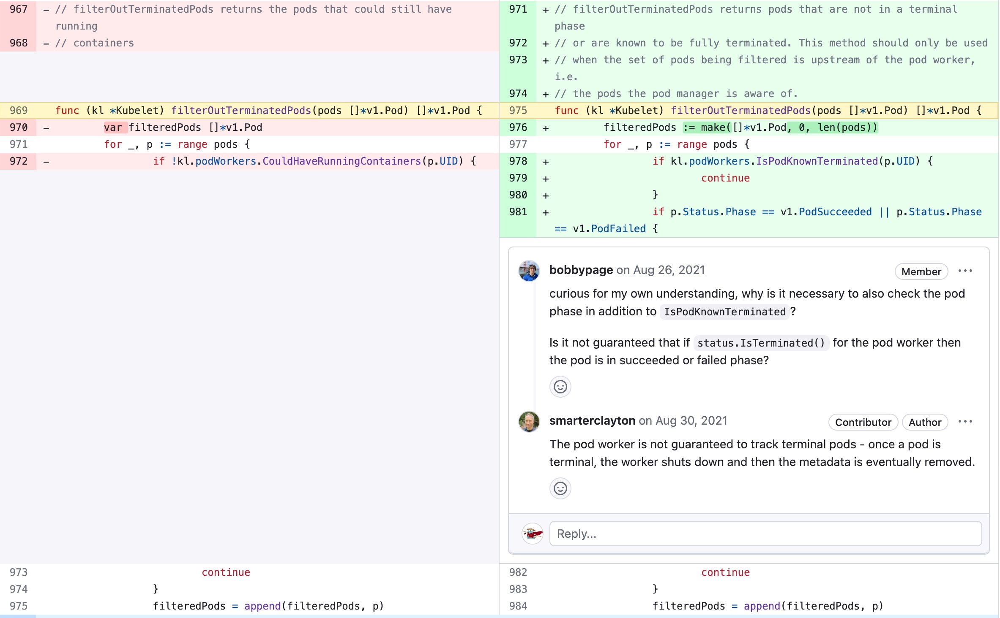

# Kubernetes 陈年老 bug - 绑核


# 背景

最近遇到一个线上问题，使用了 lxcfs 的容器，跑在 cgroup v2 的机器上时，在容器内使用 top 或者 htop 看到的核数和 cpu 使用率有问题。虽然根本问题在 lxcfs 的实现，但问题最终的触发与 cpuset 和 cpu.max 的设置有关。这里并不会去介绍这个问题本身，而是由问题引发的思考，**我们真的了解 k8s 里面的绑核行为吗，你以为你以为的就是你以为的吗？**

# 测验

接下来你可以尝试回答如下几个问题，并且通过实际的在 k8s 集群中进行操作来验证。为了方便描述，我们假设有一台最新的 **v1.28** 的 worker 节点有 12c，其分别为 system 以及 kubelet 各预留了 1c，那么他实际可用的核数将会是 10c，也就是 allocatable cpu 是 10c，并且其 cpuManagerPilicy 为 staitic 模式，cpuManagerReconcilePeriod 使用默认值 10s。

- 问题一：在没有分配任何 Pod 时，cpu_manager_state 默认的 defaultCPU 是多少核？
- 问题二：调度一个 Burstable Podb，其 cpu request 4c，cpu limit 8c，那么 Podb 的 cpuset 有几个核？
- 问题三：基于问题二，再调度一个 Guaranteed Podg1，使用 6c，那么 Podb 的 cpuset 有几个核？
- 问题四：删除 Podg1，那么 Podb 的 cpuset 有几个核？
- 问题五：重复问题三的步骤，创建 Podg2，继续看 Podb 有几个核？

# 答案

前两个问题答案都是 12c，后三个问题答案都是 6c。这个结果应该和绝大部分人以为的结果不一样，如果不相信的话，可以自行验证。涉及到一些考古信息，方便大家了解整个过程，当然最后总结部分也有按时间线提炼，可以直接跳到那里看。如果想都搞清楚搞明白的话，可能还真得需要一些时间才行。

# 分析

这里主要介绍两点，一个算是 feature：共享资源池，一个算是 bug：资源释放。估计大家会好奇问题四，而这也是这里要重点讲的。

## 共享资源池

第一点在于 defaultCPU 的设置，官网文档很明确的写了 https://kubernetes.io/zh-cn/docs/tasks/administer-cluster/cpu-management-policies/

> 此策略管理一个 CPU 共享池，该共享池最初包含节点上所有的 CPU 资源。 可独占性 CPU 资源数量等于节点的 CPU 总量减去通过 kubelet `--kube-reserved` 或 `--system-reserved` 参数保留的 CPU 资源。 从 1.17 版本开始，可以通过 kubelet `--reserved-cpus` 参数显式地指定 CPU 预留列表。 由 `--reserved-cpus` 指定的显式 CPU 列表优先于由 `--kube-reserved` 和 `--system-reserved` 指定的 CPU 预留。 通过这些参数预留的 CPU 是以整数方式，按物理核心 ID 升序从初始共享池获取的。 共享池是 `BestEffort` 和 `Burstable` Pod 运行的 CPU 集合。 `Guaranteed` Pod 中的容器，如果声明了非整数值的 CPU `requests`，也将运行在共享池的 CPU 上。 只有 `Guaranteed` Pod 中，指定了整数型 CPU `requests` 的容器，才会被分配独占 CPU 资源。

也就是说预留资源属于共享资源池资源，可以被非 Guaranteed Pod 共享。这可以解释前两个问题。

## 资源释放

对于问题四，为什么删除了 Podg1 后，Podb 的 cpuset 还是只有 6c？此时去看 cpu_state_manager 文件内容的话，可以看到 defaultCPU 只有 6c，而且 Podg1 的信息仍然还存在。既然删了之后没释放，可用的只有 6c 了，那继续问题五的步骤，岂不是 cpu 会被用完，导致没有剩余的 cpu 给 Podb 用了？但结果 Podb 仍然还有 6c 可用，此时再去看 cpu_manager_state 文件内容，defaultCPU 仍然是 6c，但已经分配的内容变了，换了个 PodID，但实际也是只有一个 Pod 分配了 6c，而不是两个。是不是很神奇，看起来泄露了一个，等新的 Podg2 调度上去之后，之前未删除的记录反而消失了。

之前曾经整理过一篇有关绑核的 bug，但那是针对较低版本的 k8s 的，可以看这篇：https://www.likakuli.com/posts/kubernetes-cpu-manager/。

> ### ISSUE
>
> 感兴趣的可以翻翻历史 ISSUE，此问题从 1.8 开始有大量相关的 ISSUE，下面列几个比较典型的
>
> [Internal PreStartContainer hook failed: not enough cpus available to satisfy request #63018](https://github.com/kubernetes/kubernetes/issues/63018)
>
> [cpumanager: AddContainer error: not enough cpus available to satisfy request #79159](https://github.com/kubernetes/kubernetes/issues/79159)
>
> [TopologyManager: Guarantee Aligned resources for Multiple Containers #83476](https://github.com/kubernetes/kubernetes/issues/83476)
>
> [Container cpuset lost, apparently due to race between PostStopContainer() and new container creation #90303](https://github.com/kubernetes/kubernetes/issues/90303)
>
> [The CPU manager does not work correctly for the guaranteed pod with multiple containers #103952](https://github.com/kubernetes/kubernetes/issues/103952)
>
> ### PR
>
> [Make CPU manager release CPUs when Pod enters completed phase #52363](https://github.com/kubernetes/kubernetes/pull/52363)
>
> [cpumanager: rollback state if updateContainerCPUSet failed #67430](https://github.com/kubernetes/kubernetes/pull/67430)
>
> [clean containers in reconcileState of cpuManager #68619](https://github.com/kubernetes/kubernetes/pull/68619)
>
> [Update CPUManager stored state semantics #84462](https://github.com/kubernetes/kubernetes/pull/84462)
>
> [Fix exclusive CPU allocations being deleted at container restart #90377](https://github.com/kubernetes/kubernetes/pull/90377)
>
> [Do not clear state of pods pending admission for CPU/Memory/Device manager #103979](https://github.com/kubernetes/kubernetes/pull/103979)

灵魂拷问：就一个绑核，有那么难吗，这么多问题。接下来分析下问题的原因，怎么引入的，怎么修复。

### 原因

先说结论，v1.22 对 kubelet 进行了比较大的重构，这个过程中引入了很多的问题，绑核这只是其中的一个问题。此问题在 2021 年 v1.22 引入，至今（2023.9 v1.28）仍然存在。根本原因在如下代码处：

```go
func (m *manager) removeStaleState() {
	// Only once all sources are ready do we attempt to remove any stale state.
	// This ensures that the call to `m.activePods()` below will succeed with
	// the actual active pods list.
	if !m.sourcesReady.AllReady() {
		return
	}

	// We grab the lock to ensure that no new containers will grab CPUs while
	// executing the code below. Without this lock, its possible that we end up
	// removing state that is newly added by an asynchronous call to
	// AddContainer() during the execution of this code.
	m.Lock()
	defer m.Unlock()

	// Get the list of active pods.
	activeAndAdmittedPods := m.activePods()
	if m.pendingAdmissionPod != nil {
		activeAndAdmittedPods = append(activeAndAdmittedPods, m.pendingAdmissionPod)
	}

  # 垃圾清理
	... 
}
```

首先调用 `activePods` 获取尚未 Completed 的 Pod，然后在把处于 admission 阶段的 Pod 也当做 active 的，那么剩下的就是需要清楚的了，pendingAdmissionPod 在执行到 admit 时会去将其设置为当前的 Pod，但是并没有一个把他置空的地方，即使 Pod 被删除了，这个资源还是有值的，是最后一个执行的 Pod，直到下一个 Pod 去 admit 时，才会更新为新 Pod 的值。这个过程就对应了上述问题三四五的结论，Podg1 虽然删了，但是 pendingAdmissionPod 还是 Podg1，kubelet 并不去清理之前为他分配的绑核记录，直到问题五再次调度一个 Podg2 过来的时候，这时候 pendingAdmissionPod 被设置为 Podg2，在执行到 `removeStaleState` 时会认为 Podg1 是需要删除的，进而释放其之前所占用的资源。

也比较好理解，**总结就是有个变量记录了处于 admission 阶段的 Pod，但是在 Pod 被删除后并没有去重置，导致在 kubelet 看来这个已经被删除的 Pod 还在运行中，还需要为其保留之前的 cpuset 的信息**。

### 引入过程

#### 直接引入

看起来好理解，好修复，但为什么需要一个单独的字段去保留处于 admission 阶段的 Pod？还是得考古一番。

pendingAdmissionPod 是 [Do not clear state of pods pending admission for CPU/Memory/Device manager #103979](https://github.com/kubernetes/kubernetes/pull/103979) 引入的，为了修复 [The CPU manager does not work correctly for the guaranteed pod with multiple containers #103952](https://github.com/kubernetes/kubernetes/issues/103952) 问题，简单描述下问题现象就是一个 Guaranteed Pod 里面有两个 Container，都需要在 admit 时分配 cpuset，第一个已经分配好，而等到第二个 Container 分配的时候，第一个已分配的绑核信息被回收了居然...，导致最终的异常分配（两个容器只有一条绑核信息）。

**这个问题在之前的版本中是不存在，也就是说是在 v1.22 重构后才有的，于是大家首先想到的就是这是重构导致的问题，但重构的作者并不这么认为，而且他最终还说服了这个 pr 的作者**。

简单总结就是，重构之前的 `activePods` 是会返回处于 admission 状态的 Pod 的，但是重构之后的不再返回这个阶段的 Pod，重构的作者认为处于 admission 阶段的 Pod 尚未为其分配 podworker，不算 active 的，而且给出了详细的解释，言辞凿凿。

https://github.com/kubernetes/kubernetes/issues/103952#issuecomment-887859214
https://github.com/kubernetes/kubernetes/issues/103952#issuecomment-888387811

他还给出了应对方案就是引入额外字段记录处于 admission 阶段的 Pod，然后就有了这个 pr，确实这个 pr 解决了对应 issue 的问题，但同时也引入了当前的问题。

#### 间接引入

当前实现里面，触发回收绑核资源的只有一个地方，即 `reconcileState`，一个定时执行的 worker，每次执行时都会尝试清理废弃的绑核信息。那为什么不直接在 Pod 删除时进行回收或者 Container 删除时进行回收呢？

这也是因为 [Fix exclusive CPU allocations being deleted at container restart #90377](https://github.com/kubernetes/kubernetes/pull/90377) 这个 pr，用来修复 [Container cpuset lost, apparently due to race between PostStopContainer() and new container creation #90303](https://github.com/kubernetes/kubernetes/issues/90303) 这个问题。

简单总结就是，在很早之前，确实是会在 container 删除时去清理其绑核信息的，但这个操作是在 `PostStopContainer` 中做的，这就会有个并发的问题，即老的 Container 删除，新的 Container 要去创建，同时还要去清理老的 Container 的绑核信息，创建新的 Container 和清理老的 Container 的绑核信息是并行执行的，如果先执行了清理，再执行创建，那么是没问题的，但反过来的话，由于新的 Container 已经创建并且分配了绑核信息，结果又被清理逻辑给清理了，导致丢失绑核信息。

那为什么清理老的 Container 的绑核信息的是会把新的 Container 的绑核信息清理掉呢，这是一个更早的问题。涉及到 cpu_manager_state 文件格式的改变。在最初，其保存的结构为 `CPUManagerCheckpointV1` 当前为 `CPUManagerCheckpointV2`，这是通过 [Update CPUManager stored state semantics #84462](https://github.com/kubernetes/kubernetes/pull/84462) 引入的，是为了修复 [Internal PreStartContainer hook failed: not enough cpus available to satisfy request #63018](https://github.com/kubernetes/kubernetes/issues/63018)，[cpumanager: AddContainer error: not enough cpus available to satisfy request #79159](https://github.com/kubernetes/kubernetes/issues/79159)

这两个问题的。

简单总结就是在 v1 版本中 checkpoint 单纯以 Container 为维度以 ContainerID 为 key 记录绑核信息，没有 Pod 的概念，这会导致一个，在容器创建成功，但是启动失败（例如节点 io 高，load 高等问题）时，记录中会存在多条信息，但其中只有一条是有用的，这就到导致资源泄露，虽然外部看起来还有空闲的 cpu，但无法被其他 Pod 使用。于是在 v2 中修改了结构，改成了一个两层的 map，外层以 PodID 为 key，内层以 ContainerName 为 key，这样就可以规避同一个 Pod 同一个 Container Name 有多个 Container 的问题。但也正是因为最终以 ContainerName 为 Key，导致在清理时，遇到先创建后清理的情况，由于是同一个 Pod 同一个 ContainerName，刚分配的绑核信息就会被清理掉。

### 修复

问题四在 2021 年就已经被确认是一个 bug: [Exclusive CPUs not removed from deleted Pod and put back in the defaultCPUSet. #107074](https://github.com/kubernetes/kubernetes/issues/107074)，也有一个 pr: [kubelet: fix exclusive CPUs not removed from deleted Pod #107732](https://github.com/kubernetes/kubernetes/pull/107732) 来修复这个问题，但最后却 close 了，并没有合入 master。

为什么没有合呢，一个原因是被要求添加单元测试，但是提 pr 的作者迟迟没有添加，最后他自己关了这个 pr。看实现，确实是可以解决这个 bug 的，但是不是最优的方式呢？还得继续考古去。

上面提到问题的直接引入是为了解决重构引起的 `activePods` 返回结果的差异导致的问题，而就在修复问题的 pr 被合并之后，重构 kubelet 的作者在此 pr 后面回复如下

> Note that I have a PR I'll open soon that correctly accounts for all admitted and still running pods from the pod worker (I.e. any force deleted pod may still be terminating, so GetActivePods is incorrect today). When that lands it will fix the problem mentioned in the review threads where GetActivePods() is currently not broad enough.

也就是说他有一个新的 pr 来纠正 `activePods` 返回结果和重构前不一致的问题。在此之前还言辞凿凿的说这不是问题，返回结果中就不应该包含处于 admission 阶段的 Pod，啪啪打脸。



他后来提的这个 pr: [kubelet: Admission must exclude completed pods and avoid races #104577](https://github.com/kubernetes/kubernetes/pull/104577) 也已经合了，确实是解决了 `activePods` 返回值和重构前不一致的问题，进而解决了单个 Guaranteed Pod 多个 Container 时，已分的绑核信息随着后续 Container 准入时被回收的问题，也就是说有了这个 pr，那么之前那个修复了老问题引入了当前问题的 pr 就不再需要了，但是社区并没有去处理...，造成的结果就是直到现在了问题依然存在。

综合上述考古和分析，最直接的方案是直接 revert 引入此问题的 pr 即可。https://github.com/kubernetes/kubernetes/pull/120661

如果你心细的话，可能在介绍间接引入那一节会注意到我们只解释了为什么没有在删除 Container 时去释放资源，但并没有解释为什么不在删除 Pod 去清理资源。这里其实我个人认为是可以实现的，只需要在 `PostStopContainer` 时去传入 Pod 信息，并根据 Pod 状态决定是否要进行绑核资源释放即可。这样就可以既实现 Pod 删除时的资源释放，也避免新创建的 Container 绑核信息被误删，同样可以解决这个问题。

# 总结

按照时间线来做个总结：

1. cpu_manager 实现早期其 checkpoint 以 ContainerID 为 key，导致在 Container 创建成功，但启动失败时，由于 kubelet 的重试，导致同一个 ContainerName （pod yaml）在宿主上存在多个实际的 Container，checkpoint 会存在同一个 Container 的多条记录，造成 cpu 资源泄露。[Update CPUManager stored state semantics #84462](https://github.com/kubernetes/kubernetes/pull/84462) 升级 checkpoint v1 到 v2 ，数据结构改成两个 map，外层 PodUID，内层 ContainerName（yaml 内）解决了上述问题，同时也引入了新的问题：在删除 Container 后由于清理绑核信息和创建新的 Container 是并行的，会导致刚创建的 Container 的绑核信息被误删除；
2. [Fix exclusive CPU allocations being deleted at container restart #90377](https://github.com/kubernetes/kubernetes/pull/90377) 修复了 1 引入的问题，删除了 `PostStopContainer` 中对已删除的 Container 绑核信息的回收的逻辑，导致 Pod 删除和 Container 删除时不再进行绑核信息的回收，而是完全通过另外一个单独的 worker 定时的触发 `reconcileState` 进行清理；
3. v1.22 对 kubelet 进行了重构，重构完之后 `activePods` 方法返回的结果不再包含处于 admission 阶段的 Pod，导致在 `reconcileState` 时会认为处于 admission 阶段的 Pod 的绑核信息是需要回收的，从而引入一个 Guaranteed Pod 存在多个 Container 时，在后续 Container admit 分配绑核信息时有可能会因为 2 中提到的 worker 的清理机制把这个 Pod 已分配的绑核信息给清理了；
4. 重构 kubelet 的作者认为 `activePods` 就是不应该返回处于 admission 阶段的 Pod，于是另外一个作者提了这个 pr [Do not clear state of pods pending admission for CPU/Memory/Device manager #103979](https://github.com/kubernetes/kubernetes/pull/103979) 修复了 3 引入的问题，添加了 pendingAdmissionPod 字段，在每次 admit 时为其复制，但并没有清理这个属性的地方，导致了最开始问题四的出现；
5. v1.22 重构 kubelet 的作者修改了实现 [kubelet: Admission must exclude completed pods and avoid races #104577](https://github.com/kubernetes/kubernetes/pull/104577)，让 `activePods` 返回了和重构之前一样的结果，即包含处于 admission 阶段的 Pod，同样修复了 3 中的问题，而且是没有副作用的，但并没有对 3 进行回滚；

中间也有人提了 pr 去修复这个问题，但因为 pr 里面没有对应的单测，一段时间后没有合就直接关闭了。最终结果就是直到现在 v1.28，问题四依然存在于 v1.22 之后的所有版本中...

# 引申

按目前的实现看，绑核的服务是不是就一定不会受到其他服务的影响呢？

提示：按照最开始问题一，二的顺序思考，首先已经给 Podb 分配了全部的 12c，又为 Podg 分配了 6c，这中间是否存在一段时间，Podb 和 Podg 的 cpuset 中存在相同的核呢？是先回收一部分 Podb 使用的核之后再分配给 Podg 使用？还是直接分配给 Podg 一些核再从 Podb 的 cpuset 里面扣除？关键在搞清楚非 Guaranteed Pod 的 cpuset 信息是何时，又是如何更新的。

