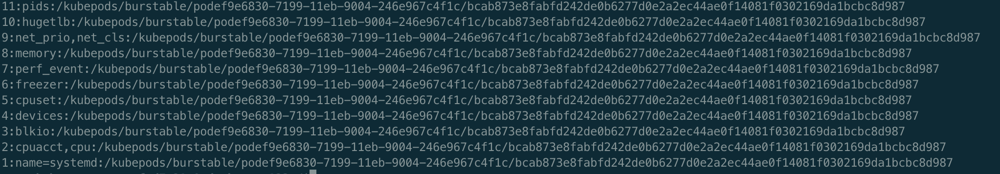
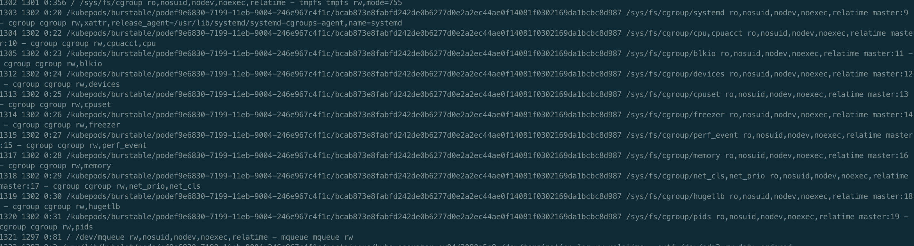

# cgroup mount destination: unknown


### 问题

线上k8s集群在进行容器创建时报如下错误

Failed create pod sandbox: rpc error: code = Unknown desc = failed to start sandbox container for pod "xxx-sf-32c80-0": Error response from daemon: cgroups: cannot find cgroup mount destination: unknown

之前遇到过cgroup相关问题，但是这个问题还是头一次见，网上搜索了关键字，社区有类似报错的issue，如[cgroups: cannot found cgroup mount destination: unknown](https://github.com/docker/for-linux/issues/219)，联系最近做过的线上变更及问题，怀疑跟某自定义组件有关，详细背景参考[这篇](../docker-java-cpu)。

### 排查过程

光看问题云里雾里的，只知道和cgroup有关，登陆宿主查看此错误是kubelet请求docker时docker返回的，docker 18.06版本，没有更详细的日志了，但是开源的一个好处在于查问题的时候有源码，这大大降低了查问题的难度，直接去docker项目中搜索关键词，最终发现是在containerd的源码中，相关代码如下

```go
// PidPath will return the correct cgroup paths for an existing process running inside a cgroup
// This is commonly used for the Load function to restore an existing container
func PidPath(pid int) Path {
	p := fmt.Sprintf("/proc/%d/cgroup", pid)
	paths, err := parseCgroupFile(p)
	if err != nil {
		return errorPath(errors.Wrapf(err, "parse cgroup file %s", p))
	}
	return existingPath(paths, "")
}

func existingPath(paths map[string]string, suffix string) Path {
	// localize the paths based on the root mount dest for nested cgroups
	for n, p := range paths {
		dest, err := getCgroupDestination(string(n))
		if err != nil {
			return errorPath(err)
		}
		rel, err := filepath.Rel(dest, p)
		if err != nil {
			return errorPath(err)
		}
		if rel == "." {
			rel = dest
		}
		paths[n] = filepath.Join("/", rel)
	}
	return func(name Name) (string, error) {
		root, ok := paths[string(name)]
		if !ok {
			if root, ok = paths[fmt.Sprintf("name=%s", name)]; !ok {
				return "", fmt.Errorf("unable to find %q in controller set", name)
			}
		}
		if suffix != "" {
			return filepath.Join(root, suffix), nil
		}
		return root, nil
	}
}

func getCgroupDestination(subsystem string) (string, error) {
	f, err := os.Open("/proc/self/mountinfo")
	if err != nil {
		return "", err
	}
	defer f.Close()
	s := bufio.NewScanner(f)
	for s.Scan() {
		fields := strings.Split(s.Text(), " ")
		if len(fields) < 10 {
			// broken mountinfo?
			continue
		}
		if fields[len(fields)-3] != "cgroup" {
			continue
		}
		for _, opt := range strings.Split(fields[len(fields)-1], ",") {
			if opt == subsystem {
				return fields[3], nil
			}
		}
	}
	if err := s.Err(); err != nil {
		return "", err
	}
	return "", ErrNoCgroupMountDestination
}

func parseCgroupFile(path string) (map[string]string, error) {
	f, err := os.Open(path)
	if err != nil {
		return nil, err
	}
	defer f.Close()
	return parseCgroupFromReader(f)
}

func parseCgroupFromReader(r io.Reader) (map[string]string, error) {
	var (
		cgroups = make(map[string]string)
		s       = bufio.NewScanner(r)
	)
	for s.Scan() {
		if err := s.Err(); err != nil {
			return nil, err
		}
		var (
			text  = s.Text()
			parts = strings.SplitN(text, ":", 3)
		)
		if len(parts) < 3 {
			return nil, fmt.Errorf("invalid cgroup entry: %q", text)
		}
		for _, subs := range strings.Split(parts[1], ",") {
			if subs != "" {
				cgroups[subs] = parts[2]
			}
		}
	}
	return cgroups, nil
}
```

逻辑比较清晰，先从/proc/id/cgroup中解析得到所有的subsystem，对应上面parseCgroupFromReader函数，/proc/id/cgroup内容如下



先按冒号分隔每行字符串，然后取第2列，再根据逗号分隔得到所有的子系统，最终返回所有子系统。然后调用existingPath检查是否所有子系统都存在，内部又调用getCgroupDestination，最终的报错就是在这个函数里报出来的。

getCgroupDestination的逻辑是读取/proc/id/mountinfo信息，判断是否传入的子系统存在



先根据空格分隔，找到所有cgroup类型的目录，然后再根据逗号分隔遍历所有的子系统是否是传入的子系统。找不到的话就会报错，但是不得不吐槽的就是这个报错报的太没有诚意了，要是直接把找不到的子系统报出来，问题会直观很多。

### 结论

到此可以明白是agent隔离程序先mount了自定义目录cpu_mirror到cgroup目录下，然后影响到了java程序去获取正确的核数，为了修复特意执行了umount的操作，但是umount之后/proc/id/cgroup还是存在cpu_mirror相关信息而/proc/id/mountinfo中已经不存在了，在容器重新创建的时候进行检查进而报错。

对比线上其他docker版本，比如1.13.1中就没有此问题，因为1.13.1用的containerd中并没有上面提到的检验逻辑

通过这个问题也暴露出来我们在测试、灰度过程中的问题，由于线上环境复杂，系统版本众多、组件版本也不统一，在上线一个功能或者执行线上操作的时候，测试用例需要充分覆盖所有场景，灰度时也需要所有类型的机器至少都覆盖到了之后才可以放量继续靠扩大灰度范围，否则很容易出现类似的问题。

