# Dockerd资源泄露系列 - 3


## 现象

线上k8s集群报警，宿主fd利用率超过80%，登陆查看dockerd内存使用26G

## 排查思路

由于之前已经遇到过多次dockerd资源泄露的问题，先看是否是已知原因导致的，参考前面两篇 

### fd的对端是谁？

执行ss -anp | grep dockerd，结果如下图，可以看到和之前遇到的问题不同，第8列显示为0，与之前遇到的的情况不符，无法找到对端。

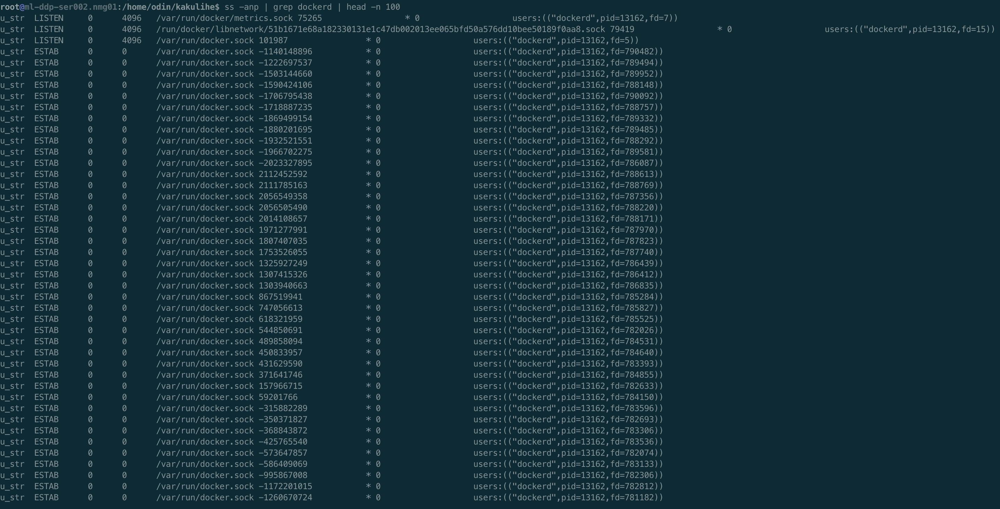

### 内存为什么泄露？

为了可以使用pprof分析内存泄露位置，首先为dockerd打开debug模式，需要修改service文件，添加如下两句

```bash
ExecReload=/bin/kill -s HUP $MAINPID 
KillMode=process
```

同时在/etc/docker/daemon.json文件中添加 "debug": true的配置，修改完之后执行systemctl daemon-reload重新加载docker服务配置，然后执行systemctl reload docker，重进加载docker配置，开启debug模式

dockerd默认使用uds对未提供服务，为了方便我们调试，可以使用socat对docker进行端口转发，如下 **sudo socat -d -d TCP-LISTEN:8080,fork,bind=0.0.0.0 UNIX:/var/run/docker.sock**，意思是外部可以通过访问宿主机的8080端口来调用docker api，至此一切就绪

在本地执行go tool pprof http://ip:8080/debug/pprof/heap查看内存使用情况，如下图

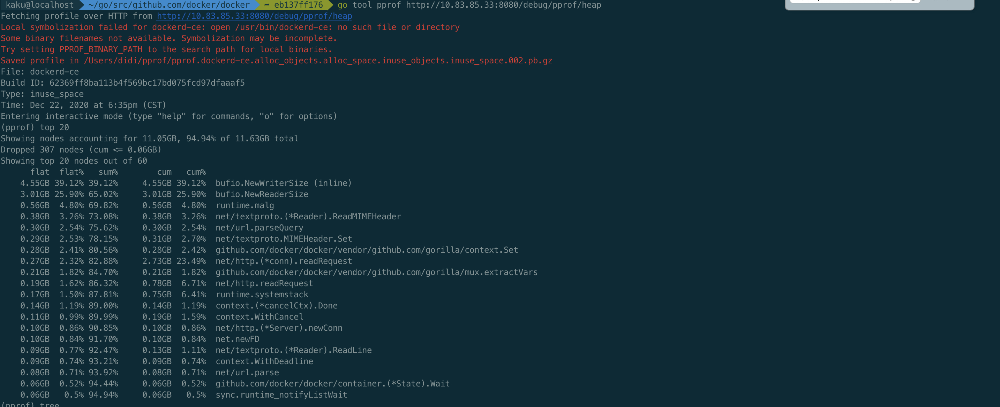

可以看到占用多的地方在golang自带的bufio NewWriterSize和NewReaderSize处，每次http调用都会都这里，也看出来有什么问题。

### Goroutine也泄露？

#### 泄露位置

通过内存还是无法知道具体出问题的位置，问题不大，再看看goroutine的情况，直接在浏览器访问http://ip:8080/debug/pprof/goroutine?debug=1，如下图

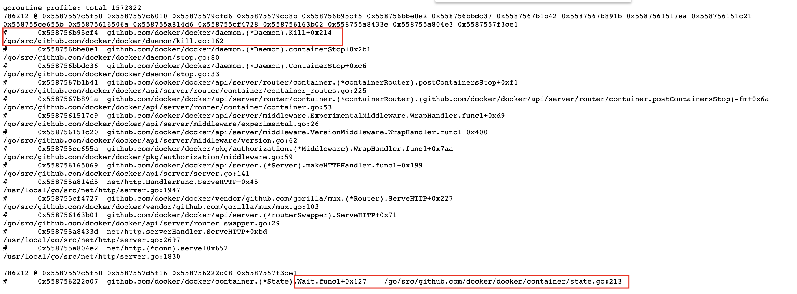

一共1572822个goroutine，两个大头各占一半，各有786212个。看到这里基本就可以沿着文件行数去源码中查看了，这里我们用的docker 18.09.2版本，把源码切换到对应版本下，通过查看源码可以知道这两大类的goroutine泄露的原因，dockerd与containerd相关处理流程如下图

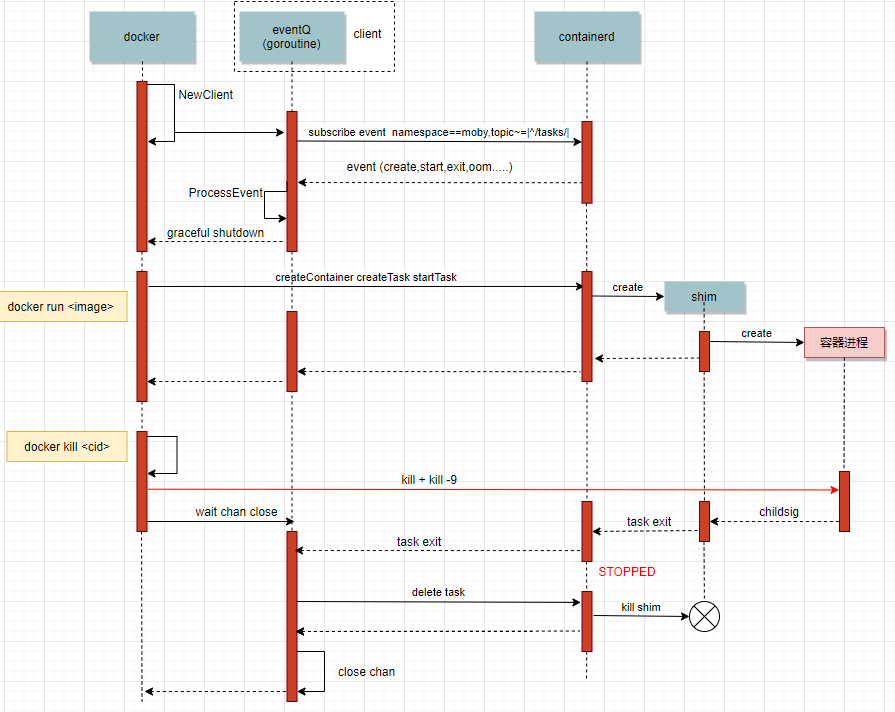

对应上图的话，goroutine泄露是由上面最后docker kill时的wait chan close导致的，wait的时候会启动另一个goroutine，每次docker kill都会造成这两个goroutine的泄露。对应代码如下

```go
// Kill forcefully terminates a container.
func (daemon *Daemon) Kill(container *containerpkg.Container) error {
   if !container.IsRunning() {
      return errNotRunning(container.ID)
   }

   // 1. Send SIGKILL
   if err := daemon.killPossiblyDeadProcess(container, int(syscall.SIGKILL)); err != nil {
      // While normally we might "return err" here we're not going to
      // because if we can't stop the container by this point then
      // it's probably because it's already stopped. Meaning, between
      // the time of the IsRunning() call above and now it stopped.
      // Also, since the err return will be environment specific we can't
      // look for any particular (common) error that would indicate
      // that the process is already dead vs something else going wrong.
      // So, instead we'll give it up to 2 more seconds to complete and if
      // by that time the container is still running, then the error
      // we got is probably valid and so we return it to the caller.
      if isErrNoSuchProcess(err) {
         return nil
      }

      ctx, cancel := context.WithTimeout(context.Background(), 2*time.Second)
      defer cancel()

      if status := <-container.Wait(ctx, containerpkg.WaitConditionNotRunning); status.Err() != nil {
         return err
      }
   }

   // 2. Wait for the process to die, in last resort, try to kill the process directly
   if err := killProcessDirectly(container); err != nil {
      if isErrNoSuchProcess(err) {
         return nil
      }
      return err
   }

   // Wait for exit with no timeout.
   // Ignore returned status.
   <-container.Wait(context.Background(), containerpkg.WaitConditionNotRunning)

   return nil
}

// Wait waits until the container is in a certain state indicated by the given
// condition. A context must be used for cancelling the request, controlling
// timeouts, and avoiding goroutine leaks. Wait must be called without holding
// the state lock. Returns a channel from which the caller will receive the
// result. If the container exited on its own, the result's Err() method will
// be nil and its ExitCode() method will return the container's exit code,
// otherwise, the results Err() method will return an error indicating why the
// wait operation failed.
func (s *State) Wait(ctx context.Context, condition WaitCondition) <-chan StateStatus {
   s.Lock()
   defer s.Unlock()

   if condition == WaitConditionNotRunning && !s.Running {
      // Buffer so we can put it in the channel now.
      resultC := make(chan StateStatus, 1)

      // Send the current status.
      resultC <- StateStatus{
         exitCode: s.ExitCode(),
         err:      s.Err(),
      }

      return resultC
   }

   // If we are waiting only for removal, the waitStop channel should
   // remain nil and block forever.
   var waitStop chan struct{}
   if condition < WaitConditionRemoved {
      waitStop = s.waitStop
   }

   // Always wait for removal, just in case the container gets removed
   // while it is still in a "created" state, in which case it is never
   // actually stopped.
   waitRemove := s.waitRemove

   resultC := make(chan StateStatus)

   go func() {
      select {
      case <-ctx.Done():
         // Context timeout or cancellation.
         resultC <- StateStatus{
            exitCode: -1,
            err:      ctx.Err(),
         }
         return
      case <-waitStop:
      case <-waitRemove:
      }

      s.Lock()
      result := StateStatus{
         exitCode: s.ExitCode(),
         err:      s.Err(),
      }
      s.Unlock()

      resultC <- result
   }()

   return resultC
}
```

对照goroutine的图片，两个goroutine分别走到了Kill最后一次的container.Wait处、Wait的select处，正因为Wait方法的select一直不返回，导致resultC无数据，外面也就无法从container.Wait返回的chan中读到数据，从而导致每次docker stop调用阻塞两个goroutine。

#### 为什么泄露？

为什么select一直不返回呢？可以看到select在等三个chan，任意一个有数据或者关闭都会返回

1. ctx.Done()：不返回是因为最后一次调用Wait的时候传入的是context.Background()。这里其实也是dockerd对请求的处理方式，既然客户端要删除容器，那我就等着容器删除，什么时间删除什么时间退出，只要容器没删，就一直有个goroutine在等待。
2. waitStop和waitRemove：不返回是因为没收到containerd发来的task exit的信号，可以对照上图看下，在收到task exit后才会关闭chan

#### 为什么没收到task exit事件？

问题逐渐明确，但还需要进一步排查为什么没有收到task exit的事件，两种可能

- 发出但没收收到：这里首先想到的是之前腾讯遇到的一个问题，也是在18版本的docker上，processEvent的goroutine异常退出了，导致无法接收到containerd发来的信号，参考[这里](https://segmentfault.com/a/1190000023809654)
- 没有发出

首先看有没有收到，还是看goroutine的内容，如下图，可以看到处理事件的goroutine:processEventStream和接收事件的goroutine:Subscribe都存在，可以排除第一种可能

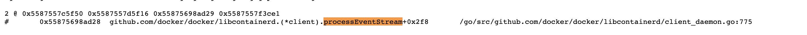

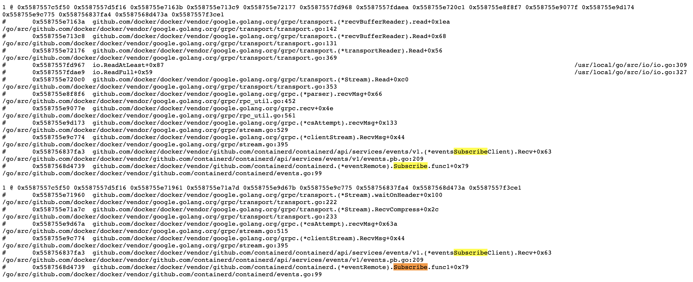

接着看第二种可能，根本没发出task exit事件。经过上面分析，已知存在goroutine泄露，且是通过docker stop引起的，所以可以肯定kubelet发起了删除容器的请求，并且是在一直尝试，要不然也不会一直泄露。那剩下唯一的问题就是找出来是在不断的删除哪个容器，又为什么删不掉。其实这个时候，聪明的你们可能已经想到容器里大概率是有D进程了，所有即使发送Kill信号容器进程无法正常退出。接下来就是去验证一下这个猜想，首先去找一下哪个容器出的问题，先看Kubelet日志和docker日志，如下

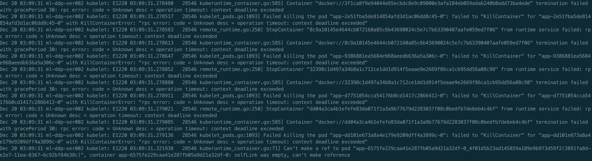

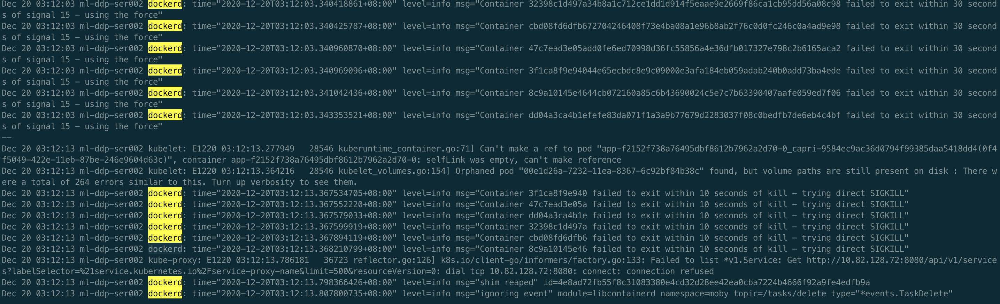

好家伙，不止一个容器删不掉。验证了确实在不断删除容器，但是删不掉，接下来看下是不是有D进程，如下

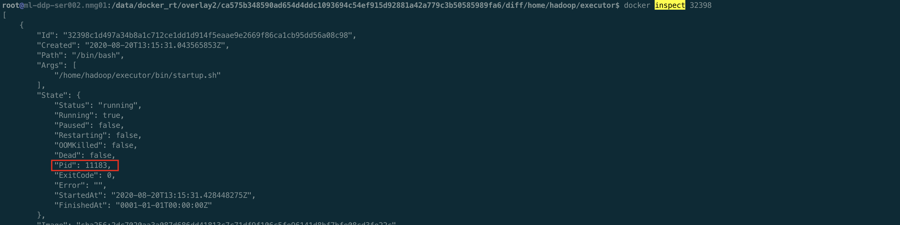

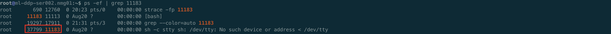

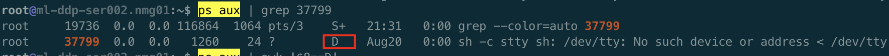

确实容器内有D进程了，可以去宿主上看下，ps aux | awk '$8="D"'，特别多的D进程

## 总结

Kubelet为了保证最终一致性，发现宿主上还有不应该存在的容器就会一直不断的去尝试删除，每次删除都会调用docker stop的api，与dockerd建立一个uds连接，dockerd删除容器的时候会启动一个goroutine通过rpc形式调用containerd来删除容器并等待最终删除完毕才返回，等待的过程中会另起一个goroutine来获取结果，然而containerd在调用runc去真正执行删除的时候因为容器内D进程，无法删除容器，导致没有发出task exit信号，dockerd的两个相关的goroutine也就不会退出。整个过程不断重复，最终就导致fd、内存、goroutine一步步的泄露，系统逐渐走向不可用。

回过头来想想，其实kubelet本身的处理都没有问题，kubelet是为了确保一致性，要去删除不应该存在的容器，直到容器被彻底删除，每次调用docker api都设置了timeout。dockerd的逻辑有待商榷，至少可以做一些改进，因为客户端请求时带了timeout，且dockerd后端在接收到task exit事件后是会去做container remove操作的，即使当前没有docker stop请求。所以可以考虑把最后传入context.Background()的Wait函数调用去掉，当前面带超时的Wait返回后直接退出就可以，这样就不会造成资源泄露了。

