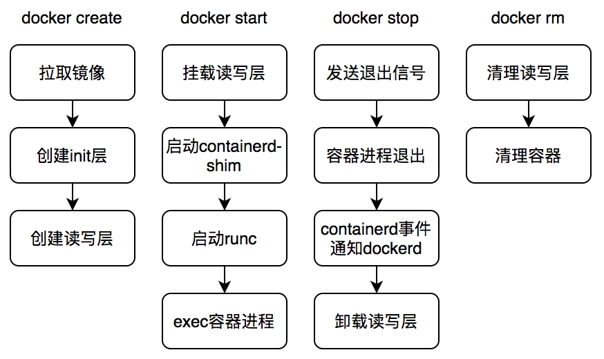
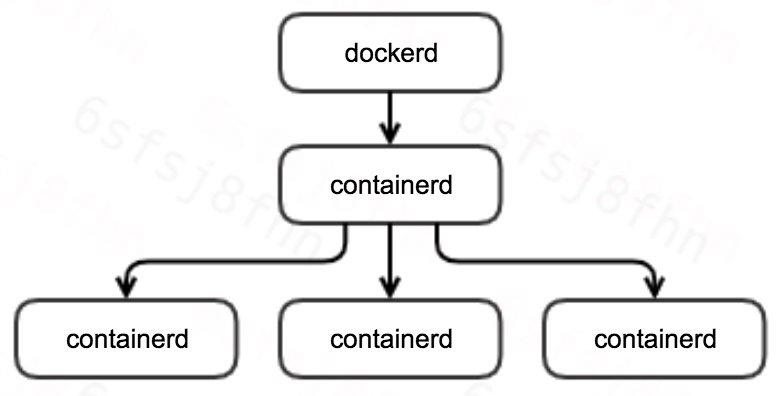

# Pod terminating


> 转载自组内同事stupig

### 1. 背景

近期，弹性云线上集群发生了几起特殊的容器漂移失败事件，其特殊之处在于容器处于Pod Terminating状态，而宿主则处于Ready状态。

宿主状态为Ready说明其能够正常处理Pod事件，但是Pod却卡在了退出阶段，说明此问题并非由kubelet引起，那么docker就是1号犯罪嫌疑人了。

下文将详细介绍问题的排查与分析全过程。

### 2. 抽丝剥茧

#### 2.1 排除kubelet嫌疑

Pod状态如下：

```shell
[stupig@master ~]$ kubectl get pod -owide
pod-976a0-5              0/1     Terminating        0          112m
```

尽管kubelet的犯罪嫌疑已经很小，但是我们还是需要排查kubelet日志进一步确认。截取kubelet关键日志片段如下：

```shell
I1014 10:56:46.492682   34976 kubelet_pods.go:1017] Pod "pod-976a0-5_default(f1e03a3d-0dc7-11eb-b4b1-246e967c4efc)" is terminated, but some containers have not been cleaned up: {ID:{Type:docker ID:41020461ed4d801afa8d10847a16907e65f6e8ca34d1704edf15b0d0e72bf4ef} Name:stupig State:exited CreatedAt:2020-10-14 10:49:57.859913657 +0800 CST StartedAt:2020-10-14 10:49:57.928654495 +0800 CST FinishedAt:2020-10-14 10:50:28.661263065 +0800 CST ExitCode:0 Hash:2101852810 HashWithoutResources:2673273670 RestartCount:0 Reason:Completed Message: Resources:map[CpuQuota:200000 Memory:2147483648 MemorySwap:2147483648]}
E1014 10:56:46.709255   34976 remote_runtime.go:250] RemoveContainer "41020461ed4d801afa8d10847a16907e65f6e8ca34d1704edf15b0d0e72bf4ef" from runtime service failed: rpc error: code = Unknown desc = failed to remove container "41020461ed4d801afa8d10847a16907e65f6e8ca34d1704edf15b0d0e72bf4ef": Error response from daemon: container 41020461ed4d801afa8d10847a16907e65f6e8ca34d1704edf15b0d0e72bf4ef: driver "overlay2" failed to remove root filesystem: unlinkat /home/docker_rt/overlay2/e5dab77be213d9f9cfc0b0b3281dbef9c2878fee3b8e406bc8ab97adc30ae4d5/merged: device or resource busy
E1014 10:56:46.709292   34976 kuberuntime_gc.go:126] Failed to remove container "41020461ed4d801afa8d10847a16907e65f6e8ca34d1704edf15b0d0e72bf4ef": rpc error: code = Unknown desc = failed to remove container "41020461ed4d801afa8d10847a16907e65f6e8ca34d1704edf15b0d0e72bf4ef": Error response from daemon: container 41020461ed4d801afa8d10847a16907e65f6e8ca34d1704edf15b0d0e72bf4ef: driver "overlay2" failed to remove root filesystem: unlinkat /home/docker_rt/overlay2/e5dab77be213d9f9cfc0b0b3281dbef9c2878fee3b8e406bc8ab97adc30ae4d5/merged: device or resource busy
```

日志显示kubelet处于Pod Terminating状态的原因很清楚：清理容器失败。

kubelet清理容器的命令是 `docker rm -f` ，其失败的原因在于删除容器目录 `xxx/merged` 时报错，错误提示为 `device or resource busy` 。

除此之外，kubelet无法再提供其他关键信息。

登陆宿主，我们验证对应容器的状态：

```shell
[stupig@hostname ~]$ sudo docker ps -a | grep pod-976a0-5
41020461ed4d            Removal In Progress                            k8s_stupig_pod-976a0-5_default_f1e03a3d-0dc7-11eb-b4b1-246e967c4efc_0
f0a75e10b252            Exited (0) 2 minutes ago                       k8s_POD_pod-976a0-5_default_f1e03a3d-0dc7-11eb-b4b1-246e967c4efc_0
[stupig@hostname ~]$ sudo docker rm -f 41020461ed4d
Error response from daemon: container 41020461ed4d801afa8d10847a16907e65f6e8ca34d1704edf15b0d0e72bf4ef: driver "overlay2" failed to remove root filesystem: unlinkat /home/docker_rt/overlay2/e5dab77be213d9f9cfc0b0b3281dbef9c2878fee3b8e406bc8ab97adc30ae4d5/merged: device or resource busy
```

问题已然清楚，现在我们有两种排查思路：

- 参考Google上解决 `device or resource busy` 问题的思路
- 结合现象分析代码

#### 2.2 Google大法

有问题找Google！所以，我们首先咨询了Google，检索结果显示很多人都碰到了类似的问题。

而网络上主流的解决方案：配置docker服务MountFlags为slave，避免docker挂载点信息泄漏到其他mnt命名空间，详细原因请参阅：[docker device busy问题解决方案](https://blog.terminus.io/docker-device-is-busy/)。

这么简单？？？显然不能，检查发现docker服务当前已配置MountFlags为slave。网络银弹再次失去功效。

so，我们还是老老实实结合现场分析代码吧。

#### 2.3 docker处理流程

在具体分析docker代码之前，先简单介绍下docker的处理流程，避免作为一只无头苍蝇处处碰壁。



清楚了docker的处理流程之后，我们再来分析现场。

#### 2.4 提审docker

问题发生在docker清理阶段，docker清理容器读写层出错，报错信息为 `device or resource busy`，说明docker读写层并没有被正确卸载，或者是没有完全卸载。下面的命令可以验证这个结论：

```shell
[stupig@hostname ~]$ grep -rwn '/home/docker_rt/overlay2/e5dab77be213d9f9cfc0b0b3281dbef9c2878fee3b8e406bc8ab97adc30ae4d5/merged' /proc/*/mountinfo
/proc/22283/mountinfo:50:386 542 0:92 / /home/docker_rt/overlay2/e5dab77be213d9f9cfc0b0b3281dbef9c2878fee3b8e406bc8ab97adc30ae4d5/merged rw,relatime - overlay overlay rw,lowerdir=XXX,upperdir=XXX,workdir=XXX
/proc/22407/mountinfo:50:386 542 0:92 / /home/docker_rt/overlay2/e5dab77be213d9f9cfc0b0b3281dbef9c2878fee3b8e406bc8ab97adc30ae4d5/merged rw,relatime - overlay overlay rw,lowerdir=XXX,upperdir=XXX,workdir=XXX
/proc/28454/mountinfo:50:386 542 0:92 / /home/docker_rt/overlay2/e5dab77be213d9f9cfc0b0b3281dbef9c2878fee3b8e406bc8ab97adc30ae4d5/merged rw,relatime - overlay overlay rw,lowerdir=XXX,upperdir=XXX,workdir=XXX
/proc/28530/mountinfo:50:386 542 0:92 / /home/docker_rt/overlay2/e5dab77be213d9f9cfc0b0b3281dbef9c2878fee3b8e406bc8ab97adc30ae4d5/merged rw,relatime - overlay overlay rw,lowerdir=XXX,upperdir=XXX,workdir=XXX
```

不出所料，容器读写层仍然被以上四个进程所挂载，进而导致docker在清理读写层目录时报错。

随之而来的问题是，为什么docker没有正确卸载容器读写层？我们先展示下 `docker stop` 中卸载容器读写层挂载的相关部分代码：

```go
func (daemon *Daemon) Cleanup(container *container.Container) {
   if err := daemon.conditionalUnmountOnCleanup(container); err != nil {
      if mountid, err := daemon.imageService.GetLayerMountID(container.ID, container.OS); err == nil {
         daemon.cleanupMountsByID(mountid)
      }
   }
}
func (daemon *Daemon) conditionalUnmountOnCleanup(container *container.Container) error {
   return daemon.Unmount(container)
}
func (daemon *Daemon) Unmount(container *container.Container) error {
   if container.RWLayer == nil {
      return errors.New("RWLayer of container " + container.ID + " is unexpectedly nil")
   }
   if err := container.RWLayer.Unmount(); err != nil {
      logrus.Errorf("Error unmounting container %s: %s", container.ID, err)
      return err
   }
 
   return nil
}
func (rl *referencedRWLayer) Unmount() error {
   return rl.layerStore.driver.Put(rl.mountedLayer.mountID)
}
func (d *Driver) Put(id string) error {
   d.locker.Lock(id)
   defer d.locker.Unlock(id)
   dir := d.dir(id)
   mountpoint := path.Join(dir, "merged")
   logger := logrus.WithField("storage-driver", "overlay2")
   if err := unix.Unmount(mountpoint, unix.MNT_DETACH); err != nil {
      logger.Debugf("Failed to unmount %s overlay: %s - %v", id, mountpoint, err)
   }
   if err := unix.Rmdir(mountpoint); err != nil && !os.IsNotExist(err) {
      logger.Debugf("Failed to remove %s overlay: %v", id, err)
   }
   return nil
}
```

代码处理流程清晰明了，最终docker会发起 `SYS_UMOUNT2` 系统调用卸载容器读写层。

但是，docker在清理容器读写层时却提示错误，并且容器读写层挂载信息也出现在其他进程中。难不成docker没有执行卸载操作？结合docker日志分析：

```shell
Oct 14 10:50:28 hostname dockerd: time="2020-10-14T10:50:28.769199725+08:00" level=debug msg="Failed to unmount e5dab77be213d9f9cfc0b0b3281dbef9c2878fee3b8e406bc8ab97adc30ae4d5 overlay: /home/docker_rt/overlay2/e5dab77be213d9f9cfc0b0b3281dbef9c2878fee3b8e406bc8ab97adc30ae4d5/merged - invalid argument" storage-driver=overlay2
Oct 14 10:50:28 hostname dockerd: time="2020-10-14T10:50:28.769213547+08:00" level=debug msg="Failed to remove e5dab77be213d9f9cfc0b0b3281dbef9c2878fee3b8e406bc8ab97adc30ae4d5 overlay: device or resource busy" storage-driver=overlay2
```

日志显示docker在执行卸载容器读写层命令时出错，提示 `invalid argument`。结合 [umount2](https://man7.org/linux/man-pages/man2/umount.2.html) 文档可知，容器读写层并非是dockerd（docker后台进程）的挂载点？？？

现在，回过头来分析拥有容器读写层挂载信息的进程，我们发现一个惊人的信息：

```shell
[stupig@hostname ~]$ ps -ef|grep -E "22283|22407|28454|28530"
root      22283      1  0 10:48 ?        00:00:00 docker-containerd-shim -namespace moby
root      22407      1  0 10:48 ?        00:00:00 docker-containerd-shim -namespace moby
root      28454      1  0 10:49 ?        00:00:00 docker-containerd-shim -namespace moby
root      28530      1  0 10:49 ?        00:00:00 docker-containerd-shim -namespace moby
```

容器读写层挂载信息没有出现在dockerd进程命名空间中，却出现在其他容器的托管服务shim进程的命名空间内，推断dockerd进程发生了重启，对比进程启动时间与命名空间详情可以进行验证：

```shell
[stupig@hostname ~]$ ps -eo pid,cmd,lstart|grep dockerd
 34836 /usr/bin/dockerd --storage- Wed Oct 14 10:50:15 2020
 
[stupig@hostname ~]$ sudo ls -la /proc/$(pidof dockerd)/ns
lrwxrwxrwx 1 root root 0 Oct 14 10:50 ipc -> ipc:[4026531839]
lrwxrwxrwx 1 root root 0 Oct 14 10:50 mnt -> mnt:[4026533327]
lrwxrwxrwx 1 root root 0 Oct 14 10:50 net -> net:[4026531968]
lrwxrwxrwx 1 root root 0 Oct 14 10:50 pid -> pid:[4026531836]
lrwxrwxrwx 1 root root 0 Oct 14 10:50 user -> user:[4026531837]
lrwxrwxrwx 1 root root 0 Oct 14 10:50 uts -> uts:[4026531838]
 
[stupig@hostname ~]$ ps -eo pid,cmd,lstart|grep -w containerd|grep -v shim
 34849 docker-containerd --config  Wed Oct 14 10:50:15 2020
 
[stupig@hostname ~]$ sudo ls -la /proc/$(pidof docker-containerd)/ns
lrwxrwxrwx 1 root root 0 Oct 14 10:50 ipc -> ipc:[4026531839]
lrwxrwxrwx 1 root root 0 Oct 14 10:50 mnt -> mnt:[4026533327]
lrwxrwxrwx 1 root root 0 Oct 14 10:50 net -> net:[4026531968]
lrwxrwxrwx 1 root root 0 Oct 14 10:50 pid -> pid:[4026531836]
lrwxrwxrwx 1 root root 0 Oct 14 10:50 user -> user:[4026531837]
lrwxrwxrwx 1 root root 0 Oct 14 10:50 uts -> uts:[4026531838]
 
[stupig@hostname ~]$ ps -eo pid,cmd,lstart|grep -w containerd-shim
 22283 docker-containerd-shim -nam Wed Oct 14 10:48:50 2020
 22407 docker-containerd-shim -nam Wed Oct 14 10:48:55 2020
 28454 docker-containerd-shim -nam Wed Oct 14 10:49:53 2020
 28530 docker-containerd-shim -nam Wed Oct 14 10:49:53 2020
 
[stupig@hostname ~]$ sudo ls -la /proc/28454/ns
lrwxrwxrwx 1 root root 0 Oct 14 10:50 ipc -> ipc:[4026531839]
lrwxrwxrwx 1 root root 0 Oct 14 10:50 mnt -> mnt:[4026533200]
lrwxrwxrwx 1 root root 0 Oct 14 10:50 net -> net:[4026531968]
lrwxrwxrwx 1 root root 0 Oct 14 10:50 pid -> pid:[4026531836]
lrwxrwxrwx 1 root root 0 Oct 14 10:50 user -> user:[4026531837]
lrwxrwxrwx 1 root root 0 Oct 14 10:50 uts -> uts:[4026531838]
 
[stupig@hostname ~]$ sudo ls -la /proc/$$/ns
lrwxrwxrwx 1 panpeilong panpeilong 0 Oct 14 21:49 ipc -> ipc:[4026531839]
lrwxrwxrwx 1 panpeilong panpeilong 0 Oct 14 21:49 mnt -> mnt:[4026531840]
lrwxrwxrwx 1 panpeilong panpeilong 0 Oct 14 21:49 net -> net:[4026531968]
lrwxrwxrwx 1 panpeilong panpeilong 0 Oct 14 21:49 pid -> pid:[4026531836]
lrwxrwxrwx 1 panpeilong panpeilong 0 Oct 14 21:49 user -> user:[4026531837]
lrwxrwxrwx 1 panpeilong panpeilong 0 Oct 14 21:49 uts -> uts:[4026531838]
```

结果验证了我们推断的正确性。现在再补充下docker组件的进程树模型，用以解释这个现象，模型如下：



dockerd进程启动时，会自动拉起containerd进程；当用户创建并启动容器时，containerd会启动containerd-shim进程用于托管容器进程，最终由containerd-shim调用runc启动容器进程。runc负责初始化进程命名空间，并exec容器启动命令。

上述模型中shim进程存在的意义是：允许dockerd/containerd升级或重启，同时不影响已运行容器。docker提供了 `live-restore` 的能力，而我们的集群也的确启用了该配置。

此外，由于我们在systemd的docker配置选项中配置了 `MountFlags=slave`，参考[systemd配置说明](https://freedesktop.org/software/systemd/man/systemd.exec.html#MountFlags=)，systemd在启动dockerd进程时，会创建一个新的mnt命名空间。

至此，问题已基本定位清楚：

- systemd在启动dockerd服务时，将dockerd安置在一个新的mnt命名空间中
- 用户创建并启动容器时，dockerd会在本mnt命名空间内挂载容器读写层目录，并启动shim进程托管容器进程
- 由于某种原因，dockerd服务发生重启，systemd会将其安置在另一个新的mnt命名空间内
- 用户删除容器时，容器退出时，dockerd在清理容器读写层挂载时报错，因为挂载并非在当前dockerd的mnt命名空间内

后来，我们在docker issue中也发现了[官方给出的说明](https://github.com/moby/moby/issues/35873#issuecomment-386467562)，`MountFlags=slave` 与 `live-restore` 确实不能同时使用。

#### 2.5 一波又起

还没当我们沉浸在解决问题的喜悦之中，另一个疑问接踵而来。我们线上集群好多宿主同时配置了 `MountFlags=slave` 和 `live-restore=true`，为什么问题直到最近才报出来呢？

当我们分析了几起 `Pod Terminating` 的涉事宿主后，发现它们的一个通性是docker版本为 `18.06.3-ce`，而我们当前主流的版本仍然是 `1.13.1`。

难道是新版本中才引入的问题？我们首先在测试环境中对 `1.13.1` 版本的docker进行了验证，Pod确实没有被阻塞在 Terminating 状态，这是不是说明低版本docker不存在挂载点泄漏的问题呢？

事实并非如此。当我们再次进行验证时，在删除Pod前记录了测试容器的读写层，之后发送删除Pod指令，Pod顺利退出，但此时，我们登录Pod之前所在宿主，发现docker日志中同样也存在如下日志：

```shell
Oct 14 22:12:43 hostname2 dockerd: time="2020-10-14T22:12:43.730726978+08:00" level=debug msg="Failed to unmount fb41efa2cfcbfbb8d90bd1d8d77d299e17518829faf52af40f7a1552ec8aa165 overlay: /home/docker_rt/overlay2/fb41efa2cfcbfbb8d90bd1d8d77d299e17518829faf52af40f7a1552ec8aa165/merged - invalid argument"
```

同样存在卸载问题的情况下，高低版本的docker却呈现出了不同的结果，这显然是docker的处理逻辑发生了变更，这里我们对比源码能够很快得出结论：

```go
// 1.13.1 版本处理逻辑
func (daemon *Daemon) cleanupContainer(container *container.Container, forceRemove, removeVolume bool) (err error) {
   // If force removal is required, delete container from various
   // indexes even if removal failed.
   defer func() {
      if err == nil || forceRemove {
         daemon.nameIndex.Delete(container.ID)
         daemon.linkIndex.delete(container)
         selinuxFreeLxcContexts(container.ProcessLabel)
         daemon.idIndex.Delete(container.ID)
         daemon.containers.Delete(container.ID)
         if e := daemon.removeMountPoints(container, removeVolume); e != nil {
            logrus.Error(e)
         }
         daemon.LogContainerEvent(container, "destroy")
      }
   }()
 
   if err = os.RemoveAll(container.Root); err != nil {
      return fmt.Errorf("Unable to remove filesystem for %v: %v", container.ID, err)
   }
 
   // When container creation fails and `RWLayer` has not been created yet, we
   // do not call `ReleaseRWLayer`
   if container.RWLayer != nil {
      metadata, err := daemon.layerStore.ReleaseRWLayer(container.RWLayer)
      layer.LogReleaseMetadata(metadata)
      if err != nil && err != layer.ErrMountDoesNotExist {
         return fmt.Errorf("Driver %s failed to remove root filesystem %s: %s", daemon.GraphDriverName(), container.ID, err)
      }
   }
 
   return nil
}
 
 
// 18.06.3-ce 版本处理逻辑
func (daemon *Daemon) cleanupContainer(container *container.Container, forceRemove, removeVolume bool) (err error) {
   // When container creation fails and `RWLayer` has not been created yet, we
   // do not call `ReleaseRWLayer`
   if container.RWLayer != nil {
      err := daemon.imageService.ReleaseLayer(container.RWLayer, container.OS)
      if err != nil {
         err = errors.Wrapf(err, "container %s", container.ID)
         container.SetRemovalError(err)
         return err
      }
      container.RWLayer = nil
   }
 
   if err := system.EnsureRemoveAll(container.Root); err != nil {
      e := errors.Wrapf(err, "unable to remove filesystem for %s", container.ID)
      container.SetRemovalError(e)
      return e
   }
 
   linkNames := daemon.linkIndex.delete(container)
   selinuxFreeLxcContexts(container.ProcessLabel)
   daemon.idIndex.Delete(container.ID)
   daemon.containers.Delete(container.ID)
   daemon.containersReplica.Delete(container)
   if e := daemon.removeMountPoints(container, removeVolume); e != nil {
      logrus.Error(e)
   }
   for _, name := range linkNames {
      daemon.releaseName(name)
   }
   container.SetRemoved()
   stateCtr.del(container.ID)
   return nil
}
```

改动一目了然，官方在[清理容器变更](https://github.com/moby/moby/pull/31012)中给出了详细的说明。也即在低版本docker中，问题并非不存在，仅仅是被隐藏了，并在高版本中被暴露出来。

### 3. 问题影响

既然所有版本的docker都存在这个问题，那么其影响是什么呢？

在高版本docker中，其影响是显式的，会引起容器清理失败，进而造成Pod删除失败。

而在低版本docker中，其影响是隐式的，造成挂载点泄漏，进而可能会造成的影响如下：

- inode被打满：由于挂载点泄漏，容器读写层不会被清理，长时间累计可能会造成inode耗尽问题，但是是小概率事件
- 容器ID复用：由于挂载点未被卸载，当docker复用了原来已经退出的容器ID时，在挂载容器init层与读写层时会失败。由于docker生成容器ID是随机的，因此也是小概率事件

### 4. 解决方案

问题已然明确，如何解决问题成了当务之急。思路有二：

1. 治标：对标 `1.13.1` 版本的处理逻辑，修改 `18.06.3-ce` 处理代码
2. 治本：既然官方也提及 `MountFlags=slave` 与 `live-restore` 不能同时使用，那么我们修改两个配置选项之一即可

考虑到 **重启docker不重启容器** 这样一个强需求的存在，似乎我们唯一的解决方案就是关闭 `MountFlags=slave` 配置。关闭该配置后，与之而来的疑问如下：

- 能够解决本问题？
- 网传其他systemd托管服务启用PrivateTmp是否会造成挂载点泄漏？

欲知后事如何，且听下回分解！

