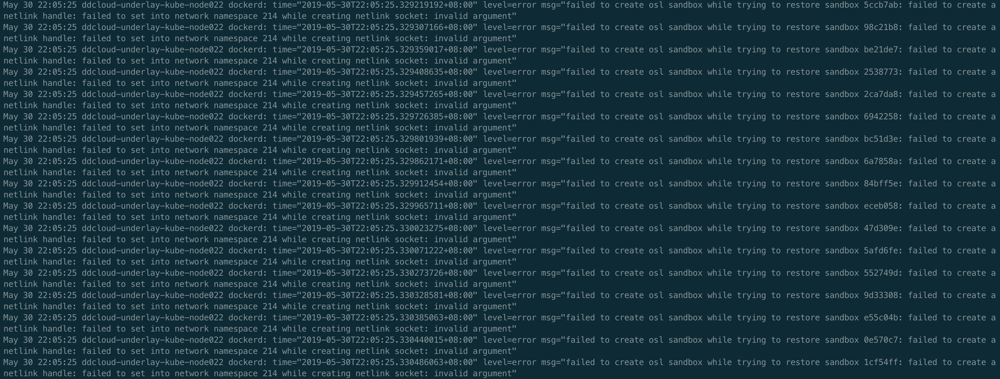
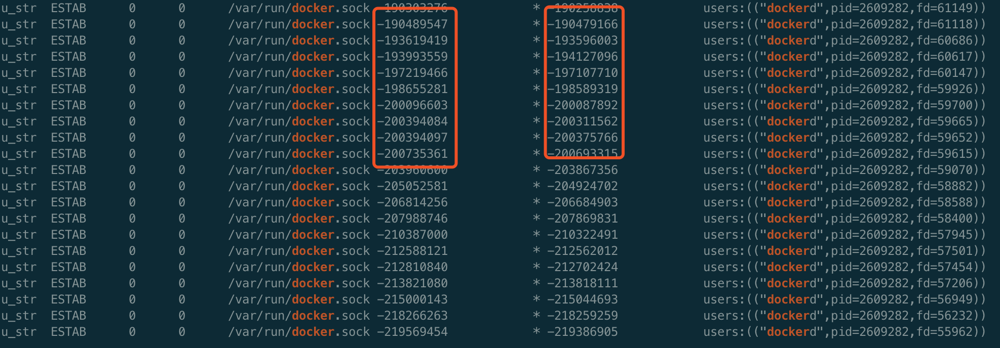

# Dockerd内存泄露


### 背景

线上部分宿主机dockerd占用内存过大，有的甚至超过100G，而整个宿主上的容器使用的内存还不如dockerd一个进程使用的多，现在的处理办法是故障自愈，检测到dockerd使用内存超过10G后会设置live-restore，然后重启dockerd，而不影响正常运行的容器，但是重启后还一直存在内存泄露的问题。可以总结为两类内存泄露情况：没有设置live-restore: true的和设置了live-restore: true且重启过dockerd的，这里是针对后者的排查，因为线上默认dockerd没有开启debug模式，要想排查前者的问题，就需要重启docker，又因为没有配置live-restore: true，就会影响到正在运行的容器。

### dockerd日志

 tail -f /var/log/messages | grep dockerd，结果如下图，存在内存泄露的dockerd的日志都有如下的日志记录，且看时间规律是相同sandbox的记录每秒打印一遍


从源码中搜索日志内容，对应下面的源码分析-2里的内容。

查看dockerd启动时的日志，如下



### 步骤

**步骤比较长，尤其是源码那部分，不关注源码的可以直接跳过源码，直接看代码的解释**

#### pprof分析

1. 开启dockerd的debug模式，即编辑/etc/docker/daemon.json，加上debug: true的配置并重启dockerd，方便利用pprof来定位内存泄露对应的代码位置。

2. 执行go tool pprof [http://ip:port/debug/pprof/heap](http://ipport)，输入top命令查看内存分配情况，如下图
      

   可以看到占用内存较多的函数调用，但是并不是很直观，可以继续输入web命令，会生成svg图片并通过画图软件或浏览器打开，如下图 
   
   
   
   这样就可以清楚地看到整个调用流程及各函数占用内存大小，可以发现是外部某程序调用了docker的api，最终调用SubscribeTopic，此函数里面存在内存泄露。

#### 源码分析

1. 明确了发生泄露的源码位置，接下来就是去看下源码的具体逻辑，下面贴出部分docker源码(tag v1.13.1)，省略部分不影响结果的代码

**docker** 

```go
// 位置github.com/docker/docker/pkg/pubsub/publisher.go
// SubscribeTopic adds a new subscriber that filters messages sent by a topic.
func (p *Publisher) SubscribeTopic(topic topicFunc) chan interface{} {
   ch := make(chan interface{}, p.buffer)
   p.m.Lock()
   p.subscribers[ch] = topic
   p.m.Unlock()
   return ch
}
```

这段代码很短，每次先new一个新的chan，然后把chan加入到字典中。可以看到如果发生内存泄漏，那八成就是这句p.subscribers[ch] = topic，也就是说会一直往map里添加新元素而得不到删除。为了验证，继续向上找此函数的调用方，沿着调用堆栈（svg图片里显示了具体的调用堆栈）往上找，如下

```go
// Subscribe adds a new subscriber to the publisher returning the channel.
func (p *Publisher) Subscribe() chan interface{} {
   // 这里调用SubscribeTopic
   return p.SubscribeTopic(nil)
}
 
 
// collect registers the container with the collector and adds it to
// the event loop for collection on the specified interval returning
// a channel for the subscriber to receive on.
func (s *statsCollector) collect(c *container.Container) chan interface{} {
   s.m.Lock()
   defer s.m.Unlock()
   publisher, exists := s.publishers[c]
   if !exists {
      publisher = pubsub.NewPublisher(100*time.Millisecond, 1024)
      s.publishers[c] = publisher
   }
   // 这里调用Subscribe
   return publisher.Subscribe()
}
 
 
func (daemon *Daemon) subscribeToContainerStats(c *container.Container) chan interface{} {
   return daemon.statsCollector.collect(c)
}
 
 
// ContainerStats writes information about the container to the stream
// given in the config object.
func (daemon *Daemon) ContainerStats(ctx context.Context, prefixOrName string, config *backend.ContainerStatsConfig) error {
   ...
 
 
   // subscribe
   updates := daemon.subscribeToContainerStats(container)
   // unsubscribe
   defer daemon.unsubscribeToContainerStats(container, updates)
 
   noStreamFirstFrame := true
   for {
      select {
      case v, ok := <-updates:
         if !ok {
            return nil
         }
 
         ...
 
         if !config.Stream && noStreamFirstFrame {
            // prime the cpu stats so they aren't 0 in the final output
            noStreamFirstFrame = false
            continue
         }
 
         if err := enc.Encode(statsJSON); err != nil {
            return err
         }
 
         if !config.Stream {
            return nil
         }
      case <-ctx.Done():
         return nil
      }
   }
}
```

可以看到最终在ContainerStats中调用了subscribe并在此函数退出后调用defer里的unsubscribe。直接看代码可能看不懂，先介绍下docker stats的api，此api用来获取容器资源使用详情，包括cpu，memory，network等信息，支持两种方式，流和非流的方式，流是利用http的chunked属性实现的，非流的方式是直接返回。

**chan****的产生**

每次调用docker stats {container} 或者 docker stats的api的时候，都会进入到ContainerStats函数，这里使用了一个chan来达到异步的效果，即并不是每次调用stats都去实时的统计相关数据，而是有个后台goroutine在定时的stats（下面会介绍），并把数据推送到chan，每次调用api时只是去chan中获取数据而已，此chan对应的就是上面for select中的updates，即daemon.subscribeToContainerStats(container)的返回结果，也就是最终SubscribeTopic里new的chan。
 **chan****的消亡**

在ContainerStats函数结束后会调用unsubscribeToContainerStats，这里会关闭创建出来的chan并从map中删除，释放内存。

2. 知道了chan的产生和消亡，可以排除以stream形式调用api导致的，因为这种方式不会一直调用api，也就不会导致chan一直新建。那就只剩下一种形式，即外部有程序定时的以非stream的形式调用docker stats的api。但是上面也看到了函数结束后会在defer里释放掉申请的chan，为什么还会导致内存泄露呢？稍微注意一下就可以看到释放chan的函数是在defer里调用的，而且函数里还有个for循环，所以很可能是因为函数的for循环一直没有退出，导致defer一直得不到执行，chan也就一直释放不了，而且外部还定时的调用api，会导致一直会有新的chan的创建且旧的chan加入缓存后无法被删除，最终导致占用的内存越来越大。那就看下for循环内的代码，可以看到只有一个select，两个case，分别对应从updates chan中读数据和从ctx.Done()中读数据，后者是外部程序取消此次api调用后会得到执行的，即结束此次调用，前者是从updates chan中读stats数据，所以如果想要函数不退出，那么两个case都无法满足即可，即外部程序没有主动cancel request且updates chan中始终没有数据，先不管外部程序，因为也不知道外部程序是谁，代码怎么写的，但是可以肯定的是外部程序在调用docker api时的处理有问题，没有设置超时或者超时了也没有去cancel request。重点关注下为什么updates chan中一直没有数据，那就要看下写数据相关代码，如下

```go
func (s *statsCollector) run() {
   type publishersPair struct {
      container *container.Container
      publisher *pubsub.Publisher
   }
   // we cannot determine the capacity here.
   // it will grow enough in first iteration
   var pairs []publishersPair
 
   // s.interval是1s，硬编码的
   for range time.Tick(s.interval) {
      // it does not make sense in the first iteration,
      // but saves allocations in further iterations
      pairs = pairs[:0]
 
      s.m.Lock()
      for container, publisher := range s.publishers {
         // copy pointers here to release the lock ASAP
         pairs = append(pairs, publishersPair{container, publisher})
      }
      s.m.Unlock()
      if len(pairs) == 0 {
         continue
      }
 
      systemUsage, err := s.getSystemCPUUsage()
      if err != nil {
         logrus.Errorf("collecting system cpu usage: %v", err)
         continue
      }
 
      for _, pair := range pairs {
         stats, err := s.supervisor.GetContainerStats(pair.container)
         if err != nil {
            if _, ok := err.(errNotRunning); !ok {
               logrus.Errorf("collecting stats for %s: %v", pair.container.ID, err)
            }
            continue
         }
         // FIXME: move to containerd on Linux (not Windows)
         stats.CPUStats.SystemUsage = systemUsage
         // 往chan里推送数据
         pair.publisher.Publish(*stats)
      }
   }
}
```

可以看到函数内有个定时器，每1秒执行一次，每次执行都遍历一遍所有注册了的container的publisher，再遍历获取对应container的stats，这里是实时的去计算的，如果获取过程中出错，且不是notRunning的错误，则会打一条日志，collecting stats for {containerID}: {err}，然后跳过往chan里推送数据的逻辑。这里日志正好和从宿主上看到的日志内容匹配，且时间间隔也相同。

3. 接着看GetContainerStats函数代码，为什么会出错，如下

```go
// GetContainerStats collects all the stats published by a container
func (daemon *Daemon) GetContainerStats(container *container.Container) (*types.StatsJSON, error) {
   stats, err := daemon.stats(container)
   if err != nil {
      return nil, err
   }
 
   // We already have the network stats on Windows directly from HCS.
   if !container.Config.NetworkDisabled && runtime.GOOS != "windows" {
      if stats.Networks, err = daemon.getNetworkStats(container); err != nil {
         return nil, err
      }
   }
 
   return stats, nil
}
```

从日志里可以看到sandbox字样，和网络有关，直接看getNetworkStats

```go
func (daemon *Daemon) getNetworkStats(c *container.Container) (map[string]types.NetworkStats, error) {
   ...
 
   sb, err := daemon.netController.SandboxByID(sandboxID)
   if err != nil {
      return nil, err
   }
 
   ...
}
 
 
func (c *controller) SandboxByID(id string) (Sandbox, error) {
   if id == "" {
      return nil, ErrInvalidID(id)
   }
   c.Lock()
   s, ok := c.sandboxes[id]
   c.Unlock()
   if !ok {
      return nil, types.NotFoundErrorf("sandbox %s not found", id)
   }
   return s, nil
}
```

可以看到在根据id从字典中取sandbox时如果没有取到，则会报sandbox not found的error，和日志里的报错匹配。也就匹配上了dockerd启动时的报错，即failed to create osl sandbox while trying to restore sandbox bc51d3e: failed to create a netlink handle: failed to set into network namespace 214 while creating netlink socket: invalid argument。那这个错是从哪里报出来的呢？

4. 继续看restore sandbox failed的错误，代码位置如下

```go
func executeInNetns(newNs, curNs netns.NsHandle) (func(), error) {
   ...
   if newNs.IsOpen() {
      runtime.LockOSThread()
      unlockThd = runtime.UnlockOSThread
      if !curNs.IsOpen() {
         if curNs, err = netns.Get(); err != nil {
            restore()
            return nil, fmt.Errorf("could not get current namespace while creating netlink socket: %v", err)
         }
         closeNs = curNs.Close
      }
      if err := netns.Set(newNs); err != nil {
         restore()
         return nil, fmt.Errorf("failed to set into network namespace %d while creating netlink socket: %v", newNs, err)
      }
      moveBack = netns.Set
   }
   return restore, nil
}
 
 
// Set sets the current network namespace to the namespace represented
// by NsHandle.
func Set(ns NsHandle) (err error) {
   return Setns(ns, CLONE_NEWNET)
}
 
 
// Setns sets namespace using syscall. Note that this should be a method
// in syscall but it has not been added.
func Setns(ns NsHandle, nstype int) (err error) {
   _, _, e1 := syscall.Syscall(SYS_SETNS, uintptr(ns), uintptr(nstype), 0)
   if e1 != 0 {
      err = e1
   }
   return
}
```

可以看到最终是在调用系统调用进入netns时出错了，但是去宿主上操作，实际使可以执行ip netns exec命令的，这个错在网上搜也可以搜到，如<https://github.com/moby/moby/issues/33656>，但是经过去宿主上查看并没有ds_agent进程，也可能是有其他病病毒扫描类的软件导致的，但是可能性不大。后续把netns操作的相关代码单独拿出来搞了个demo，到宿主上执行仍然会报此错误，而且不存是在有问题还是没问题的宿主上，后经孔飞兄排查即测试，发现只要把docker参数MountFlags=slave去掉，demo就能运行成功，dockerd启动就不会再报这个错，但是同时又发现了其他问题，相关问题简体见如下issue
 <https://blog.frognew.com/2018/02/k8s-unable-delete-pod-docker-device-busy.html>

<https://github.com/moby/moby/issues/35873>

<https://access.redhat.com/solutions/2991041>

其中又涉及到多个其他issue，涉及docker版本和linux版本的问题，从上面为issue里看这种问题暂时是无解的，无论怎么设置MountFlags，只要与live-restore一起使用就会存在问题，后面会单独有一篇来分析不同版本的docker，MountFlags应该如何设置。就目前线上配置看，除了内存泄露，还没有反馈其他问题，所以可以先找出来api调用方，规范api调用，及时关闭超时连接也是可以避免内存泄露的。而且辛亏现在用的物理网路，否则还可能出现把同一个ip分配给多个容器的bug。之前出现过的netns泄露的问题可能也与此有关。

#### 谁是调用方

经过上面的排查，已经可以明确问题的原因，对应的代码逻辑。虽然还无法从根本上解决，但是找到调用方，规范调用规则也是可以避免这个问题的，如何找到调用方呢，一般找api调用方，只需要netstat找对用端口就好了，会显示出来调用方的IP和Port，但是这里并不是通过ip:port形式访问的，而是直接通过docker.sock访问，因为线上docker并没有开启tcp访问。其实这里也可以验证一下，因为每秒调用一次api，创建一个新的链接，一定会导致fd泄露的，可以直接到进入/proc/{dockerd's pid}/fd，看里面文件个数，确实是在一直增加的，而且增长速度与宿主上的容器数有关，这也是一个潜在的风险点。

剩下的问题就是寻找unix socket的peer，目前我们已经一端是docker，只需要找到另一端就可以了，步骤如下

1. ss -a --unix -p | grep      docker，输出如下
  
      
         左边红框是dockerd开的一个socket，右边的框是调用者开的socket
    
2. 在右边的红框里随意挑一个，执行ss -a --unix      -p | awk '$6==-219386905' ，输出如下
         u_str  ESTAB      0      0            * -219386905            *      -219569454                 users:(("agent",pid=1962370,fd=55416))
         可以看到另一端是agent

#### 结束了吗

调用方是谁也查清楚了，按照上面的分析，只要设置了live-restore: true且设置完执行过重启的dockerd都存在内存泄露的情况，通过一个脚本批量执行了一下，结果却发现例外，例如ddcloud-underlay-kube-node288.ys就不存在内存泄露，此时心中又是万马奔腾啊，难道之前的分析是错的？

登录到没问题的机器上，查看dockerd的日志，failed to create osl candbox的日志有，但是每秒一次的collecting stats的日志却没有。上面分析过，只有当前存在未关闭的连接时，每秒一次的遍历才能发现有需要执行的stats，才会打印collecting stats的日志。可以通过执行docker stats命令验证，执行之后再去看dockerd的日志就会发现出现collecting stats的日志。也正因为没有未关闭的连接，所以不会出现内存和unix socket泄露，经过查看调用方即agent的版本，发现是1.18.1


至此，已找到问题，1.18.1版本的agent还没有问题，1.20.0版本有问题。顺便去看了一眼agent的代码，当时master分支的相关代码如下

```go
//拿到容器stats
func getContainerStats(containerID string) (threadNum int, err error) {
        if dockerClient == nil {
               dlog.Error("dockerClient is nil!!!")
               return
        }
 
 
    // 万恶之源，context.Background()
        resp, err := dockerClient.ContainerStats(context.Background(), containerID, false)
        if err != nil {
               dlog.Error(err)
               return
        }
 
        var stats DockerStats
        err = json.NewDecoder(resp.Body).Decode(&stats)
        if err != nil {
               return
        }
 
        threadNum = stats.PidsStats.Current
        return
}
 
 
func UpdateContainerStat() {
        fp := "/home/odin/container-host"
        if !file.IsExist(fp) {
               return
        }
        dlog.Info("UpdateContainerStat start...")
 
        go CleanContainerInspectMap()
 
        var err error
        ContainerType, err = file.ToString(fp)
        if err != nil {
               dlog.Error("read file err:", err, fp)
               return
        }
 
        GetMajorMinor()
 
        dockerClient, err = dockerclient.NewEnvClient()
        if err != nil {
               dlog.Error(err)
        }
 
    // 10s
        t1 := time.NewTicker(time.Duration(common.DEFAULT_INTERVAL[common.TYPE_DOCKER]) * time.Second)
        for {
               updateContainerStat()
               <-t1.C
        }
}
```

终于验证了问题的所在，客户端没有超时设置，服务端也没有，10s获取一次所有容器的stats信息，假如有20个容器，就会导致一天创建172800个chan（内存泄露）和172800 * 2个socket（fd泄露，dockerd和agent各占一半）

### 总结

docker使用下来给人的感觉就是存在太多的问题了，后面还会有多篇有关docker资源泄露、目录umount失败、读写pipe失败等各式各样的问题，点关注，不迷路，后续将陆续更新放出。

