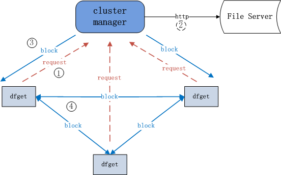

# Dragonfly + Harbor实现的p2p镜像分发


## 测试环境

> 10.0.13.19	部署harbor，单点，docker-compose的方式部署	4核8G
>
> 10.0.13.22	dragonfly的supernode节点	16核64G		docker方式部署
>
> 10.0.13.31	dragonfly的supernode节点	16核64G		docker方式部署
>
> kubernetes 集群 20个节点 ，docker storage-driver overlay		部署了dragonfly的daemon和dfget等程序
>
> 以上均为虚机，在同一个网段内，centos7.4系统
>
> 涉及到的ansible脚本在[这里](https://github.com/likakuli/ansible)

## dragonfly

### 特性

- 基于P2P文件分发
- 支持各种容器化技术
- 主机级别限速策略
- 利用CDN机制避免远程重复下载
- 强一致性
- 磁盘保护,高效的IO处理
- 高性能
- 异常自动隔离
- 降低文件来源服务器压力
- 支持标准的Http Header
- 使用简单

### 结构介绍

#### 分发普通文件



> 注: 其中`cluster manager`即超级节点(supernode)

超级节点充当CDN，同时调度每个对等者(peer)在他们之间传输文件块。`dfget`是P2P客户端，也称为对等者(peer)，主要用于下载和共享文件块。

#### 分发容器镜像


图中镜像仓库(registry)类似于文件服务器。`dfget proxy`也称为`dfdaemon`，它拦截来自`docker pull`和`docker push`的HTTP请求，然后将那些跟镜像分层相关的请求使用`dfget`来处理。

#### 文件分块是怎么下载的


> 注: 其中`cluster manager`即超级节点(supernode)

每个文件会被分成多个块在对等者(peer)间进行传输。一个peer就是一个P2P客户端。

超级节点会判断文件是否存在本地，如果不存在，则会将其从文件服务器下载到本地。

### 流程解析

1.当执行docker pull操作时,dfget-proxy会拦截docker pull请求。将请求转发给CM(cluster manager)。

cm的地址已经在client主机的/etc/dragonfly.conf文件中配置好了。另外上文中提到的dfget-proxy其实就是df-daemon。Dragonfly中有三个项目,client端:getter(python)、daemon(golang),docker pull时,df-daemon拦截到请求并通过dfget进行文件拉取,server端:supernode(java)。

2.df-daemon启动的时候带了registry参数,并且通过dfget传给服务端supernode。supernode解析参数到对应的镜像仓库获取镜像并以block的形式返回给客户端。如果再次拉取镜像时,supernode就会检测哪一个client存在和镜像文件对应的block,如果存在直接从该client下载,如果不存在就通过server端到镜像仓库拉取镜像。

## 安装部署

### 安装服务端

Dragonfly官方支持基于Docker和Physical Machine两种方案部署server，这里为了方便直接使用docker方式部署。

```shell
docker run -d -p 8001:8001 -p 8002:8002 --restart=always registry.cn-hangzhou.aliyuncs.com/alidragonfly/supernode:0.2.0
```

### 安装客户端

```shell
#下载 此链接为0.1.0版本
wget https://github.com/alibaba/Dragonfly/raw/master/package/df-client.linux-amd64.tar.gz
#解压
tar -zxvf df-client.linux-amd64.tar.gz

#设置Env
vim ~/.bashrc
#将下面的设置添加到~/.bashrc文件末
PATH=$PATH:/root/df-client
#退出vim并执行以下命令
source ~/.bashrc

```

### Harbor搭建

基于在线方式的安装, 本文采用http的方式配置Harbor。Harbor版本为1.2.2

1.下载

```shell
wget https://storage.googleapis.com/harbor-releases/harbor-online-installer-v1.5.2.tgz

tar -zxvf harbor-online-installer-v1.5.2.tgz
```

2.修改配置

```shell
cd harbor
vim harbor.cfg
hostname=10.0.13.19  //设置为当前主机ip
```

3.安装并启动harbor服务

服务启动以后,如果需要管理Harbor服务的生命周期,可以直接通过docker-compose来管理

```shell
sh install.sh
```

### 使用指南

1.在client主机上通过配置文件指定CM(cluster manager)节点

```shell
vi /etc/dragonfly.conf
内容:
[node]
address=10.0.13.22,10.0.13.31
```

2.**由于当前Dragonfly暂不支持harbor认证。如果按照官网配置"configure daemon mirror"来拉取镜像会提示授权失败。**为了绕过这个问题可以采用docker proxy的方式来解决。具体步骤如下:

（1）vi /etc/systemd/system/docker.service.d/http-proxy.conf,没有该文件就直接创建该文件。通过添加proxy，在拉取镜像时将会通过下面的配置地址转发到目标机。

```shell
[Service]
Environment="HTTP_PROXY=http://127.0.0.1:65001"
```

（2）更新变更

```shell
systemctl daemon-reload
```

3.在client机上添加harbor的insecure地址，在/etc/docker/daemon.json的insecure-registries中添加10.0.13.19

```shell
{"disable-legacy-registry":false,"graph":"/data/docker","insecure-registries":["10.0.13.19"]}
```

4.启动client服务

```shell
df-daemon --registry http://10.0.13.19
```

5.重启docker

```shell
systemctl restart docker
```

6.docker登录

```shell
docker login --username=admin 10.0.13.19
```

提示登录成功说明上述配置正确

7.验证

```shell
#有数据经过65001端口则配置正确
tcpdump -i lo port 65001
#另开一个shell执行
docker pull 10.0.13.19/kaku/bigimage:v1.0 #拉取镜像
```

## 测试结果

2个supernode，20个节点并行的拉镜像

| 镜像大小（压缩） | native cost | dragonfly cost  | native harbor流量 | dragonfly harbor流量 |
| ---------------- | ----------- | --------------- | ----------------- | -------------------- |
| 1.28G            | 2m多        | 稳定在1m30s左右 | 20*1.28           | 2*1.28               |
| 3.48G            | 10+m        | 稳定在5m30s左右 | 20*3.48           | 2*3.48               |

使用df之后，对harbor的压力明显减小，在20个节点时测试结果为

- 约33%的流量是通过p2p的方式获得的，随着节点数的增多，此值还会继续增大；
- 各节点镜像拉取时间稳定，比不使用代理时好很多，但是在单节点拉镜像时，使用代理时的耗时是要比原生docker pull耗时长的
- 目前部署的df supernode为0.2.0版本，client为0.0.1版本，尝试用0.1.0、0.1.1版本的client均失败，见[这里](https://github.com/alibaba/Dragonfly/issues/138)

## 参考

[dragonfly与harbor组建支持P2P的镜像服务](http://dockone.io/article/4646)

https://github.com/alibaba/Dragonfly/issues/17

https://github.com/alibaba/Dragonfly/issues/20

https://github.com/alibaba/Dragonfly/issues/50#issuecomment-382286474

