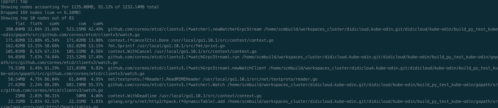
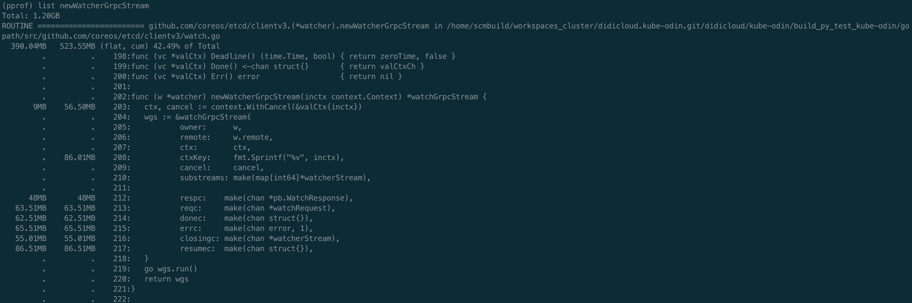

# Etcd watch内存泄漏


### 背景

通过监控看到弹性云用户平台后端程序kube-odin的内存使用量在稳定增加，每次上线完又会恢复，可以判断出kube-odin中存在内存泄漏问题

### 排查过程

golang程序的问题排查，无论CPU还是Memory问题都可以用官方提供的pprof工具，最简单的办法就是在kube-odin代码加入如下包net/http/pprof，上线到了测试环境，然后通过go tool pprof httpaddress的方式查看kube-odin内存消耗，网上也有很多pprof使用方法的文章，可以自行搜索，知道怎么用了之后看下图  

  

由于是测试环境，对接测试集群，本身数据量就不大，程序刚启动时占用内存也就百十来M，现在已经用了1G多，占用内存最多的是newWatcherGrpcStream函数，还有一些其他的函数，占用的内存也在逐步增加，先看newWatcherGrpcStream函数，可以通过list查看其具体内存使用情况，如下图



fmt.Sprintf居然都占用了86.01M内存，还有几个chan占用的也比较多，但是基本都是无缓存的chan，正常不会占用这么多的。一般内存泄露可能是流未关闭，这种情况一般文件描述符也会泄露，另外就是用到缓存时也容易造成泄露，如果缓存的内容得不到释放且一直增加内容，内存就会越来越高。去看etcd相关代码，在代码中找问题，发现了一处很可疑的代码，去掉了无关内容，且增加了fmt.Println相关函数，方便观察每次运行到此处的缓存的结果，如下

```go
// Watch posts a watch request to run() and waits for a new watcher channel
func (w *watcher) Watch(ctx context.Context, key string, opts ...OpOption) WatchChan {
   ...
   ctxKey := fmt.Sprintf("%v", ctx)
 
   // find or allocate appropriate grpc watch stream
   w.mu.Lock()
   if w.streams == nil {
      // closed
      w.mu.Unlock()
      ch := make(chan WatchResponse)
      close(ch)
      return ch
   }
   fmt.Println(ctxKey)      // 打印缓存的key
   fmt.Println(len(w.streams))       //打印缓存数量
   wgs := w.streams[ctxKey]
   if wgs == nil {
      fmt.Println("new watcher stream")        //缓存里没有对应的key
      wgs = w.newWatcherGrpcStream(ctx)
      w.streams[ctxKey] = wgs
   }else{
      fmt.Println("use exist watcher stream")  //缓存里有key，复用缓存
   }
   ...
}
 
// watcher implements the Watcher interface
type watcher struct {
   remote pb.WatchClient
 
   // mu protects the grpc streams map
   mu sync.RWMutex
 
   // streams holds all the active grpc streams keyed by ctx value.
   streams map[string]*watchGrpcStream
}
```

这里出现了上面的fmt.Sprintf、newWatcherGrpcStream等函数，而且出现了缓存，即w.streams，每次watch时都是先调用fmt.Sprintf获取到key，再从缓存中取，如果有则复用，没有则新建，问题很有可能出现在这里，然后再找一下缓存删除数据的逻辑，如下

```go
func (w *watcher) Close() (err error) {
   w.mu.Lock()
   fmt.Println("begin close watcher")
   streams := w.streams
   w.streams = nil
   w.mu.Unlock()
   for _, wgs := range streams {
      if werr := wgs.Close(); werr != nil {
         err = werr
      }
   }
   return err
}
 
func (w *watcher) closeStream(wgs *watchGrpcStream) {
   w.mu.Lock()
   fmt.Println("delete watch stream") //开始删除缓存
   close(wgs.donec)
   wgs.cancel()
   if w.streams != nil {
      fmt.Println("before delete:",len(w.streams))      //删除前缓存数量
      fmt.Println(wgs.ctxKey)
      if _,ok:=w.streams[wgs.ctxKey];ok{
         fmt.Println("delete key exist")        //删除的key在缓存里存在
      }     else{
         fmt.Println("delete key NOT exist")    //删除的key在缓存里不存在
      }
      delete(w.streams, wgs.ctxKey)
      fmt.Println("after delete:",len(w.streams))       //删除后缓存的数量
   }
   w.mu.Unlock()
}
```

和删除缓存相关的函数有两个，第一个Close函数只有在etcdclient的关闭链接时才会调用，而我们在不断的lock，unlock时其实用的是同一份etcdclient，所以不会是第一个函数。还剩一个closeStream函数，这里我也加了一些打印信息，用来查看缓存相关信息，closeStream调用如下

```go
 func (w *watcher) newWatcherGrpcStream(inctx context.Context) *watchGrpcStream {
   ...
   go wgs.run()
   return wgs
}
 
// run is the root of the goroutines for managing a watcher client
func (w *watchGrpcStream) run() {
   ...
 
   defer func() {
      ...
 
      w.owner.closeStream(w)
   }()
 
   ...
}
```

整个过程从插入缓存到删除缓存看起来都没有问题，只能写个demo测试一下了，demo大致如下

```go
func main() {
   client := instance.GetEtcdClient()
   locker := lock.New(client, lock.WithTTL(1*time.Second))
   go foo(locker)
   http.HandleFunc("/gc", func(writer http.ResponseWriter, request *http.Request) {
      runtime.GC()
   })
   http.ListenAndServe(":8080", nil)
}
 
func foo(locker lock.Locker) {
   ticker := time.NewTicker(1 * time.Second)
   ids := []string{"1", "2", "3", "4", "5", "6", "7", "8", "9", "10"}
 
   for range ticker.C {
      for _, v := range ids {
         go func(i string) {
            unlock, _, err := locker.Trylock(context.TODO(), fmt.Sprintf("%s/%s", "/kaku/test/etcd/lock", i))
            if err != nil {
               if err != context.DeadlineExceeded {
                  fmt.Println("lock task failed:%s", err)
               }
               return
            }
            //fmt.Println("task has been locked")
            defer func() {
               time.Sleep(time.Second)
               unlock()
               //fmt.Println("task has been unlocked")
            }()
         }(v)
      }
   }
}
```

特别简单，就是不断的去lock，unlock，结合之前增加的一些缓存打印信息，运行demo，结果如下

```go
context.TODO.WithCancel.WithDeadline(2019-01-27 12:03:04.293267 +0800 CST m=+3.078016721 [750.274218ms]).WithCancel
0
new watcher stream
context.TODO.WithCancel.WithDeadline(2019-01-27 12:03:04.293375 +0800 CST m=+3.078124824 [704.968531ms]).WithCancel
1
new watcher stream
context.TODO.WithCancel.WithDeadline(2019-01-27 12:03:04.293271 +0800 CST m=+3.078020710 [704.72989ms]).WithCancel
2
new watcher stream
context.TODO.WithCancel.WithDeadline(2019-01-27 12:03:04.293342 +0800 CST m=+3.078090947 [704.058853ms]).WithCancel
3
new watcher stream
context.TODO.WithCancel.WithDeadline(2019-01-27 12:03:04.293275 +0800 CST m=+3.078023966 [703.750266ms]).WithCancel
4
new watcher stream
context.TODO.WithCancel.WithDeadline(2019-01-27 12:03:04.293282 +0800 CST m=+3.078031664 [703.519141ms]).WithCancel
5
new watcher stream
context.TODO.WithCancel.WithDeadline(2019-01-27 12:03:04.293339 +0800 CST m=+3.078088098 [702.930648ms]).WithCancel
6
new watcher stream
context.TODO.WithCancel.WithDeadline(2019-01-27 12:03:04.293454 +0800 CST m=+3.078203813 [688.620812ms]).WithCancel
7
new watcher stream
context.TODO.WithCancel.WithDeadline(2019-01-27 12:03:04.293371 +0800 CST m=+3.078120807 [688.102422ms]).WithCancel
8
new watcher stream
context.TODO.WithCancel.WithDeadline(2019-01-27 12:03:04.293341 +0800 CST m=+3.078090285 [688.007852ms]).WithCancel
9
new watcher stream
delete watch stream
before delete: 10
context.TODO.WithCancel.WithDeadline(2019-01-27 12:03:04.293282 +0800 CST m=+3.078031664 [703.500369ms]).WithCancel
delete key NOT exist
after delete: 10
delete watch stream
before delete: 10
context.TODO.WithCancel.WithDeadline(2019-01-27 12:03:04.293371 +0800 CST m=+3.078120807 [688.080708ms]).WithCancel
delete key NOT exist
after delete: 10
delete watch stream
before delete: 10
context.TODO.WithCancel.WithDeadline(2019-01-27 12:03:04.293275 +0800 CST m=+3.078023966 [703.729632ms]).WithCancel
delete key NOT exist
after delete: 10
delete watch stream
before delete: 10
context.TODO.WithCancel.WithDeadline(2019-01-27 12:03:04.293342 +0800 CST m=+3.078090947 [704.033358ms]).WithCancel
delete key NOT exist
after delete: 10
delete watch stream
before delete: 10
context.TODO.WithCancel.WithDeadline(2019-01-27 12:03:04.293375 +0800 CST m=+3.078124824 [704.880537ms]).WithCancel
delete key NOT exist
after delete: 10
delete watch stream
before delete: 10
context.TODO.WithCancel.WithDeadline(2019-01-27 12:03:04.293341 +0800 CST m=+3.078090285 [687.986963ms]).WithCancel
delete key NOT exist
after delete: 10
delete watch stream
before delete: 10
context.TODO.WithCancel.WithDeadline(2019-01-27 12:03:04.293339 +0800 CST m=+3.078088098 [702.908025ms]).WithCancel
delete key NOT exist
after delete: 10
delete watch stream
before delete: 10
context.TODO.WithCancel.WithDeadline(2019-01-27 12:03:04.293267 +0800 CST m=+3.078016721 [750.193256ms]).WithCancel
delete key NOT exist
after delete: 10
delete watch stream
before delete: 10
context.TODO.WithCancel.WithDeadline(2019-01-27 12:03:04.293271 +0800 CST m=+3.078020710 [704.644318ms]).WithCancel
delete key NOT exist
after delete: 10
delete watch stream
before delete: 10
context.TODO.WithCancel.WithDeadline(2019-01-27 12:03:04.293454 +0800 CST m=+3.078203813 [688.563877ms]).WithCancel
delete key NOT exist
after delete: 10
context.TODO.WithCancel.WithDeadline(2019-01-27 12:03:05.293426 +0800 CST m=+4.078153989 [759.756591ms]).WithCancel
10
new watcher stream
context.TODO.WithCancel.WithDeadline(2019-01-27 12:03:05.293416 +0800 CST m=+4.078158395 [728.4957ms]).WithCancel
11
new watcher stream
context.TODO.WithCancel.WithDeadline(2019-01-27 12:03:05.293523 +0800 CST m=+4.078251405 [722.253999ms]).WithCancel
12
new watcher stream
context.TODO.WithCancel.WithDeadline(2019-01-27 12:03:05.293488 +0800 CST m=+4.078216138 [722.162663ms]).WithCancel
13
new watcher stream
context.TODO.WithCancel.WithDeadline(2019-01-27 12:03:05.293424 +0800 CST m=+4.078151750 [717.266629ms]).WithCancel
14
new watcher stream
context.TODO.WithCancel.WithDeadline(2019-01-27 12:03:05.293528 +0800 CST m=+4.078255977 [712.876209ms]).WithCancel
15
new watcher stream
context.TODO.WithCancel.WithDeadline(2019-01-27 12:03:05.293416 +0800 CST m=+4.078144159 [707.466138ms]).WithCancel
16
new watcher stream
context.TODO.WithCancel.WithDeadline(2019-01-27 12:03:05.293488 +0800 CST m=+4.078216388 [703.493252ms]).WithCancel
17
new watcher stream
context.TODO.WithCancel.WithDeadline(2019-01-27 12:03:05.293488 +0800 CST m=+4.078215857 [699.093924ms]).WithCancel
18
new watcher stream
context.TODO.WithCancel.WithDeadline(2019-01-27 12:03:05.293516 +0800 CST m=+4.078244421 [697.771793ms]).WithCancel
19
new watcher stream
delete watch stream
before delete: 20
context.TODO.WithCancel.WithDeadline(2019-01-27 12:03:05.293424 +0800 CST m=+4.078151750 [717.235314ms]).WithCancel
delete key NOT exist
after delete: 20
delete watch stream
before delete: 20
context.TODO.WithCancel.WithDeadline(2019-01-27 12:03:05.293488 +0800 CST m=+4.078215857 [699.057032ms]).WithCancel
delete key NOT exist
after delete: 20
delete watch stream
before delete: 20
context.TODO.WithCancel.WithDeadline(2019-01-27 12:03:05.293416 +0800 CST m=+4.078158395 [728.46232ms]).WithCancel
delete key NOT exist
after delete: 20
delete watch stream
before delete: 20
context.TODO.WithCancel.WithDeadline(2019-01-27 12:03:05.293516 +0800 CST m=+4.078244421 [697.748116ms]).WithCancel
delete key NOT exist
after delete: 20
delete watch stream
before delete: 20
context.TODO.WithCancel.WithDeadline(2019-01-27 12:03:05.293528 +0800 CST m=+4.078255977 [712.843231ms]).WithCancel
delete key NOT exist
after delete: 20
delete watch stream
before delete: 20
context.TODO.WithCancel.WithDeadline(2019-01-27 12:03:05.293523 +0800 CST m=+4.078251405 [722.229087ms]).WithCancel
delete key NOT exist
after delete: 20
delete watch stream
before delete: 20
context.TODO.WithCancel.WithDeadline(2019-01-27 12:03:05.293426 +0800 CST m=+4.078153989 [759.725266ms]).WithCancel
delete key NOT exist
after delete: 20
delete watch stream
before delete: 20
context.TODO.WithCancel.WithDeadline(2019-01-27 12:03:05.293488 +0800 CST m=+4.078216388 [703.416841ms]).WithCancel
delete key NOT exist
after delete: 20
delete watch stream
before delete: 20
context.TODO.WithCancel.WithDeadline(2019-01-27 12:03:05.293416 +0800 CST m=+4.078144159 [707.353454ms]).WithCancel
delete key NOT exist
after delete: 20
delete watch stream
before delete: 20
context.TODO.WithCancel.WithDeadline(2019-01-27 12:03:05.293488 +0800 CST m=+4.078216138 [722.147597ms]).WithCancel
delete key NOT exist
after delete: 20
...
```

看到每次复用缓存都会失败，而且删除缓存的key时，key都不存在，导致缓存的数量一直在增加，从而导致使用的内存越来越大。那为什么每次复用缓存和删除时都找不到对应的key呢，其实问题就出现在的缓存key的计算方法上

```go
ctxKey := fmt.Sprintf("%v", ctx)
```

简单，粗暴，直接格式化ctx作为缓存的key，那问题就来了，我们传入的ctx其实是context.WithTimeout后得到的，这个ctx格式化后会带事件输出，如上面的输出结果，同一个ctx，每次格式化输出得到的string其实是不一样的，而且这个key是每次用到的时候都去获取一次，并没有在第一次获取完就保存下来，所以就会导致每次获取缓存都没有这个key，删除时也没有，这就是问题所在了，也可以解释为什么fmt.Sprintf居然还会占用那么多内存的现象了。

kube-odin目前用的3.1.3的etcd代码，直到3.2.20版本时获取key的方式才改变，但是当初要改变的获取key的方式的原因并非是发现了上述问题，而是之前的设计还存在另一个问题，即竞态问题，见[这里](https://github.com/etcd-io/etcd/issues/8275)。无心插柳柳成荫，3.2.20版本解决了竞态问题后，上面分析的问题也就解决了。

### 解决方案

升级etcd包版本至少到3.2.20

 

更多精彩内容可关注微信订阅号：幼儿园小班工程师
