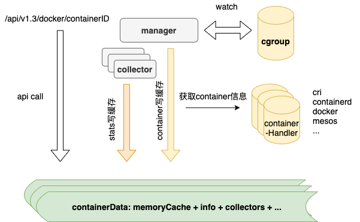

# 容器开启特权模式后无法通过cadvisor获取GPU metrics指标


## 问题描述

开启特权模式（`--privileged`）的容器，在使用nvidia GPU时，无法通过cAdvisor获取GPU相关的metrics信息。Google大法可以搜到相关的[Issue](https://github.com/google/cadvisor/issues/2046)，于2018年提出，至今仍处于Open状态（给cAdvisor贡献代码的机会），由于涉及到的内容较多，分为三篇来讲。

## 寻踪觅源

问题的最终表现是通过cAdvisor无法获取开启特权模式容器的gpu相关数据，即 `curl localhost:4194/api/v1.3/docker/{containerID}` 返回的结果中不包含任何gpu信息，而没有开特权模式的容器是可以正常返回gpu相关信息的。

未开启特权模式的容器返回结果类似如下：

```shell
root@node1: 
# curl localhost:4194/api/v1.3/docker/a0f3c54d8c6beba5d9947723494e4c9b625f03ce4eb0c096e4cf46cae9e389e0 | jq [.[]][0].stats[0].accelerators

[
  {
    "make": "nvidia",
    "model": "Tesla T4",
    "id": "GPU-a2d26dd1-5a8f-35e5-c325-2cd0756d5ed2",
    "memory_total": 15843721216,
    "memory_used": 15127085056,
    "duty_cycle": 6
  },
  {
    "make": "nvidia",
    "model": "Tesla T4",
    "id": "GPU-febe3f91-914e-cb7f-bf0a-d96ffeda2777",
    "memory_total": 15843721216,
    "memory_used": 11367940096,
    "duty_cycle": 44
  }
]
```

可以看到容器用到了两块GPU卡。

开启特权模式的容器执行上述命令后返回空信息。

### cAdvisor

首先需要了解的就是cAdvisor获取gpu指标信息的原理，可以查看[官方文档](https://github.com/google/cadvisor/blob/master/docs/running.md#hardware-accelerator-monitoring)，简单翻译一下如下：

- cAdvisor可以对外暴露容器级别的硬件加速器的指标，且当前只支持英伟达GPU，不支持整机级别
- cAdvisor只对在容器启动时显示设置了`--device /dev/nvidia0:/dev/nvidia0`信息的容器暴露指标，未显示指定的不暴露（对应容器启动时设置了`--privileged`参数）

通过介绍可以得出如下结论：**无法获取开启特权模式容器的GPU指标是Feature而不是Bug**

同时文档中最后提到如果cAdvisor容器化部署时如何设置参数，其中提到的三种方法，如下：

- cAdvisor容器以`--privileged`模式启动
- Docker  v17.04.0-ce 及以上版本的话，启动时设置`--device-cgroup-rule 'c 195:* mrw'`参数
- 启动时设置`--device /dev/nvidiactl:/dev/nvidiactl /dev/nvidia0:/dev/nvidia0 /dev/nvidia1:/dev/nvidia1 <and-so-on-for-all-nvidia-devices>`参数

现实是无论容器是否开启特权模式，我们都需要去获取容器级别的GPU使用率指标，那怎么办呢？大致有两种方法：修改cAdvisor使其支持（In-Tree）、添加其他组件来提供GPU使用率指标（Out-Of-Tree），无论哪种方式，我们都有必要先搞清楚如何采集GPU使用率指标，可以从cAdvisor下手，看他是如何采集的。

#### 采集机制

在看具体实现之前，首先介绍一下cAdvisor运行原理，如下图



cAdvisor在采集过程中主要分两种数据：

- 容器数据
- 指标数据

**容器数据来源**

通过watch cgroup下文件目录的变化进行对应容器的处理，此处只获取到容器ID，在获取到新增容器时，通过containerHandler根据容器ID获取容器详情，例如判断出来watch到的容器是通过docker创建的，则会调用docker API获取指定ID的容器详情，其中就包含了容器启动时需要的Env信息，后面的解决方案中会用到这个属性。

**指标数据来源**

每个容器都有与之对应的collector来进行指标采集，其中nvidia指标由对应的nvidiaCollector负责采集。

#### 源码分析

明白了原理之后，就可以有针对性的去源码中看其具体实现逻辑了。代码位置很好找，在项目根目录下有个accelerators文件夹，源码位于nvidia.go文件内。

```go
// GetCollector returns a collector that can fetch NVIDIA gpu metrics for NVIDIA devices
// present in the devices.list file in the given devicesCgroupPath.
func (nm *nvidiaManager) GetCollector(devicesCgroupPath string) (stats.Collector, error) {
	nc := &nvidiaCollector{}

	if !nm.devicesPresent {
		return &stats.NoopCollector{}, nil
	}
	// Makes sure that we don't call initializeNVML() concurrently and
	// that we only call initializeNVML() when it's not initialized.
	nm.Lock()
	if !nm.nvmlInitialized {
		err := initializeNVML(nm)
		if err != nil {
			nm.Unlock()
			return &stats.NoopCollector{}, err
		}
	}
	nm.Unlock()
	if len(nm.nvidiaDevices) == 0 {
		return &stats.NoopCollector{}, nil
	}
  // 从cgroup中获取需要容器使用的nvidia设备信息，返回的是gpu序号数组
	nvidiaMinorNumbers, err := parseDevicesCgroup(devicesCgroupPath)
	if err != nil {
		return &stats.NoopCollector{}, err
	}

	for _, minor := range nvidiaMinorNumbers {
		device, ok := nm.nvidiaDevices[minor]
		if !ok {
			return &stats.NoopCollector{}, fmt.Errorf("NVIDIA device minor number %d not found in cached devices", minor)
		}
		nc.devices = append(nc.devices, device)
	}
	return nc, nil
}
```

逻辑比较简单，先初始化`NVML`（基于C实现的API，用来监控和管理`nvidia`设备的状态信息，通过`nvidia-smi`对外暴露其各种能力。），接着调用`parseDevicesCgroup`函数获取**容器自身所使用的GPU的序号**，最后通过返回的设备序号找到使用的设备信息返回。

```go
// parseDevicesCgroup解析device cgroup下的devices.list文件来获取允许被容器访问的GPU设备的minor号
// 如果容器可以访问所有设备或者所有nvidia设备的话，但这些设备并未在devices.list中，则返回一个空数组
var parseDevicesCgroup = func(devicesCgroupPath string) ([]int, error) {
	// Always return a non-nil slice
	nvidiaMinorNumbers := []int{}

	devicesList := filepath.Join(devicesCgroupPath, "devices.list")
	f, err := os.Open(devicesList)
	if err != nil {
		return nvidiaMinorNumbers, fmt.Errorf("error while opening devices cgroup file %q: %v", devicesList, err)
	}
	defer f.Close()

	s := bufio.NewScanner(f)

	// See https://www.kernel.org/doc/Documentation/cgroup-v1/devices.txt for the file format
	for s.Scan() {
		text := s.Text()

		fields := strings.Fields(text)
		if len(fields) != 3 {
			return nvidiaMinorNumbers, fmt.Errorf("invalid devices cgroup entry %q: must contain three whitespace-separated fields", text)
		}

		// Split the second field to find out major:minor numbers
		majorMinor := strings.Split(fields[1], ":")
		if len(majorMinor) != 2 {
			return nvidiaMinorNumbers, fmt.Errorf("invalid devices cgroup entry %q: second field should have one colon", text)
		}

		// NVIDIA graphics devices are character devices with major number 195.
		// https://github.com/torvalds/linux/blob/v4.13/Documentation/admin-guide/devices.txt#L2583
		if fields[0] == "c" && majorMinor[0] == "195" {
			minorNumber, err := strconv.Atoi(majorMinor[1])
			if err != nil {
				return nvidiaMinorNumbers, fmt.Errorf("invalid devices cgroup entry %q: minor number is not integer", text)
			}
			// We don't want devices like nvidiactl (195:255) and nvidia-modeset (195:254)
			if minorNumber < 128 {
				nvidiaMinorNumbers = append(nvidiaMinorNumbers, minorNumber)
			}
			// We are ignoring the "195:*" case
			// where the container has access to all NVIDIA devices on the machine.
		}
		// We are ignoring the "*:*" case
		// where the container has access to all devices on the machine.
	}
	return nvidiaMinorNumbers, nil
}
```

代码中有两个链接，分别来介绍相关的linux知识，如下：

- https://www.kernel.org/doc/Documentation/cgroup-v1/devices.txt 
- https://github.com/torvalds/linux/blob/v4.13/Documentation/admin-guide/devices.txt#L2583

第一个链接对cgroup v1的device子系统做了介绍，第二个链接枚举了所有device中可能出现的信息及具体介绍。建议不了解的同学阅读一下链接的内容。简单总结一下如下：

- 一条device cgroup就是一条device访问白名单，包含四个字段并以如下形式展示：`类型 主:次 权限组合`，类型包括`c（char）、b（block）、a（all）`，权限包括rwm，分别对应read、write、mknod
- 根device cgroup白名单为`a *:* rwm`，子device cgroup继承自父，且可以进行删减，但是无法访问父device cgroup中不允许的访问的设备。
- 涉及到3个文件，分别为`devices.allow`、`devices.deny`、`devices.list`，前两个文件是只写权限，最后文件是只读权限。根据文件名字很容易理解文件的作用。
- nvidia device对应的类型为`c`，主序号为195，次序号代表GPU卡号和控制设备，具体根据次序号大小决定

了解完背景知识之后再看上面的代码就很容易理解了，`parseDevicesCgroup`做的事情就是到传入的容器对应的device cgroup路径下需读`devices.list`文件，然后逐行解析，筛选类型为`c`且主序号为`195`且次序号小于`128`（nvidiactl 255，nvidia-modeset 254）的记录，返回所有符合条件的次序号数组。代码中特意注释会忽略`195:*` 及 `*:*`的情况，分别对应有权访问所有nvidia设备和有权访问所有设备的情况，这也就和官方文档中提到的Feature对应起来了。

到这里可以猜一下开启特权模式的容器无法返回GPU指标的原因：开启特权模式影响了devices.list文件内容，变成了`*:*`。

#### 对比验证

未开启特权模式的容器的devices.list文件内容如下：

```shell
root@node1:/sys/fs/cgroup/devices/kubepods.slice/kubepods-burstable.slice/kubepods-burstable-pod2e88abd5_96a2_46eb_b2a5_93ea83444052.slice/docker-a0f3c54d8c6beba5d9947723494e4c9b625f03ce4eb0c096e4cf46cae9e389e0.scope
# cat devices.list
c 1:5 rwm
c 1:3 rwm
c 1:9 rwm
c 1:8 rwm
c 5:0 rwm
c 5:1 rwm
c *:* m
b *:* m
c 1:7 rwm
c 136:* rwm
c 5:2 rwm
c 10:200 rwm
c 195:255 rw
c 243:0 rw
c 243:1 rw
c 195:0 rw
c 195:1 rw
```

可以看到里面包含了`195:0`、`195:1`、`195:255`对应使用了0、1两块GPU卡，执行`nvidia-smi -L`命令返回如下信息

```shell
# nvidia-smi -L
GPU 0: Tesla T4 (UUID: GPU-a2d26dd1-5a8f-35e5-c325-2cd0756d5ed2)
GPU 1: Tesla T4 (UUID: GPU-febe3f91-914e-cb7f-bf0a-d96ffeda2777)
GPU 2: Tesla T4 (UUID: GPU-67ed6316-eec3-f837-b4ac-e36a6d88d0ef)
GPU 3: Tesla T4 (UUID: GPU-2230f4d8-fc3e-8627-e868-28b9e065b4bf)
```

0、1正好对应了开篇通过cAdvisor获取到的GPU指标中显示的GPU id。

开启特权模式的容器的`devices.list`文件内容如下：

```shell
root@node1:/sys/fs/cgroup/devices/kubepods.slice/kubepods-burstable.slice/kubepods-burstable-podb832b138_decb_4fdc_9a62_b588a961d77c.slice/docker-4bc7d5c323f7071478f3bb6eec7f7e91d0738571f56ef8b0c22724a0b051a40f.scope
# cat devices.list
a *:* rwm
```

至此，我们已经清楚cAdvisor是如何获取容器所使用的GPU卡信息的，也清楚了为什么在容器开启特权模式时cAdvisor无法获取其所使用的的GPU卡信息。但距离给出有效且优雅的解决方案还有很多待探索的，例如`devices.list`内容是如何来的？如何知道应该为容器绑定哪些GPU卡等，欲知后事如何，且看下回分解。

