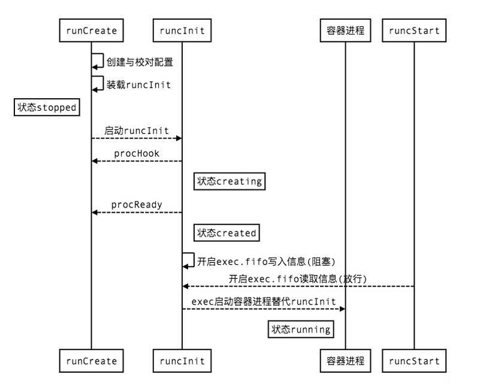
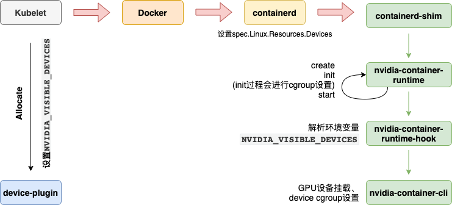

# 容器开启特权模式后无法通过cadvisor获取GPU metrics指标


## 问题描述

开启特权模式（`--privileged`）的容器，在使用nvidia GPU时，无法通过cAdvisor获取GPU相关的metrics信息。Google大法可以搜到相关的[Issue](https://github.com/google/cadvisor/issues/2046)，于2018年提出，至今仍处于Open状态（给cAdvisor贡献代码的机会），由于涉及到的内容较多，分为三篇来讲。

接[上一篇](../gpu-metrics-not-display)，在上一篇中我们已经清楚cAdvisor是如何获取容器所使用的GPU卡信息的，也清楚了为什么在容器开启特权模式时cAdvisor无法获取其所使用的的GPU卡信息。但距离给出有效且优雅的解决方案还有很多待探索的，例如`devices.list`内容是如何来的？如何知道应该为容器绑定哪些GPU卡等，这些问题都将会在接下来的内容中得到答案，让我们一步一步进行分析。

## 抽丝剥茧

### `devics.lists`内容从何而来

上面提到过三个device cgroup的重要文件，其中`devices.allow`和`devices.deny`为只写文件，`devices.list`为只读文件。device子系统是通过device whitelist实现的，此处涉及到内核的知识，想深入了解其实现的可以翻一下内核的代码。简单理解就是通过前面两个只写的文件对whitelist做设置，往`devices.allow`中添加条目相当于添加白名单，往`devices.deny`中添加条目相当于删除白名单，最后通过`devices.list`获取白名单内容。那接下来的问题就是`devices.allow`和`devices.deny`内容是谁根据什么规则写入的？

### `devices.allow`和`devices.deny`内容谁负责写入

> nvidia-container-runtime-webhook对应的github项目为 nvidia-container-toolkit。

这里内容比较多，涉及到`kubelet`、`device-plugin`、` containerd`、 `runC`、`nvidia-container-runtime`、`nvidia-container-runtime-hook`等。在继续之前先回顾一下`docker`的进程模型，了解了进程模型及各组件的作用之后定位问题会更有针对性，更容易理解下面的内容。

#### 进程模型回顾


相信上图大家已经非常熟悉了，其中`Docker Engine`通过rpc与`containerd`通信，`containerd`通过rpc与`containerd-shim` 通信，最终`containerd-shim`通过`runC`来控制容器的生命周期。提到`runC`就不得不提`OCI（Open Container Initiative）`。`OCI `的来源这里不多说，感兴趣的可以自行搜索。其主要包含了两种规范，即`runtime-spec`和`image-spce`，而 `runC`就是对`runtime-spec`的一种实现。既然是规范，那就会存在多种实现，`nvidia-container-runtime`就是为了支持容器使用GPU而做的另一种`runtime-spec`的实现，原理如下


右侧从`runC`开始的一整块就是`nvidia-container-runtime`。

#### runC实现原理

**`runC`容器创建原理**

一个容器启动主要分为三大部分：

- `create`:  主要是为了解析、组装容器启动的配置和与子进程的消息通道等；
- `init`  :  主要根据容器配置启动容器整个运行环境，包括熟知ns，cgroups, seccomp, apparmor, caps等;
- `start` :  主要是为了通知init 进程启动容器；

大致流程如下图



**`nvidia-container-runtime`原理**

`nvidia-container-runtime`原理是利用`runtime-spec`<u>规范中提到的`PreStart Hook`机制在执行完`runc start`之后，在真正的用户进程启动之前</u>，执行`nviadia-container-runtime-hook`进行一些操作，其针对**GPU设备的挂载**和**device cgroup的设置**是通过一个由C和C++实现的叫做`nvidia-container-cli（libnvidia-container）`的程序实现的。

***注意：prestart hook的生效时机有待确认，虽然`OCI` spec中提到是在`start`之后，但是经过看`runc`源码发现是在执行`init`的过程中，且尚未执行`start`***

`nvidia-container-runtime-hook`通过解析`runtime-spec`中为用户程序设置的**`NVIDIA_VISIBLE_DEVICES`**环境变量获取容器需要使用的GPU卡的ID，并调用`nvidia-container-cli configure --device=ID(s)` 来完成上述提到的操作。

至此可以对容器内的GPU设备挂载和device cgroup的设置过程和原理有个大概的了解，这里利用了`OCI` hook和spec，通过环境变量形式把需要的GPU设备ID设置到名为`NVIDIA_VISIBLE_DEVICES`的环境变量上，进行了比较巧妙的实现，那又是谁为此环境变量设置赋值的呢？继续往下看

#### NVIDIA_VISIBLE_DEVICES来自何处

`Kubernetes` 提供了一个 [device plugin框架](https://github.com/kubernetes/community/blob/master/contributors/design-proposals/resource-management/device-plugin.md)（beta from 1.10），可以用它来将系统硬件资源发布到`Kubelet`，再由`Kubelet`上报给`Kube-apiserver`，不必定制 Kubernetes 本身的代码。目标设备包括 GPU、高性能 NIC、FPGA、 InfiniBand 适配器以及其他类似的、可能需要特定于供应商的初始化和设置的计算资源。


工作流程如上图所示，`device plugin`先注册到`Kubelet`，`Kubelet`开始watch`device plugin`变化，在容器真正创建之前`Kubelet`调用`device plugin`提供的`Allocate`服务去为Pod申请所需资源。`Kubelet`在内部维护了一份`Pod`与扩展资源的映射数据，且通过`checkpoint`形式写到本地文件中，在后续`Kubelet`重启时会用到。同时在开启`KubeletPodResource`特性开关后，Kubulet还可以通过rpc的形式对外提供`pod-resources`信息，详情可以参考https://kubernetes.io/zh/docs/concepts/extend-kubernetes/compute-storage-net/device-plugins/。

这里大致可以猜到赋值的地方了，因为这是一个专门用于GPU的环境变量，所以不可能直接在`Kubelet`中定义，那就只剩下nidia对应的k8s-device-plugin了，我们可以在其源码中找到对应的实现逻辑，如下：

```go
// Constants to represent the various device list strategies
const (
	DeviceListStrategyEnvvar       = "envvar"
	DeviceListStrategyVolumeMounts = "volume-mounts"
)

// migStrategyNone
func (s *migStrategyNone) GetPlugins() []*NvidiaDevicePlugin {
	return []*NvidiaDevicePlugin{
		NewNvidiaDevicePlugin(
			"nvidia.com/gpu",
			NewGpuDeviceManager(false), // Enumerate device even if MIG enabled
			"NVIDIA_VISIBLE_DEVICES",
			gpuallocator.NewBestEffortPolicy(),
			pluginapi.DevicePluginPath+"nvidia-gpu.sock"),
	}
}

// Allocate which return list of devices.
func (m *NvidiaDevicePlugin) Allocate(ctx context.Context, reqs *pluginapi.AllocateRequest) (*pluginapi.AllocateResponse, error) {
	responses := pluginapi.AllocateResponse{}
	for _, req := range reqs.ContainerRequests {
		for _, id := range req.DevicesIDs {
			if !m.deviceExists(id) {
				return nil, fmt.Errorf("invalid allocation request for '%s': unknown device: %s", m.resourceName, id)
			}
		}

		response := pluginapi.ContainerAllocateResponse{}

		uuids := req.DevicesIDs
		deviceIDs := m.deviceIDsFromUUIDs(uuids)

    // 默认为DeviceListStrategyEnvvar，m.deviceListEnvvar的值就是NVIDIA_VISIBLE_DEVICES
		if deviceListStrategyFlag == DeviceListStrategyEnvvar {
			response.Envs = m.apiEnvs(m.deviceListEnvvar, deviceIDs)
		}
		if deviceListStrategyFlag == DeviceListStrategyVolumeMounts {
			response.Envs = m.apiEnvs(m.deviceListEnvvar, []string{deviceListAsVolumeMountsContainerPathRoot})
			response.Mounts = m.apiMounts(deviceIDs)
		}
		if passDeviceSpecsFlag {
			response.Devices = m.apiDeviceSpecs(nvidiaDriverRootFlag, uuids)
		}

		responses.ContainerResponses = append(responses.ContainerResponses, &response)
	}

	return &responses, nil
}
```

可以看到在具体是在`Kubelet`调用Allocate服务时，k8s-device-plugin对response.Env进行了设置，添加了对应的环境变量，值就是容器所对应的GPU设备，多个设备用逗号分隔。

#### 为什么开启特权模式的容器devices.list是`*:*`

同样是设置了`NVIDIA_VISIBLE_DEVICES`，同样最终都是nvidia-container-cli进行device cgroup的设置，为什么特权模式的容器对应的device cgroup就是`*:*`呢？

这里就又得提到`runc`了，上面虽然提到`nvidia-container-runtime-hook`会获取环境变量，进行一系列操作，设置device cgroup，但是在执行`runc int`的过程中同样会去进行设备挂载和cgroup的设置。

接下来重点看下其设置cgroup的相关代码，cgroup参数组装的过程在`create`命令中，真正将参数设置到linux系统上是在`init`命令中进行的，且没有对参数做任何修改，所以我们看`create`部分cgroup参数是如何组装的，忽略掉不相关的代码：

```go
func CreateCgroupConfig(opts *CreateOpts) (*configs.Cgroup, error) {
	...

	// In rootless containers, any attempt to make cgroup changes is likely to fail.
	// libcontainer will validate this but ignores the error.
	c.Resources.AllowedDevices = AllowedDevices
	if spec.Linux != nil {
		r := spec.Linux.Resources
		if r == nil {
			return c, nil
		}
		for i, d := range spec.Linux.Resources.Devices {
			var (
				t     = "a"
				major = int64(-1)
				minor = int64(-1)
			)
			if d.Type != "" {
				t = d.Type
			}
			if d.Major != nil {
				major = *d.Major
			}
			if d.Minor != nil {
				minor = *d.Minor
			}
			if d.Access == "" {
				return nil, fmt.Errorf("device access at %d field cannot be empty", i)
			}
			dt, err := stringToCgroupDeviceRune(t)
			if err != nil {
				return nil, err
			}
			dd := &configs.Device{
				Type:        dt,
				Major:       major,
				Minor:       minor,
				Permissions: d.Access,
				Allow:       d.Allow,
			}
			c.Resources.Devices = append(c.Resources.Devices, dd)
		}
		
    ...
}
```

可以看到是根据`spec.Linux.Resources.Devices`来设置device cgroup的，接下来就去对比一下普通容器和特权模式容器上述字段值得区别，如下

```shell
# 普通容器
root@node1:/var/run/containerd/io.containerd.runtime.v2.task/moby/a0f3c54d8c6beba5d9947723494e4c9b625f03ce4eb0c096e4cf46cae9e389e0
# cat config.json | jq .linux.resources.devices
[
  {
    "allow": false,
    "access": "rwm"
  },
  {
    "allow": true,
    "type": "c",
    "major": 1,
    "minor": 5,
    "access": "rwm"
  },
  {
    "allow": true,
    "type": "c",
    "major": 1,
    "minor": 3,
    "access": "rwm"
  },
  {
    "allow": true,
    "type": "c",
    "major": 1,
    "minor": 9,
    "access": "rwm"
  },
  {
    "allow": true,
    "type": "c",
    "major": 1,
    "minor": 8,
    "access": "rwm"
  },
  {
    "allow": true,
    "type": "c",
    "major": 5,
    "minor": 0,
    "access": "rwm"
  },
  {
    "allow": true,
    "type": "c",
    "major": 5,
    "minor": 1,
    "access": "rwm"
  },
  {
    "allow": false,
    "type": "c",
    "major": 10,
    "minor": 229,
    "access": "rwm"
  }
]

# 特权容器
root@node1:/var/run/containerd/io.containerd.runtime.v2.task/moby/4bc7d5c323f7071478f3bb6eec7f7e91d0738571f56ef8b0c22724a0b051a40f
# cat config.json | jq .linux.resources.devices
[
  {
    "allow": true,
    "access": "rwm"
  }
]
```

区别很明显，结合上面的代码可以很容器判断出来特权模式将会设置`a *:* rwm`，而非特权模式容器则按需设置，最终导致虽然`nvidia-container-runtime-hook`会根据环境变量的值进行device cgroup的设置，但由于开启特权模式的容器设置了更大的范围，最终读`devices.list`时就会直接返回`a *:* rwm`。

`OCI` spce文件中`spec.Linux.Resources.Devices`值则是由`containerd`设置的，`containerd`会判断容器是否开启特权模式进行响应的设置，相关代码如下：

```go
func populateDefaultUnixSpec(ctx context.Context, s *Spec, id string) error {
	...

	*s = Spec{
		...
		Linux: &specs.Linux{
			...
			CgroupsPath: filepath.Join("/", ns, id),
			Resources: &specs.LinuxResources{
				Devices: []specs.LinuxDeviceCgroup{
					{
						Allow:  false,
						Access: rwm,
					},
				},
			},
			...
		},
	}
	...
}


// NewContainer creates a new container
func NewContainer(ctx gocontext.Context, client *containerd.Client, context *cli.Context) (containerd.Container, error) {
	...
  
		if context.Bool("privileged") {
			opts = append(opts, oci.WithPrivileged, oci.WithAllDevicesAllowed, oci.WithHostDevices)
		}
		
    ...
}

// WithAllDevicesAllowed permits READ WRITE MKNOD on all devices nodes for the container
func WithAllDevicesAllowed(_ context.Context, _ Client, _ *containers.Container, s *Spec) error {
	setLinux(s)
	if s.Linux.Resources == nil {
		s.Linux.Resources = &specs.LinuxResources{}
	}
	s.Linux.Resources.Devices = []specs.LinuxDeviceCgroup{
		{
			Allow:  true,
			Access: rwm,
		},
	}
	return nil
}
```

### 完整流程

至此我们清楚了容器在使用GPU时的整个流程，从容器创建到真正挂载GPU设备以及开启特权模式后无法获取GPU指标的原因。




好了，有关cAdvisor无法提供特权模式容器的GPU指标的原理及原因至此已经都搞清楚了，下一篇我们讲介绍解决方案，敬请期待~

