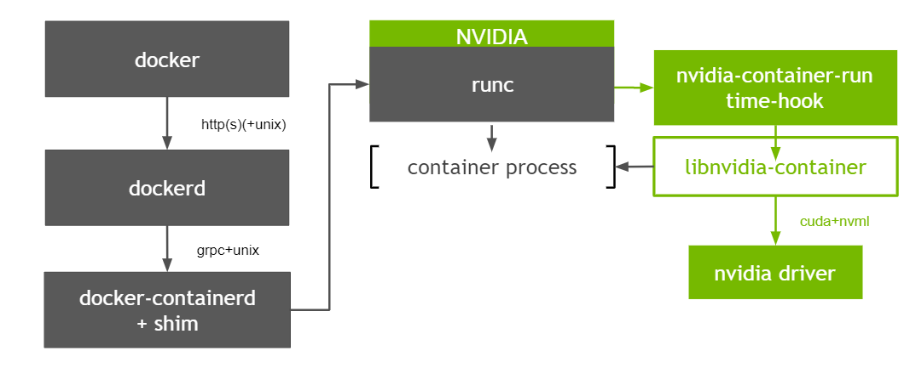

# 容器开启特权模式后无法通过cadvisor获取GPU metrics指标

## 问题描述

开启特权模式（`--privileged`）的容器，在使用nvidia GPU时，无法通过cAdvisor获取GPU相关的metrics信息。Google大法可以搜到相关的[Issue](https://github.com/google/cadvisor/issues/2046)，于2018年提出，至今仍处于Open状态（给cAdvisor贡献代码的机会），由于涉及到的内容较多，分为三篇来讲。

本篇为最后一篇，在看本篇之前建议先查看前两篇：

[容器开启特权模式后无法通过cadvisor获取GPU metrics指标](../gpu-metrics-not-display)

[容器开启特权模式后无法通过cadvisor获取GPU metrics指标](gpu-metrics-not-display2)

## 回顾

首先通过两种图回顾一下容器使用NVIDIA GPU的原理，如下

### [Kubelet & Device Plugin](https://docs.google.com/document/d/1wPlJL8DsVpHnbVbTaad35ILB-jqoMLkGFLnQpWWNduc/edit "device plugin")

### [Nvidia-container-runtime](https://docs.google.com/document/d/10EGjF1nEGUD5060dJ-ZcJI2w7Ob4CLCvcn1lzKW6I4o/edit# "nvidia-container-runtime")

## 解决方案

总结一下cAdvisor无法提供特权模式容器GPU指标的根本原因：

- cAdvisor作为一个偏底层的通用指标能力的提供者，为了与其他组件解耦，其从最底层device cgroup来获取容器绑定的GPU信息；
- containerd在创建容器时判断是否开启特权模式，是的话会为容器设置可以访问所有设备，即`a *:* rwm`。

### 必要性

使用GPU时容器开启特权模式是一种趋势，简单说就是通过Env的方式传递GPU卡信息时，用户如果知道这个能力，则很容易就可以越过`device-plugin`在`Pod spec`中设置Env来实现使用GPU卡的目的，为了安全性，nvidia `k8s-deivice-plugin`提供了另一种实现方式，参考[这里](https://docs.google.com/document/d/1uXVF-NWZQXgP1MLb87_kMkQvidpnkNWicdpO2l9g-fw/edit# "device-plugin")，新的方式是通过挂载卷的方式识别所需的GPU设备信息，必须开启特权模式。

虽然两种方式都可以实现容器内使用GPU设备的目的，但实现方式都不够优雅，根本原因还是缺少一个将第三方设备资源通知给`container runtime`的规范，社区也意识到了这个问题，提出了[CDI](https://github.com/container-orchestrated-devices/container-device-interface "container-device-interface")规范，有关进展详见[这里](https://docs.google.com/document/d/1gUgAMEThkRt4RJ7pA7ZbPPmIOX2Vb7fwH025MjfcTYU/edit# "CDI进展")。在此规范的标准实现上线之前，随着越来越多的容器在使用GPU时开启特权模式，哪怕不那么优雅的方案也是有必要先实现的。

### GPU设备表示方式

k8s-device-plugin支持两种GPU设备表示方式，通过`deviceIDStrategyFlag`参数设置：

- index
- uuid （默认）

如果以index方式设置，则可以直接在`cAdvisor`中获取index值，无需从device cgroup中获取，实现起来比较简单。下面的内容是针对以uuid方式设置时`cAdvisor`的处理逻辑。

### GPU设备信息来源

#### Pod-Resource

`Kubelet`提供了`pod-resource`机制，对外提供rpc服务，供外部获取容器所需的资源信息。对`Kubelet`版本有一定的要求，且这种方式会把`cAdvisor`和`Kubelet`偶合在一起，不适合`In-Tree`方式，可以采取`Out-Of-Tree`的方式实现。

#### OCI spec

`cAdvisor`中本身已经缓存了容器`OCI` spec信息，可以从中获取绑定的GPU信息，优点是上层无感知，缺点是加重了`cAdvisor`的依赖，`cAdvisor`需要知道当前容器使用的GPU信息和当前节点上所有GPU信息。

k8s-device-plugin提供了两种方式设置当前容器使用的GPU设备信息：

- Env
- Volume Mount

在获取当前节点所有GPU信息之前有个基础知识点需要了解，即[Mig Strategy](https://docs.nvidia.com/datacenter/cloud-native/kubernetes/mig-k8s.html "mig strategy")。策略不同，最终获取到的节点的GPU设备信息不同。当前支持三种策略：

- None：不使用MIG能力
- Single：使用MIG能力，且各GPU实例被分为相同的规格的计算实例
- Mixed：使用MIG能力，GPU实例可以划分为任意规格的计算实例，或者直接使用整个GPU实例

剩下的工作就是实现不同机制下获取GPU设备信息的功能，可以参考`k8s-device-plugin`的实现，因为其本身在Allocate时必然涉及到相关能力。

