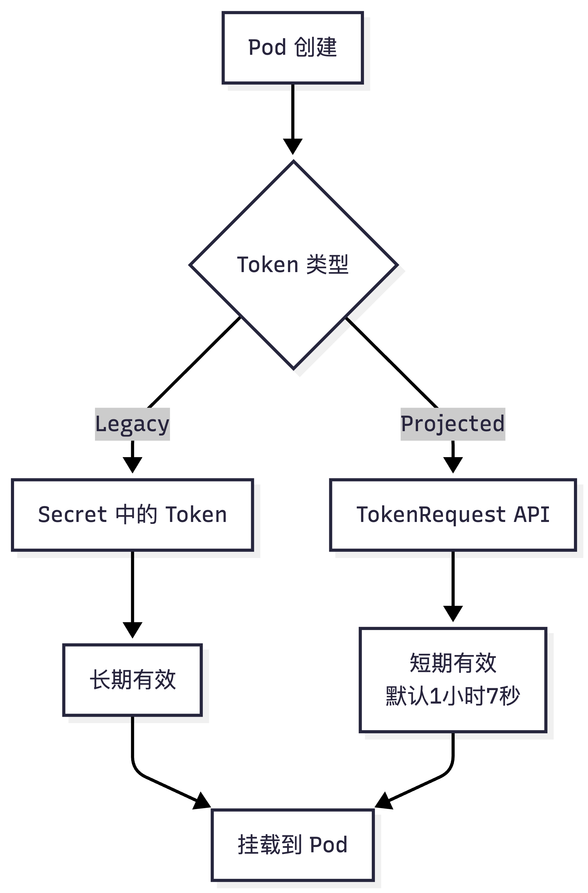
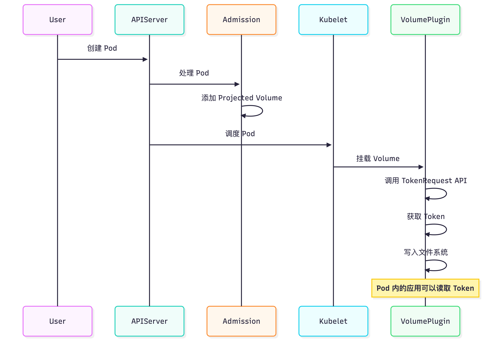
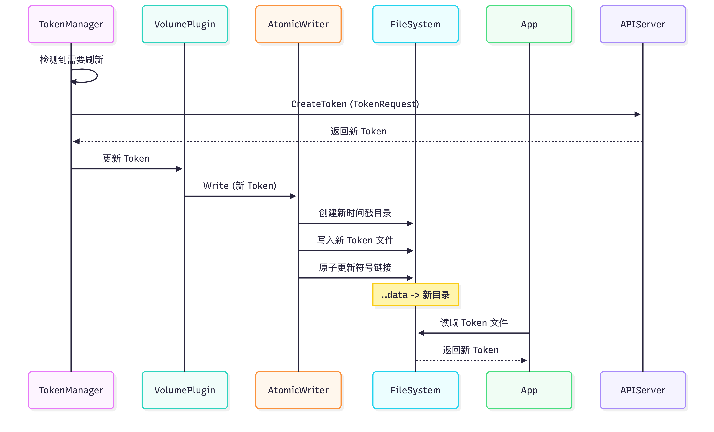
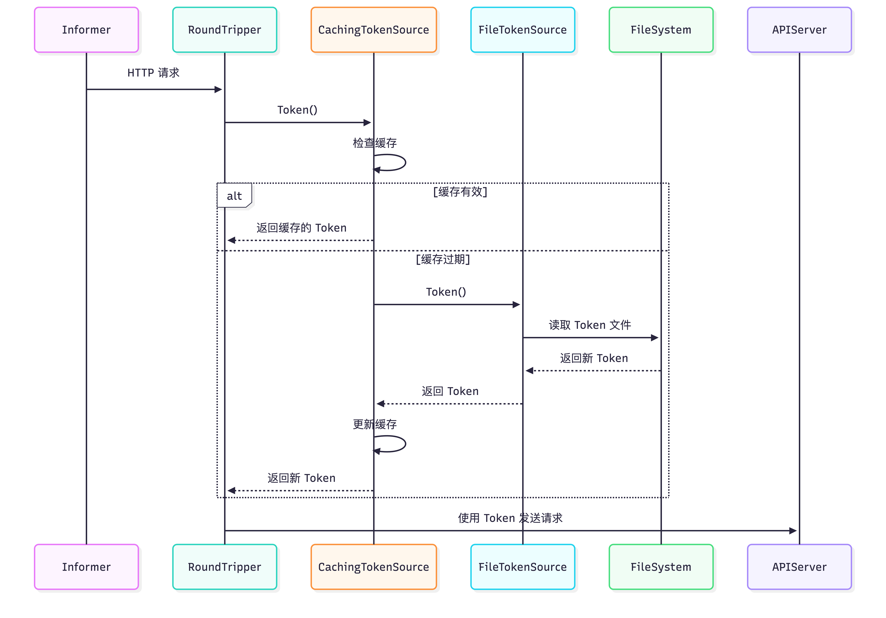

# Kubernetes 认证机制深度解析：从 Token 到证书的自动轮转


# Kubernetes 认证机制深度解析：从 Token 到证书的自动轮转

> 你是否好奇过：为什么 Pod 内的应用只需要 Token 就能访问 API Server？为什么 Kubelet 使用客户端证书而不是 Token？当 Token 或证书更新后，正在运行的客户端是如何自动切换的？本文将深入解析 Kubernetes 认证机制的完整生命周期，揭示这些设计背后的原理。

## 引言

在 Kubernetes 集群中，安全认证是保障集群安全的第一道防线。无论是 Pod 内的应用访问 API Server，还是 Kubelet 这样的系统组件，都需要通过认证来证明自己的身份。

Kubernetes 提供了多种认证方式，其中 **Bearer Token** 和 **TLS 客户端证书** 都支持自动轮转，但它们的实现机制却大相径庭。本文将深入解析这两种认证方式的完整生命周期，揭示它们的设计原理和实现细节。

**你将学到**：

- Token 和客户端证书的本质区别
- 两种认证方式的自动轮转机制
- 客户端如何处理认证凭证的更新
- InClusterConfig 的工作原理
- 实际应用中的最佳实践

## 一、两种认证方式概览

### 1.1 Bearer Token 认证

**使用场景**：Pod 内的应用访问 API Server

**特点**：

- 应用层认证（HTTP Header）
- 短期有效（默认 1 小时 7 秒）
- 自动刷新机制
- 通过 Projected Volume 挂载到 Pod

**典型使用**：

```go
config, err := rest.InClusterConfig()  // 自动使用 Token
clientset, err := kubernetes.NewForConfig(config)
```

### 1.2 TLS 客户端证书认证

**使用场景**：Kubelet、Kube-proxy 等系统组件

**特点**：

- 传输层认证（TLS 握手）
- 长期有效（通常数月）
- 通过 CSR（Certificate Signing Request）自动轮转
- 存储在节点文件系统

**典型使用**：

```yaml
# Kubelet 配置
rotateCertificates: true
certDirectory: /var/lib/kubelet/pki
```

## 二、Token 的完整生命周期

### 2.1 Token 的类型

Kubernetes 中存在两种主要的 Service Account Token：

#### Legacy Token（传统 Token）

- **存储方式**：存储在 Secret 中
- **过期时间**：**没有过期时间**（除非 Secret 被删除）
- **Issuer**：`kubernetes/serviceaccount`
- **状态**：逐步被淘汰，新版本推荐使用 Projected Token

#### Projected Token（投影 Token）

- **生成方式**：通过 TokenRequest API 动态生成
- **过期时间**：**有明确的过期时间**（默认 1 小时 7 秒）
- **Issuer**：`kubernetes.io/serviceaccount`
- **状态**：现代 Kubernetes 推荐的标准方式



### 2.2 Token 的挂载机制

当 Pod 创建时，如果没有明确禁用，Kubernetes 会自动挂载 Token：

**挂载流程**：

1. **Admission 阶段**：ServiceAccount Admission Controller 修改 Pod Spec
2. **Volume 创建**：添加 Projected 类型的 Volume
3. **文件挂载**：挂载到 `/var/run/secrets/kubernetes.io/serviceaccount/`

**挂载内容**：

- `token`：Service Account Token
- `ca.crt`：集群 CA 证书
- `namespace`：Pod 所在命名空间



### 2.3 Token 的自动更新机制

Token Manager 负责管理 Token 的生命周期：

**更新触发条件**：

- Token 使用时间超过 24 小时，或
- Token 剩余有效期少于 20%（加上随机抖动）

**更新流程**：

```go
// Token Manager 的更新逻辑
func (m *Manager) GetServiceAccountToken(...) (*authenticationv1.TokenRequest, error) {
    // 1. 检查缓存
    ctr, ok := m.get(key)
    
    // 2. 判断是否需要刷新
    if ok && !m.requiresRefresh(ctx, ctr) {
        return ctr, nil  // 返回缓存的 Token
    }
    
    // 3. 获取新 Token
    tr, err := m.getToken(name, namespace, tr)
    
    // 4. 更新缓存
    m.set(key, tr)
    return tr, nil
}
```

**文件更新机制**：

- Projected Volume 使用 **AtomicWriter** 实现原子更新
- 通过符号链接的原子重命名实现文件更新
- 应用可以监控 `..data` 符号链接的变化



### 2.4 客户端如何处理 Token 更新

这是很多开发者关心的问题：当 Token 更新后，正在使用旧 Token 的客户端（如 Informer）会如何处理？

#### 文件更新机制

Projected Volume 使用符号链接实现原子更新：

- 用户可见文件：`/var/run/secrets/kubernetes.io/serviceaccount/token` → `..data/token`
- 数据目录：`..data` → `..2024_01_01_12_00_00.12345678/`
- 通过重命名符号链接实现原子切换

#### client-go 的 Token 读取

client-go 使用两层机制处理 Token：

1. **fileTokenSource**：

   - 每次调用 `Token()` 时**重新读取文件**
   - 不缓存文件内容，确保获取最新 Token

2. **cachingTokenSource**：

   - 提供缓存机制，减少文件 I/O
   - 缓存时间短（1 分钟），确保及时刷新
   - 缓存过期时自动重新读取文件

   

#### Informer 的处理

当 Token 更新后，Informer 通过以下机制自动处理：

1. **自动重连**：Watch 连接断开后自动重新建立
2. **401 错误处理**：收到 401 时清除缓存，强制重新读取 Token
3. **无缝切换**：整个过程对应用透明，不会丢失事件

**关键设计**：

- 缓存时间短（1 分钟），确保及时感知 Token 更新
- 401 错误时强制清除缓存
- 通过 ResourceVersion 恢复 Watch 事件

## 三、客户端证书的完整生命周期

### 3.1 证书轮转的触发

Kubelet 的客户端证书轮转在以下情况触发：

1. **证书即将过期**：剩余有效期少于 1/3
2. **证书不存在**：首次启动或证书丢失
3. **强制轮转**：使用 Bootstrap 证书时立即轮转

### 3.2 GetClientCertificate 机制

这是客户端证书轮转的核心机制：

```go
// 设置 GetClientCertificate 回调
tlsConfig.GetClientCertificate = func(requestInfo *tls.CertificateRequestInfo) (*tls.Certificate, error) {
    // 每次 TLS 握手时调用
    cert := clientCertificateManager.Current()
    if cert == nil {
        return &tls.Certificate{Certificate: nil}, nil
    }
    return cert, nil
}
```

**关键点**：

- `GetClientCertificate` 是 **Go 标准库 `crypto/tls` 包提供的回调接口**
- 在**每次 TLS 握手时**被调用
- 允许动态获取证书，而不是在连接建立时固定

### 3.3 证书更新后的连接处理

这是客户端证书轮转的关键步骤：

```go
// 检测证书更新
checkNewCertificateAndRotate := func() {
    curr := clientCertificateManager.Current()
    
    if curr == nil || lastCert == curr {
        return  // 证书未更新
    }
    
    // 证书已更新，关闭所有连接
    klog.InfoS("Certificate rotation detected, shutting down client connections")
    d.CloseAll()  // 关闭所有 TCP 连接
}
```

**为什么必须关闭连接？**

因为 TLS 握手在连接建立时完成，已建立的连接使用握手时的证书。要使用新证书，必须：

1. 关闭所有现有连接
2. 强制重新进行 TLS 握手
3. 新握手时调用 `GetClientCertificate` 获取新证书


### 3.4 CSR 流程

证书轮转通过 CSR（Certificate Signing Request）实现：

1. **生成 CSR**：Kubelet 生成私钥和 CSR
2. **提交 CSR**：通过 API Server 的 CSR API 提交
3. **等待批准**：CSR Controller 自动批准（或手动批准）
4. **获取证书**：下载签名后的证书
5. **更新文件**：更新本地证书文件

## 四、两种机制的深度对比

### 4.1 本质区别

| 维度         | Bearer Token           | TLS 客户端证书            |
| ------------ | ---------------------- | ------------------------- |
| **认证层次** | 应用层（HTTP Header）  | 传输层（TLS 握手）        |
| **认证时机** | HTTP 请求时            | TLS 握手时                |
| **更新方式** | 文件更新 + 重新读取    | 关闭连接 + 重新握手       |
| **Go 机制**  | 文件系统 + HTTP Header | GetClientCertificate 回调 |
| **连接影响** | 不需要关闭连接         | 必须关闭连接              |
| **更新频率** | 高（Token 有效期短）   | 低（证书有效期长）        |

### 4.2 实现机制对比

#### Token 轮转实现

```go
// 1. Token Manager 管理 Token
func (m *Manager) GetServiceAccountToken(...) {
    if m.requiresRefresh(ctx, ctr) {
        tr, err := m.getToken(...)  // 获取新 Token
        m.set(key, tr)  // 更新缓存
    }
}

// 2. 文件系统更新（Projected Volume）
// 原子性地更新符号链接

// 3. 客户端读取（每次请求时）
func (ts *fileTokenSource) Token() (*oauth2.Token, error) {
    tokb, err := os.ReadFile(ts.path)  // 重新读取文件
    return &oauth2.Token{AccessToken: string(tokb)}, nil
}
```

**特点**：

- ✅ 不需要关闭连接
- ✅ 在现有连接上更新 HTTP Header
- ✅ 更新频率高，但开销小

#### 客户端证书轮转实现

```go
// 1. 设置 GetClientCertificate 回调
tlsConfig.GetClientCertificate = func(*tls.CertificateRequestInfo) (*tls.Certificate, error) {
    return clientCertificateManager.Current(), nil
}

// 2. 检测证书更新
go wait.Until(func() {
    curr := clientCertificateManager.Current()
    if curr != lastCert {
        d.CloseAll()  // 关闭所有连接
    }
}, 10*time.Second, stopCh)

// 3. 新连接自动使用新证书
// GetClientCertificate 在每次握手时调用
```

**特点**：

- ⚠️ 必须关闭连接
- ⚠️ 需要重新进行 TLS 握手
- ✅ 更新频率低，但一次性开销大

### 4.3 为什么需要不同的机制？

#### TLS 握手的限制

**问题**：

- TLS 握手在连接建立时完成
- 已建立的连接使用握手时的证书
- **无法在已建立的连接上更换证书**

**解决方案**：

- 关闭所有连接
- 强制重新握手
- 新握手时使用新证书

#### HTTP Header 的灵活性

**优势**：

- HTTP Header 在每个请求中发送
- 可以随时更新 Header 内容
- 不需要重新建立连接

**实现**：

- Token 文件更新后，应用重新读取
- 新请求使用新 Token
- 旧请求继续使用旧 Token（直到过期）

### 4.4 性能影响对比

**客户端证书轮转**：

- ⚠️ **连接中断**：所有连接被关闭
- ⚠️ **重新握手开销**：需要重新进行 TLS 握手
- ✅ **一次性开销**：轮转频率低（通常数月一次）

**Token 轮转**：

- ✅ **无连接中断**：连接保持打开
- ✅ **无握手开销**：不需要重新握手
- ⚠️ **文件 I/O**：需要读取文件（有缓存优化）

## 五、InClusterConfig 的工作原理

### 5.1 为什么只需要 Token 和 CA？

很多开发者疑惑：为什么 `InClusterConfig` 只需要 Token 和 CA，不需要客户端证书的私钥？

**答案**：

- **Token 本身就是完整的认证凭证**：Bearer Token 通过 HTTP Header 发送，本身就是认证凭证
- **不需要私钥**：Token 验证在 API Server 端使用**公钥**进行，客户端只需要提供 Token
- **CA 的作用**：用于验证 API Server 的 TLS 证书，确保连接到正确的服务器

**对比 TLS 客户端证书**：

- TLS 客户端证书：需要**私钥**（用于 TLS 握手时的签名）
- Bearer Token：**不需要私钥**（Token 本身已包含签名，服务器用公钥验证）

### 5.2 TLS 握手仍然会发生

**重要理解**：即使没有客户端证书，TLS 握手仍然会发生！

**原因**：

1. **HTTPS 协议要求**：`InClusterConfig` 使用 `https://` 协议，必须进行 TLS 握手
2. **CA 的作用**：用于验证 API Server 的 TLS 证书
3. **客户端证书是可选的**：没有客户端证书不影响 TLS 握手，只是不发送客户端证书

**完整流程**：

```
1. TCP 连接建立
2. TLS 握手开始
3. 服务器发送证书
4. 客户端使用 CA 验证服务器证书 ✅
5. （可选）客户端发送客户端证书 ❌ InClusterConfig 没有
6. TLS 握手完成，加密连接建立 ✅
7. HTTP 请求发送（在加密连接中）
8. Authorization Header 包含 Bearer Token ✅
9. API Server 验证 Token ✅
```

### 5.3 为什么只能在集群内使用？

`InClusterConfig` 通过检查环境变量来判断是否在集群内：

```go
host, port := os.Getenv("KUBERNETES_SERVICE_HOST"), os.Getenv("KUBERNETES_SERVICE_PORT")
if len(host) == 0 || len(port) == 0 {
    return nil, ErrNotInCluster  // 返回错误
}
```

**原因**：

- `KUBERNETES_SERVICE_HOST` 和 `KUBERNETES_SERVICE_PORT` 由 **kubelet** 在创建 Pod 时自动注入
- Token 文件 `/var/run/secrets/kubernetes.io/serviceaccount/token` 由 **Projected Volume** 挂载
- 这些资源在集群外不存在

## 六、实际应用场景

### 6.1 Pod 内应用使用 Token

**典型场景**：Pod 内的应用需要访问 Kubernetes API

```go
// 在 Pod 内使用
config, err := rest.InClusterConfig()
if err != nil {
    // 如果不在集群内，会返回 ErrNotInCluster
    panic(err.Error())
}

clientset, err := kubernetes.NewForConfig(config)
// 使用 clientset 访问 API
```

**优势**：

- 零配置，自动发现
- Token 自动轮转
- 符合 Kubernetes 最佳实践

### 6.2 Kubelet 使用客户端证书

**典型场景**：Kubelet 需要与 API Server 通信

```yaml
# Kubelet 配置
rotateCertificates: true
certDirectory: /var/lib/kubelet/pki
```

**优势**：

- 传输层认证，更安全
- 适合长期连接
- 证书有效期长，轮转频率低

### 6.3 混合使用

在实际场景中，两种方式可以同时使用：

- **TLS 客户端证书**：用于节点级别的认证（Kubelet、Kube-proxy）
- **Bearer Token**：用于 Pod 内应用的认证

两者**互补**而非替代：

- TLS 提供**传输安全**（加密 + 服务器身份验证）
- Token 提供**应用层身份认证**（客户端身份验证）

## 七、最佳实践

### 7.1 Token 使用建议

1. **使用 Projected Token**：新部署优先使用 Projected Token
2. **合理设置过期时间**：根据应用需求设置合适的过期时间
3. **禁用不必要的自动挂载**：对于不需要访问 API Server 的 Pod，禁用自动挂载
4. **处理 Token 过期**：应用需要正确处理 Token 过期和刷新

### 7.2 证书使用建议

1. **启用自动轮转**：生产环境必须启用证书自动轮转
2. **配置 Bootstrap**：使用 Bootstrap 机制支持自动化部署
3. **监控证书状态**：定期检查证书 TTL 和轮转状态
4. **设置告警**：对证书过期和轮转失败设置告警

### 7.3 故障排查

**Token 相关问题**：

- Token 未挂载：检查 Pod 和 ServiceAccount 的 `automountServiceAccountToken` 设置
- Token 过期：检查 Token 的过期时间和 Token Manager 状态
- Token 刷新失败：检查 API Server 连接和 ServiceAccount 权限

**证书相关问题**：

- 证书轮转失败：检查 CSR 状态、Approver 日志、网络连接
- 证书过期：检查证书管理器状态，手动批准 CSR
- 连接问题：检查证书更新后的连接关闭机制

## 八、总结

### 8.1 核心要点

1. **两种认证方式都支持自动轮转**，但实现机制不同：
   - **Token**：应用层认证，通过文件更新实现，不需要关闭连接
   - **客户端证书**：传输层认证，通过 GetClientCertificate 回调实现，需要关闭连接

2. **本质区别**：
   - Token 在 **HTTP 请求时**认证，可以随时更新
   - 客户端证书在 **TLS 握手时**认证，已建立的连接无法更新

3. **设计考虑**：
   - Token 适合 Pod 内应用，更新频繁但开销小
   - 客户端证书适合系统组件，更新频率低但需要重新握手

### 8.2 技术亮点

1. **GetClientCertificate 机制**：
   - Go 标准库提供的 TLS 回调接口
   - 允许动态获取证书
   - 每次握手时调用，确保使用最新证书

2. **AtomicWriter 机制**：
   - 通过符号链接实现原子文件更新
   - 支持多个进程同时读取
   - 避免文件更新的竞态条件

3. **两层安全机制**：
   - TLS 层：传输加密 + 服务器身份验证
   - 应用层：客户端身份认证（Token）

### 8.3 实践建议

- **Pod 内应用**：使用 `InClusterConfig`，自动使用 Token
- **系统组件**：使用客户端证书，启用自动轮转
- **开发测试**：可以使用 kubeconfig 文件，即使是在集群内

理解这些机制有助于：

- 更好地设计应用架构
- 快速排查认证相关问题
- 优化应用的性能和安全性

---

**参考资料**：

- [Kubernetes Service Account Tokens](https://kubernetes.io/docs/concepts/security/service-accounts/)
- [Kubelet Certificate Rotation](https://kubernetes.io/docs/reference/access-authn-authz/kubelet-tls-bootstrapping/)
- [Go crypto/tls Package](https://pkg.go.dev/crypto/tls)

