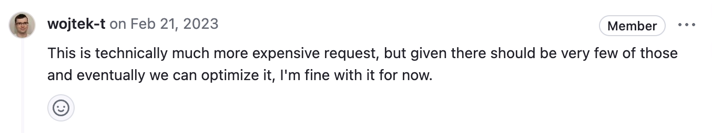

# k8s watch 丢事件 - 2


[前一篇](https://mp.weixin.qq.com/s/Zje1gpy0_iERqKZZoW3UYg)已经描述了较老版本中存在的丢事件的问题，本篇继续描述另外一种。

# 现象

v1.27 的 K8s，在 kube-apiserver 的日志中会看到 "**etcd event received with PrevKv=nil**" 的字样，资源对象被删除后在 Etcd 中已经不存在了但在 Reflector store 中仍然存在，可以在 Informer 或者 watchCache 中看到对应的对象，依赖 Informer 的组件也不会感知到资源对象被删除，通过 List API 设置 RV="0" 去 kube-apiserver 的 watchCache 中获取的话也可以看到已经被删除的对象仍然存在。

# 回顾

出现 PrevKV=nil 的话，肯定就是 Etcd 返回的数据有问题。前一篇中讲到

1. Etcd compaction 导致出现 PrevKV=nil 的 delete event，而这个问题已经在 Etcd 中修复，最终返回 `ErrCompacted`；
1. K8s 侧做了兜底，任何 PrevKV=nil 的非 Create 事件都会导致 Reflector 收到 **InternalServerError** 报错，进而触发 ListAndWatch() 的重新执行，规避 Etcd 返回异常数据带来的影响；

既然都已经在 Etcd 与 K8s 侧都进行了功能完善，那么理论上就不会再出现 PrevKV=nil 导致的丢事件的问题了，但为何又出现了呢？

# 新问题

新的问题是在名为 "[APIServer watchcache lost events](https://github.com/kubernetes/kubernetes/issues/123072)" 的 issue 中提出的，使用了 v1.27 的 K8s 版本。目前基本已经知道问题原因，但尚未完全修复，也就是说如果你在使用 v1.27 或者更新的 K8s 版本，就有可能会遇到这个问题，但也并不是说使用低版本的 K8s 不会遇到这个问题，只是概率不同而已，另外也和具体的使用方式有关，下面会介绍。

这次的问题主要是在 Etcd，当然 K8s 侧也有一点小问题。本篇重点介绍 K8s 侧的相关逻辑，后续再详细介绍 Etcd 的相关逻辑问题。截止目前，这些问题都已经被定位到，有相关 PR，但尚未全部合入 master。

## 直接原因

PR [cacher: Fix watch behaviour for unset RV](https://github.com/kubernetes/kubernetes/pull/115096) 随着 v1.27 发布，**触发了 Etcd 的问题**，导致最终问题的出现。这个 PR 本身是为了修复一个自 Cacher 存在以来就有的 bug，也是为了保持 RV 语义的一致性，即 RV="" 的请求直接穿透到 Etcd 去处理。在此 PR 合入之前，针对 List 请求，RV="" 直接穿透到 Etcd，针对 Watch 请求，RV="" 仍然使用 Cacher 数据直接从 kube-apiserver 缓存返回对应的事件。此 PR 正是为了解决这个问题，合入之后的效果就是无论什么请求，携带了 RV="" 的话都会直接穿透到 Etcd。

功能侧看没有问题，确实也应该保持语义一致性。但如果客户端有 RV="" 的请求的话，这些请求会都穿透到 Etcd，Etcd 侧的连接数会增多，严格的说，针对不同类型的资源 Watch 是连接数增多，针对同一种资源是复用的 gRPC 连接，但由于每条连接有最大流数量，所以最终也可能会导致连接数增多，可以参考[连接数对内存的影响](https://mp.weixin.qq.com/s/2HkxVu-OjtG2_YKwMAhO0A)，里面提到了这些。如果数据量比较大的话，还会导致 kube-apiserver 和 Etcd 的内存的飙升。在 Code Review 中已经考虑到了相关问题，有如下[评论](https://github.com/kubernetes/kubernetes/pull/115096/files#r1112904696)



大佬们其实是认识到潜在影响的，但是**认为实际使用场景中很少会有 RV="" 的 Watch 请求**，就过了。但很不幸，问题还是出现了。正如问题被发现并定位到和这个 PR 有关后的另一个回复所说

> making a great call-out on that PR - but under-estimating how notorious our client ecosystem can be :')


看到这个评论也是深有感触，你根本不知道你的用户在以什么样的方式使用你设计的系统，玩出花儿了都，一些看似合理的改动可能带来意料之外的影响，究竟是系统健壮性不足，还是用户未按流程规范使用，可能站在不同的角度看会得出不同的结论吧。没有完美的系统，所谓的健壮性是否也应该建立在一定的约束之上，提升健壮性也是建立在一定的约束之上，有边界的，没有绝对的可靠性。

感兴趣的话可以参考 [Watch with resourceVersion="" can take down control plane](https://github.com/kubernetes/kubernetes/issues/123448) 这个 issue，里面粗略的解释了 Etcd 侧的问题，给出了在 K8s 侧稳定复现此问题的代码，可以运行给出的代码，同时执行 `kubectl get cm -oyaml -w` 观察输出，很快就会发现 PrevKV=nil 的报错。

## 间接原因

继续看问题，虽然说上面的 PR 触发了 Etcd 的问题，导致他返回了 PrevKV=nil 的异常数据，但是根据前一篇的分析，K8s 已经处理了 PrevKV=nil 的异常数据，应该不会再有问题才对。

经过分析， K8s 确实在 v1.15 做了兜底，但是在 v1.25 里面这个兜底逻辑失效了。导致兜底逻辑失效的 PR [Add option to retry internal api error in reflector](https://github.com/kubernetes/kubernetes/pull/111387)。此 PR 是用来解决 [Prolonged etcd reelection causes api-server to close all watchers](https://github.com/kubernetes/kubernetes/issues/111116) 问题的，即如果 Etcd 经过三个选主周期仍未选出 leader，那么所有的 Watch 请求都将会被关闭，Reflector 得到的报错同样是 `InternalServerError`，关键代码如下

```go
		err = watchHandler(start, w, r.store, r.expectedType, r.expectedGVK, r.name, r.expectedTypeName, r.setLastSyncResourceVersion, r.clock, resyncerrc, stopCh)
		retry.After(err)
		if err != nil {
			if err != errorStopRequested {
				switch {
				case isExpiredError(err):
					// Don't set LastSyncResourceVersionUnavailable - LIST call with ResourceVersion=RV already
					// has a semantic that it returns data at least as fresh as provided RV.
					// So first try to LIST with setting RV to resource version of last observed object.
					klog.V(4).Infof("%s: watch of %v closed with: %v", r.name, r.expectedTypeName, err)
				case apierrors.IsTooManyRequests(err):
					klog.V(2).Infof("%s: watch of %v returned 429 - backing off", r.name, r.expectedTypeName)
					<-r.initConnBackoffManager.Backoff().C()
					continue
				case apierrors.IsInternalError(err) && retry.ShouldRetry():
					klog.V(2).Infof("%s: retrying watch of %v internal error: %v", r.name, r.expectedTypeName, err)
					continue
				default:
					klog.Warningf("%s: watch of %v ended with: %v", r.name, r.expectedTypeName, err)
				}
			}
			return nil
		}
```

在 `case apierrors.IsInternalError(err) && retry.ShouldRetry()`，无论是 PrevKV=nil 还是 no leader，都会命中这个 case，在 v1.25 之前的逻辑中没有这一个 case，可以走到最后 return nil 的逻辑，然后外层整体重新执行 ListAndWatch，加了这个 case 之后，就会命中 continue 的逻辑，也就是重新以 LastRV 去 Watch，不会重新 List 了，已经丢失的事件导致垃圾数据会一直存在于 Reflector store 里面，直到下次重新 ListAndWatch 数据才会恢复正常。这里有一点需要注意，`retry.ShouldRetry()` 会用到 `MaxInternalErrorRetryDuration`，这个参数只有在 Cacher 启动 Reflector 的时候才会设置，设置后上述函数调用才会返回 true，也就是说 Reflecotor 新加的 case 分支只对 Cacher 里面 Reflector 生效，Informer 中用到的 Reflector 是不会命中这个 case 的，所以最终的效果就是出现 PrevKV=nil 的异常数据，Cacher 里面的 Reflector 从 LastRV 重新 Watch，导致存在脏数据，客户端 Informer 重新发起 ListAndWatch 请求，但是由于 Informer 默认从 Cacher 获取数据，所以客户端拿到的数据也会存在脏数据。

所有 Watch 请求被关闭后客户端重新发起 Watch 请求，会导致 kube-apiserver 和 Etcd 内存飙升，甚至 OOM，扩展 kube-apiserver 实例数也无法解决这个问题，这在大规模集群中是不可忍受的。当然，关闭所有 Watch 请求可能导致的问题在最新版本中已经得到了改善，感兴趣的话可以参考 PR [apiserver: terminate watch with rate limiting during shutdown](https://github.com/kubernetes/kubernetes/pull/114925)，有一个参数 `--shutdown-watch-termination-grace-period` 支持优雅关闭 Watch 请求，专门用来缓解瞬间大量 Watch 请求被关闭后重新发起 Watch 请求给集群带来的冲击。不过仍然存在一个例外，即 CRD 改变导致的与该 CRD 有关的所有 CR 的 Watch 请求的关闭仍然尚未支持优雅关闭，仍然存在上面提到的导致 kube-apiserver OOM 的问题，也在之前给社区提了 issue [apiserver OOM due to terminate all watchers for a specified crd cacher](https://github.com/kubernetes/kubernetes/issues/123074)，优化逻辑理论上和上面 PR 一致，不清楚为什么在上述 PR 的实现中没有考虑 CRD 的场景。

## 根本原因

问题根因还是在 Etcd，[etcd watch events starvation / lost multiplexed on a single watch stream](https://github.com/etcd-io/etcd/issues/17529)，里面给出了 Etcd 侧的复现方式，稳定复现，此处将会有单独文章来分析 Etcd 侧的问题。

## 修复

截止目前 Etcd 自身问题尚未修复，已经有用来修复此问题的 PR [Fix watch event loss](https://github.com/etcd-io/etcd/pull/17555)。

K8s 侧的修复，参考 PR [Move cacher watch to separate rpc preventing starvation](https://github.com/kubernetes/kubernetes/pull/123532)，用来规避特定 Etcd 问题，也就是上面提到的根本原因导致的丢事件。其原理是通过 metadata 区分由 Cacher 发起的 Watch 请求和由客户直接发起的 RV="" 的 Watch 请求，这是 Etcd 本身提供的能力，会根据 metadata 计算一个 key，每个 key 对应一个 watchGrpcStream，起到复用的效果。此 PR 为 Cacher 发起的 Watch 请求添加了特定的 metadata，实现两个不同来源的 Watch 请求不再互相影响。这样就可以规避 Cacher 脏数据的问题，也就是说那些从 kube-apiserver 缓存获取数据的客户端可以拿到正确的数据。多个客户端发起的 RV="" 请求仍然会相互影响，这些客户端还是会收到 PrevKV=nil 的异常的 event。

上文分析的 K8s 侧的兜底逻辑目前仍然是失效状态，也就是说后续如果 Etcd 侧出现其他原因导致的 PrevKV=nil 的 event，那么 k8s 还是会出现丢事件的问题。同时也意味着自 v1.25 后一直存在丢事件的潜在风险。

# 总结

可能确实 k8s 已经太复杂了，无论是在自身能力上面，还是在用户的使用方式上面，在 code review 时可能会忽视或者难以准确评估一些改动带来的负面影响。


