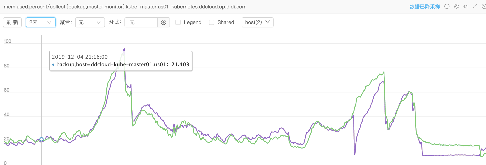
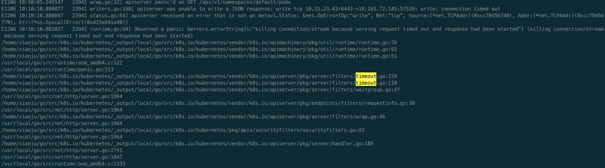

# Kube-apiserver goroutine leak


### 背景

线上master的apiserver组件内存报警，内存使用量持续增长，监控如下



### 排查过程

从监控上看和另外一个程序（管理员平台）的内存使用情况吻合，使用率降下来是因为重启了apiserver和管理员平台，且问题只出现在最近两天的晚上，管理员平台中有一段逻辑是定时全量拉取集群数据（设计不合理，后续需要改），管理员平台的日志里显示拉取数据超时，基本猜测和管理员平台调用k8s api不合理有关，且k8s apiserver应该也有bug，导致**内存泄露或者goroutine泄露**。但是最近代码都没动过，为啥之前没事呢，后负责管理员平台的同事说近两天美东专线有问题，延迟是之前的3倍，而且出现问题的时间正好匹配，那接下来就查一下具体原因。

#### 查看apiserver日志



apiserver错误日志里有大量的上述日志，可以看到是apiserver因为响应超时触发的，里面也有详细的函数调用堆栈信息，也有ip的信息，正好对应了master和管理员平台的地址，通过pprof也可以看到此时的goroutine使用量一直在增加，已45000+，确认是产生了goroutine泄露。下图为pprof tree看到的部分内容，里面显示了占用量最多的地方


同时在浏览器中访问http://ip:port/debug/pprof/goroutine 可以看到具体goroutine数量和执行函数的行号，此处忘记截图了，不过和上面的信息吻合，且更信息因为携带了行号的信息，可以看到是如下代码出的问题（代码版本1.12.4）

```go
// k8s.io/kubernetes/vendor/k8s.io/apiserver/pkg/server/filters/timeout.go
func (t *timeoutHandler) ServeHTTP(w http.ResponseWriter, r *http.Request) {
	r, after, postTimeoutFn, err := t.timeout(r)
	if after == nil {
		t.handler.ServeHTTP(w, r)
		return
	}

	errCh := make(chan interface{})
	tw := newTimeoutWriter(w)
	go func() {
		defer func() {
			err := recover()
			if err != nil {
				const size = 64 << 10
				buf := make([]byte, size)
				buf = buf[:runtime.Stack(buf, false)]
				err = fmt.Sprintf("%v\n%s", err, buf)
			}
			errCh <- err
		}()
		t.handler.ServeHTTP(tw, r)
	}()
	select {
	case err := <-errCh:
		if err != nil {
			panic(err)
		}
		return
	case <-after:
		postTimeoutFn()
		tw.timeout(err)
	}
}
```

泄露的goroutine就是第11行处的，简单解释一下上面的逻辑：生成一个timeout的handler，起一个新的goroutine进行后续handler的处理，当前goroutine中使用select进行等待，分为两种case，分别对应新goroutine中panic的情况和整个函数超时的情况，分别看两个case的内容

第25行：从errCh读取数据，其中errCh中的数据是在新的goroutine中产生的，对应到实际情况就是22行的代码出发生了panic，在13行捕获到了，最后在20行把err写入到errCh中，但是这里需要注意一下这个errCh是个无缓存的；

第30行：after是调用time.After后产生的一个chan，在超时后可以从这个chan中获取到数据，然后再32行处会调用tw.timeout函数，里面会触发panic；

#### 那为什么11行出的goroutine泄露了呢？

问题就出现在了刚才提到的无缓冲的errCh上，因为触发了timeout，代码逻辑没有执行到25行，直接去了30行，然后整个函数panic，导致20行执行的时候卡住了，从而阻止了11行出的新的goroutine的退出，每有一个timeout的请求，这里就会泄露一个goroutine，从而导致内存随之泄露，cpu的话其实不受什么影响，因为泄露的goroutine已经执行过gopark，不是runnable状态的。

### 解决方案

印象中记得之前看k8s版本升级的release-note时有提到过修复apiserver leak字样的信息，然后就去官方项目中查，结果没找到，然后直接去看了对应文件的[最新版本代码](https://github.com/kubernetes/kubernetes/blob/master/staging/src/k8s.io/apiserver/pkg/server/filters/timeout.go)，看history，终于找到了相关的修复的[commit](https://github.com/kubernetes/kubernetes/commit/a4ae7b9081f3ddedd0d588688215ddbe26274f75#diff-4271e9acdab54fd07404a569fdd5011f)

```go
case <-after:
		defer func() {
			// resultCh needs to have a reader, since the function doing
			// the work needs to send to it. This is defer'd to ensure it runs
			// ever if the post timeout work itself panics.
			go func() {
				res := <-resultCh
				if res != nil {
					switch t := res.(type) {
					case error:
						utilruntime.HandleError(t)
					default:
						utilruntime.HandleError(fmt.Errorf("%v", res))
					}
				}
			}()
		}()

		postTimeoutFn()			postTimeoutFn()
		tw.timeout(err)			tw.timeout(err)
```

可以看到其思想就是在外层panic后，新加一个defer func用来从之前的errCh（新版改名为resultCh）接收数据，从而避免之前的问题。

### 总结

通过假如上线的逻辑，确实可以解决goroutine泄露的问题，但是也存在一个隐患：第6行新加的goroutine会从resultCh读数据，因为在上一段代码处有个处理，无论是否panic，都会往errCh（resultCh）写入err，从而可以避免同时泄露两个goroutine的情况，但是如果短时间内大量请求到来且处理时间都比较慢直至超时，虽然goroutine不会泄露，但是会产生两倍于之前的goroutine，可能会在短时间内造成内存暴涨，也算是一个稳定性风险吧，感兴趣的话可以思考一下此处如何更优雅的进行处理吧

