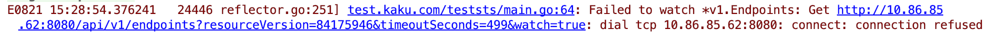

# Kube-apiserver重启导致产生全量的update event


### 现象

k8s master进行线上升级，notifier利用client-go提供的informer机制注册了EndPoint的Update Handler，当kube-apiserver重启时触发了大量的update事件，触发依赖的第三方服务限流。

### 原因排查

在测试环境进行了测试，并且在注册update事件处理函数中调用 reflect.DeepEqual(old, new) 进行了比较，发现返回true，即old与new完全相同却产生了update事件。


接下来就是到事件产生的地方去寻找原因，主要有两个地方，一个是reflect的ListAndWatch，相当于元数据的生产者，另一个是sharedIndexedInformer的HandleDeltas，消费元数据并生成对应类型的事件分发下去，接下来分别看

#### HandleDeltas （事件来源）

```
func (s *sharedIndexInformer) HandleDeltas(obj interface{}) error {
   s.blockDeltas.Lock()
   defer s.blockDeltas.Unlock()
 
   // from oldest to newest
   for _, d := range obj.(Deltas) {
      switch d.Type {
      case Sync, Added, Updated:
         isSync := d.Type == Sync
         s.cacheMutationDetector.AddObject(d.Object)
                // 重点关注
         if old, exists, err := s.indexer.Get(d.Object); err == nil && exists {
            if err := s.indexer.Update(d.Object); err != nil {
               return err
            }
            s.processor.distribute(updateNotification{oldObj: old, newObj: d.Object}, isSync)
         } else {
            if err := s.indexer.Add(d.Object); err != nil {
               return err
            }
            s.processor.distribute(addNotification{newObj: d.Object}, isSync)
         }
      case Deleted:
         if err := s.indexer.Delete(d.Object); err != nil {
            return err
         }
         s.processor.distribute(deleteNotification{oldObj: d.Object}, false)
      }
   }
   return nil
}
```

很容易看出来，当delta类型为非Delete时，informer会从自己的indexer（带索引的缓存）中获取指定的object是否存在（注意这里其实是从object计算出key，然后用key寻找到的），如果存在则更新缓存且分发一个update事件。可以继续看后续对分发的这个notification的处理，都是直接处理，没有任何去重逻辑。到这里就可以理解为啥会收到全量的update事件了，正式因为此时缓存里已经有了对应数据，而在分发事件时并没有比较缓存中的object是否和新来的object一致就直接当成update处理了，导致客户端收到全量的更新事件。那问题又来了，为什么重启apiserver时会往deltafifo里全量扔一遍数据，正常不应该是从最后的resourceVersion开始重新watch吗？继续看下面的处理

#### ListAndWatch （全量数据的来源）

```
// 代码位置 k8s.io/client-go/tools/cache/reflector.go
 
 
// ListAndWatch first lists all items and get the resource version at the moment of call,
// and then use the resource version to watch.
// It returns error if ListAndWatch didn't even try to initialize watch.
func (r *Reflector) ListAndWatch(stopCh <-chan struct{}) error {
   klog.V(3).Infof("Listing and watching %v from %s", r.expectedType, r.name)
   var resourceVersion string
 
   // Explicitly set "0" as resource version - it's fine for the List()
   // to be served from cache and potentially be delayed relative to
   // etcd contents. Reflector framework will catch up via Watch() eventually.
   options := metav1.ListOptions{ResourceVersion: "0"}
 
   if err := func() error {
      initTrace := trace.New("Reflector ListAndWatch", trace.Field{"name", r.name})
      defer initTrace.LogIfLong(10 * time.Second)
      var list runtime.Object
      var err error
      listCh := make(chan struct{}, 1)
      panicCh := make(chan interface{}, 1)
      go func() {
         defer func() {
            if r := recover(); r != nil {
               panicCh <- r
            }
         }()
         // Attempt to gather list in chunks, if supported by listerWatcher, if not, the first
         // list request will return the full response.
         pager := pager.New(pager.SimplePageFunc(func(opts metav1.ListOptions) (runtime.Object, error) {
            return r.listerWatcher.List(opts)
         }))
         if r.WatchListPageSize != 0 {
            pager.PageSize = r.WatchListPageSize
         }
         // Pager falls back to full list if paginated list calls fail due to an "Expired" error.
         list, err = pager.List(context.Background(), options)
         close(listCh)
      }()
      select {
      case <-stopCh:
         return nil
      case r := <-panicCh:
         panic(r)
      case <-listCh:
      }
      if err != nil {
         return fmt.Errorf("%s: Failed to list %v: %v", r.name, r.expectedType, err)
      }
      initTrace.Step("Objects listed")
      listMetaInterface, err := meta.ListAccessor(list)
      if err != nil {
         return fmt.Errorf("%s: Unable to understand list result %#v: %v", r.name, list, err)
      }
      resourceVersion = listMetaInterface.GetResourceVersion()
      initTrace.Step("Resource version extracted")
      items, err := meta.ExtractList(list)
      if err != nil {
         return fmt.Errorf("%s: Unable to understand list result %#v (%v)", r.name, list, err)
      }
      initTrace.Step("Objects extracted")
      if err := r.syncWith(items, resourceVersion); err != nil {
         return fmt.Errorf("%s: Unable to sync list result: %v", r.name, err)
      }
      initTrace.Step("SyncWith done")
      r.setLastSyncResourceVersion(resourceVersion)
      initTrace.Step("Resource version updated")
      return nil
   }(); err != nil {
      return err
   }
 
   resyncerrc := make(chan error, 1)
   cancelCh := make(chan struct{})
   defer close(cancelCh)
   go func() {
      resyncCh, cleanup := r.resyncChan()
      defer func() {
         cleanup() // Call the last one written into cleanup
      }()
      for {
         select {
         case <-resyncCh:
         case <-stopCh:
            return
         case <-cancelCh:
            return
         }
         if r.ShouldResync == nil || r.ShouldResync() {
            klog.V(4).Infof("%s: forcing resync", r.name)
            if err := r.store.Resync(); err != nil {
               resyncerrc <- err
               return
            }
         }
         cleanup()
         resyncCh, cleanup = r.resyncChan()
      }
   }()
 
   for {
      // give the stopCh a chance to stop the loop, even in case of continue statements further down on errors
      select {
      case <-stopCh:
         return nil
      default:
      }
 
      timeoutSeconds := int64(minWatchTimeout.Seconds() * (rand.Float64() + 1.0))
      options = metav1.ListOptions{
         ResourceVersion: resourceVersion,
         // We want to avoid situations of hanging watchers. Stop any wachers that do not
         // receive any events within the timeout window.
         TimeoutSeconds: &timeoutSeconds,
         // To reduce load on kube-apiserver on watch restarts, you may enable watch bookmarks.
         // Reflector doesn't assume bookmarks are returned at all (if the server do not support
         // watch bookmarks, it will ignore this field).
         AllowWatchBookmarks: true,
      }
 
      w, err := r.listerWatcher.Watch(options)
      if err != nil {
         switch err {
         case io.EOF:
            // watch closed normally
         case io.ErrUnexpectedEOF:
            klog.V(1).Infof("%s: Watch for %v closed with unexpected EOF: %v", r.name, r.expectedType, err)
         default:
                       // 这里报出来的错误
            utilruntime.HandleError(fmt.Errorf("%s: Failed to watch %v: %v", r.name, r.expectedType, err))
         }
         // If this is "connection refused" error, it means that most likely apiserver is not responsive.
         // It doesn't make sense to re-list all objects because most likely we will be able to restart
         // watch where we ended.
         // If that's the case wait and resend watch request.
         if urlError, ok := err.(*url.Error); ok {
            if opError, ok := urlError.Err.(*net.OpError); ok {
               if errno, ok := opError.Err.(syscall.Errno); ok && errno == syscall.ECONNREFUSED {
                  time.Sleep(time.Second)
                  continue
               }
            }
         }
         return nil
      }
 
      if err := r.watchHandler(w, &resourceVersion, resyncerrc, stopCh); err != nil {
         if err != errorStopRequested {
            switch {
            case apierrs.IsResourceExpired(err):
               klog.V(4).Infof("%s: watch of %v ended with: %v", r.name, r.expectedType, err)
            default:
               klog.Warningf("%s: watch of %v ended with: %v", r.name, r.expectedType, err)
            }
         }
         return nil
      }
   }
}
```

其中有一段注释写的很明白，如果是"connection refused" error, 意味着很可能是apiserver无响应了，这个时候需要做的是等一段时间然后从结束的resourceVersion开始重新watch而不是重新执行relist。看注释的话其实是没有问题的，符合正常逻辑，即断开了之后重新watch而不用同步全量数据，但为什么还会收到全量的upade事件呢，原因就在下面的判断逻辑，先看下重启apiserver时客户端报的错，如下



这里不太容易看出来有什么问题，猛一看肯定觉得没问题，确实是connection refused error啊，其实不是的。实际返回的错误是

&url.Error{Err: &net.OpError{Err: &os.SyscallError{Err: &syscall.ECONNREFUSED}}}

而上面代码判断的是如下的error

&url.Error{Err: &net.OpError{Err: &syscall.ECONNREFUSED}}


正因为判断失效，没有执行到continue而是直接return nil，这就会导致整个函数退出，然后外层有一个循环开始重新调用ListAndWatch，然后开始list，开始watch，全量数据就是这么来的。正常我们是期望直接执行到continue，然后重新watch的，就不会有全量同步的问题了。

### 总结

至此，已经清楚了具体的原因，ListAndWatch的修改很简单，已经给官方提了[pull request](https://github.com/kubernetes/kubernetes/pull/81634)修复这个问题。
