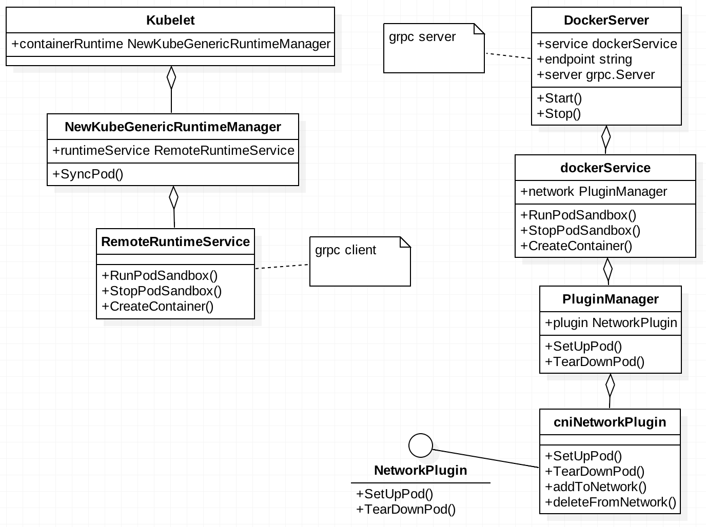

# Kubelet与CNI交互源码


> 转载自：https://www.cnblogs.com/haoqingchuan/p/8668746.html，有修改 代码版本1.12.4

# 整体介绍

kubelet通过调用 grpc 接口调用实现了 CRI 的 dockershim 完成 rpc 通信，CNI 是由 dockershim grpc server 中调用的

kubelet -> CRI shim -> container runtime -> container

POD 创建过程中从 kubelet 到 docker server 到 cni 的 UML 结构如下


# CNI 插件初始化

kubelet 在初始化的时候如果使用containerRuntime为Docker，则会起动dockershim rpc server

```go
case kubetypes.DockerContainerRuntime:
		// Create and start the CRI shim running as a grpc server.
		streamingConfig := getStreamingConfig(kubeCfg, kubeDeps, crOptions)
    // 主要函数
		ds, err := dockershim.NewDockerService(kubeDeps.DockerClientConfig, crOptions.PodSandboxImage, streamingConfig,
			&pluginSettings, runtimeCgroups, kubeCfg.CgroupDriver, crOptions.DockershimRootDirectory, !crOptions.RedirectContainerStreaming)
		if err != nil {
			return nil, err
		}
		if crOptions.RedirectContainerStreaming {
			klet.criHandler = ds
		}

		// The unix socket for kubelet <-> dockershim communication.
		glog.V(5).Infof("RemoteRuntimeEndpoint: %q, RemoteImageEndpoint: %q",
			remoteRuntimeEndpoint,
			remoteImageEndpoint)
		glog.V(2).Infof("Starting the GRPC server for the docker CRI shim.")
		server := dockerremote.NewDockerServer(remoteRuntimeEndpoint, ds)
		if err := server.Start(); err != nil {
			return nil, err
		}

		// Create dockerLegacyService when the logging driver is not supported.
		supported, err := ds.IsCRISupportedLogDriver()
		if err != nil {
			return nil, err
		}
		if !supported {
			klet.dockerLegacyService = ds
			legacyLogProvider = ds
		}
```

创建 dockerservice 对象时初始化cniplugin

```go
// rpc server端
func NewDockerService(config *ClientConfig, podSandboxImage string, streamingConfig *streaming.Config, pluginSettings *NetworkPluginSettings,
	cgroupsName string, kubeCgroupDriver string, dockershimRootDir string, startLocalStreamingServer bool) (DockerService, error) {
  ...
	// 解析kubelet配置的pluginbindir
	pluginSettings.PluginBinDirs = cni.SplitDirs(pluginSettings.PluginBinDirString)
	cniPlugins := cni.ProbeNetworkPlugins(pluginSettings.PluginConfDir, 		     pluginSettings.PluginBinDirs)
	cniPlugins = append(cniPlugins, kubenet.NewPlugin(pluginSettings.PluginBinDirs))
	netHost := &dockerNetworkHost{
		&namespaceGetter{ds},
		&portMappingGetter{ds},
	}
	plug, err := network.InitNetworkPlugin(cniPlugins, pluginSettings.PluginName, netHost, pluginSettings.HairpinMode, pluginSettings.NonMasqueradeCIDR, pluginSettings.MTU)
	if err != nil {
		return nil, fmt.Errorf("didn't find compatible CNI plugin with given settings %+v: 	%v", pluginSettings, err)
	}
	ds.network = network.NewPluginManager(plug)
	glog.Infof("Docker cri networking managed by %v", plug.Name())
...
}

// 根据指定confdir 和 bindir获取networkplugin
func ProbeNetworkPlugins(confDir string, binDirs []string) []network.NetworkPlugin {
	old := binDirs
	binDirs = make([]string, 0, len(binDirs))
	for _, dir := range old {
		if dir != "" {
			binDirs = append(binDirs, dir)
		}
	}

	plugin := &cniNetworkPlugin{
		defaultNetwork: nil,
		loNetwork:      getLoNetwork(binDirs),
		execer:         utilexec.New(),
		confDir:        confDir,
		binDirs:        binDirs,
	}

	// sync NetworkConfig in best effort during probing.
	plugin.syncNetworkConfig()
	return []network.NetworkPlugin{plugin}
}
```

初始化cniplugin，会根据pluginDir**查找符合条件的第一个 CNI config 文件**，并以此 config 文件查找到对应的 CNI bin

```go
// InitNetworkPlugin inits the plugin that matches networkPluginName. Plugins must have unique names.
func InitNetworkPlugin(plugins []NetworkPlugin, networkPluginName string, host Host, hairpinMode kubeletconfig.HairpinMode, nonMasqueradeCIDR string, mtu int) (NetworkPlugin, error) {
	if networkPluginName == "" {
		// default to the no_op plugin
		plug := &NoopNetworkPlugin{}
		plug.Sysctl = utilsysctl.New()
		if err := plug.Init(host, hairpinMode, nonMasqueradeCIDR, mtu); err != nil {
			return nil, err
		}
		return plug, nil
	}

	pluginMap := map[string]NetworkPlugin{}

	allErrs := []error{}
	for _, plugin := range plugins {
		name := plugin.Name()
		if errs := validation.IsQualifiedName(name); len(errs) != 0 {
			allErrs = append(allErrs, fmt.Errorf("network plugin has invalid name: %q: %s", name, strings.Join(errs, ";")))
			continue
		}

		if _, found := pluginMap[name]; found {
			allErrs = append(allErrs, fmt.Errorf("network plugin %q was registered more than once", name))
			continue
		}
		pluginMap[name] = plugin
	}

	chosenPlugin := pluginMap[networkPluginName]
	if chosenPlugin != nil {
		err := chosenPlugin.Init(host, hairpinMode, nonMasqueradeCIDR, mtu)
		if err != nil {
			allErrs = append(allErrs, fmt.Errorf("Network plugin %q failed init: %v", networkPluginName, err))
		} else {
			glog.V(1).Infof("Loaded network plugin %q", networkPluginName)
		}
	} else {
		allErrs = append(allErrs, fmt.Errorf("Network plugin %q not found.", networkPluginName))
	}

	return chosenPlugin, utilerrors.NewAggregate(allErrs)
}

func (plugin *cniNetworkPlugin) Init(host network.Host, hairpinMode kubeletconfig.HairpinMode, nonMasqueradeCIDR string, mtu int) error {
	err := plugin.platformInit()
	if err != nil {
		return err
	}

	plugin.host = host

	plugin.syncNetworkConfig()
	return nil
}

func (plugin *cniNetworkPlugin) syncNetworkConfig() {
	network, err := getDefaultCNINetwork(plugin.confDir, plugin.binDirs)
	if err != nil {
		glog.Warningf("Unable to update cni config: %s", err)
		return
	}
	plugin.setDefaultNetwork(network)
}
```

```go
// plugin目录中找到符合.conf，.conflist，.json为后缀的文件，用文件名来排序，并从文件
// 名列表中找到符合cni 配置规则的plugin配置文件并返回，找到一个立即返回
func getDefaultCNINetwork(confDir string, binDirs []string) (*cniNetwork, error) {
	files, err := libcni.ConfFiles(confDir, []string{".conf", ".conflist", ".json"})
	switch {
	case err != nil:
		return nil, err
	case len(files) == 0:
		return nil, fmt.Errorf("No networks found in %s", confDir)
	}

	sort.Strings(files)
	for _, confFile := range files {
		var confList *libcni.NetworkConfigList
		if strings.HasSuffix(confFile, ".conflist") {
			confList, err = libcni.ConfListFromFile(confFile)
			if err != nil {
				glog.Warningf("Error loading CNI config list file %s: %v", confFile, err)
				continue
			}
		} else {
			conf, err := libcni.ConfFromFile(confFile)
			if err != nil {
				glog.Warningf("Error loading CNI config file %s: %v", confFile, err)
				continue
			}
			// Ensure the config has a "type" so we know what plugin to run.
			// Also catches the case where somebody put a conflist into a conf file.
			if conf.Network.Type == "" {
				glog.Warningf("Error loading CNI config file %s: no 'type'; perhaps this is a .conflist?", confFile)
				continue
			}

			confList, err = libcni.ConfListFromConf(conf)
			if err != nil {
				glog.Warningf("Error converting CNI config file %s to list: %v", confFile, err)
				continue
			}
		}
		if len(confList.Plugins) == 0 {
			glog.Warningf("CNI config list %s has no networks, skipping", confFile)
			continue
		}

		glog.V(4).Infof("Using CNI configuration file %s", confFile)

		network := &cniNetwork{
			name:          confList.Name,
			NetworkConfig: confList,
			CNIConfig:     &libcni.CNIConfig{Path: binDirs},
		}
		return network, nil
	}
	return nil, fmt.Errorf("No valid networks found in %s", confDir)
}
```

# POD 来源

在分析 POD 创建的流程之前，我们先看下 kubelet 是怎么获取 POD 资源。 总结下来有三种 POD 来源：

- 最常见的是 kubelet list & watch apiserver 获取 POD 资源的更新
- 静态目录下 static POD
- kubelet 提供的 http 服务
  后面两者都是 static POD， kubelet 为了能够在 apiserver 也能管理 static POD，在 apiserver 创建了 mirror POD。

```go
// makePodSourceConfig 为kubelet 提供 pod update 事件来源，目前支持三种，监听url，
// 监听目录，watch apiserver，每种来源都有对应的channel
func makePodSourceConfig(kubeCfg *kubeletconfiginternal.KubeletConfiguration, kubeDeps *Dependencies, nodeName types.NodeName, bootstrapCheckpointPath string) (*config.PodConfig, error) {
	manifestURLHeader := make(http.Header)
	if len(kubeCfg.StaticPodURLHeader) > 0 {
		for k, v := range kubeCfg.StaticPodURLHeader {
			for i := range v {
				manifestURLHeader.Add(k, v[i])
			}
		}
	}

	// source of all configuration
	cfg := config.NewPodConfig(config.PodConfigNotificationIncremental, kubeDeps.Recorder)

	// define file config source
	if kubeCfg.StaticPodPath != "" {
		glog.Infof("Adding pod path: %v", kubeCfg.StaticPodPath)
		config.NewSourceFile(kubeCfg.StaticPodPath, nodeName, kubeCfg.FileCheckFrequency.Duration, cfg.Channel(kubetypes.FileSource))
	}

	// define url config source
	if kubeCfg.StaticPodURL != "" {
		glog.Infof("Adding pod url %q with HTTP header %v", kubeCfg.StaticPodURL, manifestURLHeader)
		config.NewSourceURL(kubeCfg.StaticPodURL, manifestURLHeader, nodeName, kubeCfg.HTTPCheckFrequency.Duration, cfg.Channel(kubetypes.HTTPSource))
	}

	// Restore from the checkpoint path
	// NOTE: This MUST happen before creating the apiserver source
	// below, or the checkpoint would override the source of truth.

	var updatechannel chan<- interface{}
	if bootstrapCheckpointPath != "" {
		glog.Infof("Adding checkpoint path: %v", bootstrapCheckpointPath)
		updatechannel = cfg.Channel(kubetypes.ApiserverSource)
		err := cfg.Restore(bootstrapCheckpointPath, updatechannel)
		if err != nil {
			return nil, err
		}
	}

	if kubeDeps.KubeClient != nil {
		glog.Infof("Watching apiserver")
		if updatechannel == nil {
			updatechannel = cfg.Channel(kubetypes.ApiserverSource)
		}
		config.NewSourceApiserver(kubeDeps.KubeClient, nodeName, updatechannel)
	}
	return cfg, nil
}
```

之后每个pod来源的更新都会发送事件到podcfg的update channel

```go
// syncLoop is the main loop for processing changes. It watches for changes from
// three channels (file, apiserver, and http) and creates a union of them. For
// any new change seen, will run a sync against desired state and running state. If
// no changes are seen to the configuration, will synchronize the last known desired
// state every sync-frequency seconds. Never returns.
func (kl *Kubelet) syncLoop(updates <-chan kubetypes.PodUpdate, handler SyncHandler) {
	glog.Info("Starting kubelet main sync loop.")
	// The resyncTicker wakes up kubelet to checks if there are any pod workers
	// that need to be sync'd. A one-second period is sufficient because the
	// sync interval is defaulted to 10s.
	syncTicker := time.NewTicker(time.Second)
	defer syncTicker.Stop()
	housekeepingTicker := time.NewTicker(housekeepingPeriod)
	defer housekeepingTicker.Stop()
	plegCh := kl.pleg.Watch()
	const (
		base   = 100 * time.Millisecond
		max    = 5 * time.Second
		factor = 2
	)
	duration := base
	for {
		if rs := kl.runtimeState.runtimeErrors(); len(rs) != 0 {
			glog.Infof("skipping pod synchronization - %v", rs)
			// exponential backoff
			time.Sleep(duration)
			duration = time.Duration(math.Min(float64(max), factor*float64(duration)))
			continue
		}
		// reset backoff if we have a success
		duration = base

		kl.syncLoopMonitor.Store(kl.clock.Now())
		if !kl.syncLoopIteration(updates, handler, syncTicker.C, housekeepingTicker.C, plegCh) {
			break
		}
		kl.syncLoopMonitor.Store(kl.clock.Now())
	}
}
```

# POD 创建

```go
// syncLoopIteration reads from various channels and dispatches pods to the
// given handler.
//
// Arguments:
// 1.  configCh:       a channel to read config events from
// 2.  handler:        the SyncHandler to dispatch pods to
// 3.  syncCh:         a channel to read periodic sync events from
// 4.  houseKeepingCh: a channel to read housekeeping events from
// 5.  plegCh:         a channel to read PLEG updates from
//
// Events are also read from the kubelet liveness manager's update channel.
//
// The workflow is to read from one of the channels, handle that event, and
// update the timestamp in the sync loop monitor.
//
// Here is an appropriate place to note that despite the syntactical
// similarity to the switch statement, the case statements in a select are
// evaluated in a pseudorandom order if there are multiple channels ready to
// read from when the select is evaluated.  In other words, case statements
// are evaluated in random order, and you can not assume that the case
// statements evaluate in order if multiple channels have events.
//
// With that in mind, in truly no particular order, the different channels
// are handled as follows:
//
// * configCh: dispatch the pods for the config change to the appropriate
//             handler callback for the event type
// * plegCh: update the runtime cache; sync pod
// * syncCh: sync all pods waiting for sync
// * houseKeepingCh: trigger cleanup of pods
// * liveness manager: sync pods that have failed or in which one or more
//                     containers have failed liveness checks
func (kl *Kubelet) syncLoopIteration(configCh <-chan kubetypes.PodUpdate, handler SyncHandler,
	syncCh <-chan time.Time, housekeepingCh <-chan time.Time, plegCh <-chan *pleg.PodLifecycleEvent) bool {
	select {
	case u, open := <-configCh:
		// Update from a config source; dispatch it to the right handler
		// callback.
		if !open {
			glog.Errorf("Update channel is closed. Exiting the sync loop.")
			return false
		}

		switch u.Op {
		case kubetypes.ADD:
			glog.V(2).Infof("SyncLoop (ADD, %q): %q", u.Source, format.Pods(u.Pods))
			// After restarting, kubelet will get all existing pods through
			// ADD as if they are new pods. These pods will then go through the
			// admission process and *may* be rejected. This can be resolved
			// once we have checkpointing.
			handler.HandlePodAdditions(u.Pods)
		case kubetypes.UPDATE:
			glog.V(2).Infof("SyncLoop (UPDATE, %q): %q", u.Source, format.PodsWithDeletionTimestamps(u.Pods))
			handler.HandlePodUpdates(u.Pods)
		case kubetypes.REMOVE:
			glog.V(2).Infof("SyncLoop (REMOVE, %q): %q", u.Source, format.Pods(u.Pods))
			handler.HandlePodRemoves(u.Pods)
		case kubetypes.RECONCILE:
			glog.V(4).Infof("SyncLoop (RECONCILE, %q): %q", u.Source, format.Pods(u.Pods))
			handler.HandlePodReconcile(u.Pods)
		case kubetypes.DELETE:
			glog.V(2).Infof("SyncLoop (DELETE, %q): %q", u.Source, format.Pods(u.Pods))
			// DELETE is treated as a UPDATE because of graceful deletion.
			handler.HandlePodUpdates(u.Pods)
		case kubetypes.RESTORE:
			glog.V(2).Infof("SyncLoop (RESTORE, %q): %q", u.Source, format.Pods(u.Pods))
			// These are pods restored from the checkpoint. Treat them as new
			// pods.
			handler.HandlePodAdditions(u.Pods)
		case kubetypes.SET:
			// TODO: Do we want to support this?
			glog.Errorf("Kubelet does not support snapshot update")
		}

		if u.Op != kubetypes.RESTORE {
			// If the update type is RESTORE, it means that the update is from
			// the pod checkpoints and may be incomplete. Do not mark the
			// source as ready.

			// Mark the source ready after receiving at least one update from the
			// source. Once all the sources are marked ready, various cleanup
			// routines will start reclaiming resources. It is important that this
			// takes place only after kubelet calls the update handler to process
			// the update to ensure the internal pod cache is up-to-date.
			kl.sourcesReady.AddSource(u.Source)
		}
	case e := <-plegCh:
		if isSyncPodWorthy(e) {
			// PLEG event for a pod; sync it.
			if pod, ok := kl.podManager.GetPodByUID(e.ID); ok {
				glog.V(2).Infof("SyncLoop (PLEG): %q, event: %#v", format.Pod(pod), e)
				handler.HandlePodSyncs([]*v1.Pod{pod})
			} else {
				// If the pod no longer exists, ignore the event.
				glog.V(4).Infof("SyncLoop (PLEG): ignore irrelevant event: %#v", e)
			}
		}

		if e.Type == pleg.ContainerDied {
			if containerID, ok := e.Data.(string); ok {
				kl.cleanUpContainersInPod(e.ID, containerID)
			}
		}
	case <-syncCh:
		// Sync pods waiting for sync
		podsToSync := kl.getPodsToSync()
		if len(podsToSync) == 0 {
			break
		}
		glog.V(4).Infof("SyncLoop (SYNC): %d pods; %s", len(podsToSync), format.Pods(podsToSync))
		handler.HandlePodSyncs(podsToSync)
	case update := <-kl.livenessManager.Updates():
		if update.Result == proberesults.Failure {
			// The liveness manager detected a failure; sync the pod.

			// We should not use the pod from livenessManager, because it is never updated after
			// initialization.
			pod, ok := kl.podManager.GetPodByUID(update.PodUID)
			if !ok {
				// If the pod no longer exists, ignore the update.
				glog.V(4).Infof("SyncLoop (container unhealthy): ignore irrelevant update: %#v", update)
				break
			}
			glog.V(1).Infof("SyncLoop (container unhealthy): %q", format.Pod(pod))
			handler.HandlePodSyncs([]*v1.Pod{pod})
		}
	case <-housekeepingCh:
		if !kl.sourcesReady.AllReady() {
			// If the sources aren't ready or volume manager has not yet synced the states,
			// skip housekeeping, as we may accidentally delete pods from unready sources.
			glog.V(4).Infof("SyncLoop (housekeeping, skipped): sources aren't ready yet.")
		} else {
			glog.V(4).Infof("SyncLoop (housekeeping)")
			if err := handler.HandlePodCleanups(); err != nil {
				glog.Errorf("Failed cleaning pods: %v", err)
			}
		}
	}
	return true
}
```

pod_works用于为pod update分配goroutine执行具体任务。
`result := kl.containerRuntime.SyncPod(pod, apiPodStatus, podStatus, pullSecrets, kl.backOff)`
syncPod时会调用createPodSandbox 来创建pause container（infrastructure container），pause pod 创建后所有的业务容器共享该pause 容器的网络。
在创建 pause 容器时调用如下方法配置网络，
err = ds.network.SetUpPod(config.GetMetadata().Namespace, config.GetMetadata().Name, cID, config.Annotations)

```go
// 为了能够保证业务pod在异常退出时仍然能够保存网络信息，因此创建pause (infra)容器来共享网络配置
// pause container也叫做 infrastructure-container， 
// RunPodSandbox creates and starts a pod-level sandbox. Runtimes should ensure
// the sandbox is in ready state.
// For docker, PodSandbox is implemented by a container holding the network
// namespace for the pod.
// Note: docker doesn't use LogDirectory (yet).
func (ds *dockerService) RunPodSandbox(ctx context.Context, r *runtimeapi.RunPodSandboxRequest) (*runtimeapi.RunPodSandboxResponse, error) {
	config := r.GetConfig()

	// Step 1: Pull the image for the sandbox.
	image := defaultSandboxImage
	podSandboxImage := ds.podSandboxImage
	if len(podSandboxImage) != 0 {
		image = podSandboxImage
	}

	// NOTE: To use a custom sandbox image in a private repository, users need to configure the nodes with credentials properly.
	// see: http://kubernetes.io/docs/user-guide/images/#configuring-nodes-to-authenticate-to-a-private-repository
	// Only pull sandbox image when it's not present - v1.PullIfNotPresent.
	if err := ensureSandboxImageExists(ds.client, image); err != nil {
		return nil, err
	}

	// Step 2: Create the sandbox container.
	if r.GetRuntimeHandler() != "" {
		return nil, fmt.Errorf("RuntimeHandler %q not supported", r.GetRuntimeHandler())
	}
	createConfig, err := ds.makeSandboxDockerConfig(config, image)
	if err != nil {
		return nil, fmt.Errorf("failed to make sandbox docker config for pod %q: %v", config.Metadata.Name, err)
	}
	createResp, err := ds.client.CreateContainer(*createConfig)
	if err != nil {
		createResp, err = recoverFromCreationConflictIfNeeded(ds.client, *createConfig, err)
	}

	if err != nil || createResp == nil {
		return nil, fmt.Errorf("failed to create a sandbox for pod %q: %v", config.Metadata.Name, err)
	}
	resp := &runtimeapi.RunPodSandboxResponse{PodSandboxId: createResp.ID}

	ds.setNetworkReady(createResp.ID, false)
	defer func(e *error) {
		// Set networking ready depending on the error return of
		// the parent function
		if *e == nil {
			ds.setNetworkReady(createResp.ID, true)
		}
	}(&err)

	// Step 3: Create Sandbox Checkpoint.
	if err = ds.checkpointManager.CreateCheckpoint(createResp.ID, constructPodSandboxCheckpoint(config)); err != nil {
		return nil, err
	}

	// Step 4: Start the sandbox container.
	// Assume kubelet's garbage collector would remove the sandbox later, if
	// startContainer failed.
	err = ds.client.StartContainer(createResp.ID)
	if err != nil {
		return nil, fmt.Errorf("failed to start sandbox container for pod %q: %v", config.Metadata.Name, err)
	}

	// Rewrite resolv.conf file generated by docker.
	// NOTE: cluster dns settings aren't passed anymore to docker api in all cases,
	// not only for pods with host network: the resolver conf will be overwritten
	// after sandbox creation to override docker's behaviour. This resolv.conf
	// file is shared by all containers of the same pod, and needs to be modified
	// only once per pod.
	if dnsConfig := config.GetDnsConfig(); dnsConfig != nil {
		containerInfo, err := ds.client.InspectContainer(createResp.ID)
		if err != nil {
			return nil, fmt.Errorf("failed to inspect sandbox container for pod %q: %v", config.Metadata.Name, err)
		}

		if err := rewriteResolvFile(containerInfo.ResolvConfPath, dnsConfig.Servers, dnsConfig.Searches, dnsConfig.Options); err != nil {
			return nil, fmt.Errorf("rewrite resolv.conf failed for pod %q: %v", config.Metadata.Name, err)
		}
	}

	// Do not invoke network plugins if in hostNetwork mode.
	if config.GetLinux().GetSecurityContext().GetNamespaceOptions().GetNetwork() == runtimeapi.NamespaceMode_NODE {
		return resp, nil
	}

	// Step 5: Setup networking for the sandbox.
	// All pod networking is setup by a CNI plugin discovered at startup time.
	// This plugin assigns the pod ip, sets up routes inside the sandbox,
	// creates interfaces etc. In theory, its jurisdiction ends with pod
	// sandbox networking, but it might insert iptables rules or open ports
	// on the host as well, to satisfy parts of the pod spec that aren't
	// recognized by the CNI standard yet.
	cID := kubecontainer.BuildContainerID(runtimeName, createResp.ID)
	err = ds.network.SetUpPod(config.GetMetadata().Namespace, config.GetMetadata().Name, cID, config.Annotations)
	if err != nil {
		errList := []error{fmt.Errorf("failed to set up sandbox container %q network for pod %q: %v", createResp.ID, config.Metadata.Name, err)}

		// Ensure network resources are cleaned up even if the plugin
		// succeeded but an error happened between that success and here.
		err = ds.network.TearDownPod(config.GetMetadata().Namespace, config.GetMetadata().Name, cID)
		if err != nil {
			errList = append(errList, fmt.Errorf("failed to clean up sandbox container %q network for pod %q: %v", createResp.ID, config.Metadata.Name, err))
		}

		err = ds.client.StopContainer(createResp.ID, defaultSandboxGracePeriod)
		if err != nil {
			errList = append(errList, fmt.Errorf("failed to stop sandbox container %q for pod %q: %v", createResp.ID, config.Metadata.Name, err))
		}

		return resp, utilerrors.NewAggregate(errList)
	}

	return resp, nil
}
```

SetUpPod -> addToNetwork，cniNet.AddNetworkList 根据 CNI 执行 CNI binary，并将 CNI config 文件内容作为 stdin ，将podName, podNamespace， podSandboxID 等以 env 的形式传递给 CNI binary

```go
func (plugin *cniNetworkPlugin) addToNetwork(network *cniNetwork, podName string, podNamespace string, podSandboxID kubecontainer.ContainerID, podNetnsPath string, annotations map[string]string) (cnitypes.Result, error) {
	rt, err := plugin.buildCNIRuntimeConf(podName, podNamespace, podSandboxID, podNetnsPath, annotations)
	if err != nil {
		glog.Errorf("Error adding network when building cni runtime conf: %v", err)
		return nil, err
	}

	netConf, cniNet := network.NetworkConfig, network.CNIConfig
	glog.V(4).Infof("About to add CNI network %v (type=%v)", netConf.Name, netConf.Plugins[0].Network.Type)
	res, err := cniNet.AddNetworkList(netConf, rt)
	if err != nil {
		glog.Errorf("Error adding network: %v", err)
		return nil, err
	}

	return res, nil
}
```


