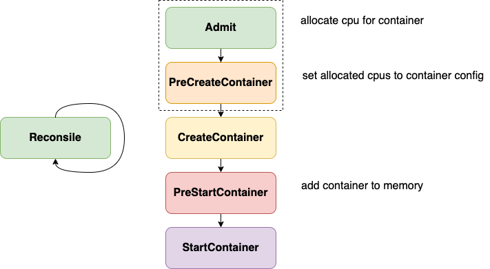

# 那些年，我们一起追的Bug

## 背景

上半年遇到了一些绑核相关的 bug，分析了其原因，但没有总结整理下来，现在又碰到了，补一下作业，同时也希望可以帮助大家快速从坑里爬出来。本篇会总结绑核相关的 bug，部分官网已修复，部分尚未修复，与 k8s 版本有关，感兴趣的可以对 k8s 进行一些考古，翻一翻从 1.8 到现在 CPU Manager 的发展过程，当然下面也会做简单介绍。

## 发展历程

CPU Manager 作为 alpha 特性引入 Kubernetes 1.8 版本，1.12 开始转换为 beta 状态。如何使用，参数配置不是这里的重点，可以参考[官网](https://kubernetes.io/docs/tasks/administer-cluster/cpu-management-policies/)。在此基础上还有 NUMA Topology Aware 的能力，可以参考[前篇](./kubernetes-topology-manager)。

## 问题表现

绑核的功能实现是在 kubelet 当中的，在容器启动之前会经过 admit 机制进行校验宿主上是否有足够资源供绑核使用。如果资源不足，则容器准入失败，会报错提示 cpu 资源不足，**not enough cpus available to satisfy request**。

**此问题存在于1.8之后的所有版本中，所以如果在线上遇到的话不要惊讶，一直在修复，从未被彻底修复，这可能也是为什么直到现在仍然处于 beta 状态的原因。针对此现象的所有的 PR 都只是对已知原因的修复，且当前仍存在原因已知但尚未修复的问题。**

## 解决方案

根据我的经验，遇到此类问题最直接有效的解决方案分三步，就如同把大象装冰箱一样简单：

1. 停止 Kubelet 进程
2. 删除本地 cpu_manager_state 文件
3. 重启 Kubelet 进程

可以解决99%的此类问题，如果还是无法解决且 k8s 版本 < 1.18，那就需要祭出更厉害的武功秘籍了：

1. docker ps 查找同 Pod 同 Conatiner Name（.spec.containers 中同一个 name 的 container）的记录，大概率会存在多条记录，例如存在 Created 状态的 container，这时需要删除这些个多余的 container
2. 按照上面的1，2，3再来一次即可

如果还是没有解决，那么恭喜你，你可能遇到未知原因的问题了，希望你可以深入排查并反馈给社区，帮助更多受害者。

## 原理介绍

上图是最新版本 k8s 中的实现，在不同 k8s 版本中实现方式不同，上图中的虚线框中的部分在低版本中是不存在的。在低版本中，计算绑核信息以及设置绑核信息到容器是在 Reconsile 和 PreStartContaier 中实现的，而现版本是在 Reconsile 和 Admit、PreCreateContainer 实现的，即在 Admit 时会计算出容器所需资源并保存在内存中，在真正调用 Docker 之前，从内存中获取到容器绑核信息并设置到其 Config 中，然后传递给 Docker，而老版本中是先创建出来容器，然后再调用 Docker API 去更新其绑核信息。

## 相关ISSUE & PR

### ISSUE

感兴趣的可以翻翻历史 ISSUE，此问题从 1.8 开始有大量相关的 ISSUE，下面列几个比较典型的

[Internal PreStartContainer hook failed: not enough cpus available to satisfy request #63018](https://github.com/kubernetes/kubernetes/issues/63018)

[[cpumanager] AddContainer error: not enough cpus available to satisfy request #79159](https://github.com/kubernetes/kubernetes/issues/79159)

[TopologyManager: Guarantee Aligned resources for Multiple Containers #83476](https://github.com/kubernetes/kubernetes/issues/83476)

[Container cpuset lost, apparently due to race between PostStopContainer() and new container creation #90303](https://github.com/kubernetes/kubernetes/issues/90303)

[The CPU manager does not work correctly for the guaranteed pod with multiple containers #103952](https://github.com/kubernetes/kubernetes/issues/103952)

### PR

[Make CPU manager release CPUs when Pod enters completed phase #52363](https://github.com/kubernetes/kubernetes/pull/52363)

[cpumanager: rollback state if updateContainerCPUSet failed #67430](https://github.com/kubernetes/kubernetes/pull/67430)

[clean containers in reconcileState of cpuManager #68619](https://github.com/kubernetes/kubernetes/pull/68619)

[Update CPUManager stored state semantics #84462](https://github.com/kubernetes/kubernetes/pull/84462)

[Fix exclusive CPU allocations being deleted at container restart #90377](https://github.com/kubernetes/kubernetes/pull/90377)

[Do not clear state of pods pending admission for CPU/Memory/Device manager #103979](https://github.com/kubernetes/kubernetes/pull/103979)

Slack 上有一段专门针对 CPU Manager 问题的讨论，可以加深对问题的理解，见[这里](https://kubernetes.slack.com/archives/C0BP8PW9G/p1587155932390500)。

其中针对1.22及以上版本绑核相关的 bug 和 kubelet 重构有关，参考[这里](https://github.com/kubernetes/kubernetes/issues/103952#issuecomment-888387811)。在 1.22 开始 kubelet 进行了很大的重构，参考 [Commit](https://github.com/kubernetes/kubernetes/commit/3eadd1a9ead7a009a9abfbd603a5efd0560473cc)，在此 PR 合入之后出现了一些相关的 Bug 以及 Failing Test 的错误，针对其想要实现的功能也存在一个[文档](https://docs.google.com/document/d/1Pic5TPntdJnYfIpBeZndDelM-AbS4FN9H2GTLFhoJ04/edit#)。这里不再多说，针对上述 Commit 和 设计文档会再另开一篇来介绍，因为其本质和 CPU Manager 无关，但是是非常重大的一个改变。

## 已知问题

### 1.18 之前的版本

需要根据具体使用的 k8s 版本确定有哪些修复的 PR 还没有合入。

即使所有 PR 都已经合入了，也还是可能遇到问题的。原因如下：当遇到机器异常，如 docker 异常、load 高、io 使用率高时问题出现概率会增加，根本原因就在于 1.18 之前的版本 cpu_manager_state 文件对应的数据结构为 `map[ContainerID]resource`，也就是说他是以 container ID 作为 Key 的，这也就是为什么会有上面解决方案中提到更厉害的的秘籍，因为同 Pod，同 Container Name 存在多个 Container，每个都有自己的 ID，但逻辑上应该只记录一个到 cpu_manager_state 中，但实际上记录了多个。

在 1.18 之后，cpu_manager_state 文件数据结构发生改变，变为`map[PODUID]map[ContainerName]resource`，就可以避免出现同 Pod 同 Container Name 的容器占用多份资源的问题。

### 所有版本

对于强制删除的Pod，如果在其删除过程中遇到某些原因导致 Container 无法删除导致其内存和 cpu_manager_state 中记录的信息与实际使用不符时，也可能会遇到此问题。这种问题理论上通过简单的3步解决方案即可解决。

## 总结

如果一定要使用绑核功能，请尽量使用 1.18 及以上版本，同时当前最新版 1.23 尚未正式 release，且 1.22 开始对 Kubulet 进行了部分重构，存在大量已知问题，建议采用 1.18 ~ 1.21 中的版本。如果还是遇到此问题，参考上述解决方案。

