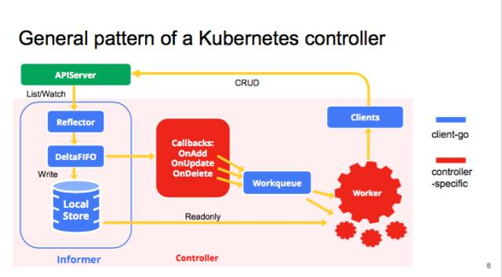

# Informer DeltaFIFO源码解析




DeltaFIFO位于Reflector和LocalStore之间，看名字知道是个先进先出的队列，作用就是缓存数据变化，直接看代码

```go
// 代码源自client-go/tools/cache/delta_fifo.go
type DeltaFIFO struct {
   // lock/cond protects access to 'items' and 'queue'.
   // 读写锁，性能要比Mutex好
   lock sync.RWMutex
   // 供pop函数使用，没有对象的时候可以阻塞
   cond sync.Cond
 
   // We depend on the property that items in the set are in
   // the queue and vice versa, and that all Deltas in this
   // map have at least one Delta.
   // 注意map值类型为Deltas，DeltaFIFO生产者和消费者是异步的，如果同一个目标的频繁操作，前面操作还缓存在队列中的时候，那么队列就要缓冲对象的所有操作
   // queue里存的是map的keys，用map实现高速查询，用slice保证有序
   items map[string]Deltas
   queue []string
 
   // 下面两个属性用来判断是否已完成同步，
   // populated is true if the first batch of items inserted by Replace() has been populated
   // or Delete/Add/Update was called first.
   populated bool
   // initialPopulationCount is the number of items inserted by the first call of Replace()
   initialPopulationCount int
 
   // keyFunc is used to make the key used for queued item
   // insertion and retrieval, and should be deterministic.
   keyFunc KeyFunc
 
   // knownObjects list keys that are "known", for the
   // purpose of figuring out which items have been deleted
   // when Replace() or Delete() is called.
   // 这里其实就是Indexer
   knownObjects KeyListerGetter
 
   // Indication the queue is closed.
   // Used to indicate a queue is closed so a control loop can exit when a queue is empty.
   // Currently, not used to gate any of CRED operations.
   closed     bool
   closedLock sync.Mutex
}
  
// 代码源自client-go/tools/cache/delta_fifo.go
type Delta struct {
    Type   DeltaType              
    Object interface{}             // 对象，也就是k8s里的资源
}
type DeltaType string              // Delta的类型用字符串表达
const (
    Added   DeltaType = "Added"    // 增加
    Updated DeltaType = "Updated"  // 更新
    Deleted DeltaType = "Deleted"  // 删除
    Sync DeltaType = "Sync"        // 同步
)
type Deltas []Delta                // Delta数组
```

Delta就是数据的变化，用字典存储达到更快的检索速度，而且Deltas是要求有序的，而字典的遍历是无序的，所以用slice保存key的集合，以达到先进先出效果。结合上图来看，DeltaFIFO就是一个用来存储kubernetes资源变化的先进先出的队列。DeltaFIFO队列功能是通过实现如下接口实现的

```go
// 代码源自client-go/tools/cache/fifo.go
type Queue interface {
   // 存储接口，再Indexer分析过了
   Store           
 
   // Pop blocks until it has something to process.
   // It returns the object that was process and the result of processing.
   // The PopProcessFunc may return an ErrRequeue{...} to indicate the item
   // should be requeued before releasing the lock on the queue.
   // pop在对列为空的时候会阻塞，就是通过上面提到的sync.Cond实现的
   // 具体弹出的对象是通过传入的PopProcessFunc处理的，处理完返回错误后，可能会再入对列
   Pop(PopProcessFunc) (interface{}, error)
 
   // AddIfNotPresent adds a value previously
   // returned by Pop back into the queue as long
   // as nothing else (presumably more recent)
   // has since been added.
   AddIfNotPresent(interface{}) error
 
   // HasSynced returns true if the first batch of items has been popped
   HasSynced() bool
 
   // Close queue
   Close()
}
```

从这个接口可以看出，其实Queue也是一个Store，只不过添加了Pop的操作，可以将对象有序弹出，对比Indexer，Indexer是在Store基础上增加了索引，所以一个当做对列用，一个当做存储用。

接着看DeltaFIFO具体实现，还是比较简单的

```go
// 代码源自client-go/tools/cache/delta_fifo.go
  
// 添加对象接口
func (f *DeltaFIFO) Add(obj interface{}) error {
    f.lock.Lock()
    defer f.lock.Unlock()
    f.populated = true  // 队列第一次写入操作都要设置标记
    return f.queueActionLocked(Added, obj)
}
// 更新对象接口
func (f *DeltaFIFO) Update(obj interface{}) error {
    f.lock.Lock()
    defer f.lock.Unlock()
    f.populated = true  // 队列第一次写入操作都要设置标记
    return f.queueActionLocked(Updated, obj)
}
// 删除对象接口
func (f *DeltaFIFO) Delete(obj interface{}) error {
    id, err := f.KeyOf(obj)
    if err != nil {
        return KeyError{obj, err}
    }
    f.lock.Lock()
    defer f.lock.Unlock()
    f.populated = true  // 队列第一次写入操作都要设置标记
    // 此处是需要注意的，knownObjects就是Indexer，里面存有已知全部的对象
    if f.knownObjects == nil {
        // 在没有Indexer的条件下只能通过自己存储的对象查一下
        if _, exists := f.items[id]; !exists {
            return nil
        }
    } else {
        // 自己和Indexer里面有任何一个有这个对象多算存在
        _, exists, err := f.knownObjects.GetByKey(id)
        _, itemsExist := f.items[id]
        if err == nil && !exists && !itemsExist {
            return nil
        }
    }
  
    return f.queueActionLocked(Deleted, obj)
}
// 列举对象键接口
func (f *DeltaFIFO) ListKeys() []string {
    f.lock.RLock()
    defer f.lock.RUnlock()
    list := make([]string, 0, len(f.items))
    for key := range f.items {
        list = append(list, key)
    }
    return list
}
// 列举对象接口
func (f *DeltaFIFO) List() []interface{} {
    f.lock.RLock()
    defer f.lock.RUnlock()
    return f.listLocked()
}
// 列举对象的具体实现
func (f *DeltaFIFO) listLocked() []interface{} {
    list := make([]interface{}, 0, len(f.items))
    for _, item := range f.items {
        item = copyDeltas(item)
        list = append(list, item.Newest().Object)
    }
    return list
}
// 获取对象接口，这个有点意思，用对象获取对象
func (f *DeltaFIFO) Get(obj interface{}) (item interface{}, exists bool, err error) {
    key, err := f.KeyOf(obj)
    if err != nil {
        return nil, false, KeyError{obj, err}
    }
    return f.GetByKey(key)
}
// 通过对象键获取对象
func (f *DeltaFIFO) GetByKey(key string) (item interface{}, exists bool, err error) {
    f.lock.RLock()
    defer f.lock.RUnlock()
    d, exists := f.items[key]
    if exists {
        d = copyDeltas(d)
    }
    return d, exists, nil
}
// 判断是否关闭
func (f *DeltaFIFO) IsClosed() bool {
    f.closedLock.Lock()
    defer f.closedLock.Unlock()
    if f.closed {
        return true
    }
    return false
}
```

上面的实现因为比较简单，而且大部分函数都用到了queueActionLocked()函数，所以我要对这个函数做比较细致的说明

```go
// 代码源自client-go/tools/cache/delta_fifo.go
func (f *DeltaFIFO) queueActionLocked(actionType DeltaType, obj interface{}) error {
    // 前面提到的计算对象键的函数
    id, err := f.KeyOf(obj)
    if err != nil {
        return KeyError{obj, err}
    }
    // 如果是同步，并且对象未来会被删除，那么就直接返回，没必要记录这个动作了
    if actionType == Sync && f.willObjectBeDeletedLocked(id) {
        return nil
    }
    // 同一个对象的多次操作，所以要追加到Deltas数组中
    newDeltas := append(f.items[id], Delta{actionType, obj})
    // 合并操作，去掉冗余的delta
    newDeltas = dedupDeltas(newDeltas)
    // 判断对象是否已经存在
    _, exists := f.items[id]
    // 合并后操作有可能变成没有Delta么？后面的代码分析来看应该不会，所以暂时不知道这个判断目的
    if len(newDeltas) > 0 {
        // 如果对象没有存在过，那就放入队列中，如果存在说明已经在queue中了，也就没必要再添加了
        if !exists {
            f.queue = append(f.queue, id)
        }
        // 更新Deltas数组，通知所有调用Pop()的人
        f.items[id] = newDeltas
        // 还记得Pop在对列没数据时会阻塞吗，这里就会唤起GoRoutine继续执行
        f.cond.Broadcast()
    } else if exists {
        // 直接把对象删除，这段代码我不知道什么条件会进来，因为dedupDeltas()肯定有返回结果的
        // 后面会有dedupDeltas()详细说明
        delete(f.items, id)
    }
    return nil
}
```

接着看下合并的操作

```go
// 代码源自client-go/tools/cache/delta_fifo.go
func dedupDeltas(deltas Deltas) Deltas {
    // 小于2个delta，那就是1个呗，没啥好合并的
    n := len(deltas)
    if n < 2 {
        return deltas
    }
    // 取出最后两个
    a := &deltas[n-1]
    b := &deltas[n-2]
    // 判断如果是重复的，那就删除这两个delta把合并后的追加到Deltas数组尾部
    if out := isDup(a, b); out != nil {
        d := append(Deltas{}, deltas[:n-2]...)
        return append(d, *out)
    }
    return deltas
}
// 判断两个Delta是否是重复的
func isDup(a, b *Delta) *Delta {
    // 只有一个判断，只能判断是否为删除类操作，和我们上面的判断相同
    // 这个函数的本意应该还可以判断多种类型的重复，当前来看只能有删除这一种能够合并
    if out := isDeletionDup(a, b); out != nil {
        return out
    }
     
    return nil
}
// 判断是否为删除类的重复
func isDeletionDup(a, b *Delta) *Delta {
    // 二者都是删除那肯定有一个是重复的
    if b.Type != Deleted || a.Type != Deleted {
        return nil
    }
    // 系统对于删除的对象有DeletedFinalStateUnknown这个状态，所以会存在两次删除的情况
    if _, ok := b.Object.(DeletedFinalStateUnknown); ok {
        return a
    }
    return b
}
```

接下来看Replace函数，这个也是Store定义的接口

```go
// 代码源自client-go/tools/cache/delta_fifo.go
func (f *DeltaFIFO) Replace(list []interface{}, resourceVersion string) error {
    f.lock.Lock()
    defer f.lock.Unlock()
    keys := make(sets.String, len(list))
    // 遍历所有的输入目标
    for _, item := range list {
        // 计算目标键
        key, err := f.KeyOf(item)
        if err != nil {
            return KeyError{item, err}
        }
        // 记录处理过的目标键，采用set存储，是为了后续快速查找
        keys.Insert(key)
        // 因为输入是目标全量，所以每个目标相当于重新同步了一次
        if err := f.queueActionLocked(Sync, item); err != nil {
            return fmt.Errorf("couldn't enqueue object: %v", err)
        }
    }
    // 如果没有存储的话，自己存储的就是所有的老对象，目的要看看那些老对象不在全量集合中，那么就是删除的对象了
    if f.knownObjects == nil {
        // 遍历所有的元素
        for k, oldItem := range f.items {
            // 这个目标在输入的对象中存在就可以忽略
            if keys.Has(k) {
                continue
            }
            // 输入对象中没有，说明对象已经被删除了。
            var deletedObj interface{}
            if n := oldItem.Newest(); n != nil {
                deletedObj = n.Object
            }
            // 终于看到哪里用到DeletedFinalStateUnknown了，队列中存储对象的Deltas数组中
            // 可能已经存在Delete了，避免重复，采用DeletedFinalStateUnknown这种类型
            if err := f.queueActionLocked(Deleted, DeletedFinalStateUnknown{k, deletedObj}); err != nil {
                return err
            }
        }
         
        // 如果populated还没有设置，说明是第一次并且还没有任何修改操作执行过
        if !f.populated {
            f.populated = true
            f.initialPopulationCount = len(list)  // 记录第一次通过来的对象数量
        }
  
        return nil
    }
    // 下面处理的就是检测某些目标删除但是Delta没有在队列中
    // 从存储中获取所有对象键
    knownKeys := f.knownObjects.ListKeys()
    queuedDeletions := 0
    for _, k := range knownKeys {
        // 对象还存在那就忽略
        if keys.Has(k) {
            continue
        }
        // 获取对象
        deletedObj, exists, err := f.knownObjects.GetByKey(k)
        if err != nil {
            deletedObj = nil
            glog.Errorf("Unexpected error %v during lookup of key %v, placing DeleteFinalStateUnknown marker without object", err, k)
        } else if !exists {
            deletedObj = nil
            glog.Infof("Key %v does not exist in known objects store, placing DeleteFinalStateUnknown marker without object", k)
        }
        // 累积删除的对象数量
        queuedDeletions++
        // 把对象删除的Delta放入队列
        if err := f.queueActionLocked(Deleted, DeletedFinalStateUnknown{k, deletedObj}); err != nil {
            return err
        }   
    }
    // 和上面的代码差不多，只是计算initialPopulationCount值的时候增加了删除对象的数量
    if !f.populated {
        f.populated = true
        f.initialPopulationCount = len(list) + queuedDeletions
    }
  
    return nil
}
```

从Replace()的实现来看，主要用于实现对象的全量更新。这个可以理解为DeltaFIFO在必要的时刻做一次全量更新，这个时刻可以是定期的，也可以是事件触发的。由于DeltaFIFO对外输出的就是所有目标的增量变化，所以每次全量更新都要判断对象是否已经删除，因为在全量更新前可能没有收到目标删除的请求。这一点与cache不同，cache的Replace()相当于重建，因为cache就是对象全量的一种内存映射，所以Replace()就等于重建。

那么为什么knownObjects为空时需要对比队列和对象全量来判断对象是否删除，而knownObjects不为空的时候就不需要了？

我们前面说过，knownObjects就是Indexer(具体实现是cache)，而开篇的那副图已经非常明确的描述了二者以及使用之间的关系。也就是说knownObjects有的对象就是使用者知道的所有对象，此时即便队列(DeltaFIFO)中有相应的对象，在更新的全量对象中又被删除了，那就没必要通知使用者对象删除了，这种情况可以假想为系统短时间添加并删除了对象，对使用者来说等同于没有这个对象。

现在，我们来看看Queue相对于Stored扩展的Pop接口

```go
// 代码源自client-go/tools/cache/delta_fifo.go
func (f *DeltaFIFO) Pop(process PopProcessFunc) (interface{}, error) {
    f.lock.Lock()
    defer f.lock.Unlock()
    for {
        // 队列中有数据么？
        for len(f.queue) == 0 {
            // 看来是先判断的是否有数据，后判断是否关闭，这个和chan像
            if f.IsClosed() {
                return nil, FIFOClosedError
            }
            // 没数据那就等待把
            f.cond.Wait()
        }
        // 取出第一个对象
        id := f.queue[0]
        // 数组缩小，相当于把数组中的第一个元素弹出去了，这个不多解释哈
        f.queue = f.queue[1:]
        // 取出对象，因为queue中存的是对象键
        item, ok := f.items[id]
        // 同步对象计数减一，当减到0就说明外部已经全部同步完毕了
        if f.initialPopulationCount > 0 {
            f.initialPopulationCount--
        }
        // 对象不存在，这个是什么情况？貌似我们在合并对象的时候代码上有这个逻辑，估计永远不会执行
        if !ok {
            continue
        }
        // 把对象删除
        delete(f.items, id)
        // Pop()需要传入一个回调函数，用于处理对象
        err := process(item)
        // 如果需要重新入队列，那就重新入队列
        if e, ok := err.(ErrRequeue); ok {
            f.addIfNotPresent(id, item)
            err = e.Err
        }
         
        return item, err
    }
}
```

逻辑很简单，就是一个永不退出的循环，通过sync.cond实现了当队列为空时挂起，队列不为空时执行的功能，避免了空转浪费CPU。

再来看下其他函数

```go
// 代码源自client-go/tools/cache/delta_fifo.go
func (f *DeltaFIFO) HasSynced() bool {
    f.lock.Lock()
    defer f.lock.Unlock()
    // 这里就比较明白了，一次同步全量对象后，并且全部Pop()出去才能算是同步完成
    // 其实这里所谓的同步就是全量内容已经进入Indexer，Indexer已经是系统中对象的全量快照了
    return f.populated && f.initialPopulationCount == 0
}
// 添加不存在的对象
func (f *DeltaFIFO) AddIfNotPresent(obj interface{}) error {
    // 这个要求放入的必须是Deltas数组，就是通过Pop（）弹出的对象
    deltas, ok := obj.(Deltas)
    if !ok {
        return fmt.Errorf("object must be of type deltas, but got: %#v", obj)
    }
    // 多个Delta都是一个对象，所以用最新的就可以了
    id, err := f.KeyOf(deltas.Newest().Object)
    if err != nil {
        return KeyError{obj, err}
    }
    f.lock.Lock()
    defer f.lock.Unlock()
    f.addIfNotPresent(id, deltas)
    return nil
}
// 这个是添加不存在对象的实现
func (f *DeltaFIFO) addIfNotPresent(id string, deltas Deltas) {
    f.populated = true
    // 这里判断的对象是否存在
    if _, exists := f.items[id]; exists {
        return
    }
    // 放入队列中
    f.queue = append(f.queue, id)
    f.items[id] = deltas
    f.cond.Broadcast()
}
// 重新同步，这个在cache实现是空的，这里面有具体实现，informer里讲到的重新同步也是从Indexer同步，而不是调用list接口同步
func (f *DeltaFIFO) Resync() error {
    f.lock.Lock()
    defer f.lock.Unlock()
    // 如果没有Indexer那么重新同步是没有意义的，因为连同步了哪些对象都不知道
    if f.knownObjects == nil {
        return nil
    }
    // 列举Indexer里面所有的对象键
    keys := f.knownObjects.ListKeys()
    // 遍历对象键，为每个对象产生一个同步的Delta
    for _, k := range keys {
        // 具体实现后面有介绍
        if err := f.syncKeyLocked(k); err != nil {
            return err
        }
    }
    return nil
}
// 具体对象同步实现接口
func (f *DeltaFIFO) syncKeyLocked(key string) error {
    // 获取对象
    obj, exists, err := f.knownObjects.GetByKey(key)
    if err != nil {
        glog.Errorf("Unexpected error %v during lookup of key %v, unable to queue object for sync", err, key)
        return nil
    } else if !exists {
        glog.Infof("Key %v does not exist in known objects store, unable to queue object for sync", key)
        return nil
    }
    // 计算对象的键值，有人会问对象键不是已经传入了么？那个是存在Indexer里面的对象键，可能与这里的计算方式不同
    id, err := f.KeyOf(obj)
    if err != nil {
        return KeyError{obj, err}
    }
    // 对象已经在存在，说明后续会通知对象的新变化，所以再加更新也没意义
    if len(f.items[id]) > 0 {
        return nil
    }
    // 添加对象同步的这个Delta
    if err := f.queueActionLocked(Sync, obj); err != nil {
        return fmt.Errorf("couldn't queue object: %v", err)
    }
    return nil
}
```

其实FIFO和Indexer整体代码并不多，也不难，重要的是里面的设计思想，搞懂了设计思想，实现都是小问题。可能在第一遍看的时候会有很多不懂或者不知道某个函数存在的意义，在哪里用，这很正常，在总的看完Informer后，再回过头来看看，一切都会豁然开朗。这两篇都是在讲比较基础的东西，如果没有这个内容直接看Informer代码，也很难看懂，都是想通的，看整体的时候，很多小的结构不知道是啥，看局部的时候又丢失了整体的视野，不知道某些东西存在的意义。

如果让你设计一个用来缓存对象变化的内存队列，也算是一个小的消息队列，你会怎么设计呢？

- 数据的变化用什么数据结构存储
- 是否需要有序
- 数据走向 （来源？去向？）
- 如何入队列、出队列 （如何生产、消费数据，同步异步？）
- 出队列如何处理，处理失败是否允许重入队列
- 如何判断第一次全量同步，全量内容已被弹出队列
- 如何保证队列不会积压 （多消费者？限速？）
- 很多时候对象的变化还需要触发事件，如何实现 （后续会涉及，k8s的设计秉持单一原则，没有把这个功能放到FIFO）


更多精彩内容可关注微信订阅号：幼儿园小班工程师

 

 


 
