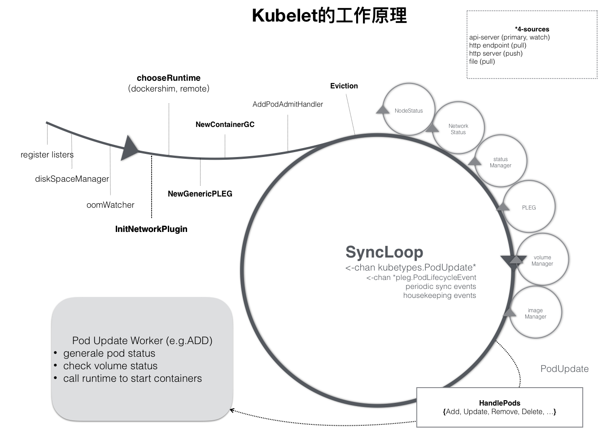
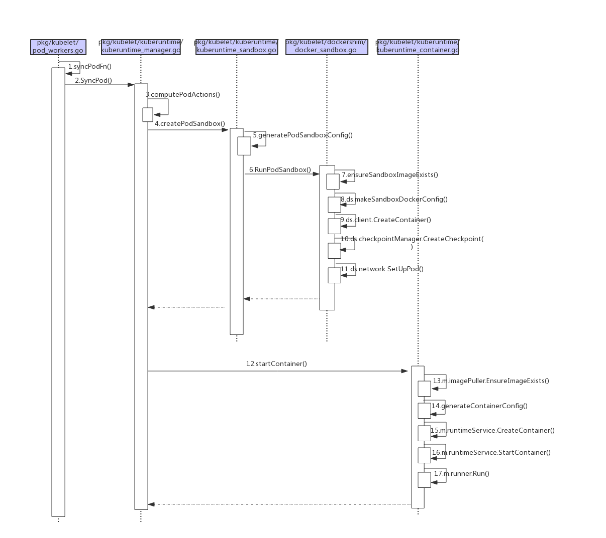

# Pod创建流程


> kubernetes 版本： v1.12



## kubelet 工作原理

kubelet 的工作核心就是在围绕着不同的生产者生产出来的不同的有关 pod 的消息来调用相应的消费者（不同的子模块）完成不同的行为(创建和删除 pod 等)，即图中的控制循环（SyncLoop），通过不同的事件驱动这个控制循环运行。

本文仅分析新建 pod 的流程，当一个 pod 完成调度，与一个 node 绑定起来之后，这个 pod 就会触发 kubelet 在循环控制里注册的 handler，上图中的 HandlePods 部分。此时，通过检查 pod 在 kubelet 内存中的状态，kubelet 就能判断出这是一个新调度过来的 pod，从而触发 Handler 里的 ADD 事件对应的逻辑处理。然后 kubelet 会为这个 pod 生成对应的 podStatus，接着检查 pod 所声明的 volume 是不是准备好了，然后调用下层的容器运行时。如果是 update 事件的话，kubelet 就会根据 pod 对象具体的变更情况，调用下层的容器运行时进行容器的重建。

## kubelet 创建 pod 的流程




kubelet 创建 pod 的流程

### 1、kubelet 的控制循环（syncLoop）

syncLoop 中首先定义了一个 syncTicker 和 housekeepingTicker，即使没有需要更新的 pod 配置，kubelet 也会定时去做同步和清理 pod 的工作。然后在 for 循环中一直调用 syncLoopIteration，如果在每次循环过程中出现比较严重的错误，kubelet 会记录到 runtimeState 中，遇到错误就等待 5 秒中继续循环。

```go
func (kl *Kubelet) syncLoop(updates <-chan kubetypes.PodUpdate, handler SyncHandler) {
    glog.Info("Starting kubelet main sync loop.")

    // syncTicker 每秒检测一次是否有需要同步的 pod workers
    syncTicker := time.NewTicker(time.Second)
    defer syncTicker.Stop()
    // 每两秒检测一次是否有需要清理的 pod
    housekeepingTicker := time.NewTicker(housekeepingPeriod)
    defer housekeepingTicker.Stop()
    // pod 的生命周期变化
    plegCh := kl.pleg.Watch()
    const (
        base   = 100 * time.Millisecond
        max    = 5 * time.Second
        factor = 2
    )
    duration := base
    for {
        if rs := kl.runtimeState.runtimeErrors(); len(rs) != 0 {
            time.Sleep(duration)
            duration = time.Duration(math.Min(float64(max), factor*float64(duration)))
            continue
        }
        ...

        kl.syncLoopMonitor.Store(kl.clock.Now())
        // 第二个参数为 SyncHandler 类型，SyncHandler 是一个 interface，
        // 在该文件开头处定义
        if !kl.syncLoopIteration(updates, handler, syncTicker.C, housekeepingTicker.C, plegCh) {
            break
        }
        kl.syncLoopMonitor.Store(kl.clock.Now())
    }
}
```

### 2、监听 pod 变化（syncLoopIteration）

syncLoopIteration 这个方法就会对多个管道进行遍历，发现任何一个管道有消息就交给 handler 去处理。它会从以下管道中获取消息：

- configCh：该信息源由 kubeDeps 对象中的 PodConfig 子模块提供，该模块将同时 watch 3 个不同来源的 pod 信息的变化（file，http，apiserver），一旦某个来源的 pod 信息发生了更新（创建/更新/删除），这个 channel 中就会出现被更新的 pod 信息和更新的具体操作。
- syncCh：定时器管道，每隔一秒去同步最新保存的 pod 状态
- houseKeepingCh：housekeeping 事件的管道，做 pod 清理工作
- plegCh：该信息源由 kubelet 对象中的 pleg 子模块提供，该模块主要用于周期性地向 container runtime 查询当前所有容器的状态，如果状态发生变化，则这个 channel 产生事件。
- livenessManager.Updates()：健康检查发现某个 pod 不可用，kubelet 将根据 Pod 的restartPolicy 自动执行正确的操作

```go
func (kl *Kubelet) syncLoopIteration(configCh <-chan kubetypes.PodUpdate, handler SyncHandler,
    syncCh <-chan time.Time, housekeepingCh <-chan time.Time, plegCh <-chan *pleg.PodLifecycleEvent) bool {
    select {
    case u, open := <-configCh:
        if !open {
            glog.Errorf("Update channel is closed. Exiting the sync loop.")
            return false
        }

        switch u.Op {
        case kubetypes.ADD:
            ...
        case kubetypes.UPDATE:
            ...
        case kubetypes.REMOVE:
            ...
        case kubetypes.RECONCILE:
            ...
        case kubetypes.DELETE:
            ...
        case kubetypes.RESTORE:
            ...
        case kubetypes.SET:
            ...
        }
        ...
    case e := <-plegCh:
        ...
    case <-syncCh:
        ...
    case update := <-kl.livenessManager.Updates():
        ...
    case <-housekeepingCh:
        ...
    }
    return true
}
```

### 3、处理新增 pod（HandlePodAddtions）

对于事件中的每个 pod，执行以下操作：

- 1、把所有的 pod 按照创建日期进行排序，保证最先创建的 pod 会最先被处理
- 2、把它加入到 podManager 中，podManager 子模块负责管理这台机器上的 pod 的信息，pod 和 mirrorPod 之间的对应关系等等。所有被管理的 pod 都要出现在里面，如果 podManager 中找不到某个 pod，就认为这个 pod 被删除了
- 3、如果是 mirror pod 调用其单独的方法
- 4、验证 pod 是否能在该节点运行，如果不可以直接拒绝
- 5、通过 dispatchWork 把创建 pod 的工作下发给 podWorkers 子模块做异步处理
- 6、在 probeManager 中添加 pod，如果 pod 中定义了 readiness 和 liveness 健康检查，启动 goroutine 定期进行检测

```go
func (kl *Kubelet) HandlePodAdditions(pods []*v1.Pod) {
    start := kl.clock.Now()
    // 对所有 pod 按照日期排序，保证最先创建的 pod 优先被处理
    sort.Sort(sliceutils.PodsByCreationTime(pods))
    for _, pod := range pods {
        if kl.dnsConfigurer != nil && kl.dnsConfigurer.ResolverConfig != "" {
            kl.dnsConfigurer.CheckLimitsForResolvConf()
        }
        existingPods := kl.podManager.GetPods()
        // 把 pod 加入到 podManager 中
        kl.podManager.AddPod(pod)

        // 判断是否是 mirror pod（即 static pod）
        if kubepod.IsMirrorPod(pod) {
            kl.handleMirrorPod(pod, start)
            continue
        }

        if !kl.podIsTerminated(pod) {
            activePods := kl.filterOutTerminatedPods(existingPods)
            // 通过 canAdmitPod 方法校验Pod能否在该计算节点创建(如:磁盘空间)
            // Check if we can admit the pod; if not, reject it.
            if ok, reason, message := kl.canAdmitPod(activePods, pod); !ok {
                kl.rejectPod(pod, reason, message)
                continue
            }
        }
        
        mirrorPod, _ := kl.podManager.GetMirrorPodByPod(pod)
        // 通过 dispatchWork 分发 pod 做异步处理，dispatchWork 主要工作就是把接收到的参数封装成 UpdatePodOptions，调用 UpdatePod 方法.
        kl.dispatchWork(pod, kubetypes.SyncPodCreate, mirrorPod, start)
        // 在 probeManager 中添加 pod，如果 pod 中定义了 readiness 和 liveness 健康检查，启动 goroutine 定期进行检测
        kl.probeManager.AddPod(pod)
    }
}
```

> static pod 是由 kubelet 直接管理的，k8s apiserver 并不会感知到 static pod 的存在，当然也不会和任何一个 rs 关联上，完全是由 kubelet 进程来监管，并在它异常时负责重启。Kubelet 会通过 apiserver 为每一个 static pod 创建一个对应的 mirror pod，如此以来就可以可以通过 kubectl 命令查看对应的 pod,并且可以通过 kubectl logs 命令直接查看到static pod 的日志信息。

### 4、下发任务（dispatchWork）

dispatchWorker 的主要作用是把某个对 Pod 的操作（创建/更新/删除）下发给 podWorkers。

```go
func (kl *Kubelet) dispatchWork(pod *v1.Pod, syncType kubetypes.SyncPodType, mirrorPod *v1.Pod, start time.Time) {
    if kl.podIsTerminated(pod) {
        if pod.DeletionTimestamp != nil {
            kl.statusManager.TerminatePod(pod)
        }
        return
    }
    // 落实在 podWorkers 中
    kl.podWorkers.UpdatePod(&UpdatePodOptions{
        Pod:        pod,
        MirrorPod:  mirrorPod,
        UpdateType: syncType,
        OnCompleteFunc: func(err error) {
            if err != nil {
                metrics.PodWorkerLatency.WithLabelValues(syncType.String()).Observe(metrics.SinceInMicroseconds(start))
            }
        },
    })
    if syncType == kubetypes.SyncPodCreate {
        metrics.ContainersPerPodCount.Observe(float64(len(pod.Spec.Containers)))
    }
}
```

### 5、更新事件的 channel（UpdatePod）

podWorkers 子模块主要的作用就是处理针对每一个的 Pod 的更新事件，比如 Pod 的创建，删除，更新。而 podWorkers 采取的基本思路是：为每一个 Pod 都单独创建一个 goroutine 和更新事件的 channel，goroutine 会阻塞式的等待 channel 中的事件，并且对获取的事件进行处理。而 podWorkers 对象自身则主要负责对更新事件进行下发。

```go
func (p *podWorkers) UpdatePod(options *UpdatePodOptions) {
    pod := options.Pod
    uid := pod.UID
    var podUpdates chan UpdatePodOptions
    var exists bool

    p.podLock.Lock()
    defer p.podLock.Unlock()

    // 如果当前 pod 还没有启动过 goroutine ，则启动 goroutine，并且创建 channel
    if podUpdates, exists = p.podUpdates[uid]; !exists {
        // 创建 channel
        podUpdates = make(chan UpdatePodOptions, 1)
        p.podUpdates[uid] = podUpdates

        // 启动 goroutine
        go func() {
            defer runtime.HandleCrash()
            p.managePodLoop(podUpdates)
        }()
    }
    // 下发更新事件
    if !p.isWorking[pod.UID] {
        p.isWorking[pod.UID] = true
        podUpdates <- *options
    } else {
        update, found := p.lastUndeliveredWorkUpdate[pod.UID]
        if !found || update.UpdateType != kubetypes.SyncPodKill {
            p.lastUndeliveredWorkUpdate[pod.UID] = *options
        }
    }
}
```

### 6、调用 syncPodFn 方法同步 pod（managePodLoop）

managePodLoop 调用 syncPodFn 方法去同步 pod，syncPodFn 实际上就是kubelet.SyncPod。在完成这次 sync 动作之后，会调用 wrapUp 函数，这个函数将会做几件事情:

- 将这个 pod 信息插入 kubelet 的 workQueue 队列中，等待下一次周期性的对这个 pod 的状态进行 sync
- 将在这次 sync 期间堆积的没有能够来得及处理的最近一次 update 操作加入 goroutine 的事件 channel 中，立即处理。

```go
func (p *podWorkers) managePodLoop(podUpdates <-chan UpdatePodOptions) {
    var lastSyncTime time.Time
    for update := range podUpdates {
        err := func() error {
            podUID := update.Pod.UID
            status, err := p.podCache.GetNewerThan(podUID, lastSyncTime)
            if err != nil {
                ...
            }
            err = p.syncPodFn(syncPodOptions{
                mirrorPod:      update.MirrorPod,
                pod:            update.Pod,
                podStatus:      status,
                killPodOptions: update.KillPodOptions,
                updateType:     update.UpdateType,
            })
            lastSyncTime = time.Now()
            return err
        }()
        if update.OnCompleteFunc != nil {
            update.OnCompleteFunc(err)
        }
        if err != nil {
            ...
        }
        p.wrapUp(update.Pod.UID, err)
    }
}
```

### 7、完成创建容器前的准备工作（SyncPod）

在这个方法中，主要完成以下几件事情：

- 如果是删除 pod，立即执行并返回
- 同步 podStatus 到 kubelet.statusManager
- 检查 pod 是否能运行在本节点，主要是权限检查（是否能使用主机网络模式，是否可以以 privileged 权限运行等）。如果没有权限，就删除本地旧的 pod 并返回错误信息
- 创建 containerManagar 对象，并且创建 pod level cgroup，更新 Qos level cgroup
- 如果是 static Pod，就创建或者更新对应的 mirrorPod
- 创建 pod 的数据目录，存放 volume 和 plugin 信息,如果定义了 pv，等待所有的 volume mount 完成（volumeManager 会在后台做这些事情）,如果有 image secrets，去 apiserver 获取对应的 secrets 数据
- 然后调用 kubelet.volumeManager 组件，等待它将 pod 所需要的所有外挂的 volume 都准备好。
- 调用 container runtime 的 SyncPod 方法，去实现真正的容器创建逻辑

这里所有的事情都和具体的容器没有关系，可以看到该方法是创建 pod 实体（即容器）之前需要完成的准备工作。

```go
func (kl *Kubelet) syncPod(o syncPodOptions) error {
    // pull out the required options
    pod := o.pod
    mirrorPod := o.mirrorPod
    podStatus := o.podStatus
    updateType := o.updateType

    // 是否为 删除 pod
    if updateType == kubetypes.SyncPodKill {
        ...
    }
    ...
    // 检查 pod 是否能运行在本节点
    runnable := kl.canRunPod(pod)
    if !runnable.Admit {
        ...
    }

    // 更新 pod 状态
    kl.statusManager.SetPodStatus(pod, apiPodStatus)

    // 如果 pod 非 running 状态则直接 kill 掉
    if !runnable.Admit || pod.DeletionTimestamp != nil || apiPodStatus.Phase == v1.PodFailed {
        ...
    }

    // 加载网络插件
    if rs := kl.runtimeState.networkErrors(); len(rs) != 0 && !kubecontainer.IsHostNetworkPod(pod) {
        ...
    }

    pcm := kl.containerManager.NewPodContainerManager()
    if !kl.podIsTerminated(pod) {
        ...
        // 创建并更新 pod 的 cgroups
        if !(podKilled && pod.Spec.RestartPolicy == v1.RestartPolicyNever) {
            if !pcm.Exists(pod) {
                ...
            }
        }
    }

    // 为 static pod 创建对应的 mirror pod
    if kubepod.IsStaticPod(pod) {
        ...
    }

    // 创建数据目录
    if err := kl.makePodDataDirs(pod); err != nil {
        ...
    }

    // 挂载 volume
    if !kl.podIsTerminated(pod) {
        if err := kl.volumeManager.WaitForAttachAndMount(pod); err != nil {
            ...
        }
    }

    // 获取 secret 信息
    pullSecrets := kl.getPullSecretsForPod(pod)

    // 调用 containerRuntime 的 SyncPod 方法开始创建容器
    result := kl.containerRuntime.SyncPod(pod, apiPodStatus, podStatus, pullSecrets, kl.backOff)
    kl.reasonCache.Update(pod.UID, result)
    if err := result.Error(); err != nil {
        ...
    }

    return nil
}
```

### 8、创建容器

containerRuntime（pkg/kubelet/kuberuntime）子模块的 SyncPod 函数才是真正完成 pod 内容器实体的创建。
syncPod 主要执行以下几个操作：

- 1、计算 sandbox 和 container 是否发生变化
- 2、创建 sandbox 容器
- 3、启动 init 容器
- 4、启动业务容器

initContainers 可以有多个，多个 container 严格按照顺序启动，只有当前一个 container 退出了以后，才开始启动下一个 container。

```go
func (m *kubeGenericRuntimeManager) SyncPod(pod *v1.Pod, _ v1.PodStatus, podStatus *kubecontainer.PodStatus, pullSecrets []v1.Secret, backOff *flowcontrol.Backoff) (result kubecontainer.PodSyncResult) {
    // 1、计算 sandbox 和 container 是否发生变化
    podContainerChanges := m.computePodActions(pod, podStatus)
    if podContainerChanges.CreateSandbox {
        ref, err := ref.GetReference(legacyscheme.Scheme, pod)
        if err != nil {
            glog.Errorf("Couldn't make a ref to pod %q: '%v'", format.Pod(pod), err)
        }
        ...
    }

    // 2、kill 掉 sandbox 已经改变的 pod
    if podContainerChanges.KillPod {
        ...
    } else {
        // 3、kill 掉非 running 状态的 containers
        ...
        for containerID, containerInfo := range podContainerChanges.ContainersToKill {
            ...
            if err := m.killContainer(pod, containerID, containerInfo.name, containerInfo.message, nil); err != nil {
                ...
            }
        }
    }

    m.pruneInitContainersBeforeStart(pod, podStatus)
    podIP := ""
    if podStatus != nil {
        podIP = podStatus.IP
    }

    // 4、创建 sandbox 
    podSandboxID := podContainerChanges.SandboxID
    if podContainerChanges.CreateSandbox {
        podSandboxID, msg, err = m.createPodSandbox(pod, podContainerChanges.Attempt)
        if err != nil {
            ...
        }
        ...
        podSandboxStatus, err := m.runtimeService.PodSandboxStatus(podSandboxID)
        if err != nil {
            ...
        }
        // 如果 pod 网络是 host 模式，容器也相同；其他情况下，容器会使用 None 网络模式，让 kubelet 的网络插件自己进行网络配置
        if !kubecontainer.IsHostNetworkPod(pod) {
            podIP = m.determinePodSandboxIP(pod.Namespace, pod.Name, podSandboxStatus)
            glog.V(4).Infof("Determined the ip %q for pod %q after sandbox changed", podIP, format.Pod(pod))
        }
    }

    configPodSandboxResult := kubecontainer.NewSyncResult(kubecontainer.ConfigPodSandbox, podSandboxID)
    result.AddSyncResult(configPodSandboxResult)
    // 获取 PodSandbox 的配置(如:metadata,clusterDNS,容器的端口映射等)
    podSandboxConfig, err := m.generatePodSandboxConfig(pod, podContainerChanges.Attempt)
    ...

    // 5、启动 init container
    if container := podContainerChanges.NextInitContainerToStart; container != nil {
        ...
        if msg, err := m.startContainer(podSandboxID, podSandboxConfig, container, pod, podStatus, pullSecrets, podIP, kubecontainer.ContainerTypeInit); err != nil {
            ...
        }
    }

    // 6、启动业务容器
    for _, idx := range podContainerChanges.ContainersToStart {
        ...
        if msg, err := m.startContainer(podSandboxID, podSandboxConfig, container, pod, podStatus, pullSecrets, podIP, kubecontainer.ContainerTypeRegular); err != nil {
            ...
        }
    }
    
    return
}
```

### 9、启动容器

最终由 startContainer 完成容器的启动，其主要有以下几个步骤：

- 1、拉取镜像
- 2、生成业务容器的配置信息
- 3、调用 docker api 创建容器
- 4、启动容器
- 5、执行 post start hook

```go
func (m *kubeGenericRuntimeManager) startContainer(podSandboxID string, podSandboxConfig *runtimeapi.PodSandboxConfig, container *v1.Container, pod *v1.Pod, podStatus *kubecontainer.PodStatus, pullSecrets []v1.Secret, podIP string, containerType kubecontainer.ContainerType) (string, error) {
    // 1、检查业务镜像是否存在，不存在则到 Docker Registry 或是 Private Registry 拉取镜像。
    imageRef, msg, err := m.imagePuller.EnsureImageExists(pod, container, pullSecrets)
    if err != nil {
        ...
    }

    ref, err := kubecontainer.GenerateContainerRef(pod, container)
    if err != nil {
        ...
    }

    // 设置 RestartCount 
    restartCount := 0
    containerStatus := podStatus.FindContainerStatusByName(container.Name)
    if containerStatus != nil {
        restartCount = containerStatus.RestartCount + 1
    }

    // 2、生成业务容器的配置信息
    containerConfig, cleanupAction, err := m.generateContainerConfig(container, pod, restartCount, podIP, imageRef, containerType)
    if cleanupAction != nil {
        defer cleanupAction()
    }
    ...

    // 3、通过 client.CreateContainer 调用 docker api 创建业务容器
    containerID, err := m.runtimeService.CreateContainer(podSandboxID, containerConfig, podSandboxConfig)
    if err != nil {
        ...
    }
    err = m.internalLifecycle.PreStartContainer(pod, container, containerID)
    if err != nil {
        ...
    }
    ...

    // 3、启动业务容器
    err = m.runtimeService.StartContainer(containerID)
    if err != nil {
        ...
    }

    containerMeta := containerConfig.GetMetadata()
    sandboxMeta := podSandboxConfig.GetMetadata()
    legacySymlink := legacyLogSymlink(containerID, containerMeta.Name, sandboxMeta.Name,
        sandboxMeta.Namespace)
    containerLog := filepath.Join(podSandboxConfig.LogDirectory, containerConfig.LogPath)
    if _, err := m.osInterface.Stat(containerLog); !os.IsNotExist(err) {
        if err := m.osInterface.Symlink(containerLog, legacySymlink); err != nil {
            glog.Errorf("Failed to create legacy symbolic link %q to container %q log %q: %v",
                legacySymlink, containerID, containerLog, err)
        }
    }

    // 4、执行 post start hook
    if container.Lifecycle != nil && container.Lifecycle.PostStart != nil {
        kubeContainerID := kubecontainer.ContainerID{
            Type: m.runtimeName,
            ID:   containerID,
        }
        // runner.Run 这个方法的主要作用就是在业务容器起来的时候，
        // 首先会执行一个 container hook(PostStart 和 PreStop),做一些预处理工作。
        // 只有 container hook 执行成功才会运行具体的业务服务，否则容器异常。
        msg, handlerErr := m.runner.Run(kubeContainerID, pod, container, container.Lifecycle.PostStart)
        if handlerErr != nil {
            ...
        }
    }

    return "", nil
}
```

## 总结

本文主要讲述了 kubelet 从监听到有容器调度至本节点再到容器创建的一个过程，kubelet 最终调用 docker api 来创建容器的。结合上篇文章，可以看出 kubelet 从启动到创建 pod 的一个清晰过程。

参考：
[k8s源码分析-kubelet](https://sycki.com/articles/kubernetes/k8s-code-kubelet)
[Kubelet源码分析(一):启动流程分析](https://segmentfault.com/a/1190000008267351)
[kubelet 源码分析：pod 新建流程](http://cizixs.com/2017/06/07/kubelet-source-code-analysis-part-2/)
[kubelet创建Pod流程解析](https://fatsheep9146.github.io/2018/07/22/kubelet创建Pod流程解析/)
[Kubelet: Pod Lifecycle Event Generator (PLEG) Design- proposals](https://github.com/kubernetes/community/blob/master/contributors/design-proposals/node/pod-lifecycle-event-generator.md)


更多精彩内容可关注微信订阅号：幼儿园小班工程师
