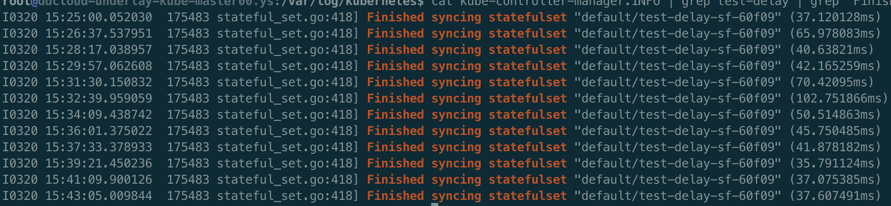
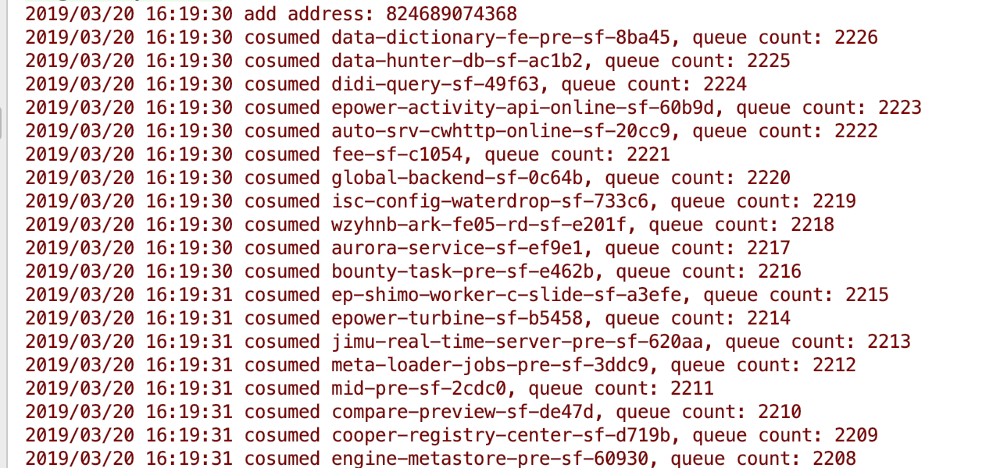
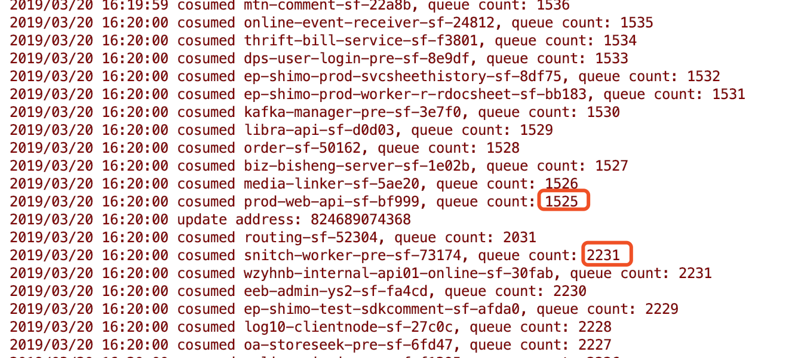

# Statefulset创建pod慢


### 背景

线上kubernetes集群从创建sts到创建pod需要时间很长，分钟级别，但是调度却很快。偶尔还会出现导致kube-odin任务失败（超过300s）的情况

### 排查过程

分析可能的原因：

- watch到sts的变化有延迟
- sts从入队列到出队列耗时长
- 处理sts耗时长

kube-controller-manager中sts相关源码中有一些日志，需要把loglevel设置为4，即调试级别才会打印，里面就包括处理单个sts的耗时。首先把kube-controller-manager日志级别调到4，日志如下图, 最后显示的时间是从队列中拿到sts到处理完sts的整个过程的耗时，可以看到耗时并不长，在毫秒级别，那就可以排除掉处理单个sts耗时长的可能性了。



还剩下两种可能，不过细想的话，第一种可能也不大，因为watch是通用的，没道理同一个集群kube-controller-manager里的watch就慢，kube-scheuler的watch就快。那就很有可能是从watch到变化后把sts入队列到从队列中拿到sts这个阶段耗时太长了。源码中并没有这一部分的耗时统计，但是从源码中可以看到整个处理过程是同步到的，即watch的所有sts按顺序入队列，消费者在顺序的从队列中拿到，每消费完一个，再去拿另一个，串行执行，那问题就来了，虽然单个sts执行耗时在毫秒级，但是整个集群的sts数量在2000+，按平均每个sts耗时40ms计算，粗略估算一下处理完一轮的话也需要40ms*2000=80s的时间，到这里已经离真相不远了，但还有一个问题，那就是kube-controller-manager在初始化的时候是会把所有的sts加载一遍放入队列中的，处理完一遍哪怕耗时2分钟，但是处理完一遍之后只watch变化的sts，数量就会少很多了，所以处理完初始化时加载的所有sts后，按道理再有sts变化应该是可以及时处理的，因为此时队列中基本没有sts了。带着问题再去看源码，发现了一个神奇的地方，如下

```go
setInformer.Informer().AddEventHandlerWithResyncPeriod(
   cache.ResourceEventHandlerFuncs{
      AddFunc: ssc.enqueueStatefulSet,
      UpdateFunc: func(old, cur interface{}) {
         oldPS := old.(*apps.StatefulSet)
         curPS := cur.(*apps.StatefulSet)
         if oldPS.Status.Replicas != curPS.Status.Replicas {
            glog.V(4).Infof("Observed updated replica count for StatefulSet: %v, %d->%d", curPS.Name, oldPS.Status.Replicas, curPS.Status.Replicas)
         }
         ssc.enqueueStatefulSet(cur)
      },
      DeleteFunc: ssc.enqueueStatefulSet,
   },
   statefulSetResyncPeriod, // 30s
)
```

这就对了，上面这段代码意思是只要watch到sts的变化，就会把对应的sts放入队列，**且每隔30s**会把全部sts重新入一遍队列，再加上刚才的估算，80s才能处理完所有sts，在未处理完之前（处理了30s时）就又会把所有的sts重新加入到队列中（并不是简单粗暴的把所有sts入队列，中间还会做一些处理，过滤掉一些不需要重复入队列的sts），这就会导致sts的待处理队列中始终有2000+个元素，新watch到的变化会加到队尾，从而导致sts创建后过了很久Pod才创建，因为sts controller一直在消费之前未处理完的其他sts了。

下面写了一个Demo来演示这个问题，代码很简单，如下

```go
package main
 
import (
   "fmt"
   "k8s.io/api/apps/v1"
   "k8s.io/client-go/informers"
   "k8s.io/client-go/kubernetes"
   "k8s.io/client-go/rest"
   "k8s.io/client-go/tools/cache"
   "k8s.io/client-go/util/workqueue"
   "log"
   "math/rand"
   "time"
   "unsafe"
)
 
var queue workqueue.RateLimitingInterface
 
func main() {
   defer queue.ShutDown()
 
   clientset, _ := kubernetes.NewForConfig(&rest.Config{
      Host: "http://10.80.101.22:8080",
   })
   factor := rand.Float64() + 1
   syncPeriod := time.Duration(float64(time.Duration(12*time.Hour).Nanoseconds()) * factor)
   informerFactory := informers.NewSharedInformerFactory(clientset, syncPeriod)
   stopChan := make(chan struct{})
   informerFactory.Start(stopChan)
   informerFactory.WaitForCacheSync(stopChan)
   stsInformer := informerFactory.Apps().V1().StatefulSets().Informer()
   // 和sts controller一直，30s同步一遍所有sts
   stsInformer.AddEventHandlerWithResyncPeriod(cache.ResourceEventHandlerFuncs{
      AddFunc:    onAdd,
      UpdateFunc: onUpdate,
      DeleteFunc: onDelete,
   }, 30*time.Second)
 
   go consume()
 
   stsInformer.Run(stopChan)
}
 
func init() {
   queue = workqueue.NewNamedRateLimitingQueue(workqueue.DefaultControllerRateLimiter(), "statefulset")
}
 
func consume() {
   for {
      func() {
         key, quit := queue.Get()
         if quit {
            fmt.Println("done")
            return
         }
         defer queue.Done(key)
         sts := key.(*v1.StatefulSet)
         // 模拟处理单个sts耗时40ms
         time.Sleep(40 * time.Millisecond)
         log.Printf("cosumed %s, queue count: %d", sts.Name, queue.Len())
      }()
   }
}
 
func onAdd(obj interface{}) {
   sts := obj.(*v1.StatefulSet)
   if sts.Name == "test-delay-sf-60f09" {
      log.Printf("add address: %d", unsafe.Pointer(sts))
   }
   queue.Add(sts)
}
 
func onUpdate(old, new interface{}) {
   sts := old.(*v1.StatefulSet)
   // 测试用的sts，观察全量同步时的地址变化，用来确定是不通批次的同步，针对同一个sts来说是否地址相同
   // 因为queue中用到sts作为map的key，所以此处打印地址，验证一下
   if sts.Name == "test-delay-sf-60f09" {
      log.Printf("update address: %d", unsafe.Pointer(sts))
   }
   queue.Add(sts)
}
 
func onDelete(obj interface{}) {
   sts := obj.(*v1.StatefulSet)
   if sts.Name == "test-delay-sf-60f09" {
      log.Printf("update address: %d", unsafe.Pointer(sts))
   }
   queue.Add(sts)
}
```

最终的输出结果





可以看到queue的长度从一开始的2000+一直降到1525，此时同步了一遍全量的sts，即2000+，queue中元素数量又生了上去。同时在未修改sts的情况，指定sts同步后的地址和同步前的地址相同824689074368。验证了之前的猜想，问题就出在了这里。

### 解决方案

想到两种优化方案

1. 去掉定期（30s）全量同步的机制，目前看其他controller，如ReplicationController，ServiceController，EndpointsController等都没有设置定期全量同步
2. 保留定期同步，添加已处理的sts的缓存，每次从queue中拿到一个新的sts时，比较已处理缓存中是否存在相同的sts(resourceversion相同)，存在则忽略此sts，否则进行处理

### 社区

上述问题已反馈社区，修复方式就是方案1，直接去掉了30s的同步机制。见https://github.com/kubernetes/kubernetes/pull/75622 

这里需要注意一点：30s的同步机制并不是从kube-apiserver拉取全量数据，而是把Informer本地缓存的数据（位于Indexer中）全量同步一遍，目的是为了防止出现在事件处理函数中与外部组件交互时出错的情况，参考这个issue：https://github.com/kubernetes/kubernetes/issues/75495，但是sts控制器本身没有依赖任何外部（k8s以外）组件，所以就不需要30s同步了。但是我们以Operator实现的自定义Controller就需要根据实际情况激进型设置了，后面会专门有一个系列详细讲Informer的源码，敬请期待。


更多精彩内容可关注微信订阅号：幼儿园小班工程师
