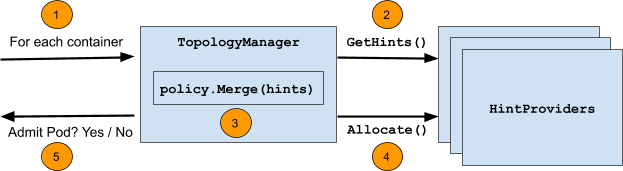
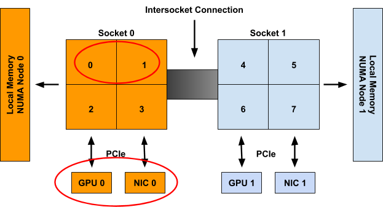

# Kubenetes NUMA拓扑感知功能介绍


## 由来

最近的工作内容中涉及到了 NUMA 感知相关的功能，之前没有特意去看过 kubelet 相关部分的实现，也是趁此机会把落下的补补。在看代码的过程中，NUMA 感知部分的逻辑尤其涉及到一些位操作的部分，看的让人头疼，于是从网上搜了搜有关原理的介绍，恰好在官网找到一篇 blog，看完之后再去看代码就会豁然开朗。此篇是对原文的翻译，想阅读原文的可以直接到[这里](https://kubernetes.io/blog/2020/04/01/kubernetes-1-18-feature-topoloy-manager-beta/)。

## TopologyManager

`TopologyManager` 在1.18版本中处于 `beta` 状态，该功能支持 CPU 和外围设备（例如 SR-IOV VF 和 GPU）的 NUMA 对齐，使工作负载能够在针对低延迟优化的环境中运行。

在引入 TopologyManager 之前，CPU 和设备管理器会做出相互独立的资源分配决策。这可能会导致 `Multi-Socket` 系统上出现不希望的分配，降低延迟敏感应用的性能。随着 `TopologyManager` 的引入，我们现在有办法避免这种情况。这篇blog包括如下内容：

1. `NUMA` 及其重要性简介
2. 用户可使用的用于保证 CPU 和外围设备 NUMA 对齐的策略
3. `TopologyManager` 内部工作原理
4. `TopologyManager` 当前限制
5. `TopologyManager` 未来发展规划

## 什么是NUMA & 为什么需要关心？

`NUMA` 是 `Non-Uniform Memory Access` 的简称。它是一种在多 CPU 系统上可用的技术，允许不同的 CPU 以不同的速度访问内存的不同部分。 任何直接连接到 CPU 的内存都被认为是该 CPU 的本地内存，并且可以非常快速地访问。 任何未直接连接到 CPU 的内存都被认为是非本地的。在现代系统上，本地与非本地内存的概念也可以扩展到外围设备，例如 NIC 或 GPU。 为了获得高性能，应该分配 CPU 和设备，以便它们可以访问相同的本地内存。

NUMA 系统上的所有内存都分为一组NUMA 节点，每个节点代表一组 CPU 或设备的本地内存。 如果单个 CPU 的本地内存与该 NUMA 节点相关联，则我们将其称为 NUMA 节点的一部分。

基于访问外围设备时所必须通过的最短互连数量，我们将外围设备视为 NUMA 节点的一部分。

例如，在图 1 中，CPU 0-3 被称为 NUMA node 0 的一部分，而 CPU 4-7 是 NUMA node 1 的一部分。同样，GPU 0 和 NIC 0 被称为 NUMA node 0 的一部分，因为它们 连接到 Socket 0，其 CPU 都是 NUMA node 0 的一部分。 NUMA node 1 上的 GPU 1 和 NIC 1 也是如此。


尽管上面的示例显示了 NUMA 节点到 Socket 的 1-1 映射，但在一般情况下不一定如此。 单个 NUMA 节点上可能有多个 Socket，或者单个 Socket 的单个 CPU 可能连接到不同的 NUMA 节点。 此外，Sub-NUMA Clustering（在最近的英特尔 CPU 上可用）等新兴技术允许单个 CPU 与多个 NUMA 节点相关联，只要它们对两个节点的内存访问时间相同（或差异可以忽略不计）。

## NUMA 对齐

TopologyManager 提供了如下几种对齐策略：

- **none**：此政策不会尝试进行任何资源调整。 它的行为就像 TopologyManager 根本不存在一样。 这是默认策略。
- **best-effort**：使用此策略，TopologyManager 将尝试尽可能地对齐 NUMA 节点上的分配，但即使某些分配的资源未在同一 NUMA 节点上对齐，也会始终允许 pod 启动。
- **restricted**：此策略与尽力而为策略相同，但如果分配的资源无法正确对齐，它将导致 pod 准入失败。 与 `single-numa-node` 策略不同，如果不可能在单个 NUMA 节点上满足分配请求，则某些分配可能来自多个 NUMA 节点。
- **single-numa-node**：这个策略是最严格的，只有当所有请求的 CPU 和设备都可以从一个 NUMA 节点分配时，pod 准入才会通过。

需要注意的是，所选策略单独应用于 pod 规范中的每个容器，而不是将所有容器中的资源对齐在一起。

此外，单个策略通过全局 kubelet 标志应用于节点上的所有 pod，而不是允许用户逐个 pod（或逐个容器）选择不同的策略。 我们希望在未来放宽这一限制。

`kubelet`可供设置的策略如下：

```shell
--topology-manager-policy=
    [none | best-effort | restricted | single-numa-node]
```

通过feature gate来控制功能的开启，于1.16引入，自1.18开始默认开启，形式如下：

```shell
--feature-gates="...,TopologyManager=<true|false>"
```

为了根据所选策略触发对齐，用户必须根据特定要求在其 `pod.spec` 中设置 CPU 和 device 的request值。

对于外围设备，这意味着从设备插件（例如 `intel.com/sriov`、`nvidia.com/gpu` 等）提供的可用资源中请求设备。 这仅在设备插件与 `TopologyManager` 正确集成时才有效。 目前，已知具有此扩展的唯一插件是 [Nvidia GPU](https://github.com/NVIDIA/k8s-device-plugin/blob/5cb45d52afdf5798a40f8d0de049bce77f689865/nvidia.go#L74) 设备插件和英特尔 [SRIOV](https://github.com/intel/sriov-network-device-plugin/blob/30e33f1ce2fc7b45721b6de8c8207e65dbf2d508/pkg/resources/pciNetDevice.go#L80) 网络设备插件。 可以在[此处](https://kubernetes.io/docs/concepts/extend-kubernetes/compute-storage-net/device-plugins/#device-plugin-integration-with-the-topology-manager)找到有关如何扩展设备插件以与 `TopologyManager` 集成的详细信息。

对于 CPU，这要求 `CPUManager` 已配置为启用了其 --static 策略，并且 pod 在保证 QoS 类中运行（即所有 CPU 和内存限制都等于它们各自的 CPU 和内存请求）。 还必须以整数值（例如 1、2、1000m 等）请求 CPU。 可以在[此处](https://kubernetes.io/docs/tasks/administer-cluster/cpu-management-policies/#cpu-management-policies)找到有关如何设置 `CPUManager` 策略的详细信息。

例如，假设 `CPUManager` 在其 --static 策略启用的情况下运行，并且 `gpu-vendor.com` 和 `nic-vendor.com` 的设备插件已扩展为与 `TopologyManager` 正确集成，则下面的 pod 规范足以触发 `TopologyManager` 运行其选定的策略：

```shell
spec:
   containers:
   - name: numa-aligned-container
     image: alpine
     resources:
         limits:
             cpu: 2
             memory: 200Mi
             gpu-vendor.com/gpu: 1
             nic-vendor.com/nic: 1
```

遵循上一节中的图 1，这将导致以下对齐分配之一：

```shell
{cpu: {0, 1}, gpu: 0, nic: 0}
{cpu: {0, 2}, gpu: 0, nic: 0}
{cpu: {0, 3}, gpu: 0, nic: 0}
{cpu: {1, 2}, gpu: 0, nic: 0}
{cpu: {1, 3}, gpu: 0, nic: 0}
{cpu: {2, 3}, gpu: 0, nic: 0}

{cpu: {4, 5}, gpu: 1, nic: 1}
{cpu: {4, 6}, gpu: 1, nic: 1}
{cpu: {4, 7}, gpu: 1, nic: 1}
{cpu: {5, 6}, gpu: 1, nic: 1}
{cpu: {5, 7}, gpu: 1, nic: 1}
{cpu: {6, 7}, gpu: 1, nic: 1}
```

只需遵循此模式，即可让 `TopologyManager` 确保请求拓扑感知设备和独占 CPU 的容器之间的 NUMA 对齐。

**注意：** 如果 Pod 被 **TopologyManager** 策略之一拒绝，它将被置于 **Terminated** 状态，并出现 Pod 准入错误和 `TopologyAffinityError` 的原因。 一旦 pod 处于此状态，`Kubernetes` 调度程序将不会尝试重新调度它。 因此，建议使用带 `replicas` 的 `deployment` 来应对在遇到此类故障时触发 pod 的重新部署。 还可以实施外部控制循环来触发具有 `TopologyAffinityError` 的 pod 的重新部署。

## 实现机制

`TopologyManager` 执行的主要逻辑的伪代码如下所示：

```golang
for container := range append(InitContainers, Containers...) {
    for provider := range HintProviders {
        hints += provider.GetTopologyHints(container)
    }

    bestHint := policy.Merge(hints)

    for provider := range HintProviders {
        provider.Allocate(container, bestHint)
    }
}
```

下图总结了此循环期间采取的步骤：



步骤说明如下：

1. 循环遍历 pod 中的所有容器。
2. 对于每个容器，从容器请求的每种拓扑感知资源类型（例如 `gpu-vendor.com/gpu`、`nic-vendor.com/nic`、`cpu` 等）的一组  `HintProviders` 中收集 `TopologyHints`。
3. 使用选定的策略，合并收集到的 `TopologyHints` 以找到在所有资源类型之间对齐资源分配的最佳提示。
4. 再次遍历 `HintProviders`，利用上一步中返回的最佳提示为容器分配资源。
5. 此循环在 pod 准入时间运行，如果这些步骤中的任何一个失败或根据所选策略无法满足对齐，则Pod注入失败。 相应地清除之前分配的任何资源。

以下部分更详细地介绍了 `TopologyHints` 和 `HintProviders` 的确切结构，以及每个策略使用的合并策略的一些细节。

### TopologyHints

`TopologyHint` 对一组约束进行编码，从中可以满足给定的资源请求。 目前，我们考虑的唯一约束是 NUMA 对齐。 它的定义如下：

```golang
type TopologyHint struct {
    NUMANodeAffinity bitmask.BitMask
    Preferred bool
}
```

`NUMANodeAffinity` 字段包含可以满足资源请求的 NUMA 节点的位掩码。 例如，具有 2 个 NUMA 节点的系统上可能的掩码包括：

```shell
{00}, {01}, {10}, {11}
```

`Preferred` 字段包含一个布尔值，用于指示指定的提示是否优先选择。 使用 `best-effort` 策略，在生成最佳提示时，`Preferred` 提示将优先于非 `Preferred` 提示。 使用 `restricted` 和单 `numa-node` 策略，非 `Preferred` 的提示将被拒绝。

通常，`HintProviders` 通过查看可以满足资源请求的当前可用资源集来生成 `TopologyHints`。 更具体地说，它们为可以满足资源请求的 NUMA 节点的每个可能掩码生成一个 `TopologyHint`。 如果掩码不能满足请求，则将其省略。 例如，当被要求分配 2 个资源时，`HintProvider` 可能会在具有 2 个 NUMA 节点的系统上提供以下提示。 这些提示显示两种资源可以来自单个 NUMA 节点（0 或 1），也可以分别来自不同的 NUMA 节点（但我们更希望它们仅来自一个）。

```shell
{01: True}, {10: True}, {11: False}
```

目前，当且仅当 `NUMANodeAffinity` 编码可以满足资源请求的最小 NUMA 节点集时，所有 `HintProvider` 才将 `Preferred` 字段设置为 True 。 通常，这仅对于在其位掩码中设置了单个 NUMA 节点的 TopologyHint 为 True。 但是，如果满足资源请求的唯一方法是跨越多个 NUMA 节点（例如，请求 2 个设备并且系统上仅有的 2 个设备位于不同的 NUMA 节点上），则它也可能为 True：

```shell
{0011: True}, {0111: False}, {1011: False}, {1111: False}
```

**注意**：以这种方式设置 `Preferred` 字段不是基于当前可用资源的集合。 它基于在一些最小的 NUMA 节点集上物理分配请求资源数量的能力。

通过这种方式，如果在其他容器释放其资源之前无法满足实际的首选分配，则 `HintProvider` 可以返回所有 `Preferred` 字段设置为 False 的提示列表。 例如，请考虑图 1 中系统的以下场景：

1. 目前除分配给容器的CPU之外只剩2 CPU空闲
2. 剩余的 2 CPU 位于不同的 NUMA 节点上
3. 一个新的容器出现，要求 2 CPU

在这种情况下，唯一生成的提示将是 {11: False} 而不是 {11: True}。 发生这种情况是因为可以从该系统上的同一个 NUMA 节点分配 2 个 CPU（鉴于当前的分配状态，现在不是这样）。 这个想法是，当可以满足最小对齐时，最好让 pod 准入失败并重试部署，而不是允许以次优对齐来调度 pod。

### HintProviders

`HintProvider` 是 `kubelet` 内部的一个组件，用于协调与 `TopologyManager` 对齐的资源分配。 目前 Kubernetes 中唯一的 `HintProvider` 是 `CPUManager` 和 `DeviceManager`。 我们计划很快添加对 `HugePages` 的支持。

如前所述，`TopologyManager` 从 `HintProviders` 收集 `TopologyHints`，使用合并后的最佳提示触发对齐的资源分配。 因此，`HintProviders` 实现了以下接口：

```golang
type HintProvider interface {
    GetTopologyHints(*v1.Pod, *v1.Container) map[string][]TopologyHint
    Allocate(*v1.Pod, *v1.Container) error
}
```

请注意，对 `GetTopologyHints()` 的调用返回一个 `map\[string][]TopologyHint`。 这允许单个 `HintProvider` 为多种资源类型提供提示，而不仅仅是一种。 例如，`DeviceManager` 需要这样做，以便为其插件注册的每个资源类型传回提示。

当 `HintProviders` 生成他们的提示时，他们只考虑如何满足系统上`当前可用资源`的对齐，不考虑已分配给其他容器的任何资源。

例如，考虑图 1 中的系统，其中有以下两个容器从中请求资源：


如果 Container0 是在系统上分配的第一个容器，则将为规范中的三种拓扑感知资源类型生成以下提示集：

```tex
               cpu: [{01: True}, {10: True}, {11: False}]
gpu-vendor.com/gpu: [{01: True}, {10: True}]
nic-vendor.com/nic: [{01: True}, {10: True}]
```

对应的对齐结果：

```shell
{cpu: {0, 1}, gpu: 0, nic: 0}
```



当考虑 Container1 时，这些资源被假定为不可用，因此只会生成以下提示集：

```tex
               cpu: [{01: True}, {10: True}, {11: False}]
gpu-vendor.com/gpu: [{10: True}]
nic-vendor.com/nic: [{10: True}]
```

对其结果如下：

```shell
{cpu: {4, 5}, gpu: 1, nic: 1}
```

**注意**：与本节开头提供的伪代码不同，对 `Allocate()` 的调用实际上并没有直接采用一个合并后的最佳提示的参数。 相反，`TopologyManager` 实现了以下 `Store` 接口，`HintProviders` 可以查询该接口以检索为特定容器生成的提示：

```golang
type Store interface {
    GetAffinity(podUID string, containerName string) TopologyHint
}
```

将其分离到其自己的 API 调用中，允许人们在 pod 准入循环之外访问此提示。 这对于调试以及通过 kubectl 等工具获取生成的提示很有用。

### Policy.Merge

由给定策略定义的合并策略决定了它如何将所有 `HintProvider` 生成的一组 `TopologyHint` 组合成单个 `TopologyHint`。

所有受支持策略的合并策略都以相同的方式开始：

1. 取为每种资源类型生成的 `TopologyHints` 的叉积
2. 对于叉积中的每个条目，将每个 `TopologyHint` 的 NUMA Affinity进行按位与计算，并将结果设置为到合并提示的 NUMA Affinity。
3. 如果条目中的所有提示都将 `Preferred` 设置为 True ，则在生成的合并提示中将 `Preferred` 设置为 True。
4. 如果即使条目中的一个提示已将 `Preferred` 设置为 False ，生成的合并提示中 `Preferred`为 False 。 如果其 NUMA Affinity 包含全 0，则合并提示中 Preferred 也为 False。

按照上一节的示例，Container0 生成的提示为：

```tex
               cpu: [{01: True}, {10: True}, {11: False}]F
gpu-vendor.com/gpu: [{01: True}, {10: True}]
nic-vendor.com/nic: [{01: True}, {10: True}]
```

上述算法产生以下叉积和合并后的提示：

| **`{cpu, gpu-vendor.com/gpu, nic-vendor.com/nic}`** | "merged" hint     |
| --------------------------------------------------- | ----------------- |
| **`[{01: True}, {01: True}, {01: True}]`**          | **`{01: True}`**  |
| **`[{01: True}, {01: True}, {10: True}]`**          | **`{00: False}`** |
| **`[{01: True}, {10: True}, {01: True}]`**          | **`{00: False}`** |
| **`[{01: True}, {10: True}, {10: True}]`**          | **`{00: False}`** |
|                                                     |                   |
| **`[{10: True}, {01: True}, {01: True}]`**          | **`{00: False}`** |
| **`[{10: True}, {01: True}, {10: True}]`**          | **`{00: False}`** |
| **`[{10: True}, {10: True}, {01: True}]`**          | **`{00: False}`** |
| **`[{10: True}, {10: True}, {10: True}]`**          | **`{01: True}`**  |
|                                                     |                   |
| **`[{11: False}, {01: True}, {01: True}]`**         | **`{01: False}`** |
| **`[{11: False}, {01: True}, {10: True}]`**         | **`{00: False}`** |
| **`[{11: False}, {10: True}, {01: True}]`**         | **`{00: False}`** |
| **`[{11: False}, {10: True}, {10: True}]`**         | **`{10: False}`** |

一旦合并提示列表生成，剩下的工作就由特定的 `TopologyManager` 策略来决定将哪个提示视为最佳提示。

一般来说，这包括：

1. 按“狭窄程度”对合并的提示进行排序。 窄度定义为在提示的 NUMA Affinity 掩码中设置的位数。 设置的位越少，提示越窄。 对于在其 NUMA Affinity 掩码中设置相同位数的提示，具有最低位设置的提示被认为更窄。
2. 按 `Preferred` 字段对合并的提示进行排序。 与将 Preferred 设置为 False 的提示相比，将 Preferred 设置为 True 的提示更可能被视为候选对象。
3. 选择具有最佳设置的最窄提示。

在 `best-effort` 策略的情况下，此算法将始终导致某些提示被选为最佳提示，最终Pod准入通过。 `HintProviders` 根据这个最佳提示进行资源分配。

但是，在 `restricted` 和 `single-numa-node` 策略的情况下，任何选择的 `Preferred` 设置为False 的提示将被立即拒绝，导致pod 准入失败并且无法资源分配。 此外 `single-numa-node` 还将拒绝在其 Affinity 掩码中设置了多个 NUMA 节点的提示。

在上面的示例中，所有策略都会使用 {01: True} 提示，Pod准入成功。

## Upcoming enhancements

虽然 1.18 版本和 Beta 版升级带来了一些重要的增强和修复，但仍然存在许多限制，[如下所述](https://kubernetes.io/docs/tasks/administer-cluster/topology-manager/#known-limitations)。 我们已经在努力解决这些限制以及更多问题。

本节将介绍我们计划在不久的将来为 `TopologyManager` 实施的一组增强功能。 这个列表并不详尽，但它很好地说明了我们前进的方向。它按照我们期望看到每个增强完成的时间范围进行排序。

如果您想参与其中的任何增强功能，请参加每周一次的 [Kubernetes SIG-node 会议](https://github.com/kubernetes/community/tree/master/sig-node)以了解更多信息并成为社区工作的一部分！

### Supporting device-specific constraints

目前，NUMA 亲和性是 `TopologyManager` 为资源对齐考虑的唯一约束。 此外，可以对 `TopologyHint` 进行的唯一扩展涉及 `node-level` 约束，例如跨设备类型的 PCIe 总线对齐。 尝试向该结构添加任何特定于设备的约束（例如，一组 GPU 设备之间的内部 NVLINK 拓扑）将是棘手的。

因此，我们建议对设备插件接口进行扩展，允许插件声明其拓扑感知分配首选项，而无需向 kubelet 公开任何特定于设备的拓扑信息。 通过这种方式，`TopologyManager` 可以被限制为仅处理常见的节点级拓扑约束，同时仍然可以将特定于设备的拓扑约束合并到其分配决策中。

可以在[此处](https://github.com/kubernetes/enhancements/pull/1121)找到此提案的详细信息，并且将很快在 Kubernetes 1.19 中提供。

### NUMA alignment for hugepages

如前所述，`TopologyManager` 当前仅有的两个 `HintProvider` :  `CPUManager` 和 `DeviceManager`。 但是，目前正在增加巨页的支持。 随着这项工作的完成，`TopologyManager` 最终将能够在同一个 NUMA 节点上分配内存、hugepages、CPU 和 PCI 设备。

这项工作的 [KEP](https://github.com/kubernetes/enhancements/blob/253f1e5bdd121872d2d0f7020a5ac0365b229e30/keps/sig-node/20200203-memory-manager.md) 目前正在审查中，并且正在制作原型以尽快实现此功能。

### Scheduler awareness

目前，`TopologyManager` 充当 Pod 准入控制器，它不直接参与 pod 的调度决策。相反，当 kubernetes 调度程序（或在部署中运行的任何调度程序）将 pod 放置在节点上运行时，`TopologyManager` 将决定是“接纳”还是“拒绝”该 pod。如果 Pod 由于缺乏可用的 NUMA 对齐资源而被拒绝，事情会变得有点有趣。这个 kubernetes [issue](https://github.com/kubernetes/kubernetes/issues/84869) 很好地突出并讨论了这种情况。

那么我们如何着手解决这个限制呢？我们可以利用 Kubernetes 调度框架来实现！该框架提供了一组新的插件 API，这些 API 与现有的 Kubernetes 调度程序集成，并允许实现调度功能，例如 NUMA 对齐。

如何实现这些扩展与 `TopologyManager` 集成的细节尚未制定。我们仍然需要回答以下问题：

1. 我们是否需要重复的逻辑在 `TopologyManager` 和调度程序中决定设备的亲和性？
2. 我们是否需要一个新的 API 来从 `TopologyManager` 获取 `TopologyHints` 到调度程序插件？

此功能的工作应在接下来的几个月内开始，敬请期待！

### Per-pod alignment policy

如前所述，单个策略通过全局 kubelet 标志应用于节点上的所有 pod，而不是允许用户逐个 pod（或逐个容器）选择不同的策略。

虽然我们同意这将是一个很棒的功能，但在实现之前还有很多障碍需要克服。 最大的障碍是此增强功能需要更改 API 才能在 `Pod spce` 或其关联的 `RuntimeClass` 中表达所需的对齐策略。

我们现在才开始认真讨论这个功能，它离可用还有几个版本。

## Conclusion

随着 `TopologyManager` 在 1.18 中升级为 `Beta`，我们鼓励大家尝试并期待您的任何反馈。 在过去的几个版本中进行了许多修复和增强，大大提高了 `TopologyManager` 及其 `HintProviders` 的功能和可靠性。 虽然仍然存在许多限制，但我们计划进行一系列增强来解决这些问题，并期待在即将发布的版本中为您提供许多新功能。

如果您有其他增强功能的想法或对某些功能的渴望，请随时告诉我们。 团队始终对增强和改进 `TopologyManager` 的建议持开放态度。


