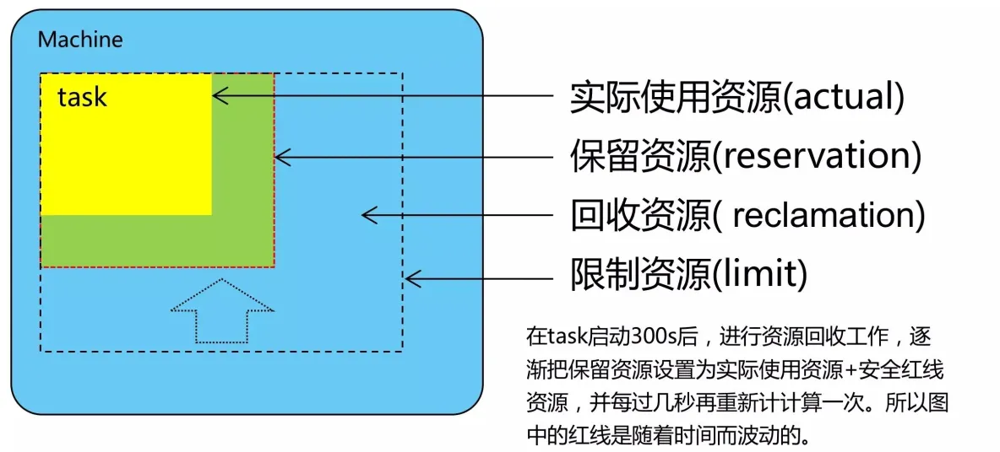
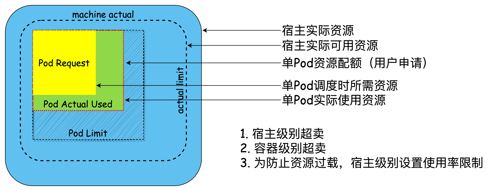

# 从容器调度到降本增效

> 从容器调度作为入口，尝试看清问题的本质。

## 容器调度

前一篇中介绍了[大规模容器平台的资源预算、精算、核算](https://mp.weixin.qq.com/s/ctMAaxaQ_EV3mqlswVwMOA)，本篇围绕容器调度开展。容器调度旨在有效地协调和管理系统中的有限资源，在保障服务 SLO 的前提下，满足任务和服务的需求。对于从事过容器调度相关工作的朋友来说，对超卖一定不陌生。容器平台一般都会对运行在其中的服务做一定程度的超卖，来达成平台本身的盈利目标。

如果是使用 K8S 的话，K8S 在每个 Container 中定义了 Request 和 Limit 两个属性分别用来代表单个 Container 可以使用的资源上限（Limit），以及调度侧调度器在进行调度时使用的资源大小（Request）。

业务级别的超卖一般指的是业务所申请的资源规格（Limit）大于 K8S 在调度时所使用的值（Request），整机级别的超卖则是其上所有业务的资源规格（Limit）之和大于整机的容量（Capacity）。

以 CPU 这种可压缩资源为例，业界常见的超卖做法如下：

- 基于 Request 和 Limit 的静态超卖，支持在不同维度自定义超卖比，比如业务申请 8c，调度时按 4c 计算；
- 基于真实负载的调度，即调度考虑服务历史运行周期的资源使用情况，使用一些预算算法预测未来的资源使用情况，跟据这些值来进行调度，比如业务申请 8c，但根据计算和预测，其最高只会用到 3c，调度时按照 3c 计算；

这是两种常见的调度策略，还存在基于以上两类调度策略的众多变种。但大部分的调度策略中都忽视了一个问题：**如何保障服务的 SLO**。

### 宏观控制面

K8S 源自 Google Borg，在设计之初就考虑到了这一点，通过 Request 和 Limit 两个值提供 QoS 机制，把保障业务 SLO 的能力暴露出去，交给 K8S 使用者来实现。同时提供了三种类型的 QoS：Guaranteed，Burstable，BestEffort。

- Guaranteed：Pod 内的所有 Container（包括 InitContainer） 都配置了 Request 和 Limit，且其 CPU、Memory 值均相等；
- BestEffort: Pod 内的所有 Container（包括 InitContainer） 都没有配置 Request 和 Limit；
- Burstable：除上述两种情况之外的所有场景；

Borg 则是定义了诸多的优先级实现类似的效果，为了保持原汁原味，这里使用英文版的内容，如下

> - Free tier: jobs running at these lowest priorities incurno internal charges, and have no Service Level Ob-jectives (SLOs). 2019 trace priority<=99; 2011 tracepriority bands 0 and 1.
> - Best-effort Batch (beb) tier: jobs running at thesepriorities are managed by the batch scheduler andincur low internal charges; they have no associatedSLOs. 2019 trace priority 110–115; 2011 trace prioritybands 2–8.
> - Mid-tier: jobs in this category offer SLOs weaker thanthose offered to production tier workloads, as well aslower internal charges. 2019 trace priority 116–119;not present in the 2011 trace.
> - Production tier: jobs in this category require highavailability (e.g., user-facing service jobs, or daemonjobs providing storage and networking primitives);internally charged for at “full price”. Borg willevictlower-tier jobs in order to ensure production tier jobsreceive their expected level of service. 2019 trace pri-ority 120–359; 2011 trace priority bands 9–10.
> - Monitoring tier: jobs we deem critical to our infras-tructure, including ones that monitor other jobs forproblems. 2019 trace priority>=360; 2011 trace priority band 11. (We merged the small number of monitor-ing jobs into the Production tier for this paper.)

服务优先级已经从 0-11 扩充到了 0-450。

以上摘自 [Borg：the Next Generation](https://dl.acm.org/doi/epdf/10.1145/3342195.3387517)

### 微观数据面

QoS 是对 SLO 宏观层面的定义，而操作系统为不同 QoS 的 Pod 提供微观层面的 SLO 保障和隔离能力。Kubelet 对外暴露了绑核、NUMA 亲和等能力，针对 Guaranteed 类型的 Pod，其每个 Container 会独占 CPU，而所有非 Guaranteed Pod 的 Container 将会共享（也做了绑核，绑的是余下所有的核，包括预留的核）剩余的所有核，同时 Kubelet 也会根据 CPU Request 和 Limit 的值设置 CPU shares 和 quota 的值（cgroup v1 v2 对应不同的文件）。

也可以通过扩展 Kubelet 或者完全自研的方式，配合 kernel，实现更丰富的隔离、压制能力等，例如基于 RDT 的超线程隔离，基于 cgroup identity 的绝对压制能力等。

### 能力层

前面涉及到的是基础能力，但怎么把这些基础能力暴露出去，怎么合理的使用这些基础能力，对调度效果也有至关重要的影响。一般情况下，K8S 并不会直接暴露给业务，在 K8S 之上会再封装一层对业务暴露。接受用户输入的资源规格和调度策略，转化为 K8S 可识别的参数，最终由 K8S 调度器做调度的决策，将资源分配给业务。

理想情况下，后台功能实现应该最大限度降低用户对其感知，通过完善的流程、机制和技术，为服务推荐对应的调度策略，规格和副本数，甚至自动化进行相关参数的设置和应用，同时在运行过程中遇到特殊情况可以及时的进行必要的重调度。

还有一个非常现实的问题，如何衡量调度效果的好坏或者收益。通常情况下大家直接使用使用率去衡量，但是使用率并不适合单独使用，还要结合业务 SLO 的指标。举个例子，即使在什么都不做的情况下，如果业务萧条，那使用率自然会低，如果业务增长，使用率自然会高。Borg 提供了一个用来衡量调度效果的方法：集群压缩比，即以业务实际历史运行来模拟，逐步挑选集群中的机器下线，直到找不到任何一台可以下线的机器停止，可以用总的机器数 / 最终机器数计算一个压缩比，这个值越大，说明浪费越严重。

在生产环境中，一般会刻意保留相当大的余地，以应对工作负载的增长、偶发的“黑天鹅”事件、负载峰值、机器故障、硬件升级以及大规模的部分故障（例如电源总线故障）。

这一层在实现的过程中会被简单化处理，致使 K8S 沦为简单的 CD 系统，有点买椟还珠或者杀鸡用牛刀的意思。

### 超卖

如果资源足够多，那调度系统就没有存在的必要。调度往往都是为了解决业务运行需要的资源与平台可以提供的资源之间的矛盾而存在的，最终超卖会成为常态。

#### Borg

> It achieves high utilization by combining admission control, efficient task-packing, over-commitment, and machinesharing with process-level performance isolation. It supports high-availability applications with runtime features that minimize  fault-recovery time, and scheduling policies that reduce the probability of correlated failures.

摘自 [Large-scale cluster management at Google with Borg](https://dl.acm.org/doi/epdf/10.1145/2741948.2741964)

Borg 在实现超卖的时的逻辑是其并不会对高优先级服务做超卖（资源申请 Limit > node capacity），甚至会少卖，以保证高优先级服务在需要其所申请的资源量的时候是可以获取到的。超卖的是上图中的回收资源，供一些低优先级服务使用。

#### K8S

对应最开始提到了 K8S 里面常用的基于静态 Request 和 Limit 值的超卖，以及为了降低超卖风险而增加的基于实际资源利用率的限制。相当于以实际使用率兜底，通过逐步扩大超卖比例来实现释放资源，提升资源使用率。

这种实现会有如下问题：

1. 随着部署密度和使用率的提升，资源争抢会越发严重，而如果忽略服务等级，单纯使用 K8S 的 Request 值作为 cpu share 争抢依据，那么很有可能会出现业务高峰期低优先业务抢占太多高优先业务的 CPU 资源的情况（低优服务的 Request 值大），得不偿失；
2. 高优先的服务真正需要使用到其所申请的资源量时，系统无法提供；

如果由于上述原因出现故障，那就是平台的原因了。

## 降本增效

随着互联网大厂故障频出，众多的吃瓜群众矛头直指降本增笑，来讽刺去年众多的裁员（人和机器）、年终打（骨）折等降本增效的行为。但这真的是造成故障的原因吗，或者说吃瓜群众真正笑的是什么？

降本增效是大势所趋，在这样的大环境下，各行各业似乎已经就此达成了共识。公司不是慈善机构，要保障其"业务连续性"，做出这种选择本也无可厚非。从实际的情况来看，在某些时间段内确实也起到了降本的功效，只不过这个过程中也伴随着一些"副作用"。

### **降**本

降本，意味着投入的减少，资源的减少，无论是人力、还是非人力（软件、硬件、运营、年终等）。

这都比较容易理解，比如机器少了，那本可能双活的，被搞成了单活，本来预留的应对黑天鹅事件的 buffer 被压榨，都可能导致系统无法提供业务真实的资源需求。比如裁员，可能会导致本该有的环节的缺失（QA），或者人力不足，或者人员能力缺失等造成一些潜在风险，埋下定时炸弹。又或者年终打折，这多少也会导致员工积极性的下降，甚至有一些个超出预料的行为。

### **不降本**

目前来看并没有证据说明这些故障就是降本造成的，而且在没有降本之前，并不是没有故障的发生。已经发生的问题只是整个稳定性风险里的冰山一角，降本在某些情况下可能只是催化剂，加速了故障的发生。

### **要解决的问题**

对于一个公司来说，他所做的所有决策都是有一个大前提的：业务的连续性。就如同上面讲的容器调度一样，也有一个大的前提是保障服务的稳定性，而服务的稳定性正是业务连续性的一环。

见识过去年互联网行业各厂的裁员、年终打折，裁员可能还可以解释，毕竟裁掉的一般也都是基于业务优先级考虑之后的那部分，年终打骨折这种行为，就跟容器调度里面的无差别超卖一个道理了。都是在资源紧张的情况下，都是在采用无差别"超卖"，结果都对稳定性产生了一定的影响。

降本增效势在必行，为了解决问题，优先级和账单是必须的，尽可能在降低影响的前提下还能有不错的效果，而这恰恰是不完善甚至不具备的能力。完善基础数据，并基于此健全成本优化决策能力，莫让降本增效真的变成降本增"笑"。

