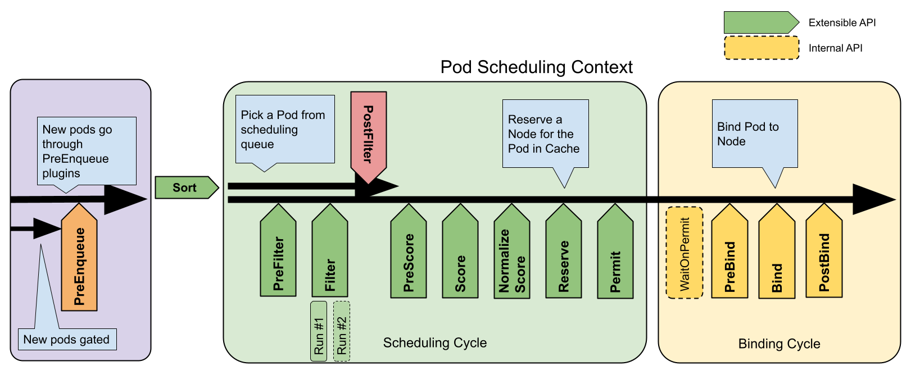

# 调度器性能调优系列

# 由来

线上调度器触发资源使用量报警，在定位问题的过程中又系统性的看了最新的 scheduler framework 的实现，以及涉及到的一些用来优化性能的 PR，这里做一个系统性的总结，分享给有类似问题或者需求的同志们。

出于篇幅考虑会拆分多篇进行讲述，每一篇集中在某个方向，所以可能不同篇有长有短。计划的章节如下，后续如果有新增的话会继续补充，遵循总分结构。

1. 调度器优化整体方向
2. SchedulerCache 优化
3. Snapshot 优化
4. Framework 优化
5. Plugin 优化

本篇作为汇总，不会过多介绍细节，期望通过对调度器的整体框架和工作流程的讲解让大家先有一个大概印象，方便后续章节进行。

# Framework

这个图应该都不陌生，想当于定义好了把大象放冰箱需要的步骤，算是 kube-scheduler 的基础吧。这个过程中会涉及到两个关键结构：Cache 与 Snapshot。

## Cache

Cache 用来缓存一些调度相关的数据，比如 Node，Pod，CSI 等信息。Cache 的存在是为了减少计算量，提升调度吞吐。在收到资源事件后进行"数据预处理"，相当于提前准备好了在 Plugin 里需要使用的数据，这样就不用每次在需要使用数据的时候现去计算。举个栗子 Cache 会根据收到已经绑定的 Pod 和 Node 事件以 Node 为维度计算好每个 Node 上的所有 Pod 已经分配的资源，这样在有 Pod 需要调度时只需要比较这个已经计算好的值 + 要调度的 Pod 的 Request 和 Node Allocatable 的大小即可，而不用遍历 Node 上所有已存在的 Pod 累加其 Request 了，也即是针对一个特定 Node 调度一个 Pod 时的 NodeResourceFit Plugin  的时间复杂度由 o(n) 降低到了 o(1)。

## Snapshot

Cache 本身以 Node 为维度保存了很多调度信息，针对 Cache 的任何操作都是需要加锁的，而 Snapshot 的存在就是为了解决这个锁的问题。如果没有 Snapshot 的话，调度时虽然可以读 Cache 来用，但是读的时候需要加锁，同时可能存在资源事件到来，就需要对 Cache 加锁，同时在进行 Node 筛选时也是多个 Goroutine 并发进行的，也会涉及到锁竞争。

Snapshot 顾名思义就是 Cache 的快照，在从队列中拿到要调度的 Pod 后会对 Cache 做一个快照，可以简单理解为复制一份数据，然后调度时就不再与 Cache 交互了，而是与 Snapshot 交互，这样就不需要加锁，也就没有锁竞争的问题了。

## Plugin

一些涉及到 Topology 的插件存在潜在的性能问题，和具体的使用方式有关，比如 InterPodAffinity，如果集群中存在大量设置了亲和/反亲和的 Pod 的话，调度器的吞吐也会降低，可以观察 plugin 耗时的指标，大部分插件的耗时是微妙级别的，有问题的插件的指标会到毫秒甚至更高，由于这个在代码中设置的上线就是 22.2ms，所以从监控上很可能会看到 22.2ms 的延迟，但真实的耗时并不是 22.2ms。

为什么 InterPodAffinity plugin 的耗时高？以 Prefilter 为例，如果欲调度的 Pod 设置了强制 Pod 反亲和，那么就需要遍历特定 Topology 下的所有节点，遍历节点上所有设置了强制 Pod 反亲和的 Pod，看欲调度的 Pod 是否满足其反亲和设置，同时需要遍历每个节点上的所有 Pod，看其是否满足欲调度 Pod 的反亲和设置。

注意这是两次遍历，第一次是用每一个存量 Pod 的反亲和设置去匹配欲调度的 Pod 的 Label，第二次是用欲调度的 Pod 的反亲和设置去匹配每一个存量 Pod 的 Label。针对每个要调度的 Pod 来说，时间复杂度是 O(MN)，M 为节点数，N 为每个节点上的 Pod 数。所以为了降低耗时，调度器里面使用了多个 Goroutine 来计算。可以在 InterPodAffinity 插件的单测中添加新的单测来分析插件性能，会发现只调度一个 Pod 的耗时和调度一批 Pod 时的平均耗时相差非常大，可以通过 go trace 分析具体原因，会在后续详细介绍。

## Framework

调度工作串行进行，每拿到一个 Pod 都会启动多个 Goroutine 进行节点筛选，启动的 Goroutine 数量，筛选的节点数量都会影响整体耗时。如何合理的使用 Goroutine，如何降低筛选的节点数量是可以考虑的优化项。

同时如果筛选完所有 Node 仍未找到合适的节点的话，Pod 会被扔到调度失败的队列中等待再次被调度，支持定时 + 事件触发，如果频繁的重试而仍然调度失败的话，也会对调度器吞吐有一定的影响，所以如何降低不必要的重试也是一个优化项。

如果自定义插件里面需要使用 CRD 或者内置资源，尤其是在需要注册对应 handler 做一些逻辑处理，处理后的数据会在调度过程中使用到的时候，这时候由于 scheduler framework 并不支持扩展 NodeInfo，Cache 等核心数据结构，也不支持自定义注册 handler，所以一般的实现方式都是在各自的插件中注册 handler 对数据做处理供调度使用。这里势必就需要加锁，类似 Cache 的处理逻辑，但是这里就没有 Snapshot 了，所以也会对整体的吞吐有一定的影响，如果不明白的话也没有关系，会在后续章节详细分析。

# 性能测试

k8s 项目中自带了 scheduler_perf，针对内置 plugin 内置了一些测试用例，可以直接运行，通过最终的 metrics 看到吞吐，e2e 耗时，插件耗时等信息。对于一些特殊场景，尤其是尚未解决的性能问题，自然测试用例可能也不存在，要不然就会发现问题解决问题了。同时 scheduler_perf 的某些实现也存在 bug 导致不能发现问题，所以用的时候还是可以合理的怀疑，尤其是你觉得有问题的实现，或者做了某些优化，但用他的程序跑出来发现没问题或者没效果的时候，可以去看看 scheduler_perf 的实现，说不定就会发现这个性能测试程序本身就存在 bug，别问我是怎么知道的...

当然也可以直接在单测文件中继续添加单测，而且这种方式非常便于调试，同时在代码中添加一个 trace 来统计不同阶段的耗时，甚至保存 pprof 文件进行分析，都是很便捷的分析调度器性能的方式，按需选择即可。

敬请期待后续章节，也欢迎互相交流~

