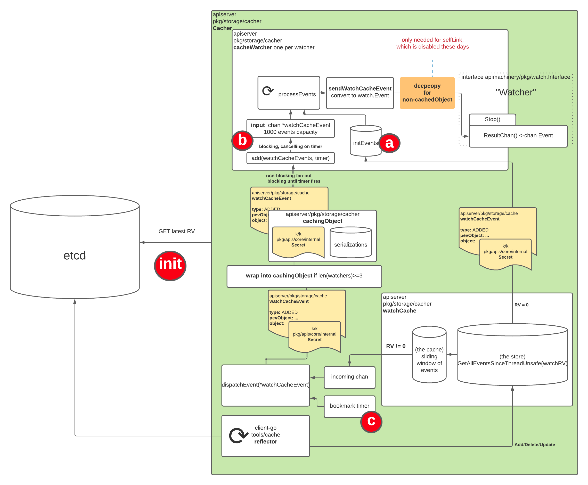

# kube-apiserver 内存优化进阶


# 背景

前面我们已经对 [kube-apiserver 内存消耗](https://mp.weixin.qq.com/s/FhNl1c2BdXJK-sDb0qzahw) 进行了阐述，文中最后提到了使用流式的请求来支持 List 的效果，从而实现对于单个请求来说，空间复杂度从 O(n) 转换成 O(1)，也讲述了其原理和流程。本篇从更细节的角度分析其在内存分配，序列化等方面做的进一步优化。

为了方便大家理解，前面多篇已经做了铺垫，建议按如下顺序阅读

1. [kubernetes 月光宝盒 - 时间倒流](https://mp.weixin.qq.com/s/B1OTBSIY7I-4TF0LaxtQUA)
2. [你真的搞懂 Informer 了吗？](https://mp.weixin.qq.com/s/ciEzUs5qb9WZYMl6QC8sZA)
3. [kube-apiserver 又 OOM 了？](https://mp.weixin.qq.com/s/FhNl1c2BdXJK-sDb0qzahw)
4. [Kubernetes 陈年老 bug - Stale Read](https://mp.weixin.qq.com/s/SMnKpnP5J07HBeG35oC9WQ)
5. [从 ListWatch 到 WatchList](https://mp.weixin.qq.com/s/futHT0njb5y2UHLeg7BL7w)

# 原理

内存优化是一个经典问题，在看具体 K8S 做了哪些工作之前，可以先抽象一些这个过程，思考一下如果是我们的话，会如何来优化。这个过程可以简单抽象为外部并发请求从服务端获取数据，如何在不影响吞吐的前提下降低服务端内存消耗？一般有几种方式：

- 缓存序列化的结果
- 优化序列化过程内存分配

数据压缩在这个场景可能不适用，压缩确实可以降低网络传输带宽，从而提升请求响应速度，但对服务端内存的优化没有太大的作用。kube-apiserver 已经支持基于 gzip 的数据压缩，只需要设置 `Accept-Encoding` 为 gzip 即可，详情可以参考[官网](https://kubernetes.io/zh-cn/docs/concepts/overview/kubernetes-api/)介绍。

当然缓存序列化的结果适用于客户端请求较多的场景，尤其是服务端需要同时把数据发送给多个客户时，缓存序列化的结果收益会比较明显，因为只需要一次序列化的过程即可，只要完成一次序列化，后续给其他客户端直接发送数据时直接使用之前的结果即可，省去了不必要的 CPU 和内存的开销。当然缓存序列化的结果这个操作本身来说也是会占用一些内存的，如果客户端数量较少，那么这个操作可能收益不大甚至可能带来额外的内存消耗。kube-apiserver watch 请求就与这个场景非常吻合。

下文会就 kube-apiserver 中是如何就这两点进行的优化做一个介绍。

# 实现

下文列出的时间线中的各种问题和优化可能而且有很大可能只是众多问题和优化中的一部分。

## 缓存序列化结果

### 时间线

1. 早在 2019 年的时候，社区有人反馈了一个[问题](https://github.com/kubernetes/kubernetes/issues/75294)：在一个包含 5000 个节点的集群中，创建一个大型的 Endpoints 对象（5000 个 Pod，大小接近 1MB），kube-apiserver 可能会在 5 秒内完全过载；
2. 接着社区定位了这个问题，并提出了 [KEP 1152 less object serializations](https://github.com/kubernetes/enhancements/tree/master/keps/sig-api-machinery/1152-less-object-serializations)，通过避免为不同的 watcher 重复多次序列化相同的对象，降低 kube-apiserver 的负载和内存分配次数，此功能在 v1.17 中发布，在 5000 节点的测试结果，内存分配优化 ~15%，CPU 优化 ~5%，但这个优化仅对 Http 协议生效，对 WebSocket 不生效；
3. 3 年后，也就是 2023 年，通过 [Refactor apiserver endpoint transformers to more natively use Encoders #119801](https://github.com/kubernetes/kubernetes/pull/119801) 对序列化逻辑进行重构，统一使用 Encoder 接口进行序列化操作，早在 2019 年就已经创建对应的 [issue 83898](https://github.com/kubernetes/kubernetes/issues/83898)。本次重构同时还解决了 2 提到的针对 WebSocket 不生效的问题，于 1.29 中发布；

所以如果你不是在以 WebSocket 形式（默认使用 Http Transfer-Encoding: chunked）使用 watch，那么升级到 1.17 之后理论上就可以了。

### 原理



新增了 `CacheableObject` 接口，同时在所有 Encoder 中支持对 CacheableObject 的支持，如下

```go
// Identifier represents an identifier.
// Identitier of two different objects should be equal if and only if for every
// input the output they produce is exactly the same.
type Identifier string

type Encoder interface {
	...
	// Identifier returns an identifier of the encoder.
	// Identifiers of two different encoders should be equal if and only if for every input
	// object it will be encoded to the same representation by both of them.
	Identifier() Identifier
}


// CacheableObject allows an object to cache its different serializations
// to avoid performing the same serialization multiple times.
type CacheableObject interface {
	// CacheEncode writes an object to a stream. The <encode> function will
	// be used in case of cache miss. The <encode> function takes ownership
	// of the object.
	// If CacheableObject is a wrapper, then deep-copy of the wrapped object
	// should be passed to <encode> function.
	// CacheEncode assumes that for two different calls with the same <id>,
	// <encode> function will also be the same.
	CacheEncode(id Identifier, encode func(Object, io.Writer) error, w io.Writer) error

	// GetObject returns a deep-copy of an object to be encoded - the caller of
	// GetObject() is the owner of returned object. The reason for making a copy
	// is to avoid bugs, where caller modifies the object and forgets to copy it,
	// thus modifying the object for everyone.
	// The object returned by GetObject should be the same as the one that is supposed
	// to be passed to <encode> function in CacheEncode method.
	// If CacheableObject is a wrapper, the copy of wrapped object should be returned.
	GetObject() Object
}

func (e *Encoder) Encode(obj Object, stream io.Writer) error {
	if co, ok := obj.(CacheableObject); ok {
		return co.CacheEncode(s.Identifier(), s.doEncode, stream)
	}
	return s.doEncode(obj, stream)
}

func (e *Encoder) doEncode(obj Object, stream io.Writer) error {
	// Existing encoder logic.
}

// serializationResult captures a result of serialization.
type serializationResult struct {
	// once should be used to ensure serialization is computed once.
	once sync.Once

	// raw is serialized object.
	raw []byte
	// err is error from serialization.
	err error
}

// metaRuntimeInterface implements runtime.Object and
// metav1.Object interfaces.
type metaRuntimeInterface interface {
	runtime.Object
	metav1.Object
}

// cachingObject is an object that is able to cache its serializations
// so that each of those is computed exactly once.
//
// cachingObject implements the metav1.Object interface (accessors for
// all metadata fields). However, setters for all fields except from
// SelfLink (which is set lately in the path) are ignored.
type cachingObject struct {
	lock sync.RWMutex

	// Object for which serializations are cached.
	object metaRuntimeInterface

	// serializations is a cache containing object`s serializations.
	// The value stored in atomic.Value is of type serializationsCache.
	// The atomic.Value type is used to allow fast-path.
	serializations atomic.Value
}
```

`cachingObject` 实现了 `CacheableObject` 接口，其 `object` 为关注的事件对象（例如 Pod），`serializations` 用来保存序列化之后的结果，`Identifier` 是一个标识，代表序列化的类型，因为存在 json、yaml、protobuf 三种序列化方式。

`cachingObject` 的生成在上图 Cacher dispatchEvent 消费自身 incoming chan 数据，将 event 发给所有相关的 cacheWatchers 的时候，会将事件对象转化为 cachingObject 发给 cacheWatcher 的 input chan。最终的 Encode 操作是在 serveWatch 方法中将最终的对象进行序列化时调用的，会先判断是否已经存在序列化的结果，存在则直接复用，避免重复的序列化。

**注意**：

1. 上图 `wrap into cachingObject if len(watchers) >= 3` 已成为过去式，新的代码逻辑中已经去掉了后面的判断，不管 watchers 数量，统一都进行 cachingObject 的封装；

1. 并没有对 Init Event（watchcache 中的全量数据） 进行 cachingObject 的封装，只有发给 Cacher incoming chan 的数据会转化为 cachingObject。也就是说这个优化对 Get/List 请求完全无效，因为他们是直接从 watchcache 返回数据的，针对 Watch 请求，也将会有部分数据在返回时没有复用已有序列化结果，因为仍然可能会有部分 Init Event 数据是从 watchcache 获取并返回的，**这是一个很神奇的地方，cacheWatcher 的 input chan 的 event 对象的 object 有可能是正常的资源对象，例如 Pod，也有可能是 CacheableObject 对象，而真正的资源对象则保存在 CacheableObject 的 object 中**；

   为什么不把 Init Event 也覆盖了，KEP 1152 中给的说法是先实现 Cache incoming chan 的覆盖，收益就已经比较可观了，解决了之前发现的问题。如果需要进一步优化的话，再来重新评估把 Init Event 也覆盖的可能。而在 [Refactor streaming watch encoder to enable caching #120300](https://github.com/kubernetes/kubernetes/pull/120300) 的评论中也有相关讨论

   

   同时在 [KEP 3157 watch-list](https://github.com/kubernetes/enhancements/blob/master/keps/sig-api-machinery/3157-watch-list/README.md) 中也提到了这个待优化项。

## 优化内存分配

### 时间线

1. [reduce the number of allocations in the WatchServer during objects serialisation #108186](https://github.com/kubernetes/kubernetes/pull/108186)，主要针对 protobuf 进行优化，对于  json 和 yaml 序列化无效，2022 年随着 v1.24 发布，protobuf 一般是内部组件使用，而外部组件访问 k8s 时一般都是使用 json 或者 yaml 序列化；

2. [Do not copy bytes for cached serializations #118362](https://github.com/kubernetes/kubernetes/pull/118362/)，自定义 SpliceBuffer，避免对 cachingObject 的序列化结果进行深拷贝，2023 年随着 v1.28 发布；

3. [Refactor streaming watch encoder to enable caching #120300](https://github.com/kubernetes/kubernetes/pull/120300)，这个修复是在已有的缓存资源对象的序列化结果的基础上，把 Event 的序列化结果也做缓存，因为最终返回给客户端的是 Event 而不是资源对象；

### 原理

针对 2，巧妙地定义了 SpliceBuffer 通过浅拷贝的方式有效的优化了内存分配，避免 embeddedEncodeFn 对已经序列化后的结果 []byte 的深拷贝；

   ```go
   // A spliceBuffer implements Splice and io.Writer interfaces.
   type spliceBuffer struct {
   	raw []byte
   	buf *bytes.Buffer
   }
   
   // Splice implements the Splice interface.
   func (sb *spliceBuffer) Splice(raw []byte) {
   	sb.raw = raw
   }
   ```

Benchmark 效果显著

   ```shell
   go test -benchmem -run=^$ -bench ^BenchmarkWrite k8s.io/apimachinery/pkg/runtime -v -count 1
   goos: linux
   goarch: amd64
   pkg: k8s.io/apimachinery/pkg/runtime
   cpu: AMD EPYC 7B12
   BenchmarkWriteSplice
   BenchmarkWriteSplice-48         151164015                7.929 ns/op           0 B/op          0 allocs/op
   BenchmarkWriteBuffer
   BenchmarkWriteBuffer-48          3476392               357.8 ns/op          1024 B/op          1 allocs/op
   PASS
   ok      k8s.io/apimachinery/pkg/runtime 3.619s
   ```

针对 3，严格来说这个 pr 不是用来优化内存分配的，而是来解决 [issue 110146](https://github.com/kubernetes/kubernetes/issues/110146) 的提到的 json 序列化时 json.compact 导致的 CPU 使用率过高的问题，随着 v1.29 发布。问题产生的原因是虽然上面提到了通过 cachingObject 来缓存资源对象的序列化结果，但最终发回到客户端的是 Event 对象，还是需要做一次 Event 的序列化操作，而 json.compact 会在每次 Marshal 后被调用，这是 golang 自带的 json 序列化的实现，可以参考 [golang json 源码](https://github.com/golang/go/blob/d8762b2f4532cc2e5ec539670b88bbc469a13938/src/encoding/json/encode.go#L498)。这个修复是在缓存资源对象的序列化结果的基础上，把 Event 的序列化结果也做缓存，用来规避 json.compact 带来的影响。

这个 PR 涉及到的改动较大，笔者目前对其实现仍然存在一些疑问，已经提了 [issue 122153](https://github.com/kubernetes/kubernetes/issues/122153) 咨询社区，等搞清楚后可以再专门安排一篇来讲讲这个实现，这块涉及到了 watch handler 的整个序列化逻辑，Encoder 的嵌套非常深，连 google 大神在 review 代码时都有如下感叹

   

   

笔者在看这块代码时被接口的来回跳转搞晕了，写了个 unit test 来一步步调试才搞清楚这些 Encoder，真的是层层嵌套，梳理如下，可以感受下这五层嵌套

watchEncoder

   —> watchEmbeddedEncoder

   ​     —> encoderWithAllocator

   ​         —> codec

   ​             —> json.Serializer

他们都实现了 Encoder 接口...

类似 cachingObject 序列化，对 Event 进行序列化同样需要额外的内存空间，但可以避免对每个 Event 进行多次序列化带来的内存消耗和 CPU 消耗，所以也起到了内存优化的作用。

# 效果

通过 WatchList 以及上述的种种优化，社区给出了优化效果

优化前


优化后


# 最后

Kube-apiserver 内存优化系系列包含前面的铺垫，到此也 6 篇了，如果把这其中涉及到的知识都搞懂了，对 kube-apiserver 的理解一定可以上一个台阶，后续也会持续关注这块的内容，不定时补充~

序列化，听上去简单，调个方法的事情，但用好了也不容易，往往这种地方最能体现能力，寻常见功力，细微见真章，看看大牛写的代码，领会其中的设计和思想，总结转化吸收为我所用。

k8s 使用起来容易，用好了不容易，搞明白背后是怎么回事难。项目经过 10 来年的迭代，无论代码量还是复杂度上面都已经比较恐怖了，而且还在不断地迭代更新，但路虽远，行则将至，事虽难，做虽然不一定成吧，不做一定成不了。

Talk is cheap, Show me the code and PPT

最后，欢迎加笔者微信 YlikakuY，一起交流前沿技术，行业动态~


