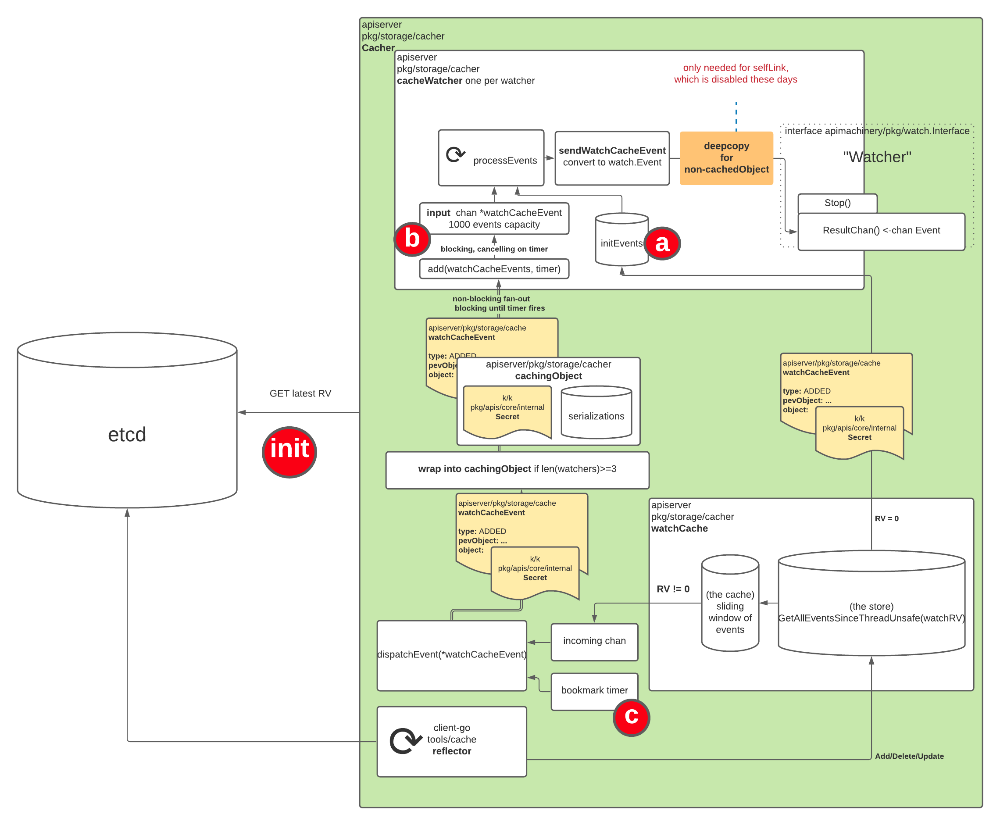

# 一条 Watch 请求的一生


> Watch 请求像极了打工人的一生，从加入社会（cacher.watchers）开始就不停地被 Push，拼命的干，干的慢了就有可能会被干掉，干的快的奖励干到寿终正寝，就像某些专家建议的一样。

前面已经通过一个系列来介绍 kube-apiserver cache 相关内容，本篇旨在通过分析 Watch 请求的生命周期把前面涉及到的关键内容串联起来，系统的描述在每个阶段都涉及到哪些关键内容，方便更直观的了解之前每一篇在整个过程中的位置和作用。

基于 v1.29 分支，针对 HTTP 协议分析（忽略 WS）。

# 怎么来滴

## 客户端

### 发起请求

Watch 请求本质还是 List 请求，集群中的大部分 watch 请求来自于集群内的 agent 或者 DaemonSet 类的数据面组件，比如 kubelet，kube-proxy 等，当然也可能会存在一些非 Go 语言的组件，但无论什么语言，什么组件，最终都是调用了 kube-apiserver 对应的 API 来实现的 watch。以常用的 [client-go informer](https://mp.weixin.qq.com/s/ciEzUs5qb9WZYMl6QC8sZA) 为例，看如下调用

```go
c.client.Get().
		Resource("pods").
		VersionedParams(&opts, scheme.ParameterCodec).
		Timeout(timeout).
		Watch(ctx)
```

`VersionedParams` 方法处理 opts（ListOptions）里面的参数并保存到 `request.params` 中，在最后调用 `Watch` 时会调用 `URL` 方法，利用 `request.params` 生成 url 的 query，最后返回完整的 url，其中 Watch: true 就是 ListOptions 的参数，最终会拼到生成的 url query 中，类似 /api/v1/pods?watch=true  的形式。

### 数据流

特指使用 client-go informer 时的数据流


## 服务端

### 路由

当客户端最终调用了 API 进行 watch，kube-apiserver 收到请求后会启动一个 goroutine 调用相应的 handler 来处理这个请求。kube-apiserver 启动时会进行路由注册，最终通过 `APIInstaller` 的 `registerResourceHandlers` 注册路由及对应的 handler，如下

```go
func (a *APIInstaller) registerResourceHandlers(path string, storage rest.Storage, ws *restful.WebService) (*metav1.APIResource, *storageversion.ResourceInfo, error) {
			...
}
```

三个入参，分来是路径，后端存储，路由，每一种资源都有自己对应的 `Storage`，但所有的 `Storage` 又都包含了相同的匿名嵌套结构 `*genericregistry.Store`，而此结构实现了 Watch 接口，所以所有的 `Storage` 也就都实现了 Watch 接口。handler 注册如下

```go
case "LIST": // List all resources of a kind.
			doc := "list objects of kind " + kind
			if isSubresource {
				doc = "list " + subresource + " of objects of kind " + kind
			}
			handler := metrics.InstrumentRouteFunc(action.Verb, group, version, resource, subresource, requestScope, metrics.APIServerComponent, deprecated, removedRelease, restfulListResource(lister, watcher, reqScope, false, a.minRequestTimeout))
			handler = utilwarning.AddWarningsHandler(handler, warnings)
			route := ws.GET(action.Path).To(handler)
```

如果看代码的话，还能看到其他地方有 watch handler 的注册，但会标注 `deprecated in 1.11`，这些 case 分支对应的是在 uri **path** 中添加 watch/ 的那些请求，类似 /api/v1/pods/watch 的路径，而客户端是通过 **query** 传递的参数，所以最终还是命中 case List。

### Handler

业务逻辑在 `restfulListResource` 中，经过一层层的函数调用，最终实例化一个对应的 `WatchServer` 对象，并通过 `HandleHTTP` 来处理

```go
// HandleHTTP serves a series of encoded events via HTTP with Transfer-Encoding: chunked.
// or over a websocket connection.
func (s *WatchServer) HandleHTTP(w http.ResponseWriter, req *http.Request) {
	flusher, ok := w.(http.Flusher)
	if !ok {
		err := fmt.Errorf("unable to start watch - can't get http.Flusher: %#v", w)
		utilruntime.HandleError(err)
		s.Scope.err(errors.NewInternalError(err), w, req)
		return
	}

	framer := s.Framer.NewFrameWriter(w)
	if framer == nil {
		// programmer error
		err := fmt.Errorf("no stream framing support is available for media type %q", s.MediaType)
		utilruntime.HandleError(err)
		s.Scope.err(errors.NewBadRequest(err.Error()), w, req)
		return
	}

	// ensure the connection times out
	timeoutCh, cleanup := s.TimeoutFactory.TimeoutCh()
	defer cleanup()

	// begin the stream
	w.Header().Set("Content-Type", s.MediaType)
	w.Header().Set("Transfer-Encoding", "chunked")
	w.WriteHeader(http.StatusOK)
	flusher.Flush()

	kind := s.Scope.Kind
	watchEncoder := newWatchEncoder(req.Context(), kind, s.EmbeddedEncoder, s.Encoder, framer)
	ch := s.Watching.ResultChan()
	done := req.Context().Done()

	for {
		select {
		case <-s.ServerShuttingDownCh:
			// the server has signaled that it is shutting down (not accepting
			// any new request), all active watch request(s) should return
			// immediately here. The WithWatchTerminationDuringShutdown server
			// filter will ensure that the response to the client is rate
			// limited in order to avoid any thundering herd issue when the
			// client(s) try to reestablish the WATCH on the other
			// available apiserver instance(s).
			return
		case <-done:
			return
		case <-timeoutCh:
			return
		case event, ok := <-ch:
			if !ok {
				// End of results.
				return
			}
			metrics.WatchEvents.WithContext(req.Context()).WithLabelValues(kind.Group, kind.Version, kind.Kind).Inc()
			isWatchListLatencyRecordingRequired := shouldRecordWatchListLatency(event)

			if err := watchEncoder.Encode(event); err != nil {
				utilruntime.HandleError(err)
				// client disconnect.
				return
			}

			if len(ch) == 0 {
				flusher.Flush()
			}
			if isWatchListLatencyRecordingRequired {
				metrics.RecordWatchListLatency(req.Context(), s.Scope.Resource, s.metricsScope)
			}
		}
	}
}
```

可以看到 watch 是通过为 HTTP 设置 `Transfer-Encoding: chunked` 实现的，`s.Watching` 就是上面提到的 `Storage.(Watcher).Watch` 的返回结果，`Storage.(Watcher)` 就是 `*genericregistry.Store`，`Store` 结构体本身也有个叫 `Storage` 的属性，经典的 store，storage 模式，store 是服务的封装，storage 的存储的封装。最终往 response 里面写的内容是从 `ch := s.Watching.ResultChan()` 获取的，然后[对 Event 以及 Event 中包含的资源对象进行序列化](https://mp.weixin.qq.com/s/RrBOHRSztsnkp5M2_32VrQ)后写到最后的 response 中。

### 数据流

`Store.Storage` 要么是 cacher，要么是 Etcd，由 kube-apiserver 的启动参数 `--watch-cache` 控制，默认为 true，对应 `Store.Storage` 是 cacher，这里我们只关注 cacher 的场景，最终返回的 cacheWatcher 现了 `k8s.io/apimachinery/pkg/watch/watch.go` 文件中定义的 `Interface` 接口（这个接口类型名字有点抽象）。

```go
// Watch implements storage.Interface.
func (c *cacher) Watch(ctx context.Context, key string, opts storage.ListOptions) (watch.Interface, error) {
	...
  
	triggerValue, triggerSupported := "", false
	if c.indexedTrigger != nil {
		for _, field := range pred.IndexFields {
			if field == c.indexedTrigger.indexName {
				if value, ok := pred.Field.RequiresExactMatch(field); ok {
					triggerValue, triggerSupported = value, true
				}
			}
		}
	}

	// It boils down to a tradeoff between:
	// - having it as small as possible to reduce memory usage
	// - having it large enough to ensure that watchers that need to process
	//   a bunch of changes have enough buffer to avoid from blocking other
	//   watchers on our watcher having a processing hiccup
	chanSize := c.watchCache.suggestedWatchChannelSize(c.indexedTrigger != nil, triggerSupported)

	// Determine a function that computes the bookmarkAfterResourceVersion
	bookmarkAfterResourceVersionFn, err := c.getBookmarkAfterResourceVersionLockedFunc(ctx, requestedWatchRV, opts)
	if err != nil {
		return newErrWatcher(err), nil
	}

	// Determine a function that computes the watchRV we should start from
	startWatchResourceVersionFn, err := c.getStartResourceVersionForWatchLockedFunc(ctx, requestedWatchRV, opts)
	if err != nil {
		return newErrWatcher(err), nil
	}

	// Determine watch timeout('0' means deadline is not set, ignore checking)
	deadline, _ := ctx.Deadline()

	identifier := fmt.Sprintf("key: %q, labels: %q, fields: %q", key, pred.Label, pred.Field)

	// Create a watcher here to reduce memory allocations under lock,
	// given that memory allocation may trigger GC and block the thread.
	// Also note that emptyFunc is a placeholder, until we will be able
	// to compute watcher.forget function (which has to happen under lock).
	watcher := newCacheWatcher(
		chanSize,
		filterWithAttrsFunction(key, pred),
		emptyFunc,
		c.versioner,
		deadline,
		pred.AllowWatchBookmarks,
		c.groupResource,
		identifier,
	)

	// note that c.waitUntilWatchCacheFreshAndForceAllEvents must be called without
	// the c.watchCache.RLock held otherwise we are at risk of a deadlock
	// mainly because c.watchCache.processEvent method won't be able to make progress
	//
	// moreover even though the c.waitUntilWatchCacheFreshAndForceAllEvents acquires a lock
	// it is safe to release the lock after the method finishes because we don't require
	// any atomicity between the call to the method and further calls that actually get the events.
	forceAllEvents, err := c.waitUntilWatchCacheFreshAndForceAllEvents(ctx, requestedWatchRV, opts)
	if err != nil {
		return newErrWatcher(err), nil
	}

	// We explicitly use thread unsafe version and do locking ourself to ensure that
	// no new events will be processed in the meantime. The watchCache will be unlocked
	// on return from this function.
	// Note that we cannot do it under cacher lock, to avoid a deadlock, since the
	// underlying watchCache is calling processEvent under its lock.
	c.watchCache.RLock()
	defer c.watchCache.RUnlock()

	startWatchRV := startWatchResourceVersionFn()
	var cacheInterval *watchCacheInterval
	if forceAllEvents {
		cacheInterval, err = c.watchCache.getIntervalFromStoreLocked()
	} else {
		cacheInterval, err = c.watchCache.getAllEventsSinceLocked(startWatchRV)
	}
	if err != nil {
		// To match the uncached watch implementation, once we have passed authn/authz/admission,
		// and successfully parsed a resource version, other errors must fail with a watch event of type ERROR,
		// rather than a directly returned error.
		return newErrWatcher(err), nil
	}

	addedWatcher := false
	func() {
		c.Lock()
		defer c.Unlock()

		if generation, ok := c.ready.checkAndReadGeneration(); generation != readyGeneration || !ok {
			// We went unready or are already on a different generation.
			// Avoid registering and starting the watch as it will have to be
			// terminated immediately anyway.
			return
		}

		// Update watcher.forget function once we can compute it.
		watcher.forget = forgetWatcher(c, watcher, c.watcherIdx, scope, triggerValue, triggerSupported)
		// Update the bookMarkAfterResourceVersion
		watcher.setBookmarkAfterResourceVersion(bookmarkAfterResourceVersionFn())
		c.watchers.addWatcher(watcher, c.watcherIdx, scope, triggerValue, triggerSupported)
		addedWatcher = true

		// Add it to the queue only when the client support watch bookmarks.
		if watcher.allowWatchBookmarks {
			c.bookmarkWatchers.addWatcherThreadUnsafe(watcher)
		}
		c.watcherIdx++
	}()

	if !addedWatcher {
		// Watcher isn't really started at this point, so it's safe to just drop it.
		//
		// We're simulating the immediate watch termination, which boils down to simply
		// closing the watcher.
		return newImmediateCloseWatcher(), nil
	}

	go watcher.processInterval(ctx, cacheInterval, startWatchRV)
	return watcher, nil
}
```

先计算 chan 缓冲区大小，然后实例化 cacheWatcher 对象，至此 watch 请求对应的服务端数据结构 cacheWatcher 也生成了。

cacher 是在 kube-apiserver 启动时就开始运行的，对应到 watch 请求的生命周期则是

1. 8）步入社会：从客户端请求开始，创建 cacheWatcher 并通过 `addWachter` 方法加入到 cacher.watchers 里面；
2. 6）被 Push：加入到 cacher.watchers 后就不停地被 push；
3. 7）干到干不动：启动一个 goroutine 调用 `processInterval` 来进行核心逻辑处理；


### 小结

至此，已经介绍了从客户端发起请求，到服务端通过已经注册的路由和对应 handler 去创建新的 cacheWatcher，并消费 cacheWatcher 的 ResultChan 把最终的 event 序列化后写到 response 中的整个过程。

# 干到干不动

## 三驾马车

```go
type cacheWatcher struct {
	input     chan *watchCacheEvent
	result    chan watch.Event
  done      chan struct{}
}
```

cacheWatcher 有三个 chan，其中 input 用来接收 cacher 发过来的 event，result 用来保存最终要返回的 event，上面提到的 `processInterval` 会消费 input 中的数据，发送到 result 中，done 用来控制是否还要往 result 中发送数据。前两个 chan 用来存放 event，是带缓冲的，缓冲的大小与资源类型以及 watchCache 的滑动窗口大小有关，

```go
func (w *watchCache) suggestedWatchChannelSize(indexExists, triggerUsed bool) int {
	// To estimate the channel size we use a heuristic that a channel
	// should roughly be able to keep one second of history.
	// We don't have an exact data, but given we store updates from
	// the last <eventFreshDuration>, we approach it by dividing the
	// capacity by the length of the history window.
	chanSize := int(math.Ceil(float64(w.currentCapacity()) / eventFreshDuration.Seconds()))

	// Finally we adjust the size to avoid ending with too low or
	// to large values.
	if chanSize < minWatchChanSize {
		chanSize = minWatchChanSize
	}
	var maxChanSize int
	switch {
	case indexExists && triggerUsed:
		maxChanSize = maxWatchChanSizeWithIndexAndTrigger
	case indexExists && !triggerUsed:
		maxChanSize = maxWatchChanSizeWithIndexWithoutTrigger
	case !indexExists:
		maxChanSize = maxWatchChanSizeWithoutIndex
	}
	if chanSize > maxChanSize {
		chanSize = maxChanSize
	}
	return chanSize
}
```

watchCache 滑动窗口大小从 [v1.19 开始支持动态调整](https://github.com/kubernetes/kubernetes/pull/90091)，初始值 100，最大 100 * 1024，chanSize 根据当前滑动窗口大小和 eventFreshDuration（从最初的 5m 调整到了最新的 75s）计算一个值，然后再根据传入的两个参数得到最大值，最终的 chanSize 介于最大值和最小值之间。传入的两个参数的计算逻辑如下

```go
triggerValue, triggerSupported := "", false
	if c.indexedTrigger != nil {
		for _, field := range pred.IndexFields {
			if field == c.indexedTrigger.indexName {
				if value, ok := pred.Field.RequiresExactMatch(field); ok {
					triggerValue, triggerSupported = value, true
				}
			}
		}
	}

	// It boils down to a tradeoff between:
	// - having it as small as possible to reduce memory usage
	// - having it large enough to ensure that watchers that need to process
	//   a bunch of changes have enough buffer to avoid from blocking other
	//   watchers on our watcher having a processing hiccup
	chanSize := c.watchCache.suggestedWatchChannelSize(c.indexedTrigger != nil, triggerSupported)
```

这里是专门为 Pod 做的优化，`c.indexedTrigger` 只有当资源类型是 Pod 时才有值，indexName 为 `spec.nodeName`，indexerFunc 返回 `pod.spec.nodeName` 的值，其作用会在下文分析。最终 chanSize 的结果如下

- 对于携带了 `fieldSelector=spec.nodeName=nodeA` 的 pod watch 请求（多来自 kubelet），其最终的 chanSize 固定为 10；
- 对于没有携带上述 fieldSelector 的 pod watch 请求，其最终的 chanSize 介于 10 ~ 1000；
- 对于其他非 pod 的 watch 请求，其最终的 chanSize 介于 10 ~ 100 之间；

chanSize 会作为最终创建的 cacheWatcher 的 input 和 result chan 的缓冲区大小。

## 辛苦劳碌



- c）Push 数据到 input chan：cacheWatcher input 和 result chan 接受资源的 add，update，delete event，同时也接受自 v1.15 开始支持的 bookmark event；
- a）把 initEvents 发送到 result chan：对于 watch 请求，如果 RV 不设置或者设置为 0，则从 `watchCache store` 返回 initEvents，否则只要其值不小于 watchCache 滑动窗口最老的 event 的 RV，则从 `watchCache` 滑动窗口返回 initEvents；
- b）消费 input chan 并发送到 result chan：initEvents 发送完之后开始消费 input chan 中的数据；

由于 cacheWatcher input chan 数据来自 cacher，所以下面的分析中也会对 cacher 相关逻辑进行分析，会标注功能所属，如前置过滤 - cacher 就代表 cacher 里面的功能。

### 前置过滤 - cacher

```go
// startDispatching chooses watchers potentially interested in a given event
// a marks dispatching as true.
func (c *Cacher) startDispatching(event *watchCacheEvent) {
    // It is safe to call triggerValuesThreadUnsafe here, because at this
    // point only this thread can access this event (we create a separate
    // watchCacheEvent for every dispatch).
    triggerValues, supported := c.triggerValuesThreadUnsafe(event)

    c.Lock()
    defer c.Unlock()

    c.dispatching = true
    // We are reusing the slice to avoid memory reallocations in every
    // dispatchEvent() call. That may prevent Go GC from freeing items
    // from previous phases that are sitting behind the current length
    // of the slice, but there is only a limited number of those and the
    // gain from avoiding memory allocations is much bigger.
    c.watchersBuffer = c.watchersBuffer[:0]

    if event.Type == watch.Bookmark {
       c.startDispatchingBookmarkEventsLocked()
       // return here to reduce following code indentation and diff
       return
    }

    // iterate over watchers for each applicable namespace/name tuple
    namespace := event.ObjFields["metadata.namespace"]
    name := event.ObjFields["metadata.name"]
    if len(namespace) > 0 {
       if len(name) > 0 {
          // namespaced watchers scoped by name
          for _, watcher := range c.watchers.allWatchers[namespacedName{namespace: namespace, name: name}] {
             c.watchersBuffer = append(c.watchersBuffer, watcher)
          }
       }
       // namespaced watchers not scoped by name
       for _, watcher := range c.watchers.allWatchers[namespacedName{namespace: namespace}] {
          c.watchersBuffer = append(c.watchersBuffer, watcher)
       }
    }
    if len(name) > 0 {
       // cluster-wide watchers scoped by name
       for _, watcher := range c.watchers.allWatchers[namespacedName{name: name}] {
          c.watchersBuffer = append(c.watchersBuffer, watcher)
       }
    }
    // cluster-wide watchers unscoped by name
    for _, watcher := range c.watchers.allWatchers[namespacedName{}] {
       c.watchersBuffer = append(c.watchersBuffer, watcher)
    }

    if supported {
       // Iterate over watchers interested in the given values of the trigger.
       for _, triggerValue := range triggerValues {
          for _, watcher := range c.watchers.valueWatchers[triggerValue] {
             c.watchersBuffer = append(c.watchersBuffer, watcher)
          }
       }
    } else {
       // supported equal to false generally means that trigger function
       // is not defined (or not aware of any indexes). In this case,
       // watchers filters should generally also don't generate any
       // trigger values, but can cause problems in case of some
       // misconfiguration. Thus we paranoidly leave this branch.

       // Iterate over watchers interested in exact values for all values.
       for _, watchers := range c.watchers.valueWatchers {
          for _, watcher := range watchers {
             c.watchersBuffer = append(c.watchersBuffer, watcher)
          }
       }
    }
}
```

c）是 cacher 的行为，发送之前会先调用 `startDispatching` 方法根据 `cacher.watchers` 和 event type 准备好要接收对应 event 的所有 cacheWatcher 放到 `c.watchersBuffer` 中。上一小节提到的 `indexedTrigger` 的作用就是减少特定情况下的需要遍历的 cacheWatcher 的数量，提升 cacher.incoming chan 的消费速度，因为他也是带缓冲的 chan，chan size 也是 100，而且也是在不停的接受来自 Etcd 的 event；

```go
for _, watcher := range c.watchersBuffer {
	  if !watcher.nonblockingAdd(event) {
		    c.blockedWatchers = append(c.blockedWatchers, watcher)
    }
}
```

相当于提前根据 event 过滤掉了不关注此 event 的 cacheWatcher，这样上面的 for 循环需要遍历的次数就会降低，尤其是对带了 `spec.nodeName` 的来自 kubelet 的 watch 请求，一个非 bookmark event 里面的资源对象如果是已经调度成功的 pod 的话，他只需要发送到指定的一个 cacheWatcher 即可，而如果没有这个功能的话，他就得把这个 event 发送给所有 cacheWatcher，然后等到 b）消费 input 数据时再根据 filter 过滤掉不匹配的 event。

对于一个 5000 个 node 的集群来说，`c.watchersBuffer` 数量会从 5000 变成 1，同时数据也只往一个 cacheWatcher 的 input chan 发送，**无论内存大小还是 cpu 消耗都是一个巨大的提升**，如果没有这个功能的话，随着集群规模的提升，在 kube-apiserver 中会出现特别多 `Fast watcher, slow processing` 字样的日志（前提日志等级需要至少开到 3），这代表处理从 Etcd 读到的 event 太慢了，`watchChan` 的 `incomingEventChan` 或者 `resultChan` 缓冲区（都是 100）满了，导致客户端感知到的 event 出现延迟，同时由于从 Etcd 接受到的 event 无法及时处理都堆积在内存中，内存也会开始增加。

### 控制 bookmark 频率 - cacher

bookmark event 是由 bookmark timer 定时发送的，来自 Etcd 的 progressNotify 所转换的 bookmark 并不会直接发送给所有的 cacheWatcher，只是更新 `lastProcessedResourceVersion`，代码如下

```go
func (c *cacher) dispatchEvents() {
	// Jitter to help level out any aggregate load.
	bookmarkTimer := c.clock.NewTimer(wait.Jitter(time.Second, 0.25))
	defer bookmarkTimer.Stop()

	lastProcessedResourceVersion := uint64(0)
	for {
		select {
		case event, ok := <-c.incoming:
			if !ok {
				return
			}
			// Don't dispatch bookmarks coming from the storage layer.
			// They can be very frequent (even to the level of subseconds)
			// to allow efficient watch resumption on kube-apiserver restarts,
			// and propagating them down may overload the whole system.
			//
			// TODO: If at some point we decide the performance and scalability
			// footprint is acceptable, this is the place to hook them in.
			// However, we then need to check if this was called as a result
			// of a bookmark event or regular Add/Update/Delete operation by
			// checking if resourceVersion here has changed.
			if event.Type != watch.Bookmark {
				c.dispatchEvent(&event)
			}
			lastProcessedResourceVersion = event.ResourceVersion
			metrics.EventsCounter.WithLabelValues(c.groupResource.String()).Inc()
		case <-bookmarkTimer.C():
			bookmarkTimer.Reset(wait.Jitter(time.Second, 0.25))
			
      ...
      
			bookmarkEvent := &watchCacheEvent{
				Type:            watch.Bookmark,
				Object:          c.newFunc(),
				ResourceVersion: lastProcessedResourceVersion,
			}
			...
			c.dispatchEvent(bookmarkEvent)
		case <-c.stopCh:
			return
		}
	}
}
```

注释写的很明确，不会直接把来自底层存储（Etcd）的 bookmark event 直接发给 cacheWatcher，代码里面也可以看到在消费 `c.incoming` 的时候有 event.Type 的判断，如果是 bookmark 的话，仅仅更新了 `lastProcessedResourceVersion` 属性。最终发给 cacheWatcher 的 bookmark 是通过 bookmarkTimer 定时触发的，**每 1s ~ 1.25s 触发一次发送，每 1m 发一次 bookmark**，这个地方很复杂，笔者觉得实现有问题，尤其是在开启 WatchList 的时候，还在和社区讨论，可以参考 [return a bookmark event with bookmarkafterresourceversion immediately to reduce WatchList time cost](https://github.com/kubernetes/kubernetes/issues/122277)，如果确认存在此问题的话，那么在 WatchList beta 之前这个问题是需要被解决的。涉及到的逻辑在上面展示的 `startDispatching` 方法中

```go
if event.Type == watch.Bookmark {
		c.startDispatchingBookmarkEventsLocked()
    // return here to reduce following code indentation and diff
		return
}
```

针对 bookmark event，会调用 `startDispatchingBookmarkEventsLocked` 筛选出来需要接收 bookmark event 的 cacheWatcher。

```go
func (c *cacher) startDispatchingBookmarkEventsLocked() {
	// Pop already expired watchers. However, explicitly ignore stopped ones,
	// as we don't delete watcher from bookmarkWatchers when it is stopped.
	for _, watchers := range c.bookmarkWatchers.popExpiredWatchersThreadUnsafe() {
		for _, watcher := range watchers {
			// c.Lock() is held here.
			// watcher.stopThreadUnsafe() is protected by c.Lock()
			if watcher.stopped {
				continue
			}
			c.watchersBuffer = append(c.watchersBuffer, watcher)
			c.expiredBookmarkWatchers = append(c.expiredBookmarkWatchers, watcher)
		}
	}
}
```

`startDispatchingBookmarkEventsLocked` 调用 `c.bookmarkWatchers` 的 `popExpiredWatchersThreadUnsafe` 找到所有需要发送 bookmark event 的 cacheWatcher，放到 `c.watchsBuffer` 中，就和普通的 event 一样。同时还要加入到 `c.expiredBookmarkWatchers` 中，在 `finishDispatching` 时重新把这些已经过期但没有 stop 的 cacheWatcher 重新加入到 `c.bookmarkWatchers` 中。

`c.bookmarkWatchers` 的类型是 `watcherBookmarkTimeBuckets`，专门用来存储那些 query 中携带了 `allowWatchBookmarks=true`  的 watch 请求对应的 cacheWatcher。从有了 bookmark 开始，`watcherBookmarkTimeBuckets` 和其 `addWatcher` 方法进行过几次改动，梳理如下：

1. v1.15 引入 bookmark 功能，`watcherBookmarkTimeBuckets.addWatcher` 会根据 cacheWatcher 的超时时间 - 2s 计算一个发送 bookmark event 的时间，然后根据这个时间戳，放到 `watcherBookmarkTimeBuckets` 里面。然后每 1s ~ 1.25s 通过 `popExpiredWatchersThreadUnsafe` 去获取需要发送 bookmark event 的 cacheWatcher，然后将生成的 bookmark event 发送给这些 cacheWatcher。此阶段在消费 `c.incoming` chan 时并没有判断 event type，因为此时并没有 progressNotify 的功能，所以 `c.incoming` chan 里面也就没有 bookmark event。这个阶段 bookmark event 发送时机是 watch 请求过期的前两秒，因为定期发送周期为 1s ~ 1.25s 所以在因为超时断开连接之前是可以发送一次 bookmark event 回去的；

2. V1.16 通过 [Pop expired watchers in case there is no update to cache](https://github.com/kubernetes/kubernetes/pull/80692/) 修复了 v1.15 中 bookmark 功能引入的一个 kube--apiserver 内存泄露的问题，在 cacher incoming chan 中没有 event 时，`lastProcessedResourceVersion` 一直是 0，在 bookmark timer 处理逻辑如下

   ```go
   if lastProcessedResourceVersion == 0 {
   		continue
   }
   ```

   就会造成客户端每发起一次 watch 请求，服务端生成的 cacheWatcher 都添加到了 `watcherBookmarkTimeBuckets` 里面，即使 watch 连接关闭了，对应的 cacheWather 也还在内存中无法释放，造成内存泄露，修复方式如下

   ```go
   if lastProcessedResourceVersion == 0 {
       // pop expired watchers in case there has been no update
   		c.bookmarkWatchers.popExpiredWatchers()
   		continue
   }
   ```

3. v1.19 通过 [Send watch bookmarks every minute](https://github.com/kubernetes/kubernetes/pull/90560/) 修改了发送逻辑，由只在超时前两秒发送一次 bookmark 改为每分钟发送一次 bookmark，同时在超时前两秒也会发送一次；

4. v1.20 开始支持 ProgressNotify 功能，Etcd 发送回来的 progressNotify event 会被当做 bookmark event 发送到 cacher incoming chan 中，同时在消费 cacher incoming 的时候加了 event type 的判断，只处理非 bookmark event，bookmark event 统一通过 bookmark timer 生成，并发送给 cacheWatcher；

5. v1.28 通过 [Implement conditionalProgressRequester that allows requesting watch progress notification if watch cache is not fresh](https://github.com/kubernetes/kubernetes/pull/119207) 解决了 List 请求存在的 [Stale Read](https://mp.weixin.qq.com/s/SMnKpnP5J07HBeG35oC9WQ) 的问题。在执行 List 时，如果 cacher 最大 RV 还没达到 Etcd 最新 RV 时，会启动一个 goroutine 每 100ms 通过 `RequestProgress` 方法请求 Etcd 发送 ProgressNotify event 回来，在收到最新数据后停止调用 `RequestProgress`。这个时候会频繁的出现 bookmark event 发送到 cacher incoming chan，但由于 4 已经做了处理，所以这些 bookmark event 并不会直接写到 cacheWatcher input chan；

6. v1.28 通过 [cacher: do not simply popExpiredWatchers when the cacher hasn't dispatched any event](https://github.com/kubernetes/kubernetes/pull/117014) 修复了一个特定情况下 bookmark 功能失效的 bug，这个 bug 和第 2, 3 步有关，也就是说在 v1.19 ~ v1.27 中存在这个问题，但由于 bookmark 在此阶段属于锦上添花的功能，并不影响数据获取，所以即使有问题，外部也感知不到。其问题在于步骤 2 中通过引入 `popExpiredWatchers` 方法来清理过期的 cacheWatcher，如果在 watch 持续一分钟后一直没有任何事件到来，也就是 `lastProcessedResourceVersion` 是 0，就会命中 `popExpiredWatchers` 的逻辑就会把 cacheWatcher 从 `watcherBookmarkTimeBuckets` 删除，之后就算有事件到来，生成一个 bookmark event 对象，去获取需要发送的 cacheWatcher 的时候由于其已经被删除，所以就不会发送给这些 cacheWatcher 了。修方方式就是重新把没有 stop 的 cacheWatcher 加回去。这个问题能被发现得益于 [WatchList](https://mp.weixin.qq.com/s/futHT0njb5y2UHLeg7BL7w)，因为 WatchList 把 bookmark 从一个锦上添花的功能提升到了核心功能，依赖携带指定 Annotation 的 bookmark 告诉客户端已经返回了全量数据了。

### 及时消费

input chan 在 cacheWatcher 创建之后就开始写数据，而消费则需要等待 initEvent 发送完之后才开始，所以就有可能在 c）往 input 发数据时，input chan 缓冲区已经满了的情况。为什么我们几乎没有发觉这个问题呢，那是因为 client-go 使用 ListWatch 的方式会先通过 List 获得最新的 RV，然后带着这个 RV 去 Watch，所以 initEvent 的数量会比较少。但这个机制的问题在开启 WatchList 时就会凸显出来，当要返回的数据量较大时，因为都是通过 Watch 实现的，input chan 在被消费之前就被写满的概率就会大大提升，如果阻塞时间较长（超过 100ms）就会被强制关闭，有一定的副作用，会在下文深入分析。在 WatchList 成为 beta 之前，这个问题是必须要解决的。

# 怎么没滴

Watch 请求有如下几种结束条件：

- 异常退出：客户端或者服务端 crash；
- 超时：客户端在发起 watch 请求时会设置 `timeoutseconds` 参数，同时服务端也有个默认值，优先使用客户端设置的值
  - client-go informer 发起的 watch 请求，默认 5m ~ 10m 超时；
  - kube-apiserver 通过 `--min-request-timeout` 控制，默认为 1800，即 30m ~ 60m 超时；
- cacher 为 cacheWatcher 分发 event 阻塞太长时间；

前两种好理解，下面主要讲第三种，涉及到的逻辑较复杂，通过控制 chan 实现。

```go
		for _, watcher := range c.watchersBuffer {
			if !watcher.nonblockingAdd(event) {
				c.blockedWatchers = append(c.blockedWatchers, watcher)
			}
		}

		if len(c.blockedWatchers) > 0 {
			// dispatchEvent is called very often, so arrange
			// to reuse timers instead of constantly allocating.
			startTime := time.Now()
			timeout := c.dispatchTimeoutBudget.takeAvailable()
			c.timer.Reset(timeout)

			// Send event to all blocked watchers. As long as timer is running,
			// `add` will wait for the watcher to unblock. After timeout,
			// `add` will not wait, but immediately close a still blocked watcher.
			// Hence, every watcher gets the chance to unblock itself while timer
			// is running, not only the first ones in the list.
			timer := c.timer
			for _, watcher := range c.blockedWatchers {
				if !watcher.add(event, timer) {
					// fired, clean the timer by set it to nil.
					timer = nil
				}
			}

			// Stop the timer if it is not fired
			if timer != nil && !timer.Stop() {
				// Consume triggered (but not yet received) timer event
				// so that future reuse does not get a spurious timeout.
				<-timer.C
			}

			c.dispatchTimeoutBudget.returnUnused(timeout - time.Since(startTime))
		}
```

依赖 `dispatchTimeoutBudget` 实现对第一次发送失败（input chan 满了）的 cacheWatcher 重新发送的能力。`dispatchTimeoutBudget` 类似内核中的 cpu burst 的控制逻辑，第一次分配 100ms 的等待时长，如果用完了，那么剩下所有的 input chan 仍然满着的 cacheWatcher 都会被关闭，如果在 100ms 内都发送成功了，那么会把还没有消耗的时间返回回去供下次使用，也就是说下次就会有大于 100ms 的等待时长可用。

```go
		// we are graceful = false, when:
		//
		// (a) The bookmarkAfterResourceVersionReceived hasn't been received,
		//     we can safely terminate the watcher. Because the client is waiting
		//     for this specific bookmark, and we even haven't received one.
		// (b) We have seen the bookmarkAfterResourceVersion, and it was sent already to the client.
		//     We can simply terminate the watcher.

		// we are graceful = true, when:
		//
		// (a) We have seen a bookmark, but it hasn't been sent to the client yet.
		//     That means we should drain the input buffer which contains
		//     the bookmarkAfterResourceVersion we want. We do that to make progress
		//     as clients can re-establish a new watch with the given RV and receive
		//     further notifications.
		graceful := func() bool {
			c.stateMutex.Lock()
			defer c.stateMutex.Unlock()
			return c.state == cacheWatcherBookmarkReceived
		}()
		klog.V(1).Infof("Forcing %v watcher close due to unresponsiveness: %v. len(c.input) = %v, len(c.result) = %v, graceful = %v", c.groupResource.String(), c.identifier, len(c.input), len(c.result), graceful)
		c.forget(graceful)
```

通过 `c.forget` 实现关闭的效果，分两种情况：

1. 如果开启了 WatchList 且 cacheWatcher 已经收到了来自 cacher 的特殊 bookmark 且还没有发送给 result chan 的话，则进行优雅关闭，只是关闭了 input chan 不再接收 cacher 的数据，并不会关闭 done，也即是还可以执行消费 input 并发送到 result 的过程；
2. 其他情况直接关闭 input 和 done，既不往 input 发送数据，也不再消费 input 往 result chan 发数据；

从各种 watchers slice 中删除对应 cacheWatcher，最后执行 `processInterval` 方法的 goroutine 结束运行，并关闭 result chan。WatchServer 在 `HandleHTTP` 方法中判断 result chan 关闭，消费完里面的数据后整个 handler 执行完毕。至此，watch 请求走完了他的一生。

