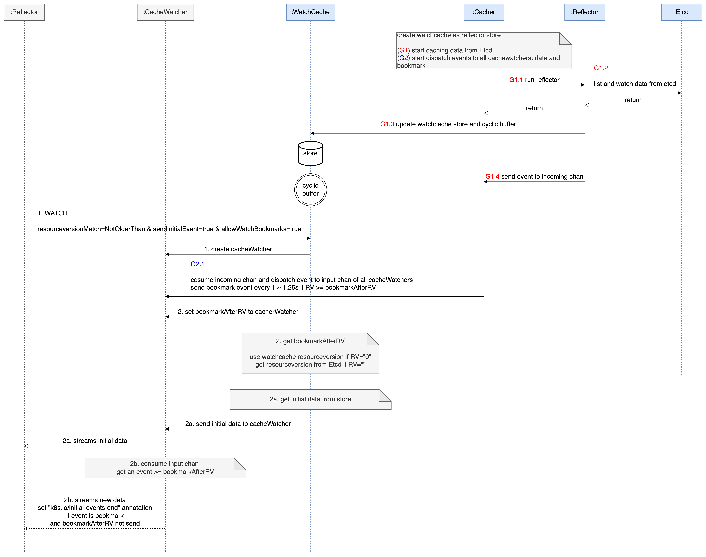

# 从 ListWatch 到 WatchList

# 背景

前面我们已经对 [kube-apiserver 内存消耗](https://mp.weixin.qq.com/s/FhNl1c2BdXJK-sDb0qzahw)进行了阐述，文中最后提到了使用流式的请求来支持 List 的效果，从而实现对于单个请求来说，空间复杂度从 O(n) 转换成 O(1)，这篇主要就分析描述其实现原理。

为了方便大家理解，前面多篇已经做了铺垫，建议按如下顺序阅读

1. [kubernetes 月光宝盒 - 时间倒流](https://mp.weixin.qq.com/s/B1OTBSIY7I-4TF0LaxtQUA)
2. [你真的搞懂 Informer 了吗？](https://mp.weixin.qq.com/s/ciEzUs5qb9WZYMl6QC8sZA)
3. [kube-apiserver 又 OOM 了？](https://mp.weixin.qq.com/s/FhNl1c2BdXJK-sDb0qzahw)
4. [Kubernetes 陈年老 bug - Stale Read](https://mp.weixin.qq.com/s/SMnKpnP5J07HBeG35oC9WQ)

# 分析

可以先设想一下如果自己去实现的话，该如何设计。Client 和 Server 端都要去适配这是必然的，因为 Informer 现在是 ListWatch 机制，服务端并不支持流式 List。因此可以有个初步的方向：

1. Server 端支持流式 List 请求
2. Informer 适配 Server 端 API 的变化

客户端的适配相对简单，重点还是放在 Server 端如何实现。先回顾下之前 List 的逻辑，在前一篇 [Stale Read](https://mp.weixin.qq.com/s/SMnKpnP5J07HBeG35oC9WQ) 里面已经介绍过了。

> 为方面描述，下文统一使用 RV 代指 Resourceversion，本节逻辑均基于 v1.26.9 版本，且忽略分页查询，因为分页是直接走 Etcd 的。
>
> 无论是 List 还是 Watch 请求，其 query 均支持传入 RV，服务端会根据请求的 RV 的不同做相应的处理，根据 RV 的值可以分为三种情况
>
> 1. 未设置或者显示设置 RV=""
> 2. RV = "0"
> 3. RV = "非 0 值"
>
> 对于前两种情况，List 会直接返回 WatchCache Store 中的内容，即服务端缓存好的 Etcd 的全部相关数据。
>
> 对于第三种情况，会等待服务端缓存数据的最大版本要超过传入的 RV 之后再返回缓存内的数据，如果等待了一段时间（3s）后缓存中的数据仍然没有达到指定版本，则会报错返回 "Too large resource version"，并告诉客户端可以在 1s 之后重试。

新版中已经修复了 List Stale Read 的问题，对于前两种情况，其会先从 kube-apiserver 获取 Etcd 最新的 RV，等待 WatchCache Store 内容追平 RV 后再一次性的返回。

也就是说服务端是可以知道自己是否已经包含最新全量数据的，在这个基础上再以流式方式返回即可。当前已有的流式 API 就是 Watch，所以可以在此基础上支持 List 的效果。为什么不直接在 List 请求基础上改呢，因为改 List 的话，会涉及到太多的客户端侧的适配，List 会经常单独使用，而 Watch 基本是在 Informer 里面使用。

**所以最终的工作就会变成如何使用 Watch API 实现 List 的效果，但数据仍然以流式返回给客户端，同时 Informer 修改 ListWatch 方式为只使用 Watch API 实现之前的效果**。下文以详细介绍服务端实现为主，客户端适配的部分会比较简单的介绍下。

# 原理

通过为 Watch API 添加一个 `SendInitialEvents=true` 参数来支持 List 的效果。Server 端接收到 Watch 请求后判断哪些数据是应该作为 InitEvents 发送给客户端，同时在发送完这些数据之后发送一个特定的 BOOKMARK Event（带特定 Annotation 的 BOOKMARK，其 RV 对应下文的 bookmarkAfterRV）给客户端作为服务端通知客户端 InitEvents 发送完毕的标志，客户端在接收到指定 BOOKMARK Event 后，将之前接收到的所有 InitEvent 作为 List 的结果处理。

## 时序图

下面是基于 v1.29 代码的分析，此时 v1.29 还在 alpha 状态，提到的旧版代表 1.27 之前的版本，新版代表 v1.29。如果你看到的代码和下面描述的不一致，有可能是代码版本导致的。

从 WatchCache 开始右面四个蓝色的是在 kube-apiserver 启动的时候开始执行的，G1 G2 代表两个 goroutine，分别用来从 Etcd 获取数据，以及发送数据给客户端 CacheWatcher 的 input chan

1. G1.1 每种资源类型对应一个 Cacher，内部包含一个 Reflector，WatchCache 作为 Reflector 的 Store 存储从 Etcd 获取到的数据；
2. G1.2 Reflector 开启调用 Etcd List 和 Watch API 获取数据；
3. G1.3 Reflector 利用获取到的数据更新 WatchCache 的 store 和 cyclic buffer，两者分别用来存储全量的对象和对象的最近更新事件；
4. G1.4 在更新完 WatchCache 后，会把 Event 发送到 Cacher 的 incoming chan 中；
5. G2.1 从 Cacher 的 imcomming chan 中消费数据发送给所有的 CacheWatcher 的 input chan，或者定时（1 ~ 1.25s）发送 RV > bookmarkAfterRV 的 BOOKMARK 事件给所有的 CacheWatcher 的 input chan；

上述过程描述了服务端启动时的数据处理流程，接下来看有客户端请求时的处理流程

1. Reflector 首次发起 Watch 请求，query 中指定 `RV=""&sendInitialEvent=true&resourceVersionMatch=NotOlderThan&AllowWatchBookmarks=true`，这里无论 RV="" 还是 RV="0" 都可以实现 List 的效果，只不过相比旧版本的实现，新版里面 Watch 请求针对 RV="" 做了特殊处理，解决了 Watch API Stale Read 的问题（List Stale Read 已经在[前一篇](https://mp.weixin.qq.com/s/SMnKpnP5J07HBeG35oC9WQ)中介绍过了，针对 List 提供了 FeatureGate 来控制是否开启 Consistent Read，但 Watch 这里并没有对应的 FeatureGate，也即是说新版中针对 RV="" 的请求一定是 Consistent Read），服务端接收到请求后为这个请求创建对应的 CacheWachter 对象；
2. Server 端在接收到请求后计算 bookmarkAfterRV 的值，如果 RV="0"，则 bookmarkAfterRV 就是 WatchCache RV（WatchCache Store 数据中的最大 RV），如果 RV=""，则去 Etcd 中获取最大的 RV 作为 bookmarkAfterRV，将 bookmarkAfterRV 传递给 CacheWatcher，最后 CacheWatcher 会结合 WatchCache Store 和自身 input chan 中的数据准备 InitEvents
   1. 2a 开始从 WatchCache Store 中获取需要返回的数据，此时的处理逻辑旧版本相同，返回 Store 中的全部数据，并记录 Store 数据的最大 RV 供下一步使用；
   2. 2b 消费 input chan 中的事件，对比其 RV 是否比 2a 传入的 RV 大，或者如果是 BOOKMARK 类型并且 RV 等与 2a 传入的 RV，且尚未发送 bookmarkAfterRV 的事件，则此 BOOKMARK 事件就会被当做 List 结束的标志，为其设置 Annotation: k8s.io/initial-events-end，最后发送给客户端；

至此，服务端的主要流程已经介绍完，客户端 Informer 也做了对应的适配，如果开启 WathList 功能的话，会发送 Watch 请求来获取一遍全量数据，等到接收到携带 Annotation: k8s.io/initial-events-end 的 BOOKMARK 事件后，记录其 RV，将在此期间接受并处理后的对象作为 List 的结果。最后再次以上述 RV 作为参数调用 Watch 请求，从这一步开始就是 Informer 传统意义上的 Watch 逻辑了。

## 数据流

图片来自 [KEP 3157 watch-list](https://github.com/kubernetes/enhancements/blob/master/keps/sig-api-machinery/3157-watch-list/README.md)，其实里面也包含时序图，不过里面的书序图画的有一些问题，和代码不一致，所以这里并没有直接使用他的时序图，而是重新画了。

可以结合上面两个图理解整个过程，上图中的 a 对应时序图中的 2a，b 对应时序图中的 2b，c 对应时序图中的 G2.1。最下面白色部分对应时序图中 G1 的逻辑，即从 Etcd 获取数据，客户端请求的处理是自上到下的，而数据返回是自下而上的。

# 注意

上述处理逻辑中存在很多的细节，需要额外注意下

1. 为 Watch API 修复了 Stale Read 的问题（RV="" WatchList 功能），本质上也是消除 List 的 Stale Read，只不过是在 Watch API 中实现的，这样结合上一篇，**不管是直接使用 List API 还是使用 WatchList 都能避免 Stale Read 的问题**；
2. WatchCache Store 中的数据和 Cacher imcomming chan 数据是有交叉的，所以在 2a 处理完所有 Store 数据后记录了最大的 RV 传递给 2b 在处理 imcomming chan 的数据时使用，**event RV > RV 的非 BOOKMARK 事件才会发回客户端，这样是为了避免时间回流**；
3. **CacheWatcher 的 input chan 中是不存在 RV < bookmarkAfterRV 的事件的**，在 G2.1 从 Cacher incoming chan 消费并发往所有 CacheWatcher input 的时候判断了如果事件类型是 BOOKMARK 且 RV < bookmarkAfterRV，则直接丢弃此事件，因为 input chan 缓冲区大小有限，在其创建后 Cacher 就开始往其 input 写数据，而开始消费 input chan 是在 2a 处理完所有 Store 中的数据之后，中间存在一段时间差，事件的长短和 Store 中的数据量有关系，丢弃不必要的 BOOKMARK 事件就可以缓解 input chan 的压力，这里涉及到了为 input chan 添加事件的处理逻辑，里面包括多种特殊情况的处理，例如缓冲满了如何处理避免因为单个 CacheWatcher 而阻塞整个流程，发数据异常如何处理；
4. **最终发回给客户端的携带特定 Annotation 的 BOOKMARK 事件的 RV >= bookmarkAfterRV**，这里非常值得注意，并不是等于 bookmarkAfterRV，**原 KEP 时序图中此处（2c）的描述是错误的**。根本原因在于 bookmark timer 的周期为 1 ~ 1.25s，也就是说每 1 ~ 1.25s 产生一个 BOOKMARK 事件，其 RV 是 incoming chan 最大 RV，正是由于这个时间间隔，结合 3 的描述，就会导致 G2.1 发送出去的第一个**有效的 (进入到 CacheWatcher input chan)** BOOKMARK 事件的 RV >= bookmarkAfterRV。这也从侧面说明了最终在返回 bookmarkAfterRV BOOKMARK 事件之前返回的所有的携带有效负载的事件集合的最大 RV 也是 >= bookmarkAfterRV 的，即**虽然标记是 bookmarkAfterRV，但 List 的结果中包含比 bookmarkAfterRV 大的数据**。
   个人认为此处还是可以再继续优化的，可以让 List 的耗时减少一个 bookmark timer 的周期，即 1 ~ 1.25s，只需要在 2b 处理非 BOOKMARK 事件时判断 RV == bookmarkAfterRV 且尚未发送过 bookmarkAfterRV BOOKMARK 事件，此时就可以直接返回一个 bookmarkAfterRV BOOKMARK 给客户端了，对于数据量较大，返回所有数据耗时超过 Watch timeout 时间 1s 左右时可以降低超时的概率，避免重复执行 WatchList 的过程，也能在一定程度上降低内存消耗。

# 总结

本篇主要分析了 WatchList 的实现原理和逻辑，其中不乏一些细节处理，后续也会和社区就有关细节进一步讨论。在此 KEP 中同时还介绍了另外两个用来降低 kube-apiserver 内存压力的修改，篇幅有限，将会在下一篇中进行介绍，同时也会给出所有优化工作做完前后的效果对比。敬请期待~

如果对上述内容不理解或者有疑问，欢迎讨论。

